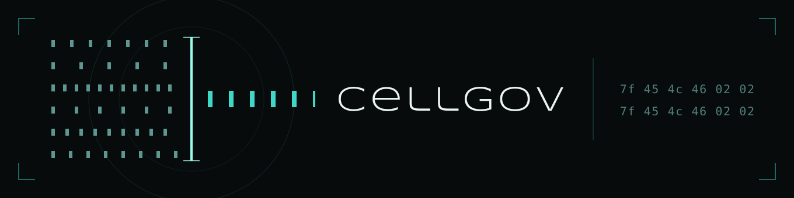

<p align="center">
  
</p>

[](https://github.com/RoyalAce22/CellGov/actions/workflows/ci.yml)
[](#license)
[](https://blog.rust-lang.org/2025/08/07/Rust-1.89.0/)

CellGov interprets PS3 PPU and SPU code deterministically, produces
replayable execution traces, and validates its output against
recorded RPCS3 observations. It is the oracle layer for static
recompilation of PS3 games: not the recompiler, but the thing that
tells a recompiler what the correct output is and which
synchronization it must preserve.

One rule governs the design: no execution unit publishes
guest-visible state directly. Threads propose changes as effects;
the runtime is the only thing that applies them. The whole workspace
compiles under `unsafe_code = "forbid"`.

CellGov does not run games. There is no rasterisation, vblank,
audio, networking, input, JIT, host-speed execution, or per-title
compatibility hack. RPCS3 plays a game; CellGov answers, byte for
byte, what a PS3 game would produce under any legal schedule.

## Documentation

- [docs/concepts/](docs/concepts/README.md) -- observations,
  checkpoints, the null backend, cross-runner agreement. Read first;
  the [glossary](docs/concepts/glossary.md) sits beside it.
- [docs/architecture/](docs/architecture/README.md) -- how the
  runtime works, one document per subsystem.
- [docs/cli.md](docs/cli.md) -- generated command reference: every
  command, its examples, its flags, and its exit codes.
- [docs/titles.md](docs/titles.md) -- generated compatibility
  matrix: which titles boot, to which checkpoint, and whether they
  converge with RPCS3. This is where current status lives.
- [docs/lv2/](docs/lv2/README.md) -- the LV2 archive: generated
  tables of every syscall slot's routing and every arm's fidelity,
  queryable through SQLite.
- [title_manifests/](title_manifests/manifest_template.README.md) --
  the title registry: one manifest per title.

## Building

Developed on Windows; supported on Windows and Linux.

Importing the crates needs Rust 1.89 or newer, the workspace's
`rust-version`. Working in the repository needs nothing chosen:
`rust-toolchain.toml` pins the exact version CI lints with, and
rustup installs it on the first `cargo` command.

```bash
cargo build --workspace
cargo test --workspace
cargo fmt --check
cargo clippy --workspace --all-targets -- -D warnings
RUSTDOCFLAGS="-D warnings" cargo doc --workspace --no-deps
```

CI runs those on both platforms and additionally `cargo test
--release`, the `cellgov_install` tests with `--features decrypt`,
and `cellgov_compare` with `--no-default-features`.

The workspace has no
runtime dependency on RPCS3. `cellgov_compare` gates its RPCS3
process-spawning runner behind the default-on `rpcs3-runner`
feature; importers that want only the `Observation` schema and the
comparison functions build with `default-features = false`.

A default build contains no decryption. SCE/SELF, PKG, and PUP
decryption -- every path that consumes a key -- sits behind the
default-off `decrypt` feature of `cellgov_install` and
`cellgov_cli`. Without it the tools parse containers and boot
plaintext ELFs; an input whose header shows an SCE wrapper is
refused with a message naming the missing feature. Installed
firmware and titles stay SCE-wrapped on disk, so booting a real
corpus needs it:

```bash
cargo build --release -p cellgov_cli --features decrypt
```

The other features (`*-corpus`, `*-dumps`, `*-microtests`,
`rpcs3-src`, `ps3autotests`) select test suites that read local dumps
or built fixtures. None is needed to build, and `--all-features`
fails without those assets.

### Keys

CellGov ships no key values. Every decrypt path reads an
operator-supplied key vault, loaded once per process on the first
SCE-wrapped image, and a run with no vault refuses that image by
name. Supply the vault one of two ways:

```bash
CELLGOV_KEYS=<file-or-dir> target/release/cellgov boot run --title <name>   # used in place
cargo run --release -p cellgov_cli -- keys import <file-or-dir>            # normalized into vfs/.cellgov/keys/keys.toml
```

An import under a non-default root (`keys import --output <root>`) is
read back by a run that names the matching `--vfs-root <root>/dev_hdd0`.

`keys show` prints the vault's inventory and what a decrypt would
still be missing; `keys remove` deletes the imported vault. The
import reads these forms:

- `keys.toml`: CellGov's own schema, what `keys import` writes.
- scetool-style `[keyset]` files: `type` / `self_type` / `revision`
  plus `erk` or `key` and `riv` or `iv` per block.
- `name: HEX` and `name = HEX` lines, and pasted key tables, one key
  per row.
- Per-key files named `app-key-0A` / `app-iv-0A` / `npdrm-...` /
  `pkg-key` / `pup-hmac`, holding hex text or the raw bytes.

Reading the loose forms is best effort; `keys show` lists whatever
the import could not place, and `keys.toml` is the exact form to fall
back on. Vault files are gitignored and never vendored.

## Installing firmware and titles

Titles install from your own dumps:

```bash
cargo run --release -p cellgov_cli --features decrypt -- title install <disc>.iso
cargo run --release -p cellgov_cli --features decrypt -- title install <title>.pkg --rap <title>.rap
```

A disc image must be a decrypted dump of a disc you own. It lands
under `vfs/dev_bdvd/<title-id>/`, a PSN package under
`vfs/dev_hdd0/game/<title-id>/`, each with an install record.

**A disc image needs no separate firmware.** The install registers the
disc's own `PS3_UPDATE/PS3UPDAT.PUP` as a `vfs/firmware/<version>/`
entry and records the version on the title; `boot run` boots the disc
on it by default. `--no-firmware` skips this.

**A PSN package needs firmware installed by hand.** Its `PARAM.SFO`
declares the lowest system software it runs on; `title show` prints
that floor as `needs fw` (`system_ver` in `--format json`):

```bash
target/release/cellgov title show <title-id>
```

Install that version or the latest `PS3UPDAT.PUP` from
[playstation.com](https://www.playstation.com/en-us/support/hardware/ps3/system-software/):

```bash
cargo run --release -p cellgov_cli --features decrypt -- firmware install /path/to/PS3UPDAT.PUP
```

The install writes per-module SELFs under
`vfs/firmware/<version>/dev_flash/` (gitignored; firmware bytes are
never vendored); they stay encrypted on disk and decrypt at boot. With
several firmwares installed, `boot run --fw <version>` picks one, and
a boot below the title's floor warns.

A title becomes bootable once it has a manifest
under [title_manifests/](title_manifests/manifest_template.README.md);
`cellgov dev gen-manifest --title-id <id>` writes the stub from the
install record.

## Running

```bash
cargo build --release -p cellgov_cli --features decrypt
target/release/cellgov boot run --title <name>     # boot to the manifest's checkpoint
target/release/cellgov boot bench --title <name>   # boot a run set, check the committed anchor
target/release/cellgov dev prx-imports <path>      # inspect a PRX / SPRX / EBOOT
target/release/cellgov --help                     # the full surface
```

`boot run` reads the firmware install record to find the installed
firmware; `--firmware-dir DIR` overrides it and
`CELLGOV_NO_FIRMWARE_DIR=1` boots with none at all. With no firmware
installed and no override, the boot is refused rather than run.

## Testing

Assertions run against structured trace records and state hashes,
never against text logs. Suites that need a local PS3 corpus (a
firmware image, an owned title dump, compiled micro-test ELFs) sit
behind cargo features rather than environment variables: with the
feature off the target is not built; with it on, a missing fixture
is a hard error. Nothing skips silently, so `cargo test` on a fresh
clone reports green only for gates that ran. A corpus feature whose
inputs are SCE-wrapped implies `decrypt`; the decrypt pipeline's own
synthetic-fixture tests run with
`cargo test -p cellgov_install --features decrypt`.

## License

Licensed under either of

- Apache License, Version 2.0 ([LICENSE-APACHE](LICENSE-APACHE) or
  http://www.apache.org/licenses/LICENSE-2.0)
- MIT license ([LICENSE-MIT](LICENSE-MIT) or
  http://opensource.org/licenses/MIT)

at your option.

One directory is excepted. The contents of
[bridges/rpcs3-patch/](bridges/rpcs3-patch/README.md) are licensed
GPL-2.0-only as modifications to RPCS3, and the dual license above does
not apply there. Nothing in that directory is compiled or linked into
any CellGov crate; CellGov invokes RPCS3 only as a separate process.

### Contribution

Unless you explicitly state otherwise, any contribution intentionally
submitted for inclusion in CellGov by you, as defined in the
Apache-2.0 license, shall be dual licensed as above, without any
additional terms or conditions. Contributions under
`bridges/rpcs3-patch/` are the exception: they are GPL-2.0-only, on the
same terms as the rest of that directory.

Copyright (c) 2026 Aidan Bennie / RoyalAce. See
[ACKNOWLEDGEMENTS.md](ACKNOWLEDGEMENTS.md) for the projects CellGov
builds on.
