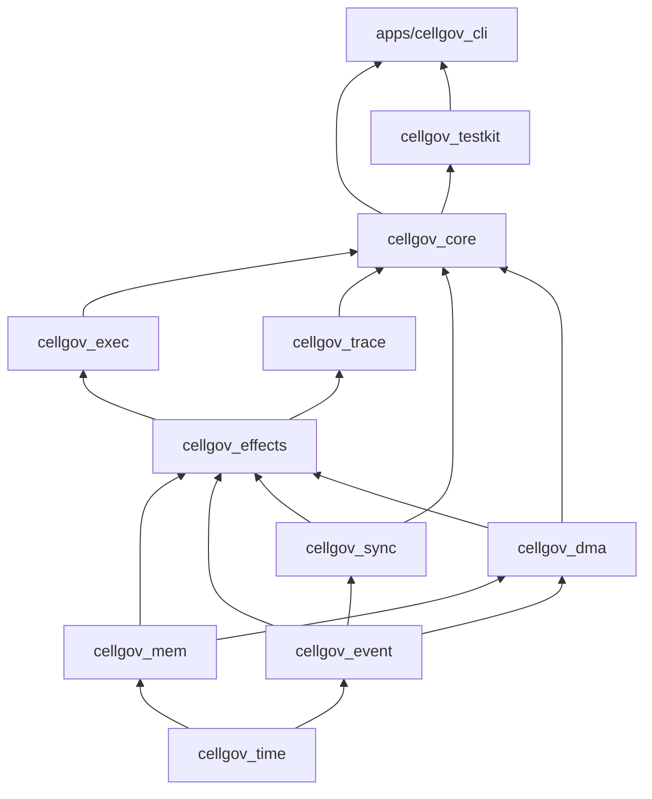

# CellGov Architecture

CellGov is a Rust workspace implementing a deterministic event-driven runtime for translated PS3 PPU and SPU execution units.

## Current state

The runtime executes units in a deterministic round-robin loop, processes effects through the commit pipeline, and produces a binary trace. The workspace compiles clean under `unsafe_code = "forbid"` and has 400+ tests across 11 crates plus a CLI.

Key capabilities:
- **Deterministic step loop** with round-robin scheduling and deadlock detection
- **Commit pipeline** processing 9 effect types: `SharedWriteIntent`, `MailboxSend`, `MailboxReceiveAttempt`, `DmaEnqueue`, `WaitOnEvent`, `WakeUnit`, `SignalUpdate`, `FaultRaised`, `TraceMarker`
- **Binary trace format** with 7 record types, categorical filtering, and encode/decode roundtrip
- **FNV-1a state hashing** at every commit boundary (committed memory, runnable queue, unit status, sync state)
- **DMA completion queue** with pluggable latency models and automatic issuer wake
- **Mailbox FIFO** with send/receive/block-on-empty and per-unit inbox delivery
- **Signal registers** with OR-merge semantics
- **Block/wake transitions** via runtime-side status overrides
- **Scenario test harness** with deterministic replay assertions, golden trace pinning, and invariant checks
- **Fake ISA** (8 opcodes) as a clean-room runtime probe

## Crate layering

The workspace is a strict layered dependency DAG. Foundational crates sit at the bottom; consumers at the top. Only direct dependencies are shown.

For per-crate responsibilities and module layout, run `cargo doc --no-deps --open` and read the crate-level doc comments.
