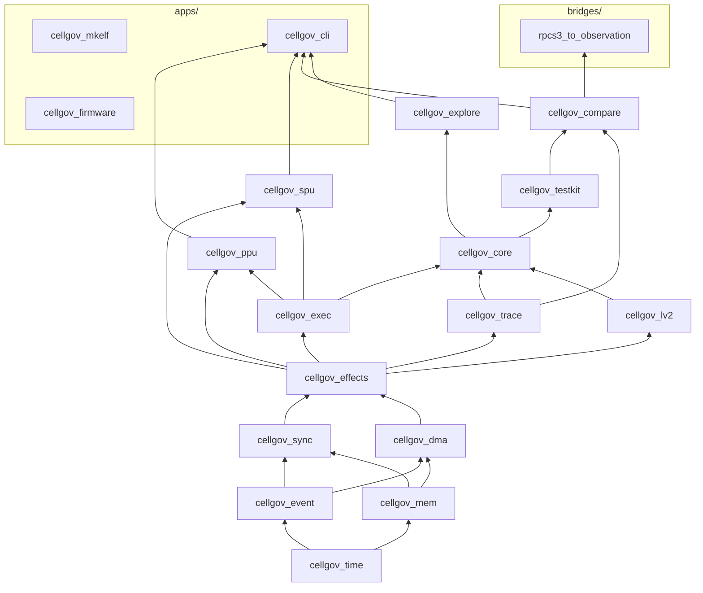

# CellGov Architecture

CellGov is a deterministic Rust runtime that interprets PS3 PPU and SPU
code, produces replayable execution traces, and validates its output
against RPCS3 baselines. It is the oracle layer for static
recompilation: it does not run games, it tells the recompiler what the
correct output is.

The whole design hangs off one rule: **no execution unit publishes
guest-visible state directly. All state changes pass through one
ordered pipeline.** Everything else in this document follows from
that.

## Workspace shape

15 library crates, 3 application binaries under `apps/`, and 1 bridge
binary under `bridges/`, organized as a strict layered DAG.
Foundational primitives sit at the bottom; consumers at the top. No
backward edges. `cellgov_firmware` is fully standalone (no workspace
library dependencies); `cellgov_mkelf` likewise.

Four structural rules worth calling out:

- `cellgov_lv2` does not depend on `cellgov_core`. The runtime calls
  into the host through a narrow `Lv2Runtime` trait; the host never
  reaches back.
- `cellgov_ppu` and `cellgov_spu` are leaves of the library DAG. They
  plug into the runtime through the `ExecutionUnit` trait in
  `cellgov_exec`; the runtime drives any `T: ExecutionUnit` without
  naming concrete types.
- `cellgov_explore` lives above `cellgov_core` and drives the runtime
  externally through `Runtime::step` / `commit_step` /
  `set_scheduler`. It never modifies the runtime model.
- `cellgov_firmware` is a standalone app with no workspace library
  dependencies. It uses external crypto crates (`aes`, `cbc`, `ctr`,
  `hmac`, `sha1`, `flate2`) that no library crate pulls. Its only
  job is one-shot firmware extraction; no library crate imports it
  and no runtime path depends on it.

External dependencies are minimal: `serde`, `serde_json`, and `toml`
in `cellgov_compare`; `serde` and `serde_json` in `cellgov_explore`
and `cellgov_cli`; crypto crates in `cellgov_firmware` only.
Everything else is workspace-internal. The workspace compiles under
`unsafe_code = "forbid"`.

## Per-crate responsibilities

| Crate                          | Responsibility                                                                                                                                                                                                                                                                                                                                                                                                                                           |
| ------------------------------ | -------------------------------------------------------------------------------------------------------------------------------------------------------------------------------------------------------------------------------------------------------------------------------------------------------------------------------------------------------------------------------------------------------------------------------------------------------- |
| `cellgov_time`                 | `GuestTicks`, `Budget`, `Epoch` -- distinct numeric types so guest time never accidentally becomes wall time.                                                                                                                                                                                                                                                                                                                                            |
| `cellgov_event`                | `UnitId`, `EventId`, `MailboxId`, `PriorityClass` -- identifier types and event vocabulary.                                                                                                                                                                                                                                                                                                                                                              |
| `cellgov_mem`                  | `GuestMemory` (sorted `Vec<Region>` matching the PS3 LV2 VA layout), `Region` with `RegionAccess` modes, `ByteRange`, `GuestAddr`, FNV-1a hashing with cached `content_hash`.                                                                                                                                                                                                                                                                            |
| `cellgov_sync`                 | Mailbox FIFO, signal-register OR-merge, barrier and wait-set primitives.                                                                                                                                                                                                                                                                                                                                                                                 |
| `cellgov_dma`                  | DMA completion queue with pluggable latency models.                                                                                                                                                                                                                                                                                                                                                                                                      |
| `cellgov_effects`              | The 13-variant `Effect` enum and inline `WritePayload` (16-byte stack buffer, heap fallback above).                                                                                                                                                                                                                                                                                                                                                      |
| `cellgov_exec`                 | `ExecutionUnit` trait, `ExecutionContext`, `ExecutionStepResult`. The seam between architecture interpreters and the runtime. Effects flow through a caller-owned `&mut Vec<Effect>` passed to `run_until_yield`, not on the result struct.                                                                                                                                                                                                              |
| `cellgov_trace`                | Binary trace format: 9 record variants with strict tag/layout contract (7 decision-level + `PpuStateHash` + `PpuStateFull` for per-step divergence trace).                                                                                                                                                                                                                                                                                               |
| `cellgov_lv2`                  | LV2 model: image registry, thread-group table, syscall classification (`Lv2Request`) and dispatch (`Lv2Dispatch`).                                                                                                                                                                                                                                                                                                                                       |
| `cellgov_core`                 | The runtime: deterministic step loop, commit pipeline, syscall response table, SPU factory hook.                                                                                                                                                                                                                                                                                                                                                         |
| `cellgov_ppu`                  | PPU interpreter, ELF64/SPRX/PRX loaders, NID database, HLE binder.                                                                                                                                                                                                                                                                                                                                                                                       |
| `cellgov_spu`                  | SPU interpreter, channel file, SPU ELF loader.                                                                                                                                                                                                                                                                                                                                                                                                           |
| `cellgov_testkit`              | Scenario fixtures and the runner used by tests across the workspace.                                                                                                                                                                                                                                                                                                                                                                                     |
| `cellgov_compare`              | Normalized observation schema, RPCS3 runner adapter, multi-baseline diff, per-step `diverge` scanner, zoom-in `zoom_lookup`.                                                                                                                                                                                                                                                                                                                             |
| `cellgov_explore`              | Bounded schedule exploration with conflict-aware pruning.                                                                                                                                                                                                                                                                                                                                                                                                |
| `cellgov_cli`                  | The user-facing binary: `run-game`, `dump`, `compare`, `explore`, `compare-observations`, `diverge`, `zoom`.                                                                                                                                                                                                                                                                                                                                             |
| `cellgov_mkelf`                | Standalone tool that generates PPU ELF fixtures for the microtest corpus. No workspace dependencies.                                                                                                                                                                                                                                                                                                                                                     |
| `cellgov_firmware`             | PS3 firmware and SELF decrypter. Two subcommands: `install` extracts decrypted SPRX modules from a `PS3UPDAT.PUP` downloaded from Sony's website (PUP container parse, SHA-1 HMAC validation, AES-256-CBC / AES-128-CTR decryption, zlib decompression, nested TAR extraction). `decrypt-self` decrypts a retail game `EBOOT.BIN` (SELF) into an `EBOOT.elf` using per-revision APP keys -- same AES pipeline, different key table. No RPCS3 dependency. |
| `bridges/rpcs3_to_observation` | RPCS3 dump -> `Observation` JSON adapter. Lives under `bridges/` (excluded from the workspace's `default-members`) so a plain `cargo build` does not pull in any RPCS3-aware code. Build explicitly with `cargo build -p rpcs3_to_observation`. Paired with the C++ patch under `bridges/rpcs3-patch/`.                                                                                                                                                  |

## Guest memory layout

`cellgov_mem::GuestMemory` is a sorted `Vec<Region>` keyed by
region base address. Each `Region` owns a `Vec<u8>` sized to that
region plus a label, page-size class, and access mode. Address
translation goes through `containing_region(addr, length)` (a
binary search), which returns the region entirely containing the
range or `None` if the access straddles a boundary or falls in an
unmapped gap.

The `run-game` driver builds four regions matching the canonical PS3
LV2 virtual-address layout:

| Guest VA              | Size   | Label          | Access                           | Purpose                                                                  |
| --------------------- | ------ | -------------- | -------------------------------- | ------------------------------------------------------------------------ |
| 0x00000000-0x3FFFFFFF | 1 GB   | `main`         | `ReadWrite`                      | User memory: EBOOT PT_LOAD segments, TLS, HLE bump arena, allocator pool |
| 0xC0000000-0xCFFFFFFF | 256 MB | `rsx`          | `ReservedZeroReadable` (default) | Video / RSX local memory -- placeholder, reads zero and are counted      |
| 0xD0000000-0xD000FFFF | 64 KB  | `stack`        | `ReadWrite`                      | Primary-thread stack (page-4K)                                           |
| 0xD0010000-0xD0F0FFFF | 15 MB  | `child_stacks` | `ReadWrite`                      | Stack pool for PPU threads spawned by `sys_ppu_thread_create`            |
| 0xE0000000-0xFFFFFFFF | 512 MB | `spu_reserved` | `ReservedZeroReadable` (default) | SPU-shared range -- same provisional semantics as RSX                    |

The `main` region's internal sub-layout is not tracked by the region
map (it stays flat within that region): `sys_memory_allocate` starts
above the loaded ELF footprint (computed at startup by scanning the
ELF's highest user-region PT_LOAD end + 64 KB alignment); TLS sits
at `0x10400000`; the HLE bump arena at `0x10410000`. The allocator
base moves above the ELF because real PS3 LV2 shares
`0x00010000-0x0FFFFFFF` between the loaded binary and the
allocator pool; CellGov matches that layout so guest pointer
values line up across runners.

### Region access modes

`RegionAccess` has three variants, encoded as a distinct enum (not a
boolean flag) so a future contributor cannot accidentally collapse
them:

- **`ReadWrite`**: normal user memory. Reads and writes go through
  the region's backing `Vec<u8>`.
- **`ReservedZeroReadable`**: reads return the region's zero-init
  bytes and bump `GuestMemory::provisional_read_count`; writes fault
  with `MemError::ReservedWrite`. This is the default for RSX and
  SPU-reserved -- it keeps the address space honest without
  requiring real semantics, and surfaces any silent zero-reads in
  `run-game`'s end-of-boot summary.
- **`ReservedStrict`**: reads return `None`, writes fault with
  `MemError::ReservedWrite`. Opted into via `--strict-reserved` on
  the CLI, used by tests asserting no code paths touch the region
  yet.

Out-of-region accesses (addresses that fall in no region) surface as
`MemError::Unmapped(FaultContext)`, where `FaultContext` names the
faulting address and the labels of the nearest mapped regions below
and above it. This turns a diagnostic at `0xB0000000` into
"between `main` and `rsx`" rather than a bare "out of bounds".

### PPU access routing

The PPU interpreter's fetch path uses `GuestMemory::as_bytes()`, a
legacy accessor that returns the base-0 region's bytes -- code
always lives in `main`, so this is safe. Load paths (`ld`, `lwz`,
`lfs`, `lvx`, etc.) go through a cached `load_slice` closure built
at the top of `run_until_yield`: the closure holds a
`[(u64, &[u8]); 8]` snapshot of every region's base and bytes, and
linear-scans it per load. Linear scan wins over `BTreeMap` lookup
because the region count stays single-digit under the current PS3
layout (main, stack, child_stacks, rsx, spu_reserved); if many more mappings are
later added, a two-tier fast-path is the natural next
step. Stores go through `Effect::SharedWriteIntent`
effects -- the commit pipeline's `apply_commit` is region-aware, so
stores to any mapped region land correctly.

## Per-step pipeline

`Runtime::step` and `Runtime::commit_step` together implement a
ten-step deterministic loop:

1. Select a runnable unit via the configured `Scheduler`. The
   default `RoundRobinScheduler` walks the registry in id
   order from the position after the last selection, skipping
   units whose effective status is `Blocked` / `Faulted` /
   `Finished`. A single-runnable fast path (one iter pass that
   exits on the second runnable) keeps single-PPU titles off
   the two-pass rotation. When the registry is non-empty but
   every unit is `Blocked`, `Runtime::step` returns
   `StepError::AllBlocked` rather than `NoRunnableUnit` --
   callers that care about liveness vs terminal stall can
   distinguish the two.
2. Grant the unit the per-step `Budget` (default 256 instructions).
3. Run the unit until it yields (one `ExecutionUnit::run_until_yield`).
   The PPU executes up to Budget instructions per call, batching
   across basic-block boundaries. An intra-block store-forwarding
   buffer provides write-then-read coherence within the batch.
   Effects are collected through a caller-owned `&mut Vec<Effect>`
   (not on the result struct).
4. Validate effects against the registry and memory.
5. Stage a commit batch.
6. Apply the batch to shared state (memory, mailboxes, signals, etc).
7. Inject resulting events: DMA completions, syscall dispatch through
   `Lv2Host`, block / wake transitions.
8. Advance guest time by the unit's consumed budget.
9. Emit trace records for every decision in steps 1-7.

Steps 4-6 are atomic. A fault discards the entire batch -- the unit
faults, the rest of the system sees nothing the unit tried to do.
This is what makes the determinism guarantees mechanical rather than
aspirational. When a fault occurs mid-batch (after some instructions
have retired), the PPU restores a state snapshot taken at step entry
and re-executes at Budget=1 so that pre-fault instructions commit
individually and the faulting instruction is isolated.

**Trivial-step fast path (FaultDriven only).** When the effects
vec is empty, `fault` is `None`, `yield_reason` is neither
`Syscall` nor `Finished`, and the DMA queue is empty,
`Runtime::commit_step` skips steps 4-7 entirely and only advances
the epoch (step 8 still runs). Under `RuntimeMode::FaultDriven`
the trace records of steps 1-7 are suppressed anyway, so the
observable contract is identical -- every atomic-batch boundary
still advances the epoch, and scheduler-visible state
(`status_overrides`, pending receives / syscall returns / reg
writes) is unchanged by an empty commit. The fast path cuts the
per-step commit cost for PPU-bound hot loops that dominate real
game boots; scenarios with async state (pending DMA, pending
wakes) naturally fall to the slow path on the step that
originates or observes the async event.

## Predecoded instruction shadow

The PPU maintains a `PredecodedShadow` covering the main text
region. Every 4-byte-aligned instruction word is decoded once at
ELF load time and stored in a flat `Vec<PpuInstruction>` indexed
by `(pc - base) / 4`. The hot-path fetch becomes a bounds check
plus an array index instead of a raw-memory read plus decode.

Three optimization passes run at shadow build time:

1. **Quickening.** Common idioms are rewritten into specialized
   variants that eliminate redundant work: `addi rT, 0, imm` ->
   `Li`, `or rA, rS, rS` -> `Mr`, `rlwinm` subsets ->
   `Slwi`/`Srwi`/`Clrlwi`, `ori rA, rA, 0` -> `Nop`,
   `cmpwi crF, rA, 0` -> `CmpwZero`, `rldicl`/`rldicr` subsets
   -> `Clrldi`/`Sldi`/`Srdi`. Candidates are selected from
   instruction profiling data (> 0.5% frequency threshold).

2. **Super-pairing.** Frequent 2-instruction sequences are fused
   into single dispatch entries: `lwz + cmpwi` -> `LwzCmpwi`,
   `li + stw` -> `LiStw`, `mflr + stw` -> `MflrStw`,
   `lwz + mtlr` -> `LwzMtlr`, `cmpwi + bc` -> `CmpwiBc`,
   `cmpw + bc` -> `CmpwBc`. The second slot is marked `Consumed`;
   the fetch loop skips it. Candidates are selected from
   adjacent-pair profiling data (> 1% frequency threshold).

3. **Block-length annotation.** A backward scan fills
   `block_len[i]` with the number of instructions to the end of
   the basic block. Branches and syscalls terminate blocks. The
   runtime uses this to size the inner loop's iteration count.

Guest-visible code writes (self-modifying code, CRT0 relocations,
HLE trampoline planting) invalidate the affected slots. The next
fetch re-decodes from committed memory and re-applies quickening.

## Effects and trace records

The full vocabulary of guest-visible operations:

- **13 effect variants** in `cellgov_effects::Effect`:
  `SharedWriteIntent`, `MailboxSend`, `MailboxReceiveAttempt`,
  `DmaEnqueue`, `WaitOnEvent`, `WakeUnit`, `SignalUpdate`,
  `FaultRaised`, `TraceMarker`, `ReservationAcquire`,
  `ConditionalStore`, `RsxLabelWrite`, `RsxFlipRequest`.
- **9 trace record variants** in `cellgov_trace::TraceRecord` --
  seven decision-level (`UnitScheduled`, `StepCompleted`,
  `CommitApplied`, `StateHashCheckpoint`, `EffectEmitted`,
  `UnitBlocked`, `UnitWoken`) plus two per-step variants for the
  divergence trace (`PpuStateHash`, `PpuStateFull`).

Trace emission is gated by `RuntimeMode` (`FaultDriven` /
`DeterminismCheck` / `FullTrace`). Fault-driven boot pays no trace
overhead; determinism check pays state-hash overhead at commit
boundaries; full trace pays both.

The two per-step variants are gated separately on the unit, not on
`RuntimeMode`. `PpuExecutionUnit::set_per_step_trace(true)` enables
one `PpuStateHash` (25 bytes: step + pc + 64-bit FNV-1a fingerprint
of GPR + LR + CTR + XER + CR) per retired instruction. The runtime
drains them via `ExecutionUnit::drain_retired_state_hashes` after
each `run_until_yield` and writes them to the main trace stream
with monotonic per-instruction step indices that are independent of
`steps_taken`. `set_full_state_window(Some((lo, hi)))` enables a
bounded-window second stream of `PpuStateFull` records (301 bytes
each, full register snapshot) routed to a separate `zoom_trace`
sink so the main per-step stream stays homogeneous. Cost: 876 ns per
100 instructions when off, 27 us per 100 instructions when on
(measured on a Windows dev box; the off branch is one predicted-away
test in the hot loop).

## Execution units

**PPU (`cellgov_ppu`)**: PPC64 interpreter with 32 GPRs, 32 FPRs, PC,
CR, LR, CTR, XER (carry tracked), TB, and 32 vector registers.
**119 instruction variants** today, covering integer arithmetic and
logic, D-form and indexed loads/stores with and without update,
conditional branches with LR/CTR variants, 64-bit multiply and divide
families, signed and unsigned multiply-high, rotate and mask families
(`rlwinm`, `rlwnm`, `rldicl`, `rldicr`), floating-point arithmetic and
conversion (`fmadd`, `fmul`, `fdiv`, `fcmp`, `fsel`, `frsp`,
`fctiwz`, `fcfid`), VMX (25+ VX-form and VA-form vector ops), SPR/CR
moves, and atomic load-reserve / store-conditional pairs.

The PPU side also owns the loaders: PPU ELF64 with PT_LOAD and PT_TLS
segment handling, SPRX parser for decrypted PS3 firmware modules with
4 relocation types, PS3 PRX import-table parser, and a 145-entry NID
database every entry of which is verified by SHA-1 round-trip in test.

The HLE binder offers two layouts for the OPDs that satisfy
`sys_prx_load_module`'s import resolution:

- **`HleLayout::Legacy24`** (default): one 24-byte trampoline per
  binding at a high reserved address. OPD and inline body
  (`lis r11, hi; ori r11, r11, lo; sc; blr`) live in the same
  trampoline. Self-contained and easy to inspect.
- **`HleLayout::Ps3Spec { opd_base, body_base }`**: 8-byte OPDs
  packed at `opd_base` (matching RPCS3's `vm::alloc(N*8, vm::main)`
  HLE-table shape), with separate 16-byte body trampolines at
  `body_base`. Used by `run-game` when `CELLGOV_HLE_OPD_BASE` is
  set so the GOT pointer values land in the user-memory address
  range RPCS3 also uses for HLE-resolved imports.

Both layouts produce semantically equivalent bindings -- the same
NID reaches the same dispatch handler regardless of layout. The
choice only affects where the OPDs sit in the address space, which
matters for cross-runner byte comparisons. See
[crates/cellgov_ppu/tests/hle_layout.rs](../crates/cellgov_ppu/tests/hle_layout.rs)
for the equivalence test that backs this property.

`run-game` exposes three env vars for firmware-loading experiments:
`CELLGOV_PRX_BASE` overrides the firmware PRX load address;
`CELLGOV_SKIP_MODULE_START=1` bypasses liblv2's `module_start`
(which corrupts game memory through a stale fixup pointer when
sys_prx_load_module returns failure for unimplemented submodules);
`CELLGOV_HLE_OPD_BASE` switches HLE binding to the PS3-spec packed
layout.

**SPU (`cellgov_spu`)**: 128x128-bit register file, 256 KB local
store, channel file. Implements RR / RI7 / RI10 / RI16 / RI18 / RRR
forms covering constant formation, integer arithmetic and logic,
compare, branch, shuffle and rotate, load and store, channel
operations. Communicates with the runtime exclusively through
effects, never reads or writes committed shared memory directly.
Includes an SPU ELF loader.

## LV2 host

`cellgov_lv2` owns the LV2 state machine: image registry, thread group
table, PPU thread table, TLS template, child-stack allocator, syscall
classification, syscall dispatch.

Classified into typed `Lv2Request` variants:

| Syscall                           | Number           | Behavior                                                                                               |
| --------------------------------- | ---------------- | ------------------------------------------------------------------------------------------------------ |
| `sys_process_exit`                | 22               | Cascades Finished to all units in the process.                                                         |
| `sys_ppu_thread_exit`             | 41               | Finishes the calling unit; wakes joiners with the exit value.                                          |
| `sys_ppu_thread_yield`            | 43               | No-op scheduling hint; round-robin picks the next runnable unit.                                       |
| `sys_ppu_thread_join`             | 44               | Either returns exit value immediately or blocks caller on target.                                      |
| `sys_ppu_thread_create`           | 52               | Allocates stack + TLS, seeds child `PpuState`, registers a new PPU unit mid-run via `PpuFactory`.      |
| `sys_event_flag_*`                | 82-87            | Create / destroy / wait / trywait / set / clear. AND/OR match with CLEAR/NO-CLEAR wake policy.         |
| `sys_semaphore_*`                 | 93-94, 114-117   | Create / destroy / wait / post / trywait / get_value. Wake-or-increment on post.                       |
| `sys_lwmutex_*`                   | 95-99            | Create / destroy / lock / unlock / trylock. FIFO waiter list, ownership tracked, EDEADLK on re-enter.  |
| `sys_mutex_*`                     | 100, 102-104     | Create / lock / unlock / trylock. Heavy-mutex variant of lwmutex with attribute capture.               |
| `sys_cond_*`                      | 105-110          | Create / destroy / wait / signal / signal_all / signal_to. Two-hop drop-and-reacquire mutex protocol.  |
| `sys_event_queue_*`               | 128-130, 133-134 | Create / destroy / receive / tryreceive / port_send. Bounded FIFO with 4-u64 payloads.                 |
| `sys_spu_image_open`              | 156              | Looks up SPU ELF by path, writes `sys_spu_image_t` to guest memory.                                    |
| `sys_spu_thread_group_create`     | 170              | Allocates a monotonic group id, writes it to guest pointer.                                            |
| `sys_spu_thread_initialize`       | 172              | Records image handle and args (copied at init time) per slot.                                          |
| `sys_spu_thread_group_start`      | 173              | Returns `RegisterSpu` with init state per slot; runtime creates SPUs.                                  |
| `sys_spu_thread_group_join`       | 177              | Blocks caller; wakes when all SPUs in the group finish.                                                |
| `sys_spu_thread_group_terminate`  | 178              | Stub: returns CELL_OK without teardown (logged as invariant break). Split from join so dispatch cannot conflate the two ABI shapes. |
| `sys_spu_thread_write_spu_mb`     | 190              | Deposits a value into the target SPU's inbound mailbox.                                                |
| `sys_memory_container_create`     | 341              | Allocates a monotonic container id, writes it to guest pointer.                                        |
| `sys_memory_allocate`             | 348              | Bump-allocates 64KB-aligned guest memory from the PS3 user region (0x00010000+, above the loaded ELF). |
| `sys_memory_free`                 | 349              | Stub: no-op (CellGov does not track deallocation).                                                     |
| `sys_memory_get_user_memory_size` | 352              | Writes `sys_memory_info_t` (total / available, 0x0D500000 each) to guest pointer.                      |
| `sys_tty_write`                   | 403              | Returns CELL_OK; fd / len / buf carried in `Lv2Request` for tracing.                                   |

### PPU thread lifecycle

The `PpuThreadTable` in `cellgov_lv2::ppu_thread` tracks every
PS3-visible PPU thread: the primary (seeded at host construction)
and any child spawned via `sys_ppu_thread_create`. Each entry
carries a guest-facing `PpuThreadId`, the runtime `UnitId`, the
lifecycle state, the creation attributes (entry OPD, arg, stack
range, priority, TLS base), the exit value (set on
`sys_ppu_thread_exit`), and a join-waiters list.

State machine: `Runnable -> Blocked(GuestBlockReason)
-> Runnable` (on wake), or `Runnable -> Finished` (on exit). The
guest-facing `GuestBlockReason` lives next to the thread table;
the scheduler sees only the opaque `UnitStatus::Blocked`.
Variants cover every LV2 primitive that parks a caller:
`WaitingOnJoin`, `WaitingOnLwMutex`, `WaitingOnMutex`,
`WaitingOnSemaphore`, `WaitingOnEventQueue`, `WaitingOnEventFlag`,
and `WaitingOnCond`. Each carries the primitive id (and the
associated mutex id for `WaitingOnCond`); this richer context is
used by diagnostics and fault backtraces but never by the
scheduler, which stays agnostic to the blocking cause.

Child stacks come from the 15 MB `child_stacks` region at
`0xD0010000+`. `ThreadStackAllocator` is a deterministic bump
allocator: two fresh allocators produce byte-identical sequences.

Per-thread TLS is instantiated from the captured `TlsTemplate`:
`set_tls_template` fires once at boot (from the loader's PT_TLS
header) and `template.instantiate()` produces a fresh copy of
the initial bytes plus zero-filled BSS tail for each child.

Mid-run unit registration goes through the `PpuFactory` hook on
`Runtime` (installed by the CLI boot path). The factory receives
a `PpuThreadInitState` (resolved entry code address, TOC, arg,
stack top, TLS base, LR sentinel) and returns a concrete
`PpuExecutionUnit` with its `PpuState` seeded per the PPC64 ABI.
This mirrors the SPU factory pattern so `cellgov_core` stays
independent of `cellgov_ppu`.

Two more are special-cased in the host dispatcher to return spec-correct
error codes instead of CELL_OK (matching RPCS3 retail behavior):

| Syscall                 | Number | Returns                            |
| ----------------------- | ------ | ---------------------------------- |
| `sys_tty_read`          | 402    | CELL_EIO when debug console off.   |
| `_sys_prx_start_module` | 481    | CELL_EINVAL when id == 0 or !pOpt. |

All other syscalls fall through the host dispatcher returning CELL_OK
with no effects.

### Synchronization primitives

Six LV2 primitives park and wake PPU threads under a shared
contract. Each has its own table inside `Lv2Host`
(`LwMutexTable`, `MutexTable`, `SemaphoreTable`,
`EventQueueTable`, `EventFlagTable`, `CondTable`) keyed by the
guest-visible id. Every table composes the shared `WaiterList`
-- a strict FIFO queue of `PpuThreadId` -- and contributes to
the host's `state_hash` only when non-empty.

#### Block / wake protocol

Park side: a wait handler whose predicate fails (mutex owned,
semaphore count zero, event queue empty, event flag mask
unsatisfied, cond with any predicate) enqueues the caller on
the primitive's waiter list, records a
`PendingResponse` for that unit in the runtime's
`SyscallResponseTable`, and returns
`Lv2Dispatch::Block { reason, pending, effects }`. The runtime
transitions the unit `Runnable -> Blocked` and applies the
effects atomically. `reason` carries the rich
`Lv2BlockReason` (primitive id + optional associated mutex id
for cond); `pending` carries whatever the wake resolver needs
to complete the syscall (a return code, a 32-byte event
payload, a u64 flag observation, or a cond-reacquire marker).

Release side: an unlock / post / send / set / signal handler
reads the waiter list and the primitive state in a single
dispatch, makes the wake decision, and returns
`Lv2Dispatch::WakeAndReturn { code, woken_unit_ids,
response_updates, effects }`. The runtime sets the releaser's
r3 to `code`, applies per-waiter `response_updates` (these can
swap a waiter's `PendingResponse` wholesale -- used by event
queue send to deliver the payload, by event flag set to
deliver the observed bit pattern, and by cond signal to swap
`CondWakeReacquire` for `ReturnCode` on clean acquire), and
then walks `woken_unit_ids`: for each, takes its pending
response, writes r3 / out-pointer effects accordingly, and
transitions `Blocked -> Runnable`.

Continuation pointers (event queue out pointer, event flag
result pointer) are co-located on the primitive's waiter entry,
not on the release-side dispatch. This is the invariant that
kept the pattern from drifting into the lost-wake class of
bugs: parking records everything the wake needs to know.

#### Cond-wake re-acquire (two-hop block)

The one primitive that breaks the straight release-wakes-caller
pattern is `sys_cond_wait`, because on wake the caller needs
the associated mutex re-held. The handler emits a new
`Lv2Dispatch::BlockAndWake` variant: releasing the mutex on
the way into the cond wait can transfer ownership to a parked
mutex waiter, which must wake in the same dispatch the cond
caller blocks.

On the signal side, the wake target holds
`PendingResponse::CondWakeReacquire { mutex_id, mutex_kind }`.
The signal handler consults the mutex table:

- If unowned: acquire on the waker's behalf, swap the pending
  response to `ReturnCode { code: 0 }`, and include the waker
  in `woken_unit_ids`. Classic wake -- r3 = 0, back to
  Runnable, mutex now held.
- If held: re-park the waker on the mutex waiter list, swap
  the pending response to `ReturnCode { code: 0 }`, and leave
  the waker Blocked. When the current mutex holder eventually
  calls `sys_mutex_unlock`, the unlock-wake path transfers
  ownership to this waker and resolves the swapped pending
  response.

Cond is non-sticky: a `sys_cond_signal` / `_signal_all` /
`_signal_to` on a cond with no waiters is observably lost. No
pending-signal counter is kept; the cond table's state hash is
unchanged by a lost signal.

#### Lost-wake prevention

The classic lost-wake bug is a race between
check-waiter-list-then-wake and check-count-then-decrement.
CellGov's runtime runs on a single OS thread and drives every
guest execution unit (PPU and SPU) sequentially through the
step loop, committing one batch at a time. Two guest threads
never execute simultaneously on two host cores, so the dispatch
handlers cannot be preempted mid-read by another handler
running in parallel. Interleaving between guest units still
happens, but only at commit boundaries and in a reproducible
order. The dispatch handlers still have to read-and-mutate
atomically within their own dispatch:

- Park handlers read primitive state AND install the block in
  the same dispatch. The runtime commits the entire dispatch
  atomically.
- Release handlers read the waiter list AND drain it in the
  same dispatch. The runtime commits atomically.

Regression coverage: five post-before-wait tests (one per
non-cond primitive) assert that a release scheduled before the
wait observably unblocks the waiter. For cond the inverse
holds -- a signal-before-wait must NOT wake a subsequent
waiter -- tested directly against all three signal variants.

### Atomic reservation model

PPU `lwarx` / `stwcx.` / `ldarx` / `stdcx.` and SPU
`MFC_GETLLAR` / `MFC_PUTLLC` back a unified reservation model
that spans both architectures. The granule is 128 bytes (Cell BE
cache line) on both sides.

**Two pieces of state.** Every execution unit carries a local
register -- `Option<ReservedLine>` on `PpuState` / `SpuState` --
set by an atomic load and cleared by a same-unit overlapping
store or a conditional-store retirement. The committed
cross-unit view lives in `cellgov_sync::ReservationTable`, a
`BTreeMap<UnitId, ReservedLine>` owned by the commit pipeline
and folded into `sync_state_hash` alongside mailboxes, signals,
LV2 host state, and syscall responses.

**Verdict rule.** `stwcx.` / `stdcx.` / `MFC_PUTLLC` succeed
when BOTH the local register is set AND its line matches the
store's line. The committed half of the check happens as a
step-start refresh: at the top of every `run_until_yield`, if
the unit's local register is `Some` but
`ExecutionContext::reservation_held(unit_id)` is false (a
cross-unit write committed in a previous commit cycle cleared
the entry), the local register is cleared. During the step
itself the context is frozen; intra-step verdicts can trust the
local register alone.

**Effect vocabulary.** Two `Effect` variants drive the table:

- `ReservationAcquire { line_addr, source }` inserts or replaces
  the unit's entry. Emitted by `lwarx` / `ldarx` (PPU) and
  `MFC_GETLLAR` (SPU).
- `ConditionalStore { range, bytes, source, ordering,
  source_time }` commits the success path of `stwcx.` / `stdcx.`
  / `MFC_PUTLLC`. The commit pipeline applies the bytes through
  the normal staging / drain path, drops the emitter's own
  reservation entry, and runs the clear sweep against all other
  entries covering the line.

**Clear-sweep contract.** Every committed write runs the clear
sweep. The sweep fires from three paths:

1. `SharedWriteIntent` commit. Handled in the commit pipeline's
   apply pass after the staging drain.
2. `ConditionalStore` commit. Same as (1) via the shared
   byte-deposit path, plus the emitter's own entry is dropped.
3. DMA completion. `fire_dma_completions` invokes
   `clear_covering` on the destination range after applying the
   transfer. DMA is a separate commit path from SharedWriteIntent
   so the sweep call is explicit here; without it a cross-unit
   MFC_PUT would commit bytes that overlap another unit's
   reserved line without clearing the reservation.

The contract is that every write path that commits bytes to
main memory must fire the clear sweep. Adding a new write-
emitting code path in a later phase must include a corresponding
`clear_covering` call, and the lost-reservation regression suite
in `cellgov_core::tests::runtime_tests` pins the invariant per
path.

**Scope and bounds.** The reservation table and local registers
are the full contention model. Memory-barrier instructions
(`sync`, `lwsync`, `eieio`, `isync`) are not modelled explicitly;
the commit pipeline's ordering at epoch boundaries is the
effective substitute. Schedule exploration over contention
workloads is conservative: `StepFootprint::reservation_lines`
marks a step dependent on any other step whose writes cover the
reserved line.

### RSX CPU-side completion

CellGov models the CPU-visible completion values a PS3 guest
polls for -- label bytes, flip-status transitions, and GPU
semaphore / report posts -- as a deterministic state machine
advanced at commit boundaries by method parsing. Lives in the
commit pipeline's committed state alongside the reservation
table; folds into `sync_state_hash`.

**FIFO cursor.** `RsxFifoCursor` tracks three scalar fields:
`put` (guest writes advance this via `0xC0000040`), `get`
(the method-advance pass updates this), and
`current_reference` (last `NV406E_SET_REFERENCE` value;
readable by `cellGcmGetCurrentReference`). Invariants: `put`
is only ever set by guest writes to the control register;
`get` is only ever advanced by the method-advance pass;
`get <= put` modulo the FIFO size.

**NV method decoder.** A narrow decoder parses the 32-bit
Fermi / NV4097 method header (6-bit subchannel, 11-bit method
address, 11-bit argument count, 4-bit flags), then walks the
argument list from the FIFO. Five handlers are registered:
`NV406E_SEMAPHORE_OFFSET`, `NV406E_SEMAPHORE_RELEASE`,
`NV406E_SET_REFERENCE`, `NV4097_SET_REPORT`,
`NV4097_FLIP_BUFFER`. Unknown methods take the fallback:
increment `get` past the declared argument count, tick
`methods_unknown`, emit a one-shot warning. Malformed headers
(out-of-range reads, address overflow, wrapped cursors) stop
the advance cleanly with a typed stop reason rather than
desynchronizing.

**Method-advance pass.** Runs at every commit boundary after
the reservation clear-sweep, before the next scheduling
decision. No-op when `get == put`. Otherwise walks the FIFO
from `get` to `put`, decoding headers and invoking handlers
in address order. Effects produced by handlers
(`RsxLabelWrite`, `RsxFlipRequest`) are emitted into the
NEXT commit batch -- a one-batch delay that preserves
atomic-batch semantics. FIFO memory is frozen at batch start,
so reads during the pass cannot observe writes committed in
the same batch.

**Effect variants.** `RsxLabelWrite { offset, value }` wraps
a 32-bit big-endian write to the RSX label area through the
standard `SharedWriteIntent` path, so the reservation clear
sweep and the state-hash contribution run automatically; kept
as a typed variant so traces can distinguish FIFO-origin
label writes from PPU / SPU / DMA writes. `RsxFlipRequest
{ buffer_index }` has no memory side-effect -- it drives the
flip state machine only.

**Flip-status state machine.** `RsxFlipState` carries three
fields: `status` (0 = DONE, 1 = WAITING), `handler` (callback
address registered via `cellGcmSetFlipHandler`, recorded but
not dispatched), and `pending` (set by `RsxFlipRequest`,
cleared on the next commit boundary). Transitions: initial
status is DONE; an `RsxFlipRequest` commit transitions to
WAITING with `pending = true`; the next commit boundary
transitions back to DONE with `pending = false`. The
intermediate WAITING observation is guaranteed for any PPU
step between the two boundaries. Multiple
`RsxFlipRequest`s before the next DONE transition collapse
(last-writer-wins on `buffer_index`, single
WAITING-to-DONE transition).

**State-hash contribution.** The RSX committed state folds
22 bytes of little-endian scalars into `sync_state_hash` at
every commit boundary: `put / get / current_reference`
(12 bytes), `flip.status / handler / pending` (6 bytes), and
the transient `sem_offset` (4 bytes, used to carry the
offset between an `NV406E_SEMAPHORE_OFFSET` parse and its
paired `NV406E_SEMAPHORE_RELEASE`).

**Scope boundary.** What the model does NOT do: no RSX
rasterisation (no pixel produced); no vertex or fragment
shader execution; no texture, render-target, or surface
modelling; no per-method latency distribution; no vblank
cadence; no flip-handler callback dispatch (the address is
recorded, PPU dispatch into it is deferred); no
performance-monitor method coverage. The only fidelity claim
is "the value the CPU polls is the deterministic CPU-visible
completion value CellGov defines for the equivalent commit-
boundary model." When the title-manifest opts into the RSX
mirror (`[rsx] mirror = true`) the region is mapped
ReadWrite and the runtime's writeback mirror participates in
the method-driven path; without that flag the RSX region
stays `ReservedZeroReadable` and put-pointer writes fault as
the `FirstRsxWrite` checkpoint.

## HLE dispatch

NID-based, separate from the syscall surface. `cellgov_ppu::nid_db`
holds 145 entries (every one verified by SHA-1+suffix round-trip in
test). Module implementations are decoupled from the Runtime via the
`HleContext` trait (`cellgov_core::hle_context`). Each module file
(`hle_sys.rs`, `hle_gcm.rs`) contains free functions that operate
through `&mut dyn HleContext` -- 7 methods covering guest memory
read/write, return value, register write, unit status, heap
allocation, and kernel-object ID allocation.

### sysPrxForUser (`hle_sys.rs`)

| Function                | NID        | Classification | Behavior                                                      |
| ----------------------- | ---------- | -------------- | ------------------------------------------------------------- |
| `sys_initialize_tls`    | 0x744680a2 | stateful       | Copies TLS image, zeroes BSS, sets r13 = base + 0x7030.       |
| `_sys_malloc`           | 0xbdb18f83 | unsafe-to-stub | Bump allocator, 16-byte aligned, never freed.                 |
| `_sys_free`             | 0xf7f7fb20 | noop-safe      | No-op.                                                        |
| `_sys_memset`           | 0x68b9b011 | stateful       | Writes val \* size bytes to guest memory, returns ptr.        |
| `_sys_heap_create_heap` | 0xb2fcf2c8 | stateful       | Allocates a fresh heap id (RPCS3-equivalent).                 |
| `_sys_heap_malloc`      | 0x35168520 | unsafe-to-stub | Bumps the shared HLE arena.                                   |
| `_sys_heap_memalign`    | 0x44265c08 | unsafe-to-stub | Bumps with `max(align, 16)` rounding.                         |
| `sys_lwmutex_create`    | 0x2f85c0ef | stateful       | Initializes the 24-byte sys_lwmutex_t (owner = lwmutex_free). |
| `sys_process_exit`      | 0xe6f2c1e7 | stateful       | Marks unit Finished.                                          |
| All others              | --         | noop-safe      | Return 0.                                                     |

### cellGcmSys HLE (RSX initialization)

Active only when the Runtime is configured for RSX-checkpoint
detection (`set_gcm_rsx_checkpoint`), toggled per title via the
title-manifest. Provides the CPU-visible GCM surface the
FIFO-cursor / method-advance path below builds on: context
allocation, label area, control register mapping, and flip-
handler registration.

| Function                    | NID        | Behavior                                                                 |
| --------------------------- | ---------- | ------------------------------------------------------------------------ |
| `_cellGcmInitBody`          | 0x15bae46b | Allocates context, command buffer, callback stub, control                |
|                             |            | register (at 0xC0000040 in RSX space), and label area.                   |
| `cellGcmGetConfiguration`   | 0xe315a0b2 | Writes CellGcmConfig (24 bytes) to caller pointer.                       |
| `cellGcmGetControlRegister` | 0xa547adde | Returns control register guest address.                                  |
| `cellGcmGetTiledPitchSize`  | 0x055bd74d | Table lookup: smallest valid tiled pitch >= input size.                  |
| `cellGcmGetLabelAddress`    | 0xf80196c1 | Returns label_base + 0x10 \* index.                                      |
| `cellGcmSetFlipHandler`     | 0xa41ef7e8 | Records the callback address in `RsxFlipState::handler`; not dispatched. |

Without the title-manifest RSX mirror flag set, the control
register stays in the RSX reserved region so the guest's first
put-pointer write triggers a ReservedWrite commit error, which
the CLI translates to the `FirstRsxWrite` checkpoint. Manifests
that opt into `[rsx] mirror = true` map the region ReadWrite so
the put-pointer write lands normally and the method-advance
pass drives completion.

## Schedule exploration

`cellgov_explore` enumerates legal alternate schedules without
modifying the runtime. It records every branching point from a
baseline run, replays each alternate through a `PrescribedScheduler`
within configurable `max_schedules` and `max_steps_per_run` bounds,
and classifies each outcome as `ScheduleStable`, `ScheduleSensitive`,
or `Inconclusive`. `StepFootprint` extracted from the 9 `Effect`
variants drives conservative dependency analysis: pairs of steps with
non-overlapping footprints prune as provably independent. The
`explore_with_regions` mode extracts named memory regions per
schedule for per-schedule comparison against external baselines.

## Comparison harness

`cellgov_compare` reduces a run of any runner (CellGov, RPCS3, future
recompiled output) to a normalized `Observation` (outcome, named
memory regions, ordered events, optional state hashes, runner
metadata). The comparison layer diffs two observations field by
field. Modes: strict (outcome + memory + events), memory-only,
events-only, prefix. Multi-baseline mode validates oracle agreement
across e.g. RPCS3 interpreter and LLVM before declaring a CellGov
divergence.

For long-running boot snapshots, `observe_from_boot` builds
observations from `run-game` outputs and the CLI's
`compare-observations` subcommand reads two JSON files and reports
MATCH or the first differing field. Determinism check on flOw's full
1.4M-step boot passes byte-identical between two CellGov runs of the
same ELF.

### Per-step divergence localization

Two scanners turn per-step state-trace files into actionable diff
reports:

- `cellgov_compare::diverge(a, b)` walks two trace byte buffers,
  filters each to `PpuStateHash` records, and reports the first
  index where they disagree. Three outcomes: `Identical { count }`,
  `LengthDiffers { common_count, a_count, b_count }`, or
  `Differs { step, a_pc, b_pc, a_hash, b_hash, field }` with `field`
  in `{Pc, Hash}`. The check order is step count -> PC -> hash so
  the report names the highest-level divergence first. Surfaced via
  `cellgov_cli diverge <a.state> <b.state>`. Throughput is
  ~17 ns per record, so a 1.4M-record flOw boot scan completes in
  ~80 ms.
- `cellgov_compare::zoom_lookup(a_zoom, b_zoom, step)` consumes
  separate zoom-trace files (`PpuStateFull` records emitted only
  inside the unit's window) and returns either `Found { diffs }`
  with per-field `RegDiff { field, a, b }` entries or
  `MissingStep`. An empty `diffs` is the false-collision case
  (`PpuStateHash` reported a divergence but `PpuStateFull` shows
  byte-equal state) and tells the outer scanner it can resume from
  the next step. Surfaced via `cellgov_cli zoom <a> <b> <step>`.

### RPCS3 bridge

`bridges/rpcs3-patch/0001-cellgov-checkpoint-dump.patch` adds an
opt-in dump hook to RPCS3's `_sys_process_exit` and `sys_tty_write`
syscalls. With `CELLGOV_DUMP_PATH`, `CELLGOV_DUMP_REGIONS`, and
`CELLGOV_DUMP_TTY_NTH=N` set, RPCS3 writes the configured guest
memory regions to a binary file on the Nth `sys_tty_write` and
exits. `bridges/rpcs3_to_observation` then converts that dump plus a
shared region manifest into the same `Observation` JSON
`cellgov_cli compare-observations` reads.

The patched RPCS3 binary is built by the developer; the CellGov
library has no Cargo or runtime dependency on RPCS3. The bridge is
a verification-time tool, not a library coupling. See
`tests/fixtures/NPUA80001_cross_runner/REPRODUCTION.md` for the build commands
and the documented vendored-RPCS3 build-config workarounds.

### Oracle-mode config contract

An RPCS3 observation is only meaningful as an oracle when the RPCS3
side is configured to emit deterministic PPU/SPU behavior and no
RSX/audio output: `Video.Renderer = "Null"`, `Audio.Renderer =
"Null"`, `Core.PPU Decoder = Recompiler (LLVM)`, and `Core.SPU
Decoder = Recompiler (LLVM)`. The canonical YAML describing these
four fields is embedded in `bridges/rpcs3_to_observation/`; the
adapter computes an FNV-1a hash of that YAML at build time and
requires matching `--config-hash` on every invocation. Dumps
produced under a different RPCS3 config are rejected at adapter
entry rather than silently feeding a wrong-config observation into
the comparator. `cellgov_cli rpcs3_to_observation
--print-expected-config-hash` prints the current expected hash for
scripting.

## Title harness (`cellgov_cli`)

Title-specific configuration lives in TOML manifests under
`docs/titles/<content-id>.toml`; no library crate below
`cellgov_cli` knows that titles exist. `cellgov_cli` scans the
directory at startup, building a registry that the CLI looks up
by short name (`--title sshd`), content id (`--content-id
NPUA80068`), or explicit manifest path (`--title-manifest
<file>`). The harness is currently wired for three titles:

- **flOw** (NPUA80001): PSN HDD, checkpoint is `process-exit` --
  flOw's boot calls `sys_process_exit` on its own and CellGov
  records the observation at that point.
- **Super Stardust HD** (NPUA80068): PSN HDD, checkpoint is
  `first-rsx-write` -- SSHD's attract-mode loop never exits, so
  the harness treats the first PPU write into the `rsx` reserved
  region as a checkpoint hit.
- **WipEout HD Fury** (BCES00664): disc ISO, same `first-rsx-write`
  checkpoint as SSHD. Disc titles add an optional `[source] kind =
"disc"` to the manifest; `resolve_eboot` then looks under
  `dev_bdvd/<content-id>/PS3_GAME/USRDIR/` instead of the PSN
  layout. The encrypted `EBOOT.BIN` is decrypted once via
  `cellgov_firmware decrypt-self`.

Per-title status (boot checkpoint reached, cross-runner observation
match) is tracked in [titles.md](titles.md).

Adding a third title is a single-file TOML commit under
`docs/titles/`; no Rust change is needed as long as the title
fits the existing checkpoint kinds (`process-exit`,
`first-rsx-write`, `pc`) and the standard PS3 VFS layout. The
`--checkpoint <kind>` flag overrides the manifest default per
run for targeted diagnostics (e.g. `--checkpoint pc=0x10381ce8`
for step-count-aligned A/B measurements).

EBOOT resolution walks
`<vfs-root>/game/<content-id>/USRDIR/<candidate>` in the order the
manifest's `eboot_candidates` declares, preferring a decrypted
`EBOOT.elf` over the encrypted `EBOOT.BIN`. Every real retail PS3
EBOOT is a SELF and must be decrypted once via
`rpcs3.exe --decrypt` before CellGov can load it; `<vfs-root>`
defaults to `tools/rpcs3/dev_hdd0` and can be overridden by
`--vfs-root` or `$CELLGOV_PS3_VFS_ROOT`.

The diagnostic surface is:

- `run-game --title <name>`: fault-driven bring-up run with full
  per-step coverage (insn tally, PC hit counts, HLE call summary).
- `bench-boot --title <name>`: two subprocess-isolated boot runs
  per invocation for reproducible wall-time measurement. The
  subprocess split is deliberate; two in-process boots on Windows
  see ~60 percent drift from 1 GB guest-memory allocation / page-
  commit reuse across `Runtime` instances in one process.
  `--checkpoint pc=0xADDR` stops at a specific retired PC, useful
  for A/B measurements that need identical step counts across
  runs.
- `dump-imports --title <name>`: prints the title's full HLE
  import table with NID, NID-DB name, stub classification, and
  whether CellGov has dedicated handling (the `impl` / `stub`
  classification reads from
  `cellgov_ppu::prx::HLE_IMPLEMENTED_NIDS`, the single
  library-level source of truth the runtime PRX binder also
  consults). The regenerated artifacts live at
  [docs/titles/NPUA80001_hle_inventory.md](titles/NPUA80001_hle_inventory.md)
  and [docs/titles/NPUA80068_hle_inventory.md](titles/NPUA80068_hle_inventory.md).

## Boot status

The `run-game` CLI subcommand loads a decrypted PS3 ELF and runs the
PPU at instruction-level granularity (Budget=1). With
`--firmware-dir`, it also loads decrypted firmware PRX modules,
executes their `module_start` functions, and resolves game imports
against real firmware exports.

Common boot sequence (per-title numbers below):

1. Load `EBOOT.elf` into guest memory; parse import tables; bind
   HLE trampolines.
2. Load `liblv2.prx` (decrypted), apply relocations, surface
   exports.
3. Pre-initialize TLS from the game's PT_TLS segment.
4. Execute liblv2 `module_start` -- returns cleanly (~24K steps).
5. Run the game's CRT0 from the ELF entry point.

**flOw (NPUA80001).** 140 HLE bindings; liblv2 surfaces 161
exports. Boot terminates deterministically at `sys_process_exit` at
PPU step **1,402,388** (prior to exit the run reaches the first RSX
call, `_cellGcmInitBody`). That terminating step is the documented
CPU-side boundary for the static-recomp oracle and the point at
which CellGov records a cross-runner observation.

**Super Stardust HD (NPUA80068).** 200 HLE bindings across 19
modules (15 with dedicated CellGov handling); the harness uses a
`FirstRsxWrite` checkpoint because the attract-mode loop never
calls `sys_process_exit`. Boot advances through CRT0, C++ static
init, TLS setup, lwmutex construction, GCM initialization
(\_cellGcmInitBody, cellGcmGetConfiguration, cellGcmGetControlRegister),
keyboard/pad init, SPURS init, video configuration, and into the
main attract loop. The first RSX write (put-pointer update to the
GCM control register at 0xC0000040) triggers at step 14,109,359
(~3.6B instructions, ~72s wall time).

**WipEout HD Fury (BCES00664).** Disc ISO title; EBOOT is loaded
from `<vfs-parent>/dev_bdvd/BCES00664/PS3_GAME/USRDIR/` after
SELF decryption via `cellgov_firmware decrypt-self`. 332 HLE
bindings across 27 modules -- the largest HLE surface of the
three tested titles. Same `FirstRsxWrite` checkpoint as
SSHD; CellGov reaches it at step 20,569.

## Microtest corpus

Six PSL1GHT-compiled C microtests. Each runs end-to-end as an
LV2-driven scenario: the PPU's own compiled code drives the full SPU
lifecycle through syscalls. No harness pre-registration of SPU
execution units.

| Test               | What it proves                                                 |
| ------------------ | -------------------------------------------------------------- |
| spu_fixed_value    | SPU writes a known value via DMA put.                          |
| mailbox_roundtrip  | PPU-to-SPU mailbox send, SPU transforms and DMA puts result.   |
| dma_completion     | 128-byte DMA put with tag wait, status header.                 |
| atomic_reservation | SPU `getllar` / `putllc` (load-linked, store-conditional).     |
| ls_to_shared       | Dependent LS store-to-load chain published via DMA.            |
| barrier_wakeup     | Two SPU threads, inter-SPU ordering via shared memory polling. |

Each test has interpreter and LLVM RPCS3 baselines (oracle settled --
both decoders agree). CellGov runs each through
`observe_with_determinism_check` (proves identical results across two
runs) and compares against both baselines via
`compare_multi --mode memory`.

For per-crate detail and module layout, run
`cargo doc --no-deps --open` and read the crate-level doc comments.
