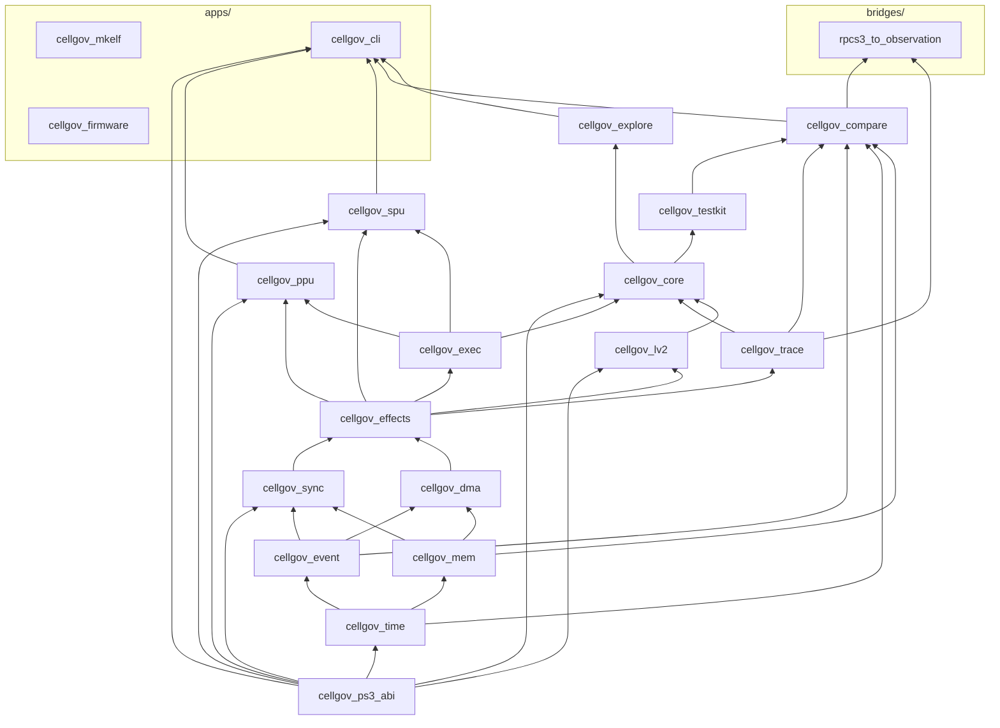

# CellGov Architecture

CellGov is a deterministic Rust runtime that interprets PS3 PPU and SPU
code, produces replayable execution traces, and validates its output
against RPCS3 baselines. It is the oracle layer for static
recompilation: it does not run games, it tells the recompiler what the
correct output is.

The whole design hangs off one rule: **no execution unit publishes
guest-visible state directly. All state changes pass through one
ordered pipeline.** Everything else in this document follows from
that.

## Workspace shape

16 library crates, 3 application binaries under `apps/`, and 1 bridge
binary under `bridges/`, organized as a strict layered DAG.
Foundational primitives sit at the bottom; consumers at the top. No
backward edges. `cellgov_ps3_abi` is the data-only leaf for PS3
ABI source-of-truth values (NIDs, errnos, struct layouts, syscall
numbers, ELF/PRX layout, hardware constants); it depends on nothing
in the workspace and is depended on by every layer that consumes
PS3 ABI literals. `cellgov_firmware` is fully standalone (no
workspace library dependencies); `cellgov_mkelf` likewise.



Four structural rules worth calling out:

- `cellgov_lv2` does not depend on `cellgov_core`. The runtime calls
  into the host through a narrow `Lv2Runtime` trait; the host never
  reaches back.
- `cellgov_ppu` and `cellgov_spu` are leaves of the library DAG. They
  plug into the runtime through the `ExecutionUnit` trait in
  `cellgov_exec`; the runtime drives any `T: ExecutionUnit` without
  naming concrete types.
- `cellgov_explore` lives above `cellgov_core` and drives the runtime
  externally through `Runtime::step` / `commit_step` /
  `set_scheduler`. It never modifies the runtime model.
- `cellgov_firmware` is a lib+bin: the binary exposes the `install`
  and `decrypt-self` subcommands; the library exposes the same PUP
  / SCE / SELF / TAR / APP-key primitives. `cellgov_cli` takes a
  library dependency to decrypt SCE-wrapped SELFs on the fly at
  boot time. The crypto crates (`aes`, `cbc`, `ctr`, `hmac`,
  `sha1`, `flate2`) are pulled by `cellgov_firmware` alone.

External dependencies are minimal: `serde`, `serde_json`, and `toml`
in `cellgov_compare`; `serde` and `serde_json` in `cellgov_explore`
and `cellgov_cli`; crypto crates in `cellgov_firmware` only.
Everything else is workspace-internal. The workspace compiles under
`unsafe_code = "forbid"`.

## Per-crate responsibilities

| Crate                          | Responsibility                                                                                                                                                                                                                                                                                                                                                                                                                                           |
| ------------------------------ | -------------------------------------------------------------------------------------------------------------------------------------------------------------------------------------------------------------------------------------------------------------------------------------------------------------------------------------------------------------------------------------------------------------------------------------------------------- |
| `cellgov_ps3_abi`              | PS3 ABI source-of-truth leaf: NIDs (with `nid_const!` SHA-1 verification), the global NID lookup table and `stub_classification`, LV2 errno database, LV2 syscall numbers, ELF / PRX / SPRX layout, CBE PPU hardware constants, and RSX hardware constants under `rsx_nv_hardware.rs`. Data only; no behaviour. Zero workspace dependencies.                                                                                                                                                |
| `cellgov_time`                 | `GuestTicks`, `Budget`, `Epoch` -- distinct numeric types so guest time never accidentally becomes wall time.                                                                                                                                                                                                                                                                                                                                            |
| `cellgov_event`                | `UnitId`, `EventId`, `MailboxId`, `PriorityClass` -- identifier types and event vocabulary.                                                                                                                                                                                                                                                                                                                                                              |
| `cellgov_mem`                  | `GuestMemory` (sorted `Vec<Region>` matching the PS3 LV2 VA layout), `Region` with `RegionAccess` modes, `ByteRange`, `GuestAddr`, FNV-1a hashing with cached `content_hash`, and `StagingMemory` / `StagedWrite` for batched pending writes.                                                                                                                                                                                                            |
| `cellgov_sync`                 | Mailbox FIFO, signal-register OR-merge, barrier ids, and the atomic reservation table.                                                                                                                                                                                                                                                                                                                                                                  |
| `cellgov_dma`                  | DMA completion queue with pluggable latency models.                                                                                                                                                                                                                                                                                                                                                                                                      |
| `cellgov_effects`              | The 13-variant `Effect` enum and inline `WritePayload` (16-byte stack buffer, heap fallback above).                                                                                                                                                                                                                                                                                                                                                      |
| `cellgov_exec`                 | `ExecutionUnit` trait, `ExecutionContext`, `ExecutionStepResult`. The boundary between architecture interpreters and the runtime. Effects flow through a caller-owned `&mut Vec<Effect>` passed to `run_until_yield`, not on the result struct.                                                                                                                                                                                                          |
| `cellgov_trace`                | Binary trace format: 9 record variants with strict tag/layout contract (7 decision-level + `PpuStateHash` + `PpuStateFull` for per-step divergence trace).                                                                                                                                                                                                                                                                                               |
| `cellgov_lv2`                  | LV2 model: image / content registry, thread-group table, PPU thread table, in-memory filesystem store, LV2 sync primitives (mutex, cond, semaphore, lwmutex, event-flag, event-queue), syscall classification (`Lv2Request`) and dispatch (`Lv2Dispatch`).                                                                                                                                                                                              |
| `cellgov_core`                 | The runtime: deterministic step loop, commit pipeline, syscall response table, SPU factory hook.                                                                                                                                                                                                                                                                                                                                                         |
| `cellgov_ppu`                  | PPU interpreter, ELF64 / SPRX / PRX loaders, and the PRX loader's dependency-ordered multi-module import resolution. The NID lookup database itself lives in `cellgov_ps3_abi`.                                                                                                                                                                                                                                                                                         |
| `cellgov_spu`                  | SPU interpreter and SPU ELF loader. The MFC / SPU channel-number constants live in `cellgov_ps3_abi::spu_channels`.                                                                                                                                                                                                                                                                                                                                       |
| `cellgov_testkit`              | Scenario fixtures and the runner used by tests across the workspace.                                                                                                                                                                                                                                                                                                                                                                                     |
| `cellgov_compare`              | Normalized observation schema, RPCS3 runner adapter, multi-baseline diff, per-step `diverge` scanner, zoom-in `zoom_lookup`.                                                                                                                                                                                                                                                                                                                             |
| `cellgov_explore`              | Bounded schedule exploration with conflict-aware pruning.                                                                                                                                                                                                                                                                                                                                                                                                |
| `cellgov_cli`                  | The user-facing binary: `run-game`, `bench-boot`, `bench-boot-once`, `dump`, `dump-imports`, `disasm`, `compare`, `explore`, `compare-observations`, `diverge`, `zoom`.                                                                                                                                                                                                                                                                                  |
| `cellgov_mkelf`                | Standalone tool that generates PPU ELF fixtures for the microtest corpus. No workspace dependencies.                                                                                                                                                                                                                                                                                                                                                     |
| `cellgov_firmware`             | PS3 firmware and SELF decrypter. Lib + bin. The binary's `install` subcommand peels the outer SCE/PUP wrapping of a `PS3UPDAT.PUP` and writes per-module SELFs to `firmware/` (PUP container parse, SHA-1 HMAC validation, AES-256-CBC / AES-128-CTR decryption, zlib decompression, nested TAR extraction). The `decrypt-self` subcommand decrypts one SELF at a time. The library's `sce::decrypt_self_to_elf` is also called by `cellgov_cli`'s boot path to peel encrypted SELFs at load time. APP keys cover firmware revisions 0x0000-0x001D, mirroring RPCS3's `KeyVault::LoadSelfAPPKeys`. The fourteen-module minimum viable PRX set from the user's PUP decrypts bit-identically to the output of RPCS3's decrypter run on the same PUP (the user supplies the PUP; neither RPCS3 nor CellGov ships firmware). No RPCS3 dependency at runtime. |
| `bridges/rpcs3_to_observation` | RPCS3 dump -> `Observation` JSON adapter. Lives under `bridges/` (excluded from the workspace's `default-members`) so a plain `cargo build` does not pull in any RPCS3-aware code. Build explicitly with `cargo build -p rpcs3_to_observation`. Paired with the C++ patch under `bridges/rpcs3-patch/`.                                                                                                                                                  |

## Guest memory layout

`cellgov_mem::GuestMemory` is a sorted `Vec<Region>` keyed by
region base address. Each `Region` owns a `Vec<u8>` sized to that
region plus a label, page-size class, and access mode. Address
translation goes through `containing_region(addr, length)` (a
binary search), which returns the region entirely containing the
range or `None` if the access straddles a boundary or falls in an
unmapped gap.

The `run-game` driver builds five regions matching the canonical PS3
LV2 virtual-address layout:

| Guest VA              | Size   | Label          | Access                           | Purpose                                                                  |
| --------------------- | ------ | -------------- | -------------------------------- | ------------------------------------------------------------------------ |
| 0x00000000-0x3FFFFFFF | 1 GB   | `main`         | `ReadWrite`                      | User memory: EBOOT PT_LOAD segments, TLS, firmware PRX images, allocator pool |
| 0xC0000000-0xCFFFFFFF | 256 MB | `rsx`          | `ReservedZeroReadable` (default) | Video / RSX local memory -- placeholder, reads zero and are counted      |
| 0xD0000000-0xD00FFFFF | 1 MB   | `stack`        | `ReadWrite`                      | Primary-thread stack (page-4K); matches `PROC_PARAM.primary_stacksize` typical for retail titles |
| 0xD0100000-0xD0FFFFFF | 15 MB  | `child_stacks` | `ReadWrite`                      | Stack pool for PPU threads spawned by `sys_ppu_thread_create`            |
| 0xE0000000-0xFFFFFFFF | 512 MB | `spu_reserved` | `ReservedZeroReadable` (default) | SPU-shared range -- same provisional semantics as RSX                    |

The `main` region's internal sub-layout is not tracked by the region
map (it stays flat within that region): `sys_memory_allocate` starts
above the loaded ELF footprint (computed at startup by scanning the
ELF's highest user-region PT_LOAD end + 64 KB alignment); TLS sits
at `0x10400000`; firmware PRX images load above that. The allocator
base moves above the ELF because real PS3 LV2 shares
`0x00010000-0x0FFFFFFF` between the loaded binary and the
allocator pool; CellGov matches that layout so guest pointer
values line up across runners.

### Region access modes

`RegionAccess` has three variants, encoded as a distinct enum (not a
boolean flag) so a future contributor cannot accidentally collapse
them:

- **`ReadWrite`**: normal user memory. Reads and writes go through
  the region's backing `Vec<u8>`.
- **`ReservedZeroReadable`**: reads return the region's zero-init
  bytes and bump `GuestMemory::provisional_read_count`; writes fault
  with `MemError::ReservedWrite`. This is the default for RSX and
  SPU-reserved -- it keeps the address space honest without
  requiring real semantics, and surfaces any silent zero-reads in
  `run-game`'s end-of-boot summary.
- **`ReservedStrict`**: reads via the legacy `GuestMemory::read`
  return `None`; reads via `GuestMemory::read_checked` fault with
  `MemError::ReservedStrictRead { addr, region }`. Writes fault
  with `MemError::ReservedWrite`. Opted into via
  `--strict-reserved` on the CLI, used by tests asserting no code
  paths touch the region yet.

Out-of-region accesses (addresses that fall in no region) surface as
`MemError::Unmapped(FaultContext)`, where `FaultContext` names the
faulting address and the labels of the nearest mapped regions below
and above it. This turns a diagnostic at `0xB0000000` into
"between `main` and `rsx`" rather than a bare "out of bounds".

### PPU access routing

The PPU interpreter's fetch path uses `GuestMemory::as_bytes()`, a
legacy accessor that returns the base-0 region's bytes -- code
always lives in `main`, so this is safe. Load paths (`ld`, `lwz`,
`lfs`, `lvx`, etc.) go through the `load_slice` helper, which scans
a stack-allocated region-view table built at the top of
`run_until_yield`: a `[(u64, &[u8]); 8]` snapshot (`MAX_REGIONS = 8`)
of every region's base and bytes, sliced to the active region count
per dispatch. Linear scan wins over `BTreeMap` lookup
because the region count stays single-digit under the current PS3
layout (main, stack, child_stacks, rsx, spu_reserved); if many more mappings are
later added, a two-tier fast-path is the natural next
step. Stores go through `Effect::SharedWriteIntent`
effects -- the commit pipeline's `apply_commit` is region-aware, so
stores to any mapped region land correctly.

## Per-step pipeline

`Runtime::step` and `Runtime::commit_step` together implement a
nine-step deterministic loop:

1. Select a runnable unit via the configured `Scheduler`. The
   default `RoundRobinScheduler` walks the registry in id
   order from the position after the last selection, skipping
   units whose effective status is `Blocked` / `Faulted` /
   `Finished`. Two stickiness exceptions match real-PS3 time-
   slice behavior: the previous unit is reselected if (a) it
   holds at least one lwmutex (critical section in flight), or
   (b) the previous yield was a non-blocking syscall that did
   not wake any other unit. Wake-causing syscalls (`sema_post`,
   `event_flag_set`, etc.) follow normal rotation so the woken
   unit gets to run. A sticky-streak counter bounds how long a
   single unit can hold the seat: after 64 consecutive sticky
   yields the scheduler rotates regardless of the held-lwmutex /
   non-waking-syscall triggers, so a single thread that holds an
   lwmutex while doing only non-waking syscalls cannot starve
   peers indefinitely. The 64-step ceiling is 8x the empirical
   minimum (the longest ps3autotests printf critical section).
   A single-runnable fast path keeps single-PPU titles off the
   two-pass rotation. When the registry is non-empty but every
   unit is `Blocked`, `Runtime::step` returns
   `StepError::AllBlocked` rather than `NoRunnableUnit` --
   callers that care about liveness vs terminal stall can
   distinguish the two.
2. Grant the unit the per-step `Budget` (default 256 instructions).
3. Run the unit until it yields (one `ExecutionUnit::run_until_yield`).
   The PPU executes up to Budget instructions per call, batching
   across basic-block boundaries. An intra-block store-forwarding
   buffer provides write-then-read coherence within the batch.
   Effects are collected through a caller-owned `&mut Vec<Effect>`
   (not on the result struct).
4. Validate every effect against the registry and memory in a
   single pass, staging `SharedWriteIntent` payloads into a
   `StagingMemory` buffer as it goes. A validation failure clears
   the staging buffer and rejects the whole batch.
5. Drain the staging buffer to guest memory as one atomic operation,
   then apply the remaining per-effect updates (mailboxes, signals,
   DMA enqueue, reservations, wakes, block transitions, RSX flip
   requests) in emission order.
6. Dispatch the unit's syscall through `Lv2Host` if the yield reason
   was `Syscall`; absorb a callback-worker mid-body fault if the
   source is a registered worker.
7. Advance the commit epoch, then fire any DMA completions whose
   ready tick has arrived; resolve join wakes if the unit finished;
   run the RSX FIFO advance pass (its emitted effects queue for the
   next batch under the atomic-batch contract).
8. Emit commit trace records for the batch and notify the scheduler
   of the yield, passing whether other units were woken and whether
   the source still holds an lwmutex.
9. Guest time itself advances inside step 3 (`Runtime::step`) by
   the unit's consumed budget; `commit_step` only advances the
   epoch.

Steps 4-5 are atomic. A fault (`YieldReason::Fault` checked at
step 4 entry, or a validation rejection mid-step 4) discards the
entire batch -- the unit faults, the rest of the system sees
nothing the unit tried to do. This is what makes the determinism
guarantees mechanical rather than aspirational. When a fault
occurs mid-batch (after some instructions have retired), the PPU
restores a state snapshot taken at step entry and re-executes at
Budget=1 so that pre-fault instructions commit individually and
the faulting instruction is isolated.

**Trivial-step fast path (FaultDriven only).** When the effects
vec is empty, `fault` is `None`, `yield_reason` is neither
`Syscall` nor `Finished`, the DMA queue is empty, and no RSX
work is pending, `Runtime::commit_step` skips steps 4-8 and only
advances the epoch (plus the scheduler `notify_yielded` call).
Under `RuntimeMode::FaultDriven` the trace records of steps 1-8
are suppressed anyway, so the observable contract is identical --
every atomic-batch boundary
still advances the epoch, and scheduler-visible state
(`status_overrides`, pending receives / syscall returns / reg
writes) is unchanged by an empty commit. The fast path cuts the
per-step commit cost for PPU-bound hot loops that dominate real
game boots; scenarios with async state (pending DMA, pending
wakes) naturally fall to the slow path on the step that
originates or observes the async event.

## Predecoded instruction shadow

The PPU maintains a `PredecodedShadow` covering the main text
region. Every 4-byte-aligned instruction word is decoded once at
ELF load time and stored in a flat `Vec<PpuInstruction>` indexed
by `(pc - base) / 4`. The hot-path fetch becomes a bounds check
plus an array index instead of a raw-memory read plus decode.

Three optimization passes run at shadow build time:

1. **Quickening.** Common idioms are rewritten into specialized
   variants that eliminate redundant work: `addi rT, 0, imm` ->
   `Li`, `or rA, rS, rS` -> `Mr`, `rlwinm` subsets ->
   `Slwi`/`Srwi`/`Clrlwi`, `ori rA, rA, 0` -> `Nop`,
   `cmpwi crF, rA, 0` -> `CmpwZero`, `rldicl`/`rldicr` subsets
   -> `Clrldi`/`Sldi`/`Srdi`. Candidates are selected from
   instruction profiling data (> 0.5% frequency threshold).

2. **Super-pairing.** Frequent 2-instruction sequences are fused
   into single dispatch entries: `lwz + cmpwi` -> `LwzCmpwi`,
   `li + stw` -> `LiStw`, `mflr + stw` -> `MflrStw`,
   `lwz + mtlr` -> `LwzMtlr`, `mflr + std` -> `MflrStd`,
   `ld + mtlr` -> `LdMtlr`, `std + std` -> `StdStd`,
   `cmpwi + bc` -> `CmpwiBc`, `cmpw + bc` -> `CmpwBc`. The
   second slot is marked `Consumed`; the fetch loop skips it.
   Candidates are selected from adjacent-pair profiling data
   (> 1% frequency threshold).

3. **Block-length annotation.** A backward scan fills
   `block_len[i]` with the number of instructions to the end of
   the basic block. Branches and syscalls terminate blocks. The
   runtime uses this to size the inner loop's iteration count.

Guest-visible code writes (self-modifying code, CRT0 relocations,
GOT slot patching during PRX import binding) invalidate the
affected slots. The next fetch re-decodes from committed memory
and re-applies quickening.

## Effects and trace records

The full vocabulary of guest-visible operations:

- **13 effect variants** in `cellgov_effects::Effect`:
  `SharedWriteIntent`, `MailboxSend`, `MailboxReceiveAttempt`,
  `DmaEnqueue`, `WaitOnEvent`, `WakeUnit`, `SignalUpdate`,
  `FaultRaised`, `TraceMarker`, `ReservationAcquire`,
  `ConditionalStore`, `RsxLabelWrite`, `RsxFlipRequest`.
- **10 trace record variants** in `cellgov_trace::TraceRecord` --
  seven decision-level (`UnitScheduled`, `StepCompleted`,
  `CommitApplied`, `StateHashCheckpoint`, `EffectEmitted`,
  `UnitBlocked`, `UnitWoken`), two per-step variants for the
  divergence trace (`PpuStateHash`, `PpuStateFull`), and one
  diagnostic side-channel for host-side invariant breaks
  (`HostInvariantBreak`).

Trace emission is gated by `RuntimeMode` (`FaultDriven` /
`DeterminismCheck` / `FullTrace`). Fault-driven boot pays no trace
overhead; determinism check pays state-hash overhead at commit
boundaries; full trace pays both.

The two per-step variants are gated by the runtime's mode through
the per-call `ExecutionContext::trace_per_step` flag.
`RuntimeMode::FullTrace` and `RuntimeMode::DeterminismCheck` set
the flag; `FaultDriven` does not. When set, the unit emits one
`PpuStateHash` (25 bytes: step + pc + 64-bit FNV-1a fingerprint of
GPR + LR + CTR + XER + CR) per retired instruction. The runtime
drains them via `ExecutionUnit::drain_retired_state_hashes` after
each `run_until_yield` and writes them to the main trace stream
with monotonic per-instruction step indices that are independent
of `steps_taken`. Per-instruction PC attribution is preserved at
any `Budget` size: a single yield retiring N instructions emits N
records, one per PC. `set_full_state_window(Some((lo, hi)))` enables a
bounded-window second stream of `PpuStateFull` records (301 bytes
each, full register snapshot) routed to a separate `zoom_trace`
sink so the main per-step stream stays homogeneous. Cost: 876 ns per
100 instructions when off, 27 us per 100 instructions when on
(measured on a Windows dev box; the off branch is one predicted-away
test in the hot loop).

## Execution units

**PPU (`cellgov_ppu`)**: PPC64 interpreter with 32 GPRs, 32 FPRs, PC,
CR, LR, CTR, XER (carry tracked), TB, and 32 vector registers.
**160 `PpuInstruction` variants** today, covering integer arithmetic
and logic, D-form / DS-form / indexed loads/stores with and without
update (including DS-form `lwa`), conditional branches with
LR/CTR/AA variants, 64-bit multiply and divide families, signed and
unsigned multiply-high, rotate and mask families (`rlwinm`, `rlwnm`,
`rldicl`, `rldicr`, `rldimi`), floating-point arithmetic and
conversion (`fmadd`, `fmul`, `fdiv`, `fcmp`, `fsel`, `frsp`,
`fctiwz`, `fcfid`), VMX (25+ VX-form and VA-form vector ops), SPR/CR
moves, atomic load-reserve / store-conditional pairs, and
record-form variants (`addic.`, `andis.`). The variant count
includes the shadow's quickening rewrites (`Mr`, `Li`,
`Slwi`/`Srwi`/`Sldi`/`Srdi`, `Clrlwi`/`Clrldi`, `Nop`, `CmpwZero`)
and super-pair fusions (`LwzCmpwi`, `LwzMtlr`, `MflrStw`, `MflrStd`,
`LiStw`, `CmpwiBc`, `CmpwBc`, `LdMtlr`, `StdStd`) plus the
`Consumed` placeholder; the architectural-instruction subset is
~141 of the 160.

The PPU side also owns the loaders: PPU ELF64 with PT_LOAD and PT_TLS
segment handling, SPRX parser for decrypted PS3 firmware modules with
relocation appliers covering the types listed in
`cellgov_ppu::sprx::APPLIER_SUPPORTED_TYPES` (the single source of
truth that the firmware reloc census audit also consults), and the
PS3 PRX import-table parser.
The NID lookup database (~5,327 entries) lives in
`cellgov_ps3_abi::nid` and is accessed via `lookup(nid)` for
human-readable name resolution in fault diagnostics.

The PRX loader resolves every game import to a firmware OPD if
one exists. Imports without a matching firmware export are
patched to the unresolved-import trampoline (see "LV2 host"
table). The minimum viable PRX set loads in topological-sort
order, with `module_start` invoked per module under a synthetic
kernel-context OPD.

`run-game` exposes two env vars for firmware-loading experiments:
`CELLGOV_PRX_BASE` overrides the firmware PRX load address, and
`CELLGOV_SKIP_MODULE_START=1` bypasses `module_start` for a
firmware PRX whose initializer corrupts state under CellGov's
current LV2 coverage.

**SPU (`cellgov_spu`)**: 128x128-bit register file, 256 KB local
store, channel file. Implements RR / RI7 / RI10 / RI16 / RI18 / RRR
forms covering constant formation, integer arithmetic and logic,
compare, branch, shuffle and rotate, load and store, channel
operations. Communicates with the runtime exclusively through
effects, never reads or writes committed shared memory directly.
Includes an SPU ELF loader.

## LV2 host

`cellgov_lv2` owns the LV2 state machine: image registry, thread group
table, PPU thread table, TLS template, child-stack allocator, syscall
classification, syscall dispatch.

Classified into typed `Lv2Request` variants:

| Syscall                           | Number           | Behavior                                                                                               |
| --------------------------------- | ---------------- | ------------------------------------------------------------------------------------------------------ |
| `sys_process_is_spu_lock_line_reservation_address` | 14   | Returns 0 (SUCCESS) for any address; the deterministic-oracle does not partition guest memory into SPU-reservable vs. not. Behavioural oracle: RPCS3's `sys_process.cpp`. |
| `sys_process_exit`                | 22               | Cascades Finished to all units in the process.                                                         |
| `sys_ppu_thread_exit`             | 41               | Finishes the calling unit; wakes joiners with the exit value.                                          |
| `sys_ppu_thread_yield`            | 43               | No-op scheduling hint; round-robin picks the next runnable unit.                                       |
| `sys_ppu_thread_join`             | 44               | Either returns exit value immediately or blocks caller on target.                                      |
| `sys_ppu_thread_create`           | 52               | Allocates stack + TLS, seeds child `PpuState`, registers a new PPU unit mid-run via `PpuFactory`.      |
| `sys_event_flag_*`                | 82, 83, 85, 86, 87, 118 | Create / destroy / wait / trywait / set / clear. AND/OR match with CLEAR/NO-CLEAR wake policy. Slot 84 is `_sys_interrupt_thread_establish`; slot 118 is the firmware-era home of `sys_event_flag_clear`. |
| `sys_semaphore_*`                 | 90-94, 114       | Create / destroy / wait / trywait / post / get_value. Wake-or-increment on post.                       |
| `sys_lwmutex_*`                   | 95-99            | Create / destroy / lock / unlock / trylock. FIFO waiter list, ownership tracked, EDEADLK on re-enter.  |
| `sys_mutex_*`                     | 100, 102-104     | Create / lock / unlock / trylock. Heavy-mutex variant of lwmutex with attribute capture.               |
| `sys_cond_*`                      | 105-110          | Create / destroy / wait / signal / signal_all / signal_to. Two-hop drop-and-reacquire mutex protocol.  |
| `sys_event_queue_*`               | 128-131, 138     | Create / destroy / receive / tryreceive / port_send. Bounded FIFO with 4-u64 payloads.                 |
| `sys_time_get_timezone`           | 144              | Writes zero through both out-pointers (UTC, no DST). CellGov has no host-time dependency.              |
| `sys_spu_image_open`              | 156              | Looks up SPU ELF by path, writes `sys_spu_image_t` to guest memory.                                    |
| `sys_spu_image_import`            | 158              | Registers `size` bytes at the guest pointer into the `ContentStore` and writes a `sys_spu_image_t` referring to the registered blob. |
| `sys_spu_initialize`              | 169              | Returns CELL_OK; the deterministic-oracle does not partition the SPU pool into "usable" vs "raw" slots. `max_usable_spu` / `max_raw_spu` captured for tracing. |
| `sys_spu_thread_group_create`     | 170              | Allocates a monotonic group id, writes it to guest pointer.                                            |
| `sys_spu_thread_group_destroy`    | 171              | Withdraws the group from the table, scrubs unit / thread maps, returns CELL_OK. CELL_ESRCH on unknown id, CELL_EBUSY if any SPU in the group is still Running. |
| `sys_spu_thread_initialize`       | 172              | Records image handle and args (copied at init time) per slot.                                          |
| `sys_spu_thread_group_start`      | 173              | Returns `RegisterSpu` with init state per slot; runtime creates SPUs.                                  |
| `sys_spu_thread_group_terminate`  | 177              | Not modeled; returns CELL_ENOSYS via the null backend (logged as invariant break). Split from join so dispatch cannot conflate the two ABI shapes. RPCS3 reference: its `sys_spu.cpp` terminate handler. |
| `sys_spu_thread_group_join`       | 178              | Blocks caller; wakes when all SPUs in the group finish.                                                |
| `sys_spu_thread_write_spu_mb`     | 190              | Deposits a value into the target SPU's inbound mailbox.                                                |
| `sys_memory_container_create`     | 341              | Allocates a monotonic container id, writes it to guest pointer.                                        |
| `sys_memory_allocate`             | 348              | Bump-allocates 64KB-aligned guest memory from the PS3 user region (0x00010000+, above the loaded ELF). |
| `sys_memory_free`                 | 349              | Stub: no-op (CellGov does not track deallocation).                                                     |
| `sys_memory_get_user_memory_size` | 352              | Writes `sys_memory_info_t` (total / available, 0x0D500000 each) to guest pointer.                      |
| `sys_tty_write`                   | 403              | Returns CELL_OK; fd / len / buf carried in `Lv2Request` for tracing.                                   |
| `sys_fs_open`                     | 801              | Routes through the in-memory FS layer (see "In-memory filesystem" below). Manifest-registered paths get a fresh fd from `FsStore`; legacy whitelist paths (`PARAM.SFO`, `output.txt`) get an `alloc_id` synthetic fd; everything else returns `CELL_FS_ENOENT`. CELL_EFAULT on unmapped path / fd out-pointer; CELL_EINVAL on no-NUL within `CELL_FS_MAX_PATH_LENGTH`; CELL_EMFILE when the FsStore allocator is exhausted. |
| `sys_fs_read`                     | 802              | Reads up to `nbytes` from `fd`'s offset into the guest buffer; advances the offset by the actual count returned and writes that count (u64 BE) to `nread_out_ptr`. Error precedence: bad nread out-pointer (8-byte aligned + writable) -> CELL_EFAULT; unknown fd -> CELL_EBADF; bad buffer (when nbytes > 0) -> CELL_EFAULT BEFORE the offset advances (POSIX semantics). |
| `sys_fs_close`                    | 804              | FsStore-tracked fds are removed from the open-fd table so subsequent reads / fstats return EBADF. Unknown fds return CELL_OK to preserve legacy whitelist `fclose` behaviour; this is a deliberate divergence pending whitelist retirement. `fs_fd_count` is left unchanged across close (real-PS3 invariant pinned by ps3autotests `sys_process`). |
| `sys_fs_lseek`                    | 818              | SEEK_SET / CUR / END semantics via `FsStore::seek`. Errors: CELL_EFAULT (bad pos out-pointer), CELL_EINVAL (whence out of `{0,1,2}` or seek out of `[0, u64::MAX]`), CELL_EBADF (unknown fd). Failed seek leaves the offset unchanged. |
| `sys_fs_opendir`                  | 805              | Snapshots the manifest- or mount-resolved directory entries into a per-fd `BTreeMap<u32, DirEntry>`, sorted lexicographically by byte order. Returns a fresh dir-fd via `FsStore::open_dir`. CELL_FS_ENOENT for unknown paths (including mount-resolve misses). |
| `sys_fs_readdir`                  | 806              | Yields the next `CellFsDirent` (258 bytes) at the dir-fd's cursor; writes the entry size to the caller's out-pointer (0 on end-of-directory). CELL_EBADF on unknown fd. |
| `sys_fs_closedir`                 | 807              | Drops the dir-fd's snapshot and entry table. CELL_EBADF on unknown fd. |
| `sys_fs_stat`                     | 808              | Path-keyed variant of `sys_fs_fstat`; manifest miss probes the mount table before returning CELL_FS_ENOENT. Same struct shape. |
| `sys_fs_fstat`                    | 809              | Writes a 56-byte `CellFsStat` to `stat_out_ptr` (8-byte aligned). `mode = S_IFREG \| 0o444`, `size` from the backing blob, `blksize = 4096`, all timestamp fields zero (oracle has no host time). CELL_EBADF on unknown fd. |
| `UnresolvedImport`                | (trampoline)     | Issued by the guest-resident unresolved-import trampoline when CRT0 calls through a GOT slot whose NID had no matching firmware export. The PRX loader patches such slots to point at a trampoline OPD that loads the NID into r4 and fires this syscall. Dispatcher prints a named diagnostic (`dispatch.unresolved_import: NID 0x... in namespace X`) and returns CELL_EINVAL so the next observable effect is a structured fault, not control-flow corruption into junk PCs. |

### PPU thread lifecycle

The `PpuThreadTable` in `cellgov_lv2::ppu_thread` tracks every
PS3-visible PPU thread: the primary (seeded at host construction)
and any child spawned via `sys_ppu_thread_create`. Each entry
carries a guest-facing `PpuThreadId`, the runtime `UnitId`, the
lifecycle state, the creation attributes (entry OPD, arg, stack
range, priority, TLS base), the exit value (set on
`sys_ppu_thread_exit`), and a join-waiters list.

State machine: `Runnable -> Blocked(GuestBlockReason)
-> Runnable` (on wake), or `Runnable -> Finished` (on exit). The
guest-facing `GuestBlockReason` lives next to the thread table;
the scheduler sees only the opaque `UnitStatus::Blocked`.
Variants cover every LV2 primitive that parks a caller:
`WaitingOnJoin`, `WaitingOnLwMutex`, `WaitingOnMutex`,
`WaitingOnSemaphore`, `WaitingOnEventQueue`, `WaitingOnEventFlag`,
and `WaitingOnCond`. Each carries the primitive id (and the
associated mutex id for `WaitingOnCond`); this richer context is
used by diagnostics and fault backtraces but never by the
scheduler, which stays agnostic to the blocking cause.

Child stacks come from the 15 MB `child_stacks` region at
`0xD0100000+`. `ThreadStackAllocator` is a deterministic bump
allocator: two fresh allocators produce byte-identical sequences.

Per-thread TLS is instantiated from the captured `TlsTemplate`:
`set_tls_template` fires once at boot (from the loader's PT_TLS
header) and `template.instantiate()` produces a fresh copy of
the initial bytes plus zero-filled BSS tail for each child.

Mid-run unit registration goes through the `PpuFactory` hook on
`Runtime` (installed by the CLI boot path). The factory receives
a `PpuThreadInitState` (resolved entry code address, TOC, arg,
stack top, TLS base, LR sentinel) and returns a concrete
`PpuExecutionUnit` with its `PpuState` seeded per the PPC64 ABI.
This mirrors the SPU factory pattern so `cellgov_core` stays
independent of `cellgov_ppu`.

Many arms are special-cased in the host dispatcher to return
spec-correct error codes or to stage guest-memory effects. The
source of truth is `cellgov_lv2::host::dispatch_route`; the table
below enumerates each arm that carries a non-default behavior.
Syscalls without a typed-variant arm route through the null
backend (see "Null backend for unmodeled syscalls" below) and
return `CELL_ENOSYS` with a traced diagnostic.

| Syscall / Request                                      | Number | Behavior                                                                                                                                                                                                                |
| ------------------------------------------------------ | ------ | ----------------------------------------------------------------------------------------------------------------------------------------------------------------------------------------------------------------------- |
| `sys_ppu_thread_get_priority`                          | 48     | Writes target priority (s32) to `*priop`; unknown thread id falls back to 1001 (boot-seed primary priority). CELL_EFAULT on null `priop`.                                                                               |
| `sys_tty_read`                                         | 402    | CELL_EIO (debug console off in retail).                                                                                                                                                                                 |
| DEX-only unused slot                                   | 462    | CELL_ENOSYS so retail liblv2 takes its fallback path.                                                                                                                                                                   |
| `sys_memory_container_create`                          | 324    | Mints kernel id, writes to `*cid_ptr`. CELL_EFAULT on null pointer.                                                                                                                                                     |
| `sys_mmapper_allocate_address`                         | 330    | Bumps a 256 MiB-aligned cursor from `0x4000_0000` (immediately above the sys_rsx window) toward `MMAPPER_REGION_END = 0xD000_0000` (start of the PPU stack region), writes base to `*alloc_addr_ptr`. CELL_ENOMEM on `size == 0`, u32 overflow, or cap-exceeded. CELL_EFAULT on null pointer.                                                                          |
| `sys_mmapper_allocate_shared_memory`                   | 332    | Mints mem_id, writes to `*mem_id_ptr`. CELL_EFAULT on null pointer.                                                                                                                                                     |
| `sys_mmapper_search_and_map`                           | 337    | Writes `start_addr` verbatim to `*alloc_addr_ptr` (flat backing collapses the search). CELL_EINVAL when `start_addr` falls outside `[0x2000_0000, 0xC000_0000)`. CELL_EFAULT on null `alloc_addr_ptr`.                  |
| `sys_mmapper_allocate_shared_memory_from_container`    | 362    | Same shape as 332 with `*mem_id_ptr` at r7.                                                                                                                                                                             |
| `_sys_prx_load_module`                                 | 480    | Resolves path at r3 against the PRX registry; returns the registered kernel id on match, otherwise echoes the path pointer as a synthetic non-zero id.                                                                  |
| `_sys_prx_start_module`                                | 481    | CELL_EINVAL when `id == 0` or `pOpt == 0`. Otherwise writes `~0` (no-start sentinel) to `pOpt->entry` and returns CELL_OK.                                                                                              |
| `_sys_prx_register_module`                             | 484    | CELL_PRX_ERROR_ELF_IS_REGISTERED (`0x8001_1910`) for non-VSH callers.                                                                                                                                                   |
| `_sys_prx_get_module_list`                             | 494    | `flags & 0x2 == 0` -> CELL_OK no-op. With bit 2 set: CELL_EFAULT on null `pInfo`, otherwise walks the PRX registry (filtering liblv2.sprx) writing kernel ids to the `idlist` slot and the count to `pInfo->count`. Iteration is BTreeMap-keyed so the byte output is independent of registration order. |
| `_sys_prx_load_module_on_memcontainer`                 | 497    | Same resolver as 480.                                                                                                                                                                                                   |
| `SsAccessControlEngine` (`sys_ss_access_control_engine`) | --     | `pkg_id == 1` or `3` -> CELL_ENOSYS (debug/root only). `pkg_id == 2` writes the program-authority id (`0x1070_0000_3A00_0001`) to `*a2`; CELL_EFAULT when `a2 == 0` or does not fit `u32`. Other `pkg_id` values return SS-domain status `0x8001_051D`. |
| `TimeGetTimezone`                                      | --     | Writes 0 to `*timezone_ptr` and `*summer_time_ptr` (UTC). CELL_EFAULT on any null pointer.                                                                                                                              |
| `TimeGetCurrentTime`                                   | --     | Writes `(sec, nsec)` derived from the dispatch-entry tick snapshot. CELL_EFAULT on any null pointer.                                                                                                                    |
| `TimeGetTimebaseFrequency`                             | --     | Returns `CELL_PPU_TIMEBASE_HZ` as the syscall code (no effects).                                                                                                                                                        |
| `MemoryGetUserMemorySize`                              | --     | Writes `(total, available)` = `(0x0D50_0000, 0x0D50_0000)` (PS3 game-mode user-memory cap). CELL_EFAULT on null pointer.                                                                                                |
| `MemoryContainerCreate`                                | --     | Mints kernel id, writes to `*cid_ptr` (same payload shape as syscall 324).                                                                                                                                              |
| `Hypercall`                                            | --     | CELL_EINVAL + invariant-break log (PS3 usermode must not issue `sc` with `LEV != 0`).                                                                                                                                   |
| `Malformed`                                            | --     | CELL_EINVAL + invariant-break log.                                                                                                                                                                                      |

`PpuThreadCreate` is decoded as a typed variant, not an `Unsupported`
arm; nonzero `SYS_PPU_THREAD_CREATE_{JOINABLE,INTERRUPT}` flag bits
are not modeled in the thread-table state and fire an invariant-break
log on first occurrence.

### Null backend for unmodeled syscalls

Any syscall without a typed-variant arm dispatches to the
**null backend**: an ABI-honest per-syscall "not implemented"
response, traced as a first-class event. The default arm
returns `CELL_ENOSYS` and emits a
`dispatch.unsupported_stub` invariant-break record naming
the syscall number; specific arms with a known RPCS3-divergent
contract return the matching errno instead (e.g.
`sys_rsx_context_attribute`'s unknown-package fallback
returns `CELL_EINVAL` per RPCS3's `sys_rsx.cpp` default arm).
The runtime never returns a blanket `CELL_OK` for a path it
did not execute; a fabricated success would let an unmodeled
syscall contaminate downstream guest state with a result the
guest consumes as truth, and the null backend exists to make
that failure mode impossible.

The criterion the null backend enforces: every guest
syscall produces either a real CellGov-computed result (the
typed-variant arm ran) or an honest traced "not implemented"
response (the null-backend arm ran). No fabricated success
ever reaches the guest. The traced records feed cross-runner
analysis: an unmodeled-syscall diagnostic on a title's boot
path identifies a specific implementation target, classified
as **divergent honest gap** (RPCS3 delivers a real result
where CellGov ENOSYS-es; an implementation target) or
**convergent honest gap** (CellGov matches RPCS3's own
divergence-from-hardware; not a target, the diagnostic can
downgrade once a classifier emerges). The honest / convergent /
divergent vocabulary is shared with the cross-runner matrix
in [titles.md](titles.md) and the convergence sections of
[concepts.md](concepts.md).

### In-memory filesystem

The read-side `sys_fs_*` surface routes through an in-memory
blob store at `Lv2Host::fs_store` (`cellgov_lv2::fs_store::FsStore`).
Three `BTreeMap`s back it: a path-keyed blob table
(`String -> Vec<u8>` plus a pre-computed FNV-1a content hash),
a per-fd open-file table (`u32 -> { path, offset }`), and a
per-fd open-directory table (`u32 -> { entries, cursor }`). Fds
come from a monotonic `next_fd` counter starting at `3`, matching
real PS3's `lv2_fs_object::id_base = 3` so the kernel-returned fd
fits in the `[3, 255)` range that the inline `cellFsRead`
wrapper truncates on. Fds are never recycled within a boot, so a
stale fd can never alias a fresh one. State-hash inclusion folds
the content hashes, fd offsets, directory cursors, and the next-fd
counter so a content swap, an unintended re-allocation, or a
bogus extra read shows up as a state-hash divergence in post-step
assertions. Single-write blob registration: a second
`register_blob` at the same path is rejected with
`FsError::PathAlreadyRegistered`, so content cannot mutate under
an open fd.

Path resolution beyond the manifest goes through `FsMountTable`:
per-title mounts (default `/app_home`) carry a host-side root and
a read-only flag. `dispatch_fs_open` / `dispatch_fs_stat` first
probe the manifest blob set; on a miss, they call
`try_mount_resolve_and_cache`, which resolves the guest path
against the mount's host root, reads the bytes on demand, and
inserts them into `FsStore` for the rest of the boot. The mount
resolver canonicalizes path segments (drops empty / `.` segments,
rejects `..`) so titles cannot escape their mount. Directory
iteration (`sys_fs_opendir` / `_readdir` / `_closedir`) snapshots
the directory contents at opendir time in lexicographic byte
order, so subsequent reads are deterministic across host file
system order.

Per-title content lands in the store at boot via the manifest
schema in `docs/title_manifests/<content-id>.toml`:

```toml
[content]
base = "boot_content/<id>"
override_base_env = "CELLGOV_<ID>_CONTENT_DIR"
files = [
    { guest_path = "/app_home/Data/Resources/first.xml", host_path = "Data/Resources/first.xml" },
    ...
]
```

The boot-time content provider in
`apps/cellgov_cli/src/game/content.rs` resolves each entry
against three tiers in priority order:

1. `override_base_env`'s value, if the env var is set to a
   non-empty path. Hard-fail on any missing file with a
   diagnostic that names the env var (so a developer who set
   the override knows which knob to fix).
2. EBOOT-adjacent USRDIR (`<eboot>.parent()`), auto-discovered.
   Soft probe: every entry must resolve under it for the tier
   to win; a partial USRDIR falls through to (3).
3. The manifest's checked-in `base` (the synthetic stubs
   committed to the public repo). Hard-fail on missing files.

The firmware cellFs surface routes through the raw `sys_fs_*`
LV2 syscall path, which is backed by the same `FsStore` model.

### Synchronization primitives

Six LV2 primitives park and wake PPU threads under a shared
contract. Each has its own table inside `Lv2Host`
(`LwMutexTable`, `MutexTable`, `SemaphoreTable`,
`EventQueueTable`, `EventFlagTable`, `CondTable`) keyed by the
guest-visible id. Every table composes the shared `WaiterList`
-- a strict FIFO queue of `PpuThreadId` -- and contributes to
the host's `state_hash` only when non-empty.

#### Block / wake protocol

Park side: a wait handler whose predicate fails (mutex owned,
semaphore count zero, event queue empty, event flag mask
unsatisfied, cond with any predicate) enqueues the caller on
the primitive's waiter list, records a
`PendingResponse` for that unit in the runtime's
`SyscallResponseTable`, and returns
`Lv2Dispatch::Block { reason, pending, effects }`. The runtime
transitions the unit `Runnable -> Blocked` and applies the
effects atomically. `reason` carries the rich
`Lv2BlockReason` (primitive id + optional associated mutex id
for cond); `pending` carries whatever the wake resolver needs
to complete the syscall (a return code, a 32-byte event
payload, a u64 flag observation, or a cond-reacquire marker).

Release side: an unlock / post / send / set / signal handler
reads the waiter list and the primitive state in a single
dispatch, makes the wake decision, and returns
`Lv2Dispatch::WakeAndReturn { code, woken_unit_ids,
response_updates, effects }`. The runtime sets the releaser's
r3 to `code`, applies per-waiter `response_updates` (these can
swap a waiter's `PendingResponse` wholesale -- used by event
queue send to deliver the payload, by event flag set to
deliver the observed bit pattern, and by cond signal to swap
`CondWakeReacquire` for `ReturnCode` on clean acquire), and
then walks `woken_unit_ids`: for each, takes its pending
response, writes r3 / out-pointer effects accordingly, and
transitions `Blocked -> Runnable`.

Continuation pointers (event queue out pointer, event flag
result pointer) are co-located on the primitive's waiter entry,
not on the release-side dispatch. This is the invariant that
kept the pattern from drifting into the lost-wake class of
bugs: parking records everything the wake needs to know.

#### Cond-wake re-acquire (two-hop block)

The one primitive that breaks the straight release-wakes-caller
pattern is `sys_cond_wait`, because on wake the caller needs
the associated mutex re-held. The handler emits a new
`Lv2Dispatch::BlockAndWake` variant: releasing the mutex on
the way into the cond wait can transfer ownership to a parked
mutex waiter, which must wake in the same dispatch the cond
caller blocks.

On the signal side, the wake target holds
`PendingResponse::CondWakeReacquire { mutex_id, mutex_kind }`.
The signal handler consults the mutex table:

- If unowned: acquire on the waker's behalf, swap the pending
  response to `ReturnCode { code: 0 }`, and include the waker
  in `woken_unit_ids`. Classic wake -- r3 = 0, back to
  Runnable, mutex now held.
- If held: re-park the waker on the mutex waiter list, swap
  the pending response to `ReturnCode { code: 0 }`, and leave
  the waker Blocked. When the current mutex holder eventually
  calls `sys_mutex_unlock`, the unlock-wake path transfers
  ownership to this waker and resolves the swapped pending
  response.

Cond is non-sticky: a `sys_cond_signal` / `_signal_all` /
`_signal_to` on a cond with no waiters is observably lost. No
pending-signal counter is kept; the cond table's state hash is
unchanged by a lost signal.

#### Lost-wake prevention

The classic lost-wake bug is a race between
check-waiter-list-then-wake and check-count-then-decrement.
CellGov's runtime runs on a single OS thread and drives every
guest execution unit (PPU and SPU) sequentially through the
step loop, committing one batch at a time. Two guest threads
never execute simultaneously on two host cores, so the dispatch
handlers cannot be preempted mid-read by another handler
running in parallel. Interleaving between guest units still
happens, but only at commit boundaries and in a reproducible
order. The dispatch handlers still have to read-and-mutate
atomically within their own dispatch:

- Park handlers read primitive state AND install the block in
  the same dispatch. The runtime commits the entire dispatch
  atomically.
- Release handlers read the waiter list AND drain it in the
  same dispatch. The runtime commits atomically.

Regression coverage: five post-before-wait tests (one per
non-cond primitive) assert that a release scheduled before the
wait observably unblocks the waiter. For cond the inverse
holds -- a signal-before-wait must NOT wake a subsequent
waiter -- tested directly against all three signal variants.

### Atomic reservation model

PPU `lwarx` / `stwcx.` / `ldarx` / `stdcx.` and SPU
`MFC_GETLLAR` / `MFC_PUTLLC` back a unified reservation model
that spans both architectures. The granule is 128 bytes (Cell BE
cache line) on both sides.

**Two pieces of state.** Every execution unit carries a local
register -- `Option<ReservedLine>` on `PpuState` / `SpuState` --
set by an atomic load and cleared by a same-unit overlapping
store or a conditional-store retirement. The committed
cross-unit view lives in `cellgov_sync::ReservationTable`, a
`BTreeMap<UnitId, ReservedLine>` owned by the commit pipeline
and folded into `sync_state_hash` alongside mailboxes, signals,
LV2 host state, and syscall responses.

**Verdict rule.** `stwcx.` / `stdcx.` / `MFC_PUTLLC` succeed
when BOTH the local register is set AND its line matches the
store's line. The committed half of the check happens as a
step-start refresh: at the top of every `run_until_yield`, if
the unit's local register is `Some` but
`ExecutionContext::reservation_held(unit_id)` is false (a
cross-unit write committed in a previous commit cycle cleared
the entry), the local register is cleared. During the step
itself the context is frozen; intra-step verdicts can trust the
local register alone.

**Effect vocabulary.** Two `Effect` variants drive the table:

- `ReservationAcquire { line_addr, source }` inserts or replaces
  the unit's entry. Emitted by `lwarx` / `ldarx` (PPU) and
  `MFC_GETLLAR` (SPU).
- `ConditionalStore { range, bytes, source, ordering,
  source_time }` commits the success path of `stwcx.` / `stdcx.`
  / `MFC_PUTLLC`. The commit pipeline applies the bytes through
  the normal staging / drain path, drops the emitter's own
  reservation entry, and runs the clear sweep against all other
  entries covering the line.

**Clear-sweep contract.** Every committed write runs the clear
sweep. The sweep fires from three paths:

1. `SharedWriteIntent` commit. Handled in the commit pipeline's
   apply pass after the staging drain.
2. `ConditionalStore` commit. Same as (1) via the shared
   byte-deposit path, plus the emitter's own entry is dropped.
3. DMA completion. `fire_dma_completions` invokes
   `clear_covering` on the destination range after applying the
   transfer. DMA is a separate commit path from SharedWriteIntent
   so the sweep call is explicit here; without it a cross-unit
   MFC_PUT would commit bytes that overlap another unit's
   reserved line without clearing the reservation.

The contract is that every write path that commits bytes to
main memory must fire the clear sweep. A future write-emitting
code path must include a corresponding `clear_covering` call,
and the lost-reservation regression suite in
`cellgov_core::tests::runtime_tests` pins the invariant per
path.

**Scope and bounds.** The reservation table and local registers
are the full contention model. Memory-barrier instructions
(`sync`, `lwsync`, `eieio`, `isync`) are not modelled explicitly;
the commit pipeline's ordering at epoch boundaries is the
effective substitute. Schedule exploration over contention
workloads is conservative: `StepFootprint::reservation_lines`
marks a step dependent on any other step whose writes cover the
reserved line.

### RSX CPU-side completion

CellGov models the CPU-visible completion values a PS3 guest
polls for -- label bytes, flip-status transitions, and GPU
semaphore / report posts -- as a deterministic state machine
advanced at commit boundaries by method parsing. Lives in the
commit pipeline's committed state alongside the reservation
table; folds into `sync_state_hash`.

**FIFO cursor.** `RsxFifoCursor` tracks three scalar fields:
`put` (guest writes advance this via `0xC0000040`), `get`
(the method-advance pass updates this), and
`current_reference` (last `NV406E_SET_REFERENCE` value;
readable by `cellGcmGetCurrentReference`). Invariants: `put`
is only ever set by guest writes to the control register;
`get` is only ever advanced by the method-advance pass;
`get <= put` modulo the FIFO size.

**NV method decoder.** A narrow decoder parses the 32-bit
Fermi / NV4097 method header (6-bit subchannel, 11-bit method
address, 11-bit argument count, 4-bit flags), then walks the
argument list from the FIFO. Five handlers are registered:
`NV406E_SEMAPHORE_OFFSET`, `NV406E_SEMAPHORE_RELEASE`,
`NV406E_SET_REFERENCE`, `NV4097_SET_REPORT`,
`NV4097_FLIP_BUFFER`. Unknown methods take the fallback:
increment `get` past the declared argument count, tick
`methods_unknown`, emit a one-shot warning. Malformed headers
(out-of-range reads, address overflow, wrapped cursors) stop
the advance cleanly with a typed stop reason rather than
desynchronizing.

**Method-advance pass.** Runs at every commit boundary after
the reservation clear-sweep, before the next scheduling
decision. No-op when `get == put`. Otherwise walks the FIFO
from `get` to `put`, decoding headers and invoking handlers
in address order. Effects produced by handlers
(`RsxLabelWrite`, `RsxFlipRequest`) are emitted into the
NEXT commit batch -- a one-batch delay that preserves
atomic-batch semantics. FIFO memory is frozen at batch start,
so reads during the pass cannot observe writes committed in
the same batch.

**Effect variants.** `RsxLabelWrite { offset, value }` wraps
a 32-bit big-endian write to the RSX label area through the
standard `SharedWriteIntent` path, so the reservation clear
sweep and the state-hash contribution run automatically; kept
as a typed variant so traces can distinguish FIFO-origin
label writes from PPU / SPU / DMA writes. `RsxFlipRequest
{ buffer_index }` has no memory side-effect -- it drives the
flip state machine only.

**Flip-status state machine.** `RsxFlipState` carries three
fields: `status` (0 = DONE, 1 = WAITING), `handler` (callback
address registered via `cellGcmSetFlipHandler`, recorded but
not dispatched), and `pending` (set by `RsxFlipRequest`,
cleared on the next commit boundary). Transitions: initial
status is DONE; an `RsxFlipRequest` commit transitions to
WAITING with `pending = true`; the next commit boundary
transitions back to DONE with `pending = false`. The
intermediate WAITING observation is guaranteed for any PPU
step between the two boundaries. Multiple
`RsxFlipRequest`s before the next DONE transition collapse
(last-writer-wins on `buffer_index`, single
WAITING-to-DONE transition).

**State-hash contribution.** The RSX committed state folds
22 bytes of little-endian scalars into `sync_state_hash` at
every commit boundary: `put / get / current_reference`
(12 bytes), `flip.status / handler / pending` (6 bytes), and
the transient `sem_offset` (4 bytes, used to carry the
offset between an `NV406E_SEMAPHORE_OFFSET` parse and its
paired `NV406E_SEMAPHORE_RELEASE`).

**Scope boundary.** What the model does NOT do: no RSX
rasterisation (no pixel produced); no vertex or fragment
shader execution; no texture, render-target, or surface
modelling; no per-method latency distribution; no vblank
cadence; no flip-handler callback dispatch (the address is
recorded, PPU dispatch into it is deferred); no
performance-monitor method coverage. The only fidelity claim
is "the value the CPU polls is the deterministic CPU-visible
completion value CellGov defines for the equivalent commit-
boundary model." When the title-manifest opts into the RSX
mirror (`[rsx] mirror = true`) the region is mapped
ReadWrite and the runtime's writeback mirror participates in
the method-driven path; without that flag the RSX region
stays `ReservedZeroReadable` and put-pointer writes fault as
the `FirstRsxWrite` checkpoint.

### LV2 sys_rsx syscall surface

`cellgov_lv2::host::rsx` models the kernel-side surface the
PS3 LV2 exposes under syscall numbers 668, 669, 670, 671,
672, 674, and 675. The surface is a single allocated RSX
context plus a bump-allocated memory region and the
structures the guest poll paths read -- `RsxReports` (37 KB:
semaphore array, notify array, report array),
`RsxDriverInfo` (0x12F8 bytes, handler-queue id at offset
0x12D0), and `RsxDmaControl` (put / get / reference fields
at offsets 0x40 / 0x44 / 0x48 from the MMIO base
`control_register::DMA_CONTROL_BASE = 0xC000_0000`). The
iomap region `[PS3_RSX_IOMAP_BASE, +PS3_RSX_IOMAP_SIZE)`
(85 MiB starting at `0x4000_0000`) is composed at boot as
ReadWrite so the IO offsets `sys_rsx_context_iomap` records
have backing for the title's later writes. Init-time fills
follow the same patterns as the real LV2 (semaphore sentinel
0x1337C0D3 at index 1020, companion sentinels at 1021--1023,
zeroed notify and report tables).

| Syscall | Request                    | Behaviour                                                           |
| ------- | -------------------------- | ------------------------------------------------------------------- |
| 668     | `SysRsxMemoryAllocate`     | Bump a 3 MB `mem_handle` from the RSX reservation range.            |
| 669     | `SysRsxMemoryFree`         | Noop-safe (returns CELL_OK); bump allocator does not free.          |
| 670     | `SysRsxContextAllocate`    | Emit reports / driver-info / dma_control init + event queue. lpar_dma_control_ptr OUT receives `0xC000_0000` (libgcm derives the put-pointer at `+0x40`). |
| 671     | `SysRsxContextFree`        | Noop-safe (returns CELL_OK); single-context model.                  |
| 672     | `SysRsxContextIomap`       | Records the IO->EA mapping on the live context. Validates per RPCS3's `sys_rsx.cpp` iomap handler (context_id, 1 MiB alignment, `ea+size` below `PS3_RSX_BASE`, `io+size` within baked iomap region using u64 arithmetic). |
| 674     | `SysRsxContextAttribute`   | Sub-command dispatch: FLIP_BUFFER, FLIP_MODE, SET_DISPLAY_BUFFER, handler register. |
| 675     | `SysRsxDeviceMap`          | Idempotent: every `dev_id == 8` call returns `sys_rsx::device_map::ADDR` (`0x4000_0000`) in the OUT slot (CELL_OK); other dev_ids return CELL_EINVAL with a recorded invariant break. |

**MMIO sentinel checkpoint.** Titles whose harness expects the
`FirstRsxWrite` checkpoint hit the pre-sys_rsx MMIO sentinel at
`0xC0000040`; firmware cellGcmSys.prx's `_cellGcmInitBody` runs
through the `sys_rsx` LV2 surface defined above.

**Single-context constraint.** CellGov matches LV2 behaviour
by permitting at most one live `SysRsxContextAllocate` at a
time. A second allocation while a context is live returns
`CELL_EINVAL`. This is consistent with the PS3 LV2 kernel
(RPCS3's `sys_rsx.cpp` enforces the same invariant; CellGov
does not borrow it, CellGov independently models what LV2
guarantees).

**State-hash contribution.** The `RsxContext` committed state
folds its scalar fields (allocation addresses, counters,
display-buffer table, flip mode, handler OPDs) into
`sync_state_hash` at every commit boundary. Pristine state
(no `SysRsxContextAllocate` yet) has a distinct golden hash
from the populated post-allocate state, so cross-runner
regressions surface immediately as a hash divergence.

**Scope boundary.** What sys_rsx does NOT do: no execution
of the RSX side (the DMA-control and driver-info structs
describe the surface, they do not drive anything); no
flip-handler callback dispatch (the OPD is recorded via
`SysRsxContextAttribute`, PPU dispatch into it is deferred);
no vblank cadence tied to sys_rsx (vblank callback
registration is recorded, not scheduled); no
DMA-control-driven command playback (the real kernel DMAs
FIFO commands to the RSX over a hardware channel CellGov
does not model); no multi-display or secondary-head
configuration. The fidelity claim is "the bytes the CPU
reads from the reports / driver-info / DMA-control regions
at the points a guest polls them match the bytes the real
PS3 LV2 places there for an equivalent single-context
configuration."

## Userspace surface (firmware-loaded)

The userspace PS3 surfaces -- sysPrxForUser, cellGcmSys,
cellSysutil, cellSpurs, cellSaveData, cellFs -- are loaded from
the user's PUP install as Sony-authored firmware SPRX modules,
not reimplemented in Rust. The PRX loader resolves each game
import to a firmware OPD and writes the resulting address into
the GOT slot; from the PPU's perspective every `bl` reaches the
firmware module's code directly.

The RSX CPU-side completion surface (`cellgov_core::rsx`)
remains in Rust: it owns the FIFO cursor, command-buffer
parsing, label updates, and the reports / driver-info / DMA
control structures. The firmware cellGcmSys.prx exists in the
PUP and is loaded; firmware-driven init still routes through
the CPU-side surface for the byte-for-byte register reads. The
`FirstRsxWrite` checkpoint fires on the first guest write to the
control register.

## Schedule exploration

`cellgov_explore` enumerates legal alternate schedules without
modifying the runtime. It records every branching point from a
baseline run, replays each alternate through a `PrescribedScheduler`
within configurable `max_schedules` and `max_steps_per_run` bounds,
and classifies each outcome as `ScheduleStable`, `ScheduleSensitive`,
or `Inconclusive`. `StepFootprint` extracted from the nine
shared-resource `Effect` variants drives conservative dependency
analysis: pairs of steps with non-overlapping footprints prune as
provably independent. The `explore_with_regions` mode also captures
named memory regions per schedule for comparison against external
baselines.

## Comparison harness

`cellgov_compare` reduces a run of any runner (CellGov, RPCS3, future
recompiled output) to a normalized `Observation` (outcome, named
memory regions, ordered events, optional state hashes, runner
metadata). The comparison layer diffs two observations field by
field. Modes: strict (outcome + memory + events), memory-only,
events-only, prefix. Multi-baseline mode validates oracle agreement
across e.g. RPCS3 interpreter and LLVM before declaring a CellGov
divergence.

For long-running boot snapshots, `observe_from_boot` builds
observations from `run-game` outputs and the CLI's
`compare-observations` subcommand reads two JSON files and reports
MATCH or the first differing field. Determinism check on a full
multi-million-step boot passes byte-identical between two CellGov
runs of the same ELF.

### Per-step divergence localization

Two scanners turn per-step state-trace files into actionable diff
reports:

- `cellgov_compare::diverge(a, b)` walks two trace byte buffers,
  filters each to `PpuStateHash` records, and reports the first
  index where they disagree. Three outcomes: `Identical { count }`,
  `LengthDiffers { common_count, a_count, b_count }`, or
  `Differs { step, a_pc, b_pc, a_hash, b_hash, field }` with `field`
  in `{Pc, Hash}`. The check order is step count -> PC -> hash so
  the report names the highest-level divergence first. Surfaced via
  `cellgov_cli diverge <a.state> <b.state>`. Throughput is
  ~17 ns per record, so a 16M-record flOw boot scan completes in
  under 300 ms.
- `cellgov_compare::zoom_lookup(a_zoom, b_zoom, step)` consumes
  separate zoom-trace files (`PpuStateFull` records emitted only
  inside the unit's window) and returns either `Found { diffs }`
  with per-field `RegDiff { field, a, b }` entries or
  `MissingStep`. An empty `diffs` is the false-collision case
  (`PpuStateHash` reported a divergence but `PpuStateFull` shows
  byte-equal state) and tells the outer scanner it can resume from
  the next step. Surfaced via `cellgov_cli zoom <a> <b> <step>`.

`run-game --save-state-trace <path>` writes the runtime's per-step
`PpuStateHash` trace to disk (switching the runtime mode from
`FaultDriven` to `DeterminismCheck` for the run); the resulting
file is the input `diverge` and `zoom` consume. Combined with
`--patch-byte` for boot-time memory injection, this lets an
investigator answer "do these N bytes propagate into any tracked
PPU register during the boot?" by capturing two CellGov traces
(unpatched + patched) and diffing them.

### RPCS3 bridge

`bridges/rpcs3-patch/0001-cellgov-checkpoint-dump.patch` adds an
opt-in dump hook to RPCS3's `_sys_process_exit` syscall. With
`CELLGOV_DUMP_PATH` and `CELLGOV_DUMP_REGIONS` set, RPCS3 writes
the configured guest memory regions (parsed as `addr:size` hex
pairs, appended contiguously in declaration order) to a binary
file on process exit. `bridges/rpcs3_to_observation` then converts
that dump plus a shared region manifest into the same `Observation`
JSON `cellgov_cli compare-observations` reads.

The patched RPCS3 binary is built by the user; the CellGov
library has no Cargo or runtime dependency on RPCS3. The bridge is
a verification-time tool, not a library coupling. See
`tests/fixtures/NPUA80001/cross_runner/REPRODUCTION.md` for the build commands
and the documented vendored-RPCS3 build-config workarounds.

### Oracle-mode config contract

An RPCS3 observation is only meaningful as an oracle when the RPCS3
side is configured to emit deterministic PPU/SPU behavior and no
RSX/audio output: `Video.Renderer = "Null"`, `Audio.Renderer =
"Null"`, `Core.PPU Decoder = Recompiler (LLVM)`, and `Core.SPU
Decoder = Recompiler (LLVM)`. The canonical YAML describing these
four fields is embedded in `bridges/rpcs3_to_observation/`; the
adapter computes an FNV-1a hash of that YAML at build time and
requires matching `--config-hash` on every invocation. Dumps
produced under a different RPCS3 config are rejected at adapter
entry rather than silently feeding a wrong-config observation into
the comparator. `cellgov_cli rpcs3_to_observation
--print-expected-config-hash` prints the current expected hash for
scripting.

## Title harness (`cellgov_cli`)

Title-specific configuration lives in TOML manifests under
`docs/title_manifests/<content-id>.toml`; no library crate below
`cellgov_cli` knows that titles exist. `cellgov_cli` scans the
directory at startup, building a registry that the CLI looks up
by short name (`--title sshd`), content id (`--content-id
NPUA80068`), or explicit manifest path (`--title-manifest
<file>`). The harness is currently wired for three titles:

- **flOw** (NPUA80001): PSN HDD, NPDRM-keyed. Manifest declares
  the `process-exit` checkpoint kind and enables `[rsx] mirror = true`
  so the title's GCM put-pointer stores land in the FIFO cursor.
  The manifest's `rap_filename` names the operator-supplied RAP
  file that drives the in-memory NPDRM decrypt at boot. The
  manifest also declares a `[content]` block of read-only blobs
  (`first.xml`, `Localization.xml`, `Classes.xml`) registered
  into `Lv2Host::fs_store` at boot via the boot-time content
  provider in `apps/cellgov_cli/src/game/content.rs`.
- **Super Stardust HD** (NPUA80068): PSN HDD, NPDRM-keyed (same
  RAP-driven decrypt path as flOw). Checkpoint is
  `first-rsx-write` -- SSHD's attract-mode loop never exits, so
  the harness treats the first PPU write into the `rsx` reserved
  region as a checkpoint hit.
- **WipEout HD Fury** (BCES00664): disc ISO, APP-keyed (no RAP).
  Same `first-rsx-write` checkpoint kind as SSHD. Disc titles
  add a `[source] kind = "disc"` block to the manifest;
  `resolve_eboot` then looks under
  `<vfs-parent>/dev_bdvd/<content-id>/PS3_GAME/USRDIR/` instead
  of the PSN HDD layout. The encrypted `EBOOT.BIN` is decrypted
  in memory at boot through `cellgov_firmware::sce::decrypt_self_to_elf`.

Per-title status (boot checkpoint reached, cross-runner observation
match) is tracked in [titles.md](titles.md).

Adding a new title is a single-file TOML commit under
`docs/title_manifests/`; no Rust change is needed as long as the title
fits the existing checkpoint kinds (`process-exit`,
`first-rsx-write`, `pc`) and the standard PS3 VFS layout. The
`--checkpoint <kind>` flag overrides the manifest default per
run for targeted diagnostics (e.g. `--checkpoint pc=0x10381ce8`
for step-count-aligned A/B measurements).

EBOOT resolution walks
`<vfs-root>/game/<content-id>/USRDIR/<candidate>` in the order the
manifest's `eboot_candidates` declares; the canonical layout is
`EBOOT.BIN`-first so the encrypted SCE source is the source of
truth and a stale operator-decrypted `EBOOT.elf` cannot shadow
it. CellGov decrypts retail SELFs in memory at boot time:
APP-keyed for disc titles and RAP-keyed NPDRM for PSN-HDD
titles (the RAP file is declared in the manifest's
`rap_filename` field and read from `<vfs-root>/home/00000001/exdata/`).
`<vfs-root>` defaults to `tools/rpcs3/dev_hdd0` and can be
overridden by `--vfs-root` or `$CELLGOV_PS3_VFS_ROOT`.

The diagnostic surface is:

- `run-game --title <name>`: fault-driven bring-up run with full
  per-step coverage (insn tally, PC hit counts, syscall summary).
- `bench-boot --title <name>`: two subprocess-isolated boot runs
  per invocation for reproducible wall-time measurement. The
  subprocess split sidesteps ~60 percent drift from 1 GB
  guest-memory allocation / page-commit reuse across `Runtime`
  instances in one process. `--checkpoint pc=0xADDR` stops at a
  specific retired PC, useful for A/B measurements that need
  identical step counts across runs.
- `dump-prx-imports <path>`: decodes any raw `.prx` or SCE-wrapped
  `.sprx`, auto-detects SCE wrappers (decrypted via
  `cellgov_firmware::sce`), and prints the module's internal name,
  export namespaces, and full import table.

## Boot status

The `run-game` CLI subcommand loads a PS3 ELF -- raw, or
SCE-wrapped (`SCE\0` magic is dispatched to
`cellgov_firmware::sce::decrypt_self_to_elf` at load time) -- and
runs the PPU at instruction-level granularity (Budget=1). When
`--firmware-dir` resolves to a directory holding the minimum
viable PRX set (it auto-defaults to `firmware/sys/external/` if
that exists), the boot path loads those modules via
`prx_loader::load_firmware_set`, executes their `module_start`
functions in dependency order, and resolves game imports against
real firmware exports. `CELLGOV_NO_FIRMWARE_DIR=1` suppresses the
auto-default; the boot then runs with no PRX loaded and every
game import routes to the unresolved-import trampoline. The
firmware set covers liblv2, libsysmodule, libfiber, libsre,
libfs, libio, libnet, libnetctl, libspurs_jq, libsync2,
libsysutil, libsysutil_np, libsysutil_avconf_ext, libgcm_sys,
and libaudio; `_sys_prx_load_module` /
`_sys_prx_get_module_list` resolve against the registered
closure rather than echoing the path-pointer.

Minimum-viable-PRX-set loading is one atomic pipeline. Each parsed SPRX
goes through the relocation applier in
[`cellgov_ppu::sprx::load_prx`](../crates/cellgov_ppu/src/sprx/load.rs),
which stages segment bytes, BSS zero-fill, and reloc patches into
a single `cellgov_mem::StagingMemory` and commits via one
`drain_into`; a faulting reloc discards the entire batch, so guest
memory observes either the fully loaded module or none of it.
Dependency edges across modules feed a Kahn topological sort in
[`prx_loader::graph`](../crates/cellgov_ppu/src/prx_loader/graph.rs)
(SCC-based cycle attribution names only the participants, not
their innocent downstream consumers). `start_modules` then iterates
the topo order and invokes each module's `module_start`. The
firmware identity (PUP hash + per-file SHA-256s) folds into
`Lv2Host::sync_state_hash`, so two runs over the same firmware
install produce byte-identical state hashes.

Common boot sequence (per-title numbers below):

1. Load `EBOOT.elf` into guest memory; parse import tables.
2. Load the minimum viable PRX set's SPRX closure (atomic-batch
   reloc applier), apply relocations, surface exports.
3. Resolve every game GOT slot against the firmware export
   table. NIDs without a matching export are patched to a
   guest-resident *unresolved-import trampoline* (one OPD per
   NID, body issues `Lv2Request::UnresolvedImport { nid }`),
   so a call through such a slot becomes a structured
   diagnostic fault instead of a control-flow jump into
   uninitialised memory.
4. Pre-initialize TLS from the game's PT_TLS segment.
5. Execute each loaded module's `module_start` in topo order
   (liblv2 returns cleanly at ~24K steps).
6. Run the game's CRT0 from the ELF entry point.

Title boot exercises the firmware modules end-to-end. The
firmware-set boot is unconditional; the synthetic harness
`ps3autotests` runs with `CELLGOV_NO_FIRMWARE_DIR=1` so no PRX
loads and every import routes to the unresolved-import
trampoline (the harness's ELFs have no firmware-side imports).
The unresolved-import trampoline catches GOT slots without a
firmware export and surfaces them as a named diagnostic via
`Lv2Request::UnresolvedImport`. LV2 syscalls that CellGov has
not implemented surface as a `dispatch.unsupported_stub` log
line at first occurrence and return `CELL_ENOSYS` (the honest
"not implemented" errno); guests see a detectable failure
rather than a fabricated success. Each fault driver is a named
NID or syscall number; the per-title narratives below name the
current frontier per title.

**flOw (NPUA80001).** The title's manifest enables `[rsx] mirror
= true` so its put-pointer store at `0xC0000040` lands in the
FIFO cursor. Under firmware-set boot, flOw reaches step
11,271 and exits via its own `sys_process_exit(1)`. With
`sys_rsx_device_map` (675) and `sys_rsx_context_iomap` (672)
now modeled, libgcm's `cellGcmInit()` proceeds further into
`_cellGcmInitBody` than before; the next honest gap is the
mmapper handout window `[0x5000_0000, 0xC000_0000)` having
no page backing (`sys_mmapper_map_shared_memory` returns
CELL_ENOSYS via the null backend with a
`dispatch.mmapper_map_shared_memory_unbacked` invariant
break). libgcm reports "cellGcmInit() failed" and flOw's
CRT0 runs its abort sequence
(`sys_spu_thread_group_join` -> CELL_ESRCH because no group
was created -> `abort()` -> `sys_process_exit`). The 42
residual `host_invariant_breaks` are all honest: ENOSYS
returns for unmodeled syscalls the abort path exercises,
mmapper-unbacked logs for the handout window, plus
no-op-with-trace logs for handlers like memory_free against
the bump allocator. No contaminating fake-success returns
remain on the boot path.

**Super Stardust HD (NPUA80068).** The harness uses a
`FirstRsxWrite` checkpoint because the attract-mode loop never
calls `sys_process_exit`. Under firmware-set boot, SSHD
reaches step 14,341,833 then faults during RSX setup. The 3
residual `host_invariant_breaks` are all honest: two
`dispatch.ppu_thread_create_unmodeled_flags` (flags=0x10000)
firings (a convergent honest gap -- RPCS3's
`_sys_ppu_thread_create` implementation only consults
`flags & 3` for joinable/interrupt bits per RPCS3's
`sys_ppu_thread.cpp`, silently ignoring bit `0x10000`;
CellGov matches), plus one
no-op-with-trace log the boot triggers in an unmodeled
handler.

**WipEout HD Fury (BCES00664).** Disc ISO title; EBOOT is loaded
from `<vfs-parent>/dev_bdvd/BCES00664/PS3_GAME/USRDIR/` after
SELF decryption via `cellgov_firmware decrypt-self`. Under
firmware-set boot, WipEout reaches step 43,066 then faults
with `COMMIT_FAULT: OutOfRange { effect_index: 0 }` -- libgcm's
`_cellGcmInitBody` calls `sys_mmapper_map_shared_memory`
(LV2 syscall 334) to map a shared-memory handle into the
mmapper handout window, CellGov honestly returns
`CELL_ENOSYS` because that virtual range has no page backing,
the title does not check the syscall's return, and the first
guest write through the handout address trips OutOfRange.
The 4 residual `host_invariant_breaks` are all honest: two
`dispatch.mmapper_map_shared_memory_unbacked` entries (one
per 334 call libgcm issues), one
`dispatch.unsupported_stub` ENOSYS for an unmodeled RSX
syscall, and one `dispatch.memory_free_noop` from sys_memory_free
against the bump allocator. See
[tests/fixtures/BCES00664/cross_runner/NOTES.md](../tests/fixtures/BCES00664/cross_runner/NOTES.md).

## Microtest corpus

Six PSL1GHT-compiled C microtests. Each runs end-to-end as an
LV2-driven scenario: the PPU's own compiled code drives the full SPU
lifecycle through syscalls. No harness pre-registration of SPU
execution units.

| Test               | What it proves                                                 |
| ------------------ | -------------------------------------------------------------- |
| spu_fixed_value    | SPU writes a known value via DMA put.                          |
| mailbox_roundtrip  | PPU-to-SPU mailbox send, SPU transforms and DMA puts result.   |
| dma_completion     | 128-byte DMA put with tag wait, status header.                 |
| atomic_reservation | SPU `getllar` / `putllc` (load-linked, store-conditional).     |
| ls_to_shared       | Dependent LS store-to-load chain published via DMA.            |
| barrier_wakeup     | Two SPU threads, inter-SPU ordering via shared memory polling. |

Each test has interpreter and LLVM RPCS3 baselines (oracle settled --
both decoders agree). CellGov runs each through
`observe_with_determinism_check` (proves identical results across two
runs) and compares against both baselines via
`compare_multi --mode memory`.

For per-crate detail and module layout, run
`cargo doc --no-deps --open` and read the crate-level doc comments.
