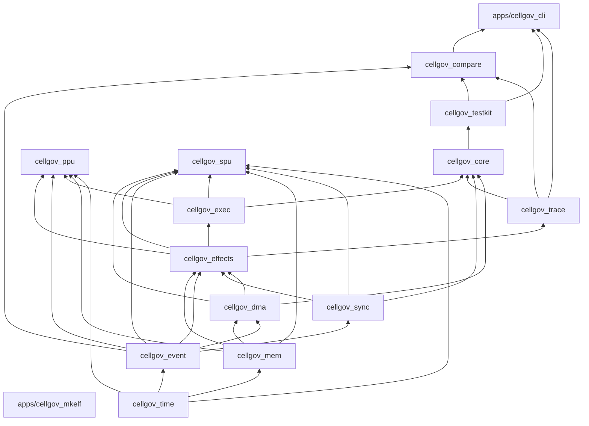

# CellGov Architecture

CellGov is a Rust workspace implementing a deterministic event-driven runtime for translated PS3 PPU and SPU execution units.

## Current state

The runtime executes units in a deterministic round-robin loop, processes effects through the commit pipeline, and produces a binary trace. Real PPU and SPU execution units decode and interpret guest instructions against committed memory and their own local state, emitting effects for every guest-visible operation. An external-oracle comparison harness compares CellGov observations against RPCS3 baselines. The workspace compiles clean under `unsafe_code = "forbid"` and has 664 tests across 13 crates and two binaries.

### Runtime

- **Deterministic step loop** with round-robin scheduling and deadlock detection
- **Commit pipeline** processing 9 effect types: `SharedWriteIntent`, `MailboxSend`, `MailboxReceiveAttempt`, `DmaEnqueue`, `WaitOnEvent`, `WakeUnit`, `SignalUpdate`, `FaultRaised`, `TraceMarker`
- **Binary trace format** with 7 record types, categorical filtering, and encode/decode roundtrip
- **FNV-1a state hashing** at every commit boundary (committed memory, runnable queue, unit status, sync state)
- **DMA completion queue** with pluggable latency models and automatic issuer wake
- **Mailbox FIFO** with send/receive/block-on-empty and per-unit inbox delivery
- **Signal registers** with OR-merge semantics
- **Block/wake transitions** via runtime-side status overrides
- **Scenario test harness** with deterministic replay assertions, golden trace pinning, and invariant checks
- **Fake ISA** (8 opcodes) retained as a clean-room runtime probe alongside the real execution units

### Execution units

- **PPU (`cellgov_ppu`)**: PPC64 interpreter with GPRs, PC, CR, LR, CTR, XER, and 32 vector registers. Implements a working subset of integer, logical, load/store, branch, compare, rotate/shift, and vector instructions sufficient for the microtest corpus. PPU ELF64 loader handles PT_LOAD segments and resolves PPC64 ABI v1 function-descriptor entry points. LV2 syscalls are dispatched through a stub table (managed SPU thread group lifecycle, TTY write, process exit).
- **SPU (`cellgov_spu`)**: SPU interpreter with 128x128-bit register file, 256 KB local store, and channel file. Implements a working subset of RR/RI7/RI10/RI16/RI18/RRR formats covering constant formation, integer arithmetic, logical, compare, branch, shuffle/rotate, load/store, and channel operations. Communicates with the runtime exclusively through effects -- never reads or writes committed shared memory directly. Includes an SPU ELF loader.

### Comparison harness

- **Normalized observation schema** shared between CellGov and external oracles
- **Comparison modes**: strict (outcome + memory + events), memory-only, events-only, prefix
- **Classification**: match, divergence (with first-differing byte/event), unsupported, unsettled oracle
- **Multi-baseline comparison**: checks oracle agreement before comparing CellGov
- **Golden snapshot save/load** for regression testing without RPCS3
- **RPCS3 adapter**: TTY-based result extraction via CGOV wire protocol
- **CellGov adapter**: determinism guard (double-run), event normalization from binary trace
- **Human and JSON report formatting**

### Microtest corpus

Six PSL1GHT-compiled C microtests targeting RPCS3's managed SPU thread groups:

| Test | What it proves |
|------|---------------|
| spu_fixed_value | SPU writes a known value via DMA put |
| mailbox_roundtrip | PPU-to-SPU mailbox send, SPU transforms and DMA puts result |
| dma_completion | 128-byte DMA put with tag wait, status header |
| atomic_reservation | SPU getllar/putllc (load-linked, store-conditional) |
| ls_to_shared | Dependent LS store-to-load chain published via DMA |
| barrier_wakeup | Two SPU threads, inter-SPU ordering via shared memory polling |

Each test has interpreter and LLVM RPCS3 baselines (oracle settled -- both decoders agree) and is run end-to-end through real PPU and SPU execution units inside CellGov with the result compared against the baseline.

## Crate layering

The workspace is a strict layered dependency DAG. Foundational crates sit at the bottom; consumers at the top. Only direct internal dependencies are shown; dev-dependencies used for cross-crate test harnesses are omitted.

`cellgov_mkelf` is a standalone binary with no workspace dependencies; it generates PPU ELF fixtures for the microtest corpus.

`cellgov_ppu` and `cellgov_spu` appear as leaves in the DAG for a reason: execution units plug into the runtime through the `ExecutionUnit` trait defined in `cellgov_exec`, not through a direct Cargo dependency on `cellgov_core`. The core runtime drives any `T: ExecutionUnit` without naming concrete types -- that is the one-way layering rule in practice. Today the only non-test consumers of `ppu`/`spu` are dev-dependencies from paired PPU+SPU integration tests; a future CLI subcommand that runs real PS3 binaries would appear as an additional consumer above them.

External dependencies are minimal: `serde`, `serde_json`, and `toml` in `cellgov_compare` and `cellgov_cli`. All other crates are dependency-free beyond the workspace.

For per-crate responsibilities and module layout, run `cargo doc --no-deps --open` and read the crate-level doc comments.
