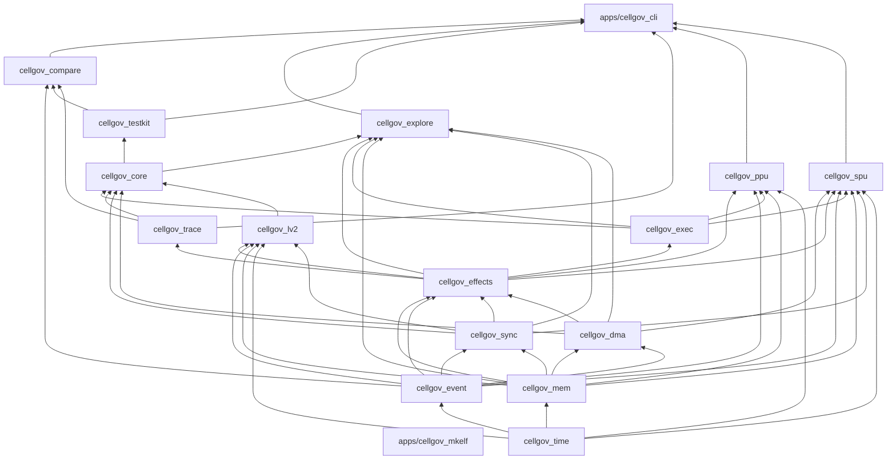

# CellGov Architecture

CellGov is a Rust workspace implementing a deterministic event-driven runtime for translated PS3 PPU and SPU execution units. It serves as the oracle/analysis engine for static recompilation of PS3 games.

## Current state

The runtime executes units in a deterministic round-robin loop, processes effects through the commit pipeline, and produces a binary trace. Real PPU and SPU execution units decode and interpret guest instructions against committed memory and their own local state, emitting effects for every guest-visible operation. The PPU drives SPU creation through a real LV2 host model. A schedule exploration engine replays workloads with alternate scheduling choices, classifies outcomes as schedule-stable or schedule-sensitive, and compares per-schedule memory against RPCS3 oracle baselines. A RuntimeMode enum (FaultDriven/DeterminismCheck/FullTrace) controls per-step overhead: trace record emission and hash checkpoints are gated on the mode. A criterion benchmark harness measures decode, execute, run_until_yield, content_hash, and commit_step with baseline comparison for before/after optimization tracking. The workspace compiles clean under `unsafe_code = "forbid"` and has 857+ tests across 15 crates and two binaries.

Firmware PRX loading lets CellGov load decrypted PS3 firmware modules, apply segment-aware relocations, and execute module_start through the PPU interpreter before the game's entry point. Combined with TLS pre-initialization and kernel memory allocation, this drives flOw past C++ static initialization to 337K+ PPU steps of boot execution with 30K+ distinct PCs.

### Runtime

- **Deterministic step loop** with round-robin scheduling and deadlock detection
- **Commit pipeline** processing 9 effect types: `SharedWriteIntent`, `MailboxSend`, `MailboxReceiveAttempt`, `DmaEnqueue`, `WaitOnEvent`, `WakeUnit`, `SignalUpdate`, `FaultRaised`, `TraceMarker`
- **Binary trace format** with 7 record types, categorical filtering, and encode/decode roundtrip
- **FNV-1a state hashing** via `cellgov_mem::Fnv1aHasher` at commit boundaries with cached `content_hash` (Cell-based interior mutability) and mode-gated checkpoints for large guest memories
- **DMA completion queue** with pluggable latency models and automatic issuer wake
- **Mailbox FIFO** with send/receive/block-on-empty and per-unit inbox delivery
- **Signal registers** with OR-merge semantics
- **Block/wake transitions** via runtime-side status overrides
- **LV2 host model** (`cellgov_lv2`) with image registry, thread group table, SPU lifecycle management, mailbox write, group-aware join wake, process-exit cascade, mutex/event-queue create with monotonic ID allocation, and bump-allocating sys_memory_allocate for kernel memory
- **HLE dispatch** with NID-based function routing, register injection (TLS r13 setup), bump allocator (_sys_malloc/_sys_free), memset, noop-safe stubs for 140+ imported functions, and HLE keep-list for functions that require full firmware initialization
- **Syscall response table** for blocked PPU callers, keyed by UnitId, drained at wake time
- **SPU factory** for runtime-driven SPU creation from `Lv2Dispatch::RegisterSpu`
- **RuntimeMode** (FaultDriven/DeterminismCheck/FullTrace) gating trace record emission and hash checkpoints per mode, replacing the loose `skip_hash_checkpoints` flag
- **Inline WritePayload** storage (stack-allocated `[u8; 16]` for payloads up to 16 bytes, heap fallback above) eliminating per-store heap allocation in the interpreter hot path
- **Commit fast path** skipping the staging pipeline entirely for steps with zero emitted effects
- **Criterion benchmark harness** (`bench.sh`) for decode, execute, run_until_yield, content_hash, commit_step with baseline save/compare for optimization tracking
- **Scenario test harness** with deterministic replay assertions, golden trace pinning, and invariant checks
- **Fake ISA** (8 opcodes) retained as a clean-room runtime probe alongside the real execution units

### Execution units

- **PPU (`cellgov_ppu`)**: PPC64 interpreter with GPRs, FPRs, PC, CR, LR, CTR, XER, TB, and 32 vector registers. Implements 79 instruction variants covering integer arithmetic/logic, load/store (D-form, indexed, with-update), branch (conditional, LR, CTR), compare, rotate/shift, floating-point (single/double loads/stores, 20+ FP63/FP59 arithmetic ops including fmadd/fmul/fdiv/fcmp/fsel/frsp/fctiwz/fcfid), VMX (25+ VX-form and VA-form vector operations), SPR/CR moves (mflr/mtlr/mfcr/mtcrf/mfctr/mftb), and cache/sync control (no-ops for deterministic model). PPU ELF64 loader handles PT_LOAD segments, BSS zero-init, PPC64 ABI v1 function-descriptor entry points, and PT_TLS segment discovery. SPRX parser and loader (`sprx` module) reads decrypted PS3 firmware PRX files (ELF64 type 0xFFA4), extracts module_info/exports/relocations, loads segments into guest memory at a chosen base, and applies 4 relocation types (R_PPC64_ADDR32, ADDR16_LO, ADDR16_HI, ADDR16_HA) with PS3 segment-relative encoding. PS3 PRX import table parser discovers imported modules and functions from PT_0x60000002 program headers. HLE stub binder writes 24-byte trampolines (OPD + lis/ori/sc/blr) and patches GOT entries. NID database covers 140+ PS3 SDK functions across 12 modules with stub classification (noop-safe/stateful/unsafe-to-stub). `PpuInstruction::variant_name()` returns a `&'static str` for zero-allocation instruction coverage tallying. Per-step `LocalDiagnostics` carries PC, faulting EA, and optional `FaultRegisterDump` (GPR[0..31], LR, CTR, CR) captured on fault for diagnostics without re-running with --trace.
- **SPU (`cellgov_spu`)**: SPU interpreter with 128x128-bit register file, 256 KB local store, and channel file. Implements a working subset of RR/RI7/RI10/RI16/RI18/RRR formats covering constant formation, integer arithmetic, logical, compare, branch, shuffle/rotate, load/store, and channel operations. Communicates with the runtime exclusively through effects -- never reads or writes committed shared memory directly. Includes an SPU ELF loader.

### LV2 host model

`cellgov_lv2` is a pure model crate that owns the LV2 state machine: image registry, thread group table, and syscall dispatch. It does not depend on `cellgov_core` -- the runtime drives the host, not the other way around. The host reads guest memory through a narrow `Lv2Runtime` trait and returns plain-data `Lv2Dispatch` values telling the runtime what to do.

Implemented syscalls:

| Syscall                       | Number  | What it does                                                         |
| ----------------------------- | ------- | -------------------------------------------------------------------- |
| `sys_process_exit`            | 22      | Cascades Finished to all units in the process                        |
| `sys_mutex_create`            | 100     | Allocates a monotonic mutex ID, writes to guest pointer              |
| `sys_mutex_lock`              | 102     | Stub: returns CELL_OK (single-threaded module_start)                 |
| `sys_mutex_unlock`            | 104     | Stub: returns CELL_OK                                                |
| `sys_event_queue_create`      | 128     | Allocates a monotonic queue ID, writes to guest pointer              |
| `sys_event_queue_destroy`     | 129     | Stub: returns CELL_OK                                                |
| `sys_spu_image_open`          | 156     | Looks up SPU ELF by path, writes `sys_spu_image_t` to guest memory   |
| `sys_spu_thread_group_create` | 170     | Allocates a monotonic group id, writes it to guest pointer           |
| `sys_spu_thread_initialize`   | 172     | Records image handle and args (copied at init time) per slot         |
| `sys_spu_thread_group_start`  | 173     | Returns `RegisterSpu` with init state per slot; runtime creates SPUs |
| `sys_spu_thread_group_join`   | 177/178 | Blocks caller; wakes when all SPUs in the group finish               |
| `sys_spu_thread_write_spu_mb` | 190     | Deposits a value into the target SPU's inbound mailbox               |
| `sys_memory_allocate`         | 348     | Bump-allocates 64KB-aligned guest memory from kernel region          |
| `sys_memory_free`             | 349     | Stub: no-op (CellGov does not track deallocation)                    |
| `sys_tty_write`               | 403     | Returns CELL_OK (output not captured)                                |

HLE-dispatched sysPrxForUser functions (NID-based):

| Function               | NID        | Classification    | Behavior                                                    |
| ---------------------- | ---------- | ----------------- | ----------------------------------------------------------- |
| `sys_initialize_tls`   | 0x744680a2 | stateful          | Copies TLS image, zeroes BSS, sets r13 = base + 0x7030      |
| `_sys_malloc`          | 0xebe5f72f | unsafe-to-stub    | Bump allocator (16-byte aligned, never freed)                |
| `_sys_free`            | 0xfc52a7a9 | noop-safe         | No-op (bump allocator)                                       |
| `_sys_memset`          | 0x1573dc3f | stateful          | Writes val x size bytes to guest memory, returns ptr         |
| `sys_process_exit`     | 0xe6f2c1e7 | stateful          | Marks unit Finished                                          |
| All others             | --         | noop-safe         | Return CELL_OK (0)                                           |

### Comparison harness

- **Normalized observation schema** shared between CellGov and external oracles
- **Comparison modes**: strict (outcome + memory + events), memory-only, events-only, prefix
- **Classification**: match, divergence (with first-differing byte/event), unsupported, unsettled oracle
- **Multi-baseline comparison**: checks oracle agreement before comparing CellGov
- **Golden snapshot save/load** for regression testing without RPCS3
- **RPCS3 adapter**: TTY-based result extraction via CGOV wire protocol
- **CellGov adapter**: determinism guard (double-run), event normalization from binary trace
- **Human and JSON report formatting**

### Schedule exploration

`cellgov_explore` sits above `cellgov_core` and orchestrates bounded exploration of alternate legal schedules without modifying the runtime.

- **Decision detection** via `observe_decisions`: runs a workload, records the full runnable set and chosen unit at every step
- **Prescribed replay** via `PrescribedScheduler`: forces alternate unit choices at specific steps, falls back to round-robin
- **Bounded exploration loop** (`explore`): identifies branching points from the baseline, replays each alternate within configurable bounds (`max_schedules`, `max_steps_per_run`), classifies outcomes
- **Conservative dependency analysis**: `StepFootprint` extracted from the 9 `Effect` variants; `conflicts()` check covers shared-write overlap, same-mailbox send/receive, same-signal update/wait, DMA range overlap, wake/wait interactions, same-barrier arrival. Aggregate footprints across each unit's lifetime prune provably independent alternates.
- **Outcome classification**: `ScheduleStable` (all hashes match), `ScheduleSensitive` (at least one differs), `Inconclusive` (bounds hit before full coverage)
- **Oracle-aware exploration** (`explore_with_regions`): extracts named memory regions from each schedule for per-schedule comparison against external baselines
- **JSON and human-readable reports**
- **CLI `explore` subcommand**: runs testkit scenarios or ELF-based microtests with optional `--baselines-dir` for oracle comparison

### Game boot (flOw)

The CLI `run-game` subcommand loads a decrypted PS3 ELF and runs the PPU from the entry point with Budget=1 (instruction-level granularity). With `--firmware-dir`, it also loads decrypted firmware PRX modules, executes their module_start functions, and resolves game imports against real firmware exports.

Boot sequence:

1. Load game ELF into guest memory, parse import tables, bind HLE trampolines
2. Load liblv2.prx (decrypted firmware), apply 1,042 relocations, resolve 161 exports
3. Pre-initialize TLS from the game's PT_TLS segment (kernel bootstrap)
4. Execute liblv2 module_start (198 steps of firmware initialization)
5. Run game CRT0 from the ELF entry point

Current flOw boot metrics (release, FaultDriven mode, with firmware loading):

| Metric | Value |
|--------|-------|
| Steps | 337,183 |
| Distinct PCs | 30,000+ |
| HLE calls | 500+ |
| Module_start steps | 198 |
| PRX relocations | 1,042 |
| Imports resolved to real code | 0 (all 15 sysPrxForUser kept as HLE) |
| Outcome | STALL (deep in game initialization, past static init) |

The C++ static initialization blocker (`__cxa_guard_acquire` failure from uninitialized libc state) is resolved. The game now progresses past static constructors into actual game setup before hitting the next blocker (likely RSX/GCM initialization or an unimplemented instruction).

### Microtest corpus

Six PSL1GHT-compiled C microtests. Each runs end-to-end as an LV2-driven scenario: the PPU's own compiled code drives the full SPU lifecycle through syscalls. No harness pre-registration of SPU execution units.

| Test               | What it proves                                                |
| ------------------ | ------------------------------------------------------------- |
| spu_fixed_value    | SPU writes a known value via DMA put                          |
| mailbox_roundtrip  | PPU-to-SPU mailbox send, SPU transforms and DMA puts result   |
| dma_completion     | 128-byte DMA put with tag wait, status header                 |
| atomic_reservation | SPU getllar/putllc (load-linked, store-conditional)           |
| ls_to_shared       | Dependent LS store-to-load chain published via DMA            |
| barrier_wakeup     | Two SPU threads, inter-SPU ordering via shared memory polling |

Each test has interpreter and LLVM RPCS3 baselines (oracle settled -- both decoders agree). CellGov runs each through `observe_with_determinism_check` (proves identical results across two runs) and compares against both baselines via `compare_multi --mode memory`.

## Crate layering

The workspace is a strict layered dependency DAG. Foundational crates sit at the bottom; consumers at the top. Only direct internal dependencies are shown; dev-dependencies used for cross-crate test harnesses are omitted.

`cellgov_mkelf` is a standalone binary with no workspace dependencies; it generates PPU ELF fixtures for the microtest corpus.

`cellgov_lv2` sits between the primitives and `cellgov_core`. It owns the LV2 state machine (image registry, thread groups, syscall dispatch) but has no dependency on `cellgov_core` or the architecture crates. The runtime calls into it; it never reaches back.

`cellgov_explore` sits above `cellgov_core` and drives the runtime externally through `Runtime::step`, `Runtime::commit_step`, and `Runtime::set_scheduler`. It depends on the effect and sync primitives for dependency analysis but never modifies the core runtime model. The `serde`/`serde_json` dependency (for JSON reports) is the only external dependency in the exploration engine.

`cellgov_ppu` and `cellgov_spu` appear as leaves in the library DAG: execution units plug into the runtime through the `ExecutionUnit` trait defined in `cellgov_exec`, not through a direct Cargo dependency on `cellgov_core`. The core runtime drives any `T: ExecutionUnit` without naming concrete types. The CLI depends on both architecture crates for the `explore micro` subcommand and the `run-game` subcommand.

External dependencies are minimal: `serde`, `serde_json`, and `toml` in `cellgov_compare`; `serde` and `serde_json` in `cellgov_explore` and `cellgov_cli`. All other crates are dependency-free beyond the workspace.

For per-crate responsibilities and module layout, run `cargo doc --no-deps --open` and read the crate-level doc comments.
