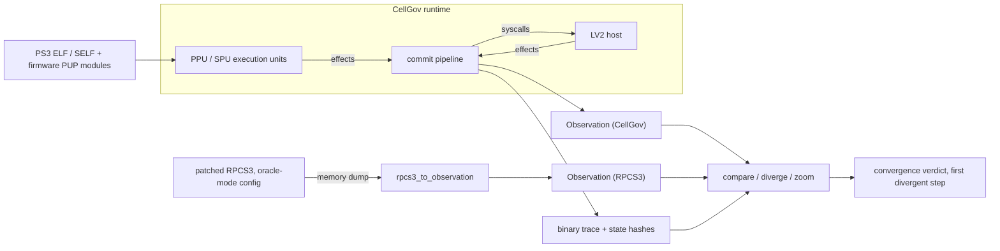

# CellGov Architecture

CellGov is a deterministic Rust runtime that interprets PS3 PPU and SPU
code, produces replayable execution traces, and validates its output
against recorded RPCS3 observations. It is the oracle layer for static
recompilation: it does not run games, it tells the recompiler what the
correct output is.

One rule governs the design: **no execution unit publishes
guest-visible state directly. All state changes pass through one
ordered pipeline.** Everything else in these documents follows from
it.

How the pieces connect:

## Map

| Document                                           | Covers                                                                                                                                                  |
| -------------------------------------------------- | ------------------------------------------------------------------------------------------------------------------------------------------------------- |
| [workspace.md](workspace.md)                       | Crate DAG and direct external dependencies generated by `cellgov dev workspace-gen`, plus structural rules and per-crate responsibilities.             |
| [guest_memory.md](guest_memory.md)                 | Region map, access modes, PPU access routing, per-process address spaces and shared mappings.                                                           |
| [runtime_pipeline.md](runtime_pipeline.md)         | The per-step commit loop, fault rollback, the effect vocabulary, and the trace record set.                                                              |
| [execution_units.md](execution_units.md)           | PPU and SPU interpreter coverage, loaders, and the predecoded instruction shadow.                                                                       |
| [lv2_host.md](lv2_host.md)                         | LV2 state buckets, how a syscall reaches its arm, thread lifecycle, process privilege and spawn, the null backend, the in-memory filesystem.            |
| [synchronization.md](synchronization.md)           | LV2 sync primitives (block / wake protocol, cond re-acquire, lost-wake prevention) and the atomic reservation model.                                    |
| [rsx.md](rsx.md)                                   | RSX CPU-side completion (FIFO cursor, method decoder, flip state) and the LV2 `sys_rsx` syscall surface.                                                |
| [boot.md](boot.md)                                 | Firmware-loaded userspace surface, the firmware-set boot pipeline, and the common boot sequence.                                                     |
| [schedule_exploration.md](schedule_exploration.md) | Bounded alternate-schedule enumeration in `cellgov_explore`.                                                                                            |
| [comparison.md](comparison.md)                     | Observation schema, per-step divergence localization, the RPCS3 bridge, and the oracle-mode config contract.                                            |
| [title_harness.md](title_harness.md)               | Title manifests, anchors and witnesses, EBOOT resolution, the diagnostic CLI surface.                                                                   |
| [microtests.md](microtests.md)                     | The PSL1GHT microtest corpus.                                                                                                                           |

Related, outside this directory: [concepts/](../concepts/README.md) for
the shared vocabulary, [titles.md](../titles.md) for the
compatibility matrix, [firmware.md](../firmware.md) for the system
software measured firmware by firmware, and the generated
[LV2 archive](../lv2/README.md) for the drift-gated per-slot
routing and per-arm fidelity tables.

For per-crate detail and module layout, run
`cargo doc --no-deps --open` and read the crate-level doc comments.
