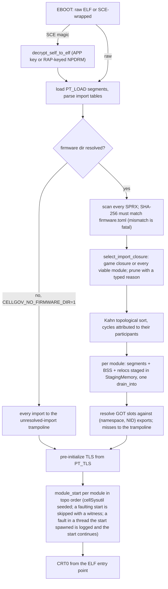

# Firmware loading and boot status

## Userspace surface (firmware-loaded)

The userspace PS3 surfaces -- sysPrxForUser, cellGcmSys,
cellSysutil, cellSpurs, cellSaveData, cellFs -- load from the
user's PUP install as Sony-authored firmware SPRX modules rather
than Rust reimplementations. The PRX loader resolves each game
import to a firmware OPD and writes that address into the GOT
slot, so every PPU `bl` reaches the firmware module's code
directly.

Two firmware modules publishing the same export library resolve
by first-wins shadowing: the first module to claim a library name
keeps it, the later module still loads with that one library
dropped, and the shadowing is recorded. The PS3 does the same
through a per-library-name lock, skipping the second publisher's
copy while the module loads normally. A hard error here would
refuse a firmware set that boots on hardware.

The RSX CPU-side completion surface (`cellgov_core::rsx`, see
[rsx.md](rsx.md)) stays in Rust: it owns the FIFO cursor,
command-buffer parsing, label updates, and the reports /
driver-info / DMA control structures. The firmware cellGcmSys.prx
loads from the PUP; its init still routes the byte-for-byte
register reads through the CPU-side surface. The `FirstRsxWrite`
checkpoint fires on the first guest write to the control register.

A firmware `module_start` that waits on a process CellGov does not
model is treated as a declared high-level divergence rather than
run to completion; `cellSysutil_Library`'s `module_start` is one.
It is the consumer side of a process-shared
producer-consumer ring whose producer runs in the system/VSH
process, which CellGov does not model, so no external producer
would ever deliver the record it waits on. CellGov seeds the first
producer record into the slot-state shared memory (registered by
ipc key when the keyed `sys_mmapper_allocate_shared_memory` create
runs, applied on the first map of that key), arms a
ring-state-aware wake for the system-namespace condition
variables, and returns `CELL_OK` from the `module_start` without
executing the producer-fed wait. A `module_start` with no such
declaration runs in full. The
`CELLGOV_DISABLE_MODULE_START_HLE_STUBS` env knob forces the
honest low-level path, which stalls `AllBlocked` at the
producer-fed wait.

## Boot pipeline

The `run-game` CLI subcommand loads a PS3 ELF, raw or SCE-wrapped
(`SCE\0` magic dispatches to
`cellgov_install::sce::decrypt_self_to_elf` at load time), and
runs the PPU at the mode's default step budget (256; `--budget`
overrides). When `--firmware-dir` resolves to a directory holding
the firmware SPRX modules (default `vfs/dev_flash/sys/external/`
when that exists), the boot path:

- scans every module in the install;
- derives the title's load set with
  `prx_loader::selection::select_import_closure` (game versus
  firmware-executable rules in
  [execution_units.md](execution_units.md));
- loads it via `prx_loader::load_firmware_set`;
- runs the modules' `module_start` functions in dependency order;
- resolves game imports against real firmware exports keyed on
  (namespace, NID).

`CELLGOV_NO_FIRMWARE_DIR=1` suppresses the default; the boot then
loads no PRX and every game import routes to the
unresolved-import trampoline. `_sys_prx_load_module` /
`_sys_prx_get_module_list` resolve against the registered closure
rather than echoing the path-pointer.

Firmware-set loading is one atomic pipeline. The relocation
applier in
[`cellgov_ppu::sprx::load_prx`](../../crates/cellgov_ppu/src/sprx/load.rs)
stages each parsed SPRX's segment bytes, BSS zero-fill, and reloc
patches into a single `cellgov_mem::StagingMemory` and commits
them with one `drain_into`; a faulting reloc discards the whole
batch, so guest memory sees the fully loaded module or none of
it. Cross-module dependency edges feed a Kahn topological sort in
[`prx_loader::graph`](../../crates/cellgov_ppu/src/prx_loader/graph.rs);
SCC-based cycle attribution names only the cycle's participants,
not their downstream consumers. `start_modules` then invokes each
module's `module_start` in topo order.

Every loaded module is verified against the corpus's
`firmware.toml` manifest, written by `cellgov_install install`
and located at or up to two levels above the firmware dir. The
post-decrypt SHA-256 must match the manifest entry; a file
missing from the manifest, a digest mismatch, or a firmware dir
without a manifest is a fatal boot error, so an unusable corpus
never degrades silently into a firmware-less run. The verified
identity (PUP hash + image version) binds into
`Lv2Host::sync_state_hash`: two runs over the same firmware
install produce byte-identical state hashes, and a different
install moves them.

Common boot sequence (per-title numbers below):

1. Load `EBOOT.elf` into guest memory; parse import tables.
2. Load the derived SPRX closure through the atomic-batch reloc
   applier, apply relocations, surface exports.
3. Resolve every game GOT slot against the firmware export
   table. A NID without a matching export is patched to a
   guest-resident _unresolved-import trampoline_ (one OPD per
   NID, body issues `Lv2Request::UnresolvedImport { nid }`), so
   a call through that slot becomes a structured diagnostic
   fault instead of a jump into uninitialised memory.
4. Pre-initialize TLS from the game's PT_TLS segment.
5. Execute each loaded module's `module_start` in topo order.
6. Run the game's CRT0 from the ELF entry point.

The decrypt node exists only in a build with the `decrypt` cargo
feature of `cellgov_install` / `cellgov_cli`. A default build links
no key material and exposes no decrypt entry point: it boots plaintext
ELFs and PRXes and refuses an SCE-wrapped executable or module with
`SceError::DecryptFeatureDisabled`, naming the feature. The key
material is not in the binary either: decryption reads the operator's
`KeyVault` (`CELLGOV_KEYS`, or the vault imported beside the VFS root
the run names -- `.cellgov/keys/keys.toml` in the directory holding
`--vfs-root`'s `dev_hdd0`, so `vfs/.cellgov/keys/keys.toml` by
default), loaded once per process on the first
SCE-wrapped image, and a run with no vault refuses that first SELF by
name (`SceError::Keys`). An NPDRM image met under an APP-only key
policy keeps its own refusal in either build, since no build could
open it.

A process the title spawns runs steps 1-5 again in its own address
space: the spawn loader parses the child's import table, loads its
closure from the same verified candidate set (decrypted once per
boot that spawns, on the first spawn), patches its GOT, seeds TLS,
and stages the `module_start` pass; the runtime parks the child's
primary unit until the step loop has run that pass
([lv2_host.md](lv2_host.md), "Process model and spawn"). The child's
region is sized by the boot's `main` rule with the same 1 GiB floor,
so the fixed TLS, kernel-context and HLE-heap addresses exist in
every process. Fault and stack-walk diagnostics read every byte
through the faulting unit's own space.

Title boot exercises the firmware modules end-to-end, and the
firmware-set boot is unconditional. The synthetic autotest ELFs go
the same way: they import `sysPrxForUser` NIDs no HLE module binds,
so their harness resolves an installed firmware set and passes it
explicitly. Without one every such import lands on the
unresolved-import trampoline, which is a different trajectory
rather than a slower one, so the harness refuses to run instead.

Each fault driver is a named NID or syscall number: an
unresolved import faults through the trampoline of step 3 as
`Lv2Request::UnresolvedImport`, and an unimplemented LV2 syscall
logs `dispatch.unsupported_stub` at first occurrence and returns
`CELL_ENOSYS`, the honest "not implemented" errno, so the guest
sees a detectable failure rather than a fabricated success (see
[Null backend](lv2_host.md#null-backend-for-unmodeled-syscalls)).

The seeded high-level divergence described under
[Userspace surface](#userspace-surface-firmware-loaded) and the
program-authority id `sys_ss_access_control_engine` serves from the
SELF header (see [Process privilege](lv2_host.md#process-privilege);
it lets `libsysmodule` create its load lock instead of skipping it)
are what carry a boot past firmware init.

Per-title boot trajectories, checkpoints, and cross-runner verdicts
are data rather than architecture: the generated
[titles.md](../titles.md) carries each title's matrix row, and
`tests/fixtures/<content-id>/cross_runner/NOTES.md` carries its
narrative.
