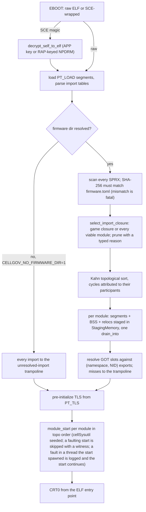

# Firmware loading and boot status

CellGov boots a PS3 title with its userspace PS3 surfaces loaded from
the user's PUP install as Sony-authored firmware SPRX modules, not
Rust reimplementations. Every module the boot loads is verified against the install's
manifest, so unusable installed firmware never degrades silently into
a firmware-less run.

## Userspace surface (firmware-loaded)

The userspace PS3 surfaces load from the user's PUP install as
Sony-authored firmware SPRX modules rather than Rust
reimplementations:

- sysPrxForUser
- cellGcmSys
- cellSysutil
- cellSpurs
- cellSaveData
- cellFs

The PRX loader resolves each game import to a firmware OPD and writes
that address into the GOT slot. Every PPU `bl` therefore reaches the
firmware module's code directly.

### Duplicate export libraries

**Two firmware modules publishing the same export library resolve by
first-wins shadowing.**

- The first module to claim a library name keeps it.
- The later module still loads, with that one library dropped.
- The shadowing is recorded.

*Why:* the PS3 does the same through a per-library-name lock,
skipping the second publisher's copy while the module loads normally.
A hard error here would refuse a firmware set that boots on hardware.

### The RSX CPU-side surface

The RSX CPU-side completion surface (`cellgov_core::rsx`, see
[rsx.md](rsx.md)) stays in Rust. It owns:

- the FIFO cursor
- command-buffer parsing
- label updates
- the reports / driver-info / DMA control structures

The firmware cellGcmSys.prx loads from the PUP. Its init still routes
the byte-for-byte register reads through the CPU-side surface. The
`FirstRsxWrite` checkpoint fires on the first guest write to the
control register.

### Declared module_start divergences

A firmware `module_start` that waits on a process CellGov does not
model is treated as a declared high-level divergence rather than run
to completion. A `module_start` with no such declaration runs in
full. `cellSysutil_Library`'s `module_start` is one declared
divergence.

*Why:* it is the consumer side of a process-shared producer-consumer
ring whose producer runs in the system/VSH process. CellGov does not
model that process, so no external producer would ever deliver the
record it waits on.

For this `module_start`, CellGov:

- seeds the first producer record into the slot-state shared memory
  (registered by ipc key when the keyed
  `sys_mmapper_allocate_shared_memory` create runs, applied on the
  first map of that key)
- arms a ring-state-aware wake for the system-namespace condition
  variables
- returns `CELL_OK` from the `module_start` without executing the
  producer-fed wait

The `--disable-module-start-hle-stubs` boot override forces the
honest low-level path, which stalls `AllBlocked` at the producer-fed
wait.

## Where the boot lives

`cellgov_boot` owns every stage below. `cellgov_cli` owns:

- the argument parsing
- the progress bar
- the report text
- the exit status

The library writes to no console. It narrates through a `BootSink`
the CLI implements over stdout and stderr. A refusal reaches the CLI
as a `BootError` rather than ending the process itself.

The one exception is the spawn loader. It runs inside `Runtime::step`,
so it returns its refusals as `ProcessSpawnLoadError`. The runtime
rolls the spawn back and fails the syscall
([lv2_host.md](lv2_host.md), "Process model and spawn").

## Boot pipeline

The `boot run` CLI subcommand loads a PS3 ELF, raw or SCE-wrapped,
and runs the PPU at the mode's default step budget (256; `--budget`
overrides). `SCE\0` magic dispatches to
`cellgov_install::sce::decrypt_self_to_elf` at load time.

The boot path takes a directory holding the firmware SPRX modules:
the `dev_flash/sys/external/` of the selected firmware entry
([title_harness.md](title_harness.md#version-selection)), or the tree
`--firmware-dir` names. Given that directory, the boot path:

- scans every module in the install;
- derives the title's load set with
  `prx_loader::selection::select_import_closure` (game versus
  firmware-executable rules in
  [execution_units.md](execution_units.md));
- loads it via `prx_loader::load_firmware_set`;
- runs the modules' `module_start` functions in dependency order;
- resolves game imports against real firmware exports keyed on
  (namespace, NID).

`_sys_prx_load_module` / `_sys_prx_get_module_list` resolve against
the registered closure rather than echoing the path-pointer.

### Firmware directory resolution

The directory comes from the install record under
`<vfs>/.cellgov/installs/firmware/`, so it follows a relocated or
re-versioned entry. The boot refuses, instead of running without
firmware, when the store:

- has no firmware entry
- has an entry whose tree is gone

A store holding several entries refuses until `--fw` names one or the
title's record names the firmware its disc shipped
([title_harness.md](title_harness.md#version-selection)).

A root still holding the layout that came before the store is refused
by name. The refusal lists what to remove and the install command
that rebuilds it. That layout is either:

- a flash mount at the root
- a record filed where the store files none

A probe that can neither find that residue nor show its absence is
its own refusal.
*Why:* no reader behind it re-asks.

There is no migration path and no second resolver.

`CELLGOV_NO_FIRMWARE_DIR=1` asks for a run without firmware
deliberately. The boot then loads no PRX, and every game import
routes to the unresolved-import trampoline.

### Atomic firmware-set loading

Firmware-set loading is one atomic pipeline. Guest memory sees the
fully loaded module or none of it.

The relocation applier in
[`cellgov_ppu::sprx::load_prx`](../../crates/cellgov_ppu/src/sprx/load.rs)
stages each parsed SPRX's segment bytes, BSS zero-fill, and reloc
patches into a single `cellgov_mem::StagingMemory`. It commits them
with one `drain_into`. A faulting reloc discards the whole batch.

Cross-module dependency edges feed a Kahn topological sort in
[`prx_loader::graph`](../../crates/cellgov_ppu/src/prx_loader/graph.rs).
SCC-based cycle attribution names only the cycle's participants, not
their downstream consumers. `start_modules` then invokes each
module's `module_start` in topo order.

### Manifest verification

Every loaded module is verified against the installed firmware's
`firmware.toml` manifest. The manifest is written by
`cellgov firmware install` and located at or up to two levels above
the firmware dir. The post-decrypt SHA-256 must match the manifest
entry. Each of these is a fatal boot error:

- a file missing from the manifest
- a digest mismatch
- a firmware dir without a manifest

*Why:* unusable installed firmware never degrades silently into a
firmware-less run.

The verified identity (PUP hash + image version) enters
`Lv2Host::sync_partial` and so `sync_state_hash`. Two runs over the
same firmware install produce byte-identical state hashes, and a
different install moves them.

### Whole-manifest check

The boot checks the modules it loads. Checking the whole manifest is
a separate, on-demand pass.
*Why:* the digests cover post-decrypt bytes, and decrypting every
entry costs more than a boot should.

The pass reports each module that:

- is missing
- no longer yields the recorded image
- yields no module image at all

A vault short of a key stops that pass rather than reporting the tree
as changed.
*Why:* a module the current vault cannot open is a gap in the vault.
Reading it as a divergence would blame the store for the reader's
configuration.

A manifest covering no module is refused rather than passing over
zero entries.

### Common boot sequence

1. Load `EBOOT.elf` into guest memory; parse import tables.
2. Load the derived SPRX closure through the atomic-batch reloc
   applier, apply relocations, surface exports.
3. Resolve every game GOT slot against the firmware export table; a
   miss goes to the
   [unresolved-import trampoline](#the-unresolved-import-trampoline).
4. Pre-initialize TLS from the game's PT_TLS segment.
5. Execute each loaded module's `module_start` in topo order.
6. Run the game's CRT0 from the ELF entry point.

```mermaid
flowchart TD
  eboot["EBOOT: raw ELF or SCE-wrapped"] -->|SCE magic| dec["decrypt_self_to_elf (APP key or RAP-keyed NPDRM)"] --> load
  eboot -->|raw| load["load PT_LOAD segments, parse import tables"]
  load --> fw{"firmware dir resolved?"}
  fw -->|"no, CELLGOV_NO_FIRMWARE_DIR=1"| tramp["every import to the unresolved-import trampoline"]
  fw -->|yes| scan["scan every SPRX; SHA-256 must match firmware.toml (mismatch is fatal)"]
  scan --> sel["select_import_closure: game closure or every viable module; prune with a typed reason"]
  sel --> topo["Kahn topological sort, cycles attributed to their participants"]
  topo --> reloc["per module: segments + BSS + relocs staged in StagingMemory, one drain_into"]
  reloc --> got["resolve GOT slots against (namespace, NID) exports; misses to the trampoline"]
  tramp --> tls
  got --> tls["pre-initialize TLS from PT_TLS"]
  tls --> ms["module_start per module in topo order (cellSysutil seeded; a faulting start is skipped with a witness; a fault in a thread the start spawned is logged and the start continues)"]
  ms --> crt0["CRT0 from the ELF entry point"]
```

### The unresolved-import trampoline

A NID without a matching export is patched to a guest-resident
_unresolved-import trampoline_: one OPD per NID, whose body issues
`Lv2Request::UnresolvedImport { nid }`. A call through that slot
becomes a structured diagnostic fault instead of a jump into
uninitialised memory.

### The decrypt feature

The decrypt node exists only in a build with the `decrypt` cargo
feature of `cellgov_install` / `cellgov_cli`. A default build links
no key material and exposes no decrypt entry point. It boots
plaintext ELFs and PRXes, and refuses an SCE-wrapped executable or
module with `SceError::DecryptFeatureDisabled`, naming the feature.

The key material is not in the binary either. Decryption reads the
operator's `KeyVault` from one of:

- `CELLGOV_KEYS`
- the vault imported beside the VFS root the run names --
  `.cellgov/keys/keys.toml` in the directory holding `--vfs-root`'s
  `dev_hdd0`, so `vfs/.cellgov/keys/keys.toml` by default

The vault loads once per process, on the first SCE-wrapped image. A
run with no vault refuses that first SELF by name (`SceError::Keys`).

An NPDRM image met under an APP-only key policy keeps its own refusal
in either build.
*Why:* no build could open it.

### Spawned processes

A process the title spawns runs steps 1-5 again in its own address
space. The spawn loader:

- parses the child's import table
- loads its closure from the same verified candidate set (decrypted
  once per boot that spawns, on the first spawn)
- patches its GOT
- seeds TLS
- stages the `module_start` pass

The runtime parks the child's primary unit until the step loop has
run that pass ([lv2_host.md](lv2_host.md), "Process model and
spawn").

The child's region is sized by the boot's `main` rule with the same
1 GiB floor, so the fixed TLS, kernel-context and HLE-heap addresses
exist in every process. Fault and stack-walk diagnostics read every
byte through the faulting unit's own space.

### Firmware-set boot is unconditional

Title boot exercises the firmware modules end-to-end, and the
firmware-set boot is unconditional. The synthetic autotest ELFs go
the same way. They import `sysPrxForUser` NIDs no HLE module binds,
so their harness resolves an installed firmware set and passes it
explicitly. Without one, the harness refuses to run.

*Why:* without a firmware set every such import lands on the
unresolved-import trampoline, which is a different trajectory rather
than a slower one.

### Fault drivers

Each fault driver is a named NID or syscall number:

- An unresolved import faults through the trampoline of step 3 as
  `Lv2Request::UnresolvedImport`.
- An unimplemented LV2 syscall logs `dispatch.unsupported_stub` at
  first occurrence and returns `CELL_ENOSYS`, the honest "not
  implemented" errno. The guest sees a detectable failure rather than
  a fabricated success (see
  [Null backend](lv2_host.md#null-backend-for-unmodeled-syscalls)).

### What carries a boot past firmware init

Two things carry a boot past firmware init:

- the seeded high-level divergence described under
  [Userspace surface](#userspace-surface-firmware-loaded)
- the program-authority id `sys_ss_access_control_engine` serves from
  the SELF header (see
  [Process privilege](lv2_host.md#process-privilege)); it lets
  `libsysmodule` create its load lock instead of skipping it

### Scope

Per-title boot trajectories, checkpoints, and cross-runner verdicts
are data rather than architecture. The generated
[titles.md](../titles.md) contains each title's matrix row. The
cell's `NOTES.md` under
`tests/fixtures/<content-id>/cross_runner/fw-<ver>/<game-ver>/`
contains its narrative.
