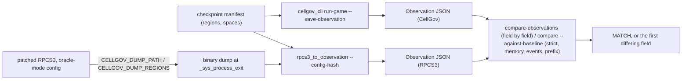
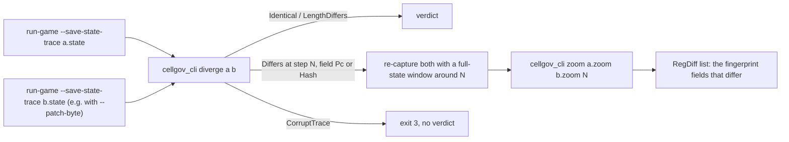

# Comparison harness

`cellgov_compare` reduces a run of any runner (CellGov, RPCS3, future
recompiled output) to a normalized `Observation`: outcome, named
memory regions, ordered events, optional state hashes, runner
metadata. Each named region carries its `AddressSpaceId` (space 0 for
the boot process, spawned children numbered from 1 in spawn order;
see [guest_memory.md](guest_memory.md#per-process-address-spaces)),
so a checkpoint manifest can observe a child's memory; RPCS3 captures
hold space 0 only, and the bridge refuses a manifest naming any
other. The comparison layer diffs two observations field by field in
four modes: strict (outcome + memory + events), memory-only,
events-only, prefix. Under every mode, two observations from the same
runner that both carry CellGov state hashes must agree on them: a
saved CellGov baseline whose hashes no longer match a fresh run of the
same scenario is a divergence, so a baseline captured under an older
hash construction fails instead of re-blessing itself. Cross-runner
pairs never compare hashes (the RPCS3 adapter records none).
Multi-baseline mode checks oracle agreement across, e.g., the RPCS3
interpreter and LLVM before declaring a CellGov divergence.

For long boot snapshots, `observe_from_boot` builds observations
from `run-game` outputs; `cellgov_cli compare-observations` reads
two JSON files and reports MATCH or the first differing field. The
determinism check requires two CellGov runs of the same ELF to
produce byte-identical observations.

## Per-step divergence localization

Two scanners turn per-step state-trace files into diff reports:

- `cellgov_compare::diverge(a, b)` walks two trace byte buffers,
  filters each to `PpuStateHash` records, and reports the first
  index where they disagree: the first *scalar-visible*
  disagreement, per the [per-step coverage caveat](runtime_pipeline.md#effects-and-trace-records).
  Four outcomes: `Identical { count }`,
  `LengthDiffers { common_count, a_count, b_count }`,
  `Differs { step, a_pc, b_pc, a_hash, b_hash, field }` with `field`
  in `{Pc, Hash}`, or `CorruptTrace { common_count, a_error, b_error }`
  when a record on either side fails to decode; the last is no
  verdict on the runs, since nothing past the cut was compared.
  Checks run step count -> PC -> hash, so the report names the
  highest-level divergence first. Surfaced via
  `cellgov_cli diverge <a.state> <b.state>` (exit 3 on a corrupt
  trace). The scan is linear in record count.
- `cellgov_compare::zoom_lookup(a_zoom, b_zoom, step)` consumes
  separate zoom-trace files (`PpuStateFull` records emitted only
  inside the unit's window) and returns
  `Found { step, a_pc, b_pc, diffs }` with per-field
  `RegDiff { field, a, b }` entries, or
  `MissingStep { step, a_missing, b_missing }`. The snapshot carries
  the full fingerprint input set, so an empty `diffs` means the
  states agree on everything the hash folds; if `PpuStateHash`
  diverged at that step, the harness is skewing snapshots against
  hashes and the scan must not resume past it. Surfaced via
  `cellgov_cli zoom <a> <b> <step>`.

`run-game --save-state-trace <path>` writes the runtime's per-step
`PpuStateHash` trace to disk, switching the runtime mode from
`FaultDriven` to `DeterminismCheck` for the run; that file is what
`diverge` and `zoom` consume. With `--patch-byte` for boot-time
memory injection, diffing two CellGov traces (unpatched + patched)
answers "do these N bytes propagate into any tracked PPU register
during the boot?"

## RPCS3 bridge

`bridges/rpcs3-patch/0001-cellgov-checkpoint-dump.patch` adds an
opt-in dump hook to RPCS3's `_sys_process_exit` syscall. With
`CELLGOV_DUMP_PATH` and `CELLGOV_DUMP_REGIONS` set, RPCS3 writes
the configured guest memory regions (parsed as `addr:size` hex
pairs, appended contiguously in declaration order) to a binary
file on process exit. `bridges/rpcs3_to_observation` converts that
dump plus a shared region manifest into the same `Observation` JSON
`cellgov_cli compare-observations` reads.

The user builds the patched RPCS3 binary; the CellGov library has no
Cargo or runtime dependency on RPCS3, and the bridge is a
verification-time tool. See
`tests/fixtures/<content-id>/cross_runner/REPRODUCTION.md` for the build
commands and the vendored-RPCS3 build-config workarounds.

## Oracle-mode config contract

An RPCS3 observation serves as an oracle only when RPCS3 is
configured for deterministic PPU/SPU behavior and no RSX/audio
output: `Video.Renderer = "Null"`, `Audio.Renderer = "Null"`,
`Core.PPU Decoder = Recompiler (LLVM)`, and `Core.SPU Decoder =
Recompiler (LLVM)`. The canonical YAML for these four fields is
embedded in `bridges/rpcs3_to_observation/`; the adapter hashes it
(FNV-1a) at build time and requires a matching `--config-hash` on
every invocation, so a dump produced under a different RPCS3 config
is rejected at adapter entry instead of feeding a wrong-config
observation into the comparator.
`rpcs3_to_observation --print-expected-config-hash` prints the
expected hash for scripting.
