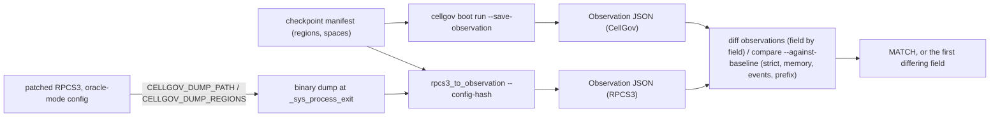
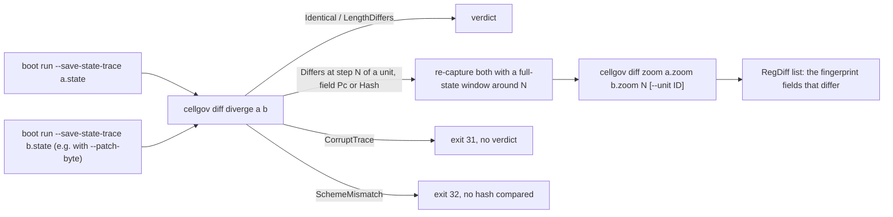

# Comparison harness

`cellgov_compare` reduces a run of any runner (CellGov, RPCS3, future
recompiled output) to a normalized `Observation`, then diffs two
observations field by field. An `Observation` contains:

- outcome
- named memory regions
- ordered events
- optional state hashes
- runner metadata
- the identity triple the run was composed from

```mermaid
flowchart LR
  man["checkpoint manifest (regions, spaces)"] --> cg
  man --> br
  cg["cellgov boot run --save-observation"] --> oc["Observation JSON (CellGov)"]
  r3["patched RPCS3, oracle-mode config"] -->|"CELLGOV_DUMP_PATH / CELLGOV_DUMP_REGIONS"| dump["binary dump at _sys_process_exit"]
  dump --> br["rpcs3_to_observation --config-hash"]
  br --> orr["Observation JSON (RPCS3)"]
  oc --> cmp["diff observations (field by field) / compare --against-baseline (strict, memory, events, prefix)"]
  orr --> cmp
  cmp --> out["MATCH, or the first differing field"]
```

## Named regions

Each named region has its `AddressSpaceId`: space 0 for the boot
process, spawned children numbered from 1 in spawn order (see
[guest_memory.md](guest_memory.md#per-process-address-spaces)). A
checkpoint manifest can therefore observe a child's memory; RPCS3
captures hold space 0 only, and the bridge refuses a manifest naming
any other or declaring a region of zero bytes.

**The whole observation is refused if the CellGov run cannot read a
region.** The refusal names the region. A region is unreadable if it:

- has a name an earlier region already declared
- declares zero bytes
- is in a space the run never created
- is a range no single mapped region contains
- is a reserved range that refuses reads
- is a `ReservedZeroReadable` range, whose reads are provisional zeros
  the run never wrote

*Why:* an observation never contains bytes nobody read, and a
same-runner round trip cannot match on them.

The RSX and SPU-reserved windows are therefore unobservable under the
default access mode as well as under `--strict-reserved`. The refusal
names the reserved region. It applies on the CellGov side of a
cross-runner pair too: a manifest naming one of those windows is
refused before the other runner's capture is read against it.

## Comparison modes

The comparison layer diffs two observations field by field in four
modes:

- strict (outcome + memory + events)
- memory-only
- events-only
- prefix

**Under every mode, two observations from the same runner that both
contain CellGov state hashes must agree on them.** A saved CellGov
baseline whose hashes no longer match a fresh run of the same scenario
is a divergence.

*Why:* a baseline captured under an older hash construction then fails
instead of re-blessing itself.

Cross-runner pairs never compare hashes (the RPCS3 adapter records
none). Multi-baseline mode checks oracle agreement across, e.g., the
RPCS3 interpreter and LLVM before declaring a CellGov divergence.

For long boot snapshots, `observe_from_boot` builds observations from
`boot run` outputs. `cellgov diff observations` reads two JSON files
and reports MATCH or the first differing field. The determinism check
requires two CellGov runs of the same ELF to produce byte-identical
observations.

## Run identity

These facts about a run's composition travel with the observation
rather than beside it:

- which firmware answered the run
- which of a title's installed versions it composed
- the boot overrides the run applied (`--skip-module-start` and its
  siblings on `boot run` / `boot bench`)

Every comparator prints both sides' identities before its verdict and
says out loud when the two differ.

*Why:* a divergence between two differently-composed runs is a
difference between compositions until it is shown otherwise.

**The identity triple is context, not a verdict.** A mismatch never
drives an exit code on its own.

The game half contains the title's version under the `PARAM.SFO` key
its tree named it by, so a warning names the key beside the value.
State traces contain the same identity as a fixed-width fingerprint in
their header record. `diverge` therefore reports two identity triples
disagreeing from the stream alone.

An artifact naming no identity triple was written before the store
had versions, or by a runner that reports none. Absence is never
treated as a mismatch.

### Runners CellGov does not compose for

A runner CellGov does not compose for has no identity triple, because
no store entry describes it. It still reports a firmware. Its capture
contains `runner_firmware`, the version read out of that runner's own
installation: the guest-path mapping in its configuration, then the
console version file in whichever tree that mapping names.

The read happens where the capture becomes an observation, not where a
report is later generated.

*Why:* a runner's installation can change between the two, and a
version read late identifies a library the capture never saw.

A capture whose conversion was given no installation to read has no
version, and a verdict built from it is refused rather than assumed.

### Cross-runner summaries

`CrossRunnerSummary` contains CellGov's identity triple and the other
runner's version together.

*Why:* a byte-parity verdict is a statement about two runs of one
firmware library.

Three shapes are refused on load rather than rendered:

- the two versions disagreeing
- either side named alone
- a file whose recorded firmware differs from the cell its directory
  names

A summary naming neither side makes no claim to contradict. A
cross-firmware comparison is a legitimate experiment, but it is not a
parity verdict, and nothing renders it as one.

> **Compatibility:** a summary naming neither side predates the
> schema.

## Per-step divergence localization

Two scanners turn per-step state-trace files into diff reports.
[Wang2024 p:340:17 s:3.9] A hash of the state is compared first, and
the full state is exposed only around the step where the hashes
differ:

- [`cellgov_compare::diverge`](#diverge) reports the first index
  where two traces' per-step hash records disagree, stream by stream:
  the first *scalar-visible* disagreement.
- [`cellgov_compare::zoom_lookup`](#zoom_lookup) and
  `spu_zoom_lookup` consume two zoom-trace files and return the
  per-field fingerprint differences at one step, or `MissingStep`.

`boot run --save-state-trace <path>` writes the runtime's per-step
`PpuStateHash` and `SpuStateHash` trace to disk. It switches the runtime mode from
`FaultDriven` to `DeterminismCheck` for the run. That file is what
`diverge` and `zoom` consume. With `--patch-byte` for boot-time memory
injection, diffing two CellGov traces (unpatched + patched) answers
"do these N bytes propagate into any tracked PPU register during the
boot?"

```mermaid
flowchart LR
  a["boot run --save-state-trace a.state"] --> dv["cellgov diff diverge a b"]
  b["boot run --save-state-trace b.state (e.g. with --patch-byte)"] --> dv
  dv -->|Identical / LengthDiffers| done["verdict"]
  dv -->|"Differs at step N of a unit, field Pc or Hash"| win["re-capture both with a full-state window around N"]
  dv -->|CorruptTrace| bad["exit 31, no verdict"]
  dv -->|SchemeMismatch| sch["exit 32, no hash compared"]
  win --> zm["cellgov diff zoom a.zoom b.zoom N [--unit ID]"]
  zm --> rd["RegDiff list: the fingerprint fields that differ"]
```

### diverge

`cellgov_compare::diverge(a, b)` walks two trace byte buffers and
compares them stream by stream (`StateStream`): the `PpuStateHash`
records form one stream, and each SPU unit's `SpuStateHash` records
form another. Two runs can interleave their units differently, so no
stream's order depends on another's. Within a stream, the index where
the two sides first disagree is the first *scalar-visible*
disagreement, per the
[per-step coverage caveat](runtime_pipeline.md#per-step-coverage-caveat).
`diverge` has five outcomes:

- `SchemeMismatch { kind, a, b }` when the two traces' state-hash
  scheme records name two PPU schemes or two SPU schemes. No record is
  compared. A checkpoint-scheme difference alone does not stop the
  scan, which reads no checkpoint record.
- `Identical { count }`, over every stream.
- `Differs { stream, step, a_pc, b_pc, a_hash, b_hash, field }` with
  `field` in `{Pc, Hash}`. Of the streams that disagree, the report
  names the one whose disagreeing record comes first in side A.
- `CorruptTrace { common_count, a_error, b_error }` when a record on
  either side fails to decode. This is no verdict on the runs, since
  nothing past the cut was compared.
- `LengthDiffers { stream, common_count, a_count, b_count }` for the
  first stream whose two sides end at two lengths. A unit present on
  one side only is such a stream.

The outcomes take precedence in that order, after the scheme check.
Within a stream, checks run step count -> PC -> hash, so the report
names the highest-level divergence first. The scan is surfaced via
`cellgov diff diverge <a.state> <b.state>` (exit 31 on a corrupt
trace, 32 on a scheme mismatch). The scan is linear in record count.

### zoom_lookup

`cellgov_compare::zoom_lookup(a_zoom, b_zoom, step)` consumes separate
zoom-trace files (`PpuStateFull` records emitted only inside the
unit's window). It returns `Found { step, a_pc, b_pc, diffs }` with
per-field `RegDiff { field, a, b }` entries, or
`MissingStep { step, a_missing, b_missing }`. It is surfaced via
`cellgov diff zoom <a> <b> <step>`.

`cellgov_compare::spu_zoom_lookup(a_zoom, b_zoom, unit, step)` does the
same for one SPU: it rebuilds the unit's snapshot from its
`SpuStateFull` record and the eight `SpuRegisters` records after it,
and returns `SpuRegDiff { field, a, b }` entries. Each changed register
is one 128-bit entry, and FPSCR, LSLR, IE, SRR0 and the reservation
follow. A header without all eight register records is a
`CorruptTrace`. It is surfaced via
`cellgov diff zoom <a> <b> <step> --unit <id>`, where `step` is the
unit's own retirement counter. Channel, signal and stopped state are
outside the SPU fingerprint, so no zoom names them.

The snapshot contains the full fingerprint input set, so an empty
`diffs` means the states agree on everything the hash folds. If
`PpuStateHash` diverged at that step, the harness is skewing snapshots
against hashes and the scan must not resume past it.

## RPCS3 bridge

`bridges/rpcs3-patch/0001-cellgov-checkpoint-dump.patch` adds an
opt-in dump hook to RPCS3's `_sys_process_exit` syscall. With
`CELLGOV_DUMP_PATH` and `CELLGOV_DUMP_REGIONS` set, RPCS3 writes
the configured guest memory regions (parsed as `addr:size` hex
pairs, appended contiguously in declaration order) to a binary
file on process exit. `bridges/rpcs3_to_observation` converts that
dump plus a shared region manifest into the same `Observation` JSON
`cellgov diff observations` reads.

The user builds the patched RPCS3 binary; the CellGov library has no
Cargo or runtime dependency on RPCS3, and the bridge is a
verification-time tool. See a cell's `REPRODUCTION.md` under
`tests/fixtures/<content-id>/cross_runner/fw-<ver>/<game-ver>/` for the
build commands and the build-config workarounds.

## Oracle-mode config contract

An RPCS3 observation serves as an oracle only when RPCS3 is
configured for deterministic PPU/SPU behavior and no RSX/audio
output:

- `Video.Renderer = "Null"`
- `Audio.Renderer = "Null"`
- `Core.PPU Decoder = Recompiler (LLVM)`
- `Core.SPU Decoder = Recompiler (LLVM)`

The canonical YAML for these four fields is embedded in
`bridges/rpcs3_to_observation/`. The adapter hashes it (FNV-1a) at
build time and requires a matching `--config-hash` on every
invocation. A dump produced under a different RPCS3 config is
therefore rejected at adapter entry instead of feeding a wrong-config
observation into the comparator.

[Wang2024 p:340:17 s:3.8 Ensuring Determinism] A backend that may
legitimately produce different results on the same input is unsuited
to differential testing; the hash pins the settings that remove that
freedom.

`rpcs3_to_observation --print-expected-config-hash` prints the
expected hash for scripting.
