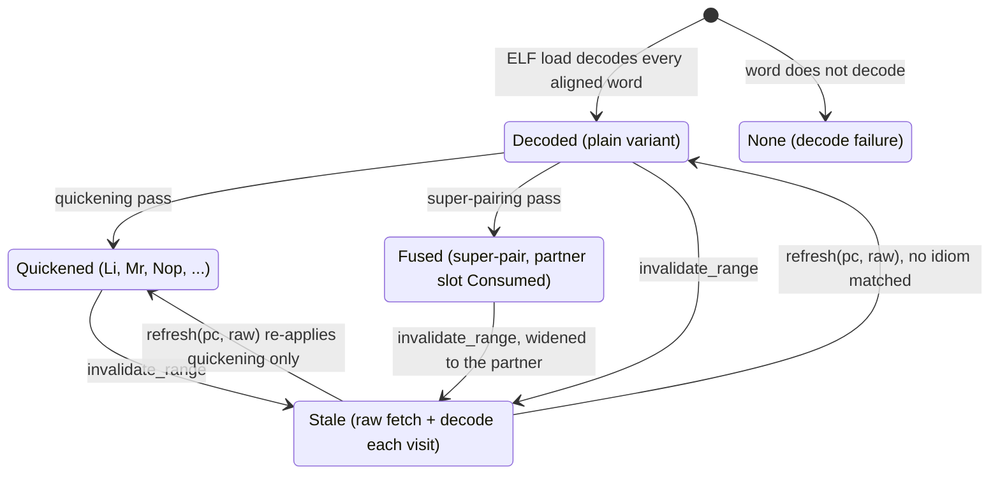

# Interpreters

## Execution units

**PPU (`cellgov_ppu`)**: PPC64 interpreter with 32 GPRs, 32 FPRs, PC,
CR, LR, CTR, XER (carry tracked), TB, and 32 vector registers.
The `PpuInstruction` set covers integer arithmetic
and logic, D-form / DS-form / indexed loads/stores with and without
update (including DS-form `lwa` and the full indexed-with-update
family), byte-reversed indexed loads/stores (`ldbrx`, `lwbrx`,
`lhbrx`, `sdbrx`, `stwbrx`, `sthbrx`), string moves (`lswi`, `lswx`,
`stswi`, `stswx`), trap (`tw`, `td`), `dcbz`, `sc`, the VMX
unaligned and element-indexed load/store family (`lvlx`, `lvrx`,
`stvlx`, `stvrx`, `lvebx`/`lvehx`/`lvewx`, `stvebx`/`stvehx`/
`stvewx`, `lvxl`, `stvxl`, `lvsl`, `lvsr`), conditional branches
with LR/CTR/AA variants, 64-bit multiply and divide families,
signed and unsigned multiply-high, rotate and mask families
(`rlwinm`, `rlwnm`, `rldicl`, `rldicr`, `rldic`, `rldcl`, `rldcr`,
`rldimi`), floating-point arithmetic and conversion (`fmadd`,
`fmul`, `fdiv`, `fcmp`, `fsel`, `frsp`, `fctiwz`, `fcfid`), VMX
VX-form and VA-form vector ops, SPR/CR moves (including `mcrxr`),
atomic load-reserve / store-conditional pairs, count-leading-zero
(`cntlzd`), popcount (`popcntb`), and record-form variants
(`addic.`, `andis.`). The variant count includes the shadow's
quickening rewrites (`Mr`, `Li`, `Slwi`/`Srwi`/`Sldi`/`Srdi`,
`Clrlwi`/`Clrldi`, `Nop`, `CmpwZero`) and super-pair fusions
(`LwzCmpwi`, `LwzMtlr`, `MflrStw`, `MflrStd`, `LiStw`, `CmpwiBc`,
`CmpwBc`, `LdMtlr`, `StdStd`) plus the `Consumed` placeholder.

`cellgov_ppu` also owns the loaders: PPU ELF64 with PT_LOAD and
PT_TLS segment handling, the SPRX parser for decrypted PS3 firmware
modules with relocation appliers for the types in
`cellgov_ppu::sprx::APPLIER_SUPPORTED_TYPES` (the single list; the
firmware reloc census consults it too), and the PS3 PRX
import-table parser.
The NID lookup database lives in
`cellgov_ps3_abi::nid`; `lookup(nid)` resolves human-readable names
for fault diagnostics.

The PRX loader resolves every game import to a firmware OPD where
one exists. Firmware exports are keyed on (namespace, NID), the
library name each import entry carries, so a NID that several
modules export under different library names cannot rebind across
them. Imports with no matching firmware export are patched to the
unresolved-import trampoline (see the [LV2 host](lv2_host.md)
syscall table), each unresolved NID attributed to the library that
requested it. The load set is derived per title by
`prx_loader::selection::select_import_closure`: a game loads the
provider closure of the namespaces its binary statically imports; a
firmware executable, which builds its import tables at runtime,
loads every viable module in the install. A module that cannot load
is pruned with a typed, reported reason (unprovided import,
multi-segment relocations, duplicate module identity), never
silently dropped. The selected set loads in topological-sort order,
`module_start` invoked per module under a synthetic kernel-context
OPD; a `module_start` that faults in guest code is skipped with a
named witness instead of aborting the boot.

`run-game` exposes two env vars for firmware-loading experiments:
`CELLGOV_PRX_BASE` overrides the firmware PRX load address, and
`CELLGOV_SKIP_MODULE_START=1` bypasses `module_start` for a
firmware PRX whose initializer corrupts state under CellGov's LV2
coverage.

**SPU (`cellgov_spu`)**: 128x128-bit register file, 256 KB local
store, channel file. Implements RR / RI7 / RI10 / RI16 / RI18 / RRR
forms covering constant formation, integer arithmetic and logic,
compare, branch, shuffle and rotate, load and store, channel
operations. Communicates with the runtime only through effects;
never reads or writes committed shared memory directly. Includes an
SPU ELF loader.

## Predecoded instruction shadow

The PPU keeps a `PredecodedShadow` over the main text region: every
4-byte-aligned instruction word is decoded once at ELF load time
into a flat `Vec<Option<PpuInstruction>>` indexed by
`(pc - base) / 4`, `None` marking decode failure. The hot-path fetch
is a bounds check plus an array index instead of a raw-memory read
plus decode.

Two optimization passes run at shadow build time:

1. **Quickening.** Common idioms rewrite into specialized variants
   that skip redundant work: `addi rT, 0, imm` -> `Li`,
   `or rA, rS, rS` -> `Mr`, `rlwinm` subsets ->
   `Slwi`/`Srwi`/`Clrlwi`, `ori rA, rA, 0` -> `Nop`,
   `cmpwi crF, rA, 0` -> `CmpwZero`, `rldicl`/`rldicr` subsets
   -> `Clrldi`/`Sldi`/`Srdi`. Candidates come from instruction
   profiling data (> 0.5% frequency threshold).

2. **Super-pairing.** Frequent 2-instruction sequences fuse into
   single dispatch entries: `lwz + cmpwi` -> `LwzCmpwi`,
   `li + stw` -> `LiStw`, `mflr + stw` -> `MflrStw`,
   `lwz + mtlr` -> `LwzMtlr`, `mflr + std` -> `MflrStd`,
   `ld + mtlr` -> `LdMtlr`, `std + std` -> `StdStd`,
   `cmpwi + bc` -> `CmpwiBc`, `cmpw + bc` -> `CmpwBc`. The second
   slot is marked `Consumed` and the fetch loop skips it. Candidates
   come from adjacent-pair profiling data (> 1% frequency
   threshold).

The fetch loop resolves one instruction per iteration from the
current PC. Batching over precomputed basic-block lengths was
measured and rejected: the loop-carried window state a batch must
carry costs more than the address resolution it removes.

Guest-visible code writes (self-modifying code, CRT0 relocations,
GOT slot patching during PRX import binding) mark the affected slots
stale via `invalidate_range`, widened to super-pair partners so both
halves transition together. The runtime falls back to raw fetch +
decode until `refresh(pc, raw)` repopulates a slot; refresh
re-applies quickening but not super-pairing, so fusable pairs
refreshed after invalidation run as separate dispatches until the
next full shadow rebuild.

Slot lifecycle:

