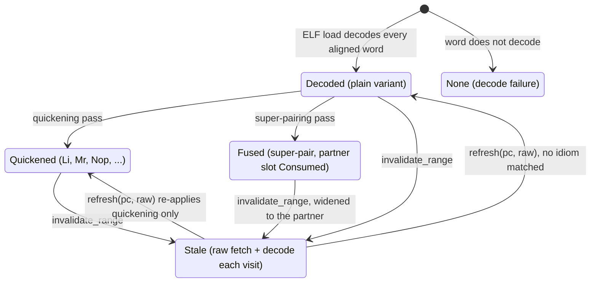

# Interpreters

## Execution units

### PPU

**PPU (`cellgov_ppu`)**: PPC64 interpreter with 32 GPRs, 32 FPRs, PC,
CR, LR, CTR, XER (carry tracked), TB, and 32 vector registers.

The `PpuInstruction` set covers:

- integer arithmetic and logic;
- D-form / DS-form / indexed loads/stores with and without update
  (including DS-form `lwa` and the full indexed-with-update family);
- byte-reversed indexed loads/stores (`ldbrx`, `lwbrx`, `lhbrx`,
  `sdbrx`, `stwbrx`, `sthbrx`);
- string moves (`lswi`, `lswx`, `stswi`, `stswx`);
- trap (`tw`, `td`);
- `dcbz`;
- `sc`;
- the VMX unaligned and element-indexed load/store family (`lvlx`,
  `lvrx`, `stvlx`, `stvrx`, `lvebx`/`lvehx`/`lvewx`,
  `stvebx`/`stvehx`/`stvewx`, `lvxl`, `stvxl`, `lvsl`, `lvsr`);
- conditional branches with LR/CTR/AA variants;
- 64-bit multiply and divide families;
- signed and unsigned multiply-high;
- rotate and mask families (`rlwinm`, `rlwnm`, `rldicl`, `rldicr`,
  `rldic`, `rldcl`, `rldcr`, `rldimi`);
- floating-point arithmetic and conversion (`fmadd`, `fmul`, `fdiv`,
  `fcmp`, `fsel`, `frsp`, `fctiwz`, `fcfid`);
- VMX VX-form and VA-form vector ops;
- SPR/CR moves (including `mcrxr`);
- atomic load-reserve / store-conditional pairs;
- count-leading-zero (`cntlzd`);
- popcount (`popcntb`);
- record-form variants (`addic.`, `andis.`).

The variant count also includes:

- the shadow's quickening rewrites (`Mr`, `Li`,
  `Slwi`/`Srwi`/`Sldi`/`Srdi`, `Clrlwi`/`Clrldi`, `Nop`,
  `CmpwZero`);
- the super-pair fusions (`LwzCmpwi`, `LwzMtlr`, `MflrStw`,
  `MflrStd`, `LiStw`, `CmpwiBc`, `CmpwBc`, `LdMtlr`, `StdStd`);
- the `Consumed` placeholder.

### PPU loaders

`cellgov_ppu` also owns the loaders:

- PPU ELF64, with PT_LOAD and PT_TLS segment handling;
- the SPRX parser for decrypted PS3 firmware modules, with
  relocation appliers for the types in
  `cellgov_ppu::sprx::APPLIER_SUPPORTED_TYPES` (the single list; the
  firmware reloc census consults it too);
- the PS3 PRX import-table parser.

**Pointers resolve through relocations.** Both parsers read their
pointers through the relocation that patches each slot, not from the
file word in it. These are all `R_PPC64_ADDR32` targets:

- a module's TOC;
- its export and import ranges;
- its per-library table pointers;
- its exported stub vaddrs;
- its entry-point OPDs.

*Why:* an SDK is free to leave the bare addend in the slot and let
the relocation supply the value segment's vaddr. Resolving through
the relocation makes a parsed address agree with the one the loader
publishes at that slot.

**Segments are addressed by program-header position.** The applier
addresses segments by program-header position, not by which two
PT_LOADs hold bytes.

*Why:* a module has two PT_LOADs with content, text and data. But a
relocation identifies its target and value segment by PT_LOAD
index, and some SDK versions pad the table with zero-sized
placeholders.

A placeholder supplies an index and nothing else. The applier
refuses a relocation that:

- names a segment index past the module's PT_LOAD count;
- patches into a placeholder;
- measures its addend from a placeholder;
- names no value segment at all. That addend is a whole address,
  which the applier cannot rebase under a base it chose.

The selection check refuses the same four shapes the applier does.
A module the load would reject is therefore pruned instead of
taking the firmware set down with it.

The NID lookup database lives in `cellgov_ps3_abi::nid`;
`lookup(nid)` resolves human-readable names for fault diagnostics.

### PRX import resolution

The PRX loader resolves every game import to a firmware OPD where
one exists.

Firmware exports are keyed on (namespace, NID), the library name
each import entry contains.

*Why:* a NID that several modules export under different library
names then cannot rebind across them.

Imports with no matching firmware export are patched to the
unresolved-import trampoline (see the [LV2 host](lv2_host.md)
syscall table). Each unresolved NID is attributed to the library
that requested it.

`prx_loader::selection::select_import_closure` derives the load set
per title:

- a game loads the provider closure of the namespaces its binary
  statically imports;
- a firmware executable, which builds its import tables at runtime,
  loads every viable module in the install.

A module that cannot load is pruned with a typed, reported reason,
never silently dropped. Reasons include:

- unprovided import;
- a relocation the applier cannot address;
- duplicate module identity.

The selected set loads in topological-sort order. `module_start` is
invoked per module under a synthetic kernel-context OPD. A
`module_start` that faults in guest code is skipped with a named
witness instead of aborting the boot.

### Boot overrides

`boot run` and `boot bench` take two flags for firmware-loading
experiments:

- `--prx-base HEX` overrides the firmware PRX load address;
- `--skip-module-start` bypasses `module_start` for a firmware PRX
  whose initializer corrupts state under CellGov's LV2 coverage.

Both are boot overrides: the run identity names them, and no anchor
gates a run that sets one.

### SPU

**SPU (`cellgov_spu`)**: 128x128-bit register file, 256 KB local
store, channel file. It implements RR / RI7 / RI10 / RI16 / RI18 /
RRR forms covering:

- constant formation;
- integer arithmetic and logic;
- compare;
- branch;
- shuffle and rotate;
- load and store;
- channel operations.

The SPU unit communicates with the runtime only through effects. It
never reads or writes committed shared memory directly.
`cellgov_spu` includes an SPU ELF loader.

### SPU isolation facility

The SPU isolation facility is out of scope. The SPU unit always runs
nonisolated:

- the IS bit of `SPU_RdMachStat` reads zero [CBEA p:141 s:9.8];
- no isolation state or isolated area exists;
- the run-control isolation exit and load requests are not
  modelled, which is how a CBE without the facility treats them
  [CBEA p:92 s:8.5.1].

*Why:* on the PS3 the facility runs the platform's own secure
modules. No game-visible SPU program enters it, and CellGov keeps
key material and decryption out of its default build.

The facility is the CBEA's one optional facility
[CBEA p:34 s:2.2.3]. It has these parts
[CBEA p:178 s:11.1], [CBEA p:179 s:11.2]:

- isolated load and exit states;
- an isolated area of local store no other unit can reach;
- an authentication and decryption master key;
- a random-number function.

### SPU local-store ordering

An SPU load always sees the SPU's own most recent store. But
instruction fetches and external local-store writes are weakly
consistent with SPU loads and stores. A store into the instruction
stream therefore might or might not be fetched before a `sync`, and
a channel write to execution state might or might not govern the
next instruction before a `sync.c` [SPU-ISA p:254 s:13.1],
[SPU-ISA p:255 s:13.3], [SPU-ISA p:256 s:13.5], [SPU-ISA p:258 s:13.9].

The SPU unit executes one instruction at a time against its own
local store. Every store is therefore visible to the next load and
the next fetch.

An MFC transfer reads and writes local store when it completes,
between two of the unit's steps [CBEA p:173 s:10.3]:

- a get's bytes land then;
- a put reads its source then.

A load or fetch sees a get's bytes once the tag group reads
complete. A store to a put's source before then reaches the put.

Every channel write the unit accepts governs the next instruction.
The channels that set execution state refuse with an
unsupported-channel fault.

The SPU unit's ordering is one of the outcomes the architecture
allows: the one a program that places its barriers correctly sees. `sync`,
`sync.c` and `dsync` decode as their own instructions and order
nothing further.

A recompiled program that depends on a store being fetched without a
`sync` is therefore not caught by an SPU run here. A traced run
records each barrier's location as a `Barrier` trace record.

## Predecoded instruction shadow

The PPU keeps a `PredecodedShadow` over the main text region. Every
4-byte-aligned instruction word is decoded once at ELF load time
into a flat `Vec<Option<PpuInstruction>>` indexed by
`(pc - base) / 4`, with `None` marking decode failure.

The hot-path fetch is a bounds check plus an array index instead of
a raw-memory read plus decode. [ErtlGregg2003 p:4 s:2] Efficient
interpreters keep a flat, sequential layout of the decoded
operations, like machine code. [Bala2000 p:2 s:2] The cache is keyed
by the guest binary address of the code it stands for.

Two optimization passes run at shadow build time:

1. **Quickening.** Common idioms rewrite into specialized variants.
   See [Quickening](#quickening).
2. **Super-pairing.** Frequent 2-instruction sequences fuse into
   single dispatch entries. See [Super-pairing](#super-pairing).

### Quickening

Common idioms rewrite into specialized variants that skip redundant
work:

- `addi rT, 0, imm` -> `Li`
- `or rA, rS, rS` -> `Mr`
- `rlwinm` subsets -> `Slwi`/`Srwi`/`Clrlwi`
- `ori rA, rA, 0` -> `Nop`
- `cmpwi crF, rA, 0` -> `CmpwZero`
- `rldicl`/`rldicr` subsets -> `Clrldi`/`Sldi`/`Srdi`

Candidates come from instruction profiling data (> 0.5% frequency
threshold).

[Brunthaler2010 p:2 s:2] Quickening rewrites an instruction from its
generic implementation to an optimized derivative in place.
[Brunthaler2010 p:3 s:3.2] The variants worth building are chosen
from a frequency analysis of the executed instructions.

### Super-pairing

Frequent 2-instruction sequences fuse into single dispatch entries:

- `lwz + cmpwi` -> `LwzCmpwi`
- `li + stw` -> `LiStw`
- `mflr + stw` -> `MflrStw`
- `lwz + mtlr` -> `LwzMtlr`
- `mflr + std` -> `MflrStd`
- `ld + mtlr` -> `LdMtlr`
- `std + std` -> `StdStd`
- `cmpwi + bc` -> `CmpwiBc`
- `cmpw + bc` -> `CmpwBc`

The second slot is marked `Consumed` and the fetch loop skips it.
Candidates come from adjacent-pair profiling data (> 1% frequency
threshold).

[ErtlGregg2003 p:20 s:6.3] Combining common sequences of VM
instructions into superinstructions reduces the number of
dispatches executed.

### Fetch loop

The fetch loop resolves one instruction per iteration from the
current PC. Batching over precomputed basic-block lengths was
measured and rejected.

*Why:* the loop-carried window state a batch must carry costs more
than the address resolution it removes.

### Invalidation and refresh

Guest-visible code writes mark the affected slots stale via
`invalidate_range`. These writes include:

- self-modifying code;
- CRT0 relocations;
- GOT slot patching during PRX import binding.

The invalidation is widened to super-pair partners so both halves
transition together.

The runtime falls back to raw fetch + decode until
`refresh(pc, raw)` repopulates a slot. Refresh re-applies quickening
but not super-pairing. Fusable pairs refreshed after invalidation
therefore run as separate dispatches until the next full shadow
rebuild. [Bala2000 p:7 s:6 Fragment Cache Management] A flushed
cache entry is regenerated when its address is executed again.

Slot lifecycle:

```mermaid
stateDiagram-v2
  state "Decoded (plain variant)" as Decoded
  state "Quickened (Li, Mr, Nop, ...)" as Quickened
  state "Fused (super-pair, partner slot Consumed)" as Fused
  state "None (decode failure)" as Failed
  state "Stale (raw fetch + decode each visit)" as Stale
  [*] --> Decoded : ELF load decodes every aligned word
  [*] --> Failed : word does not decode
  Decoded --> Quickened : quickening pass
  Decoded --> Fused : super-pairing pass
  Decoded --> Stale : invalidate_range
  Quickened --> Stale : invalidate_range
  Fused --> Stale : invalidate_range, widened to the partner
  Stale --> Quickened : refresh(pc, raw) re-applies quickening only
  Stale --> Decoded : refresh(pc, raw), no idiom matched
```
