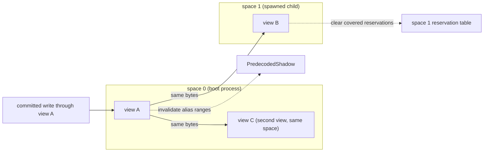
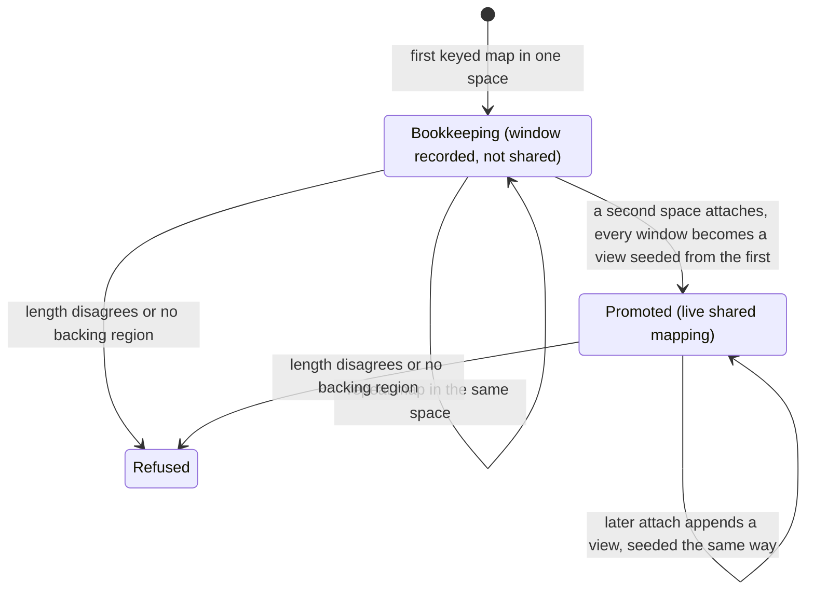

# Guest memory layout

`cellgov_mem::GuestMemory` is a sorted `Vec<Region>` keyed by
region base address. Each `Region` owns a `Vec<u8>` sized to the
region, plus a label, page-size class, and access mode.
`containing_region(addr, length)` translates addresses by binary
search, returning the region entirely containing the range, or
`None` if the access straddles a boundary or falls in an unmapped
gap.

The `boot run` driver builds these regions, matching the canonical
PS3 LV2 virtual-address layout:

| Guest VA                   | Size       | Label          | Access                           | Purpose                                                                                                                                                                  |
| -------------------------- | ---------- | -------------- | -------------------------------- | ------------------------------------------------------------------------------------------------------------------------------------------------------------------------ |
| 0x00000000-(<= 0x3FFFFFFF) | up to 1 GB | `main`         | `ReadWrite`                      | User memory: EBOOT PT_LOAD segments, TLS, firmware PRX images, allocator pool. Size is `max(ELF footprint + 2 MiB PRX headroom, 1 GiB)`, capped by `PS3_RSX_IOMAP_BASE`. |
| 0x40000000-0x454FFFFF      | 85 MB      | `rsx_iomap`    | `ReadWrite`                      | Backing for `sys_rsx_context_iomap` (672); libgcm FIFO command-buffer allocations land here                                                                              |
| 0xC0000000-0xCFFFFFFF      | 256 MB     | `rsx`          | `ReservedZeroReadable` (default) | Video / RSX local memory -- placeholder, reads zero and are counted                                                                                                      |
| 0xD0000000-0xD00FFFFF      | 1 MB       | `stack`        | `ReadWrite`                      | Primary-thread stack (page-4K); matches `PROC_PARAM.primary_stacksize` typical for retail titles                                                                         |
| 0xD0100000-0xD0FFFFFF      | 15 MB      | `child_stacks` | `ReadWrite`                      | Stack pool for PPU threads spawned by `sys_ppu_thread_create`                                                                                                            |
| 0xE0000000-0xFFFFFFFF      | 512 MB     | `spu_reserved` | `ReservedZeroReadable` (default) | SPU-shared range -- same provisional semantics as RSX                                                                                                                    |

The region map does not track `main`'s internal sub-layout; the
region stays flat. Within it, `sys_memory_allocate` starts above
the loaded ELF footprint (the ELF's highest user-region PT_LOAD end
plus 64 KB alignment, computed at startup), TLS sits at
`0x10400000`, and firmware PRX images load above that. The
allocator base sits above the ELF because real PS3 LV2 shares
`0x00010000-0x0FFFFFFF` between the loaded binary and the allocator
pool; matching that layout lines guest pointer values up across
runners.

## Region access modes

`RegionAccess` is a three-variant enum, not a boolean flag, so the
variants cannot be collapsed by accident:

- **`ReadWrite`**: normal user memory; reads and writes go through
  the region's backing `Vec<u8>`.
- **`ReservedZeroReadable`**: reads return the region's zero-init
  bytes and bump `GuestMemory::provisional_read_count`; writes fault
  with `MemError::ReservedWrite`. The default for RSX and
  SPU-reserved: it maps the address space without real semantics
  and surfaces silent zero-reads in `boot run`'s end-of-boot
  summary. An observation region over such a range is refused
  ([comparison.md](comparison.md)).
- **`ReservedStrict`**: reads via the legacy `GuestMemory::read`
  return `None`; reads via `GuestMemory::read_checked` fault with
  `MemError::ReservedStrictRead { addr, region }`; writes fault
  with `MemError::ReservedWrite`. Opted into with the CLI's
  `--strict-reserved`; used by tests asserting no code path touches
  the region.

An access in no region faults with `MemError::Unmapped(FaultContext)`;
`FaultContext` carries the faulting address and the labels of the
nearest mapped regions below and above it, so a fault at
`0xB0000000` reports "between `main` and `rsx`".

## PPU access routing

The PPU interpreter fetches through `GuestMemory::as_bytes()`, a
legacy accessor returning the base-0 region's bytes; code always
lives in `main`, so this is safe. Loads (`ld`, `lwz`, `lfs`, `lvx`,
etc.) use the `load_slice` helper, which scans a region-view table
built at the top of `run_until_yield` from
`GuestMemory::region_views()`: one `RegionView` per region (base,
bytes, and the memory that logs a read when the region is
`ReservedZeroReadable`), in an eight-slot stack table that spills
to the heap when a guest maps more regions. Every provisional-view
hit is logged, so a raw-slice read of the reserved-zero RSX / SPU
ranges reaches the trace as a `ReservedRegionRead` record, as a
host-side `GuestMemory::read` does. Linear scan beats `BTreeMap`
lookup because the region count stays single-digit under the PS3
layout: the regions above plus one per shared-memory mapping.
Stores go through `Effect::SharedWriteIntent`; the commit
pipeline's `apply_commit` is region-aware, so stores to any mapped
region land correctly.

## Per-process address spaces

A spawned process gets its own `GuestMemory` instance, not a
window into the boot map. `Runtime::spaces` (`SpaceTable`) holds:

- the child instances keyed by `AddressSpaceId` (space 0 is the
  boot process, backed by `Runtime::memory`),
- a unit-to-space tag map,
- the child spaces' reservation tables, and
- the registered shared mappings.

Equal numeric addresses in different spaces never alias: every
consumer touching guest memory for a unit resolves through the
unit's space tag, and the LV2 direct-commit channel resolves one
too: `apply_lv2_effects` takes the space, the syscall caller's for
dispatch effects and the expiring waiter's for expiry effects,
while `commit_bytes_at` takes the unit whose pointer it writes
through and resolves that unit's space itself.

Cross-process shared memory is an explicit registration: a shared
mapping names a segment size and a set of `(space, base)` views,
installed all-or-nothing. A committed write through one view fans
out to every sibling view (including a second view in the same
space), clears reservations on covered lines in the sibling
spaces, and invalidates predecoded code at the translated alias
ranges. The storing unit keeps its own reservation over those
lines, as it keeps it over the view it stored through: every view
names one reservation granule. A DMA landing inside a view fans out the same way and
clears the same lines; it invalidates no predecoded code, at the
alias ranges or at its own destination. Atomic `ConditionalStore`
through a shared view is unmodeled and refuses loudly. A DMA
transfer resolves both its ends in space 0, so the fanout is the
only part of one that reaches another space. The RSX subsystem
reads and mirrors space 0 only; deferred RSX effects never join a
child-space commit batch.

An ipc-keyed `sys_mmapper` map registers its window as a view of
that key's segment. The guest never declares the mapping: each map
of a keyed handle carries its key into the region-install drain,
which records the window against the key. A key mapped inside only
one address space stays bookkeeping and never enters the shared
table, so a single-process boot's hash channels are byte-identical
to a run with no keyed maps. When a second address space attaches,
the key promotes: every recorded window becomes a view, each
seeded from the first view's bytes with the reservations it
overwrites cleared. Seeding covers all views, not only the
attaching one, because until promotion each window was an
independent zero-filled region and a repeat map inside the first
space would otherwise stay stale forever. Later attaches append to
the live mapping and seed the same way. A view whose length
disagrees with the segment, or a window with no backing region, is
refused with a named witness and never joins the mapping.

`SpaceTable` is pure data: it rides in `RuntimeSnapshot`, folds
into the sync-channel state hash (tags, mappings, child
reservations) and the committed-memory hash (child contents), and
adds nothing to either byte stream while empty.
