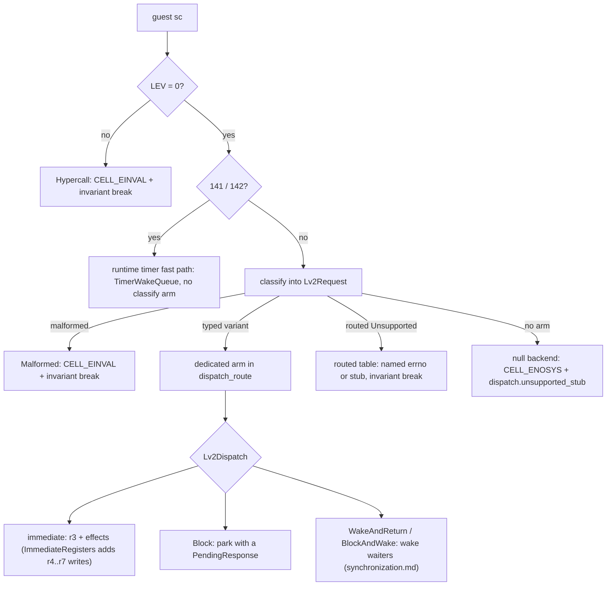
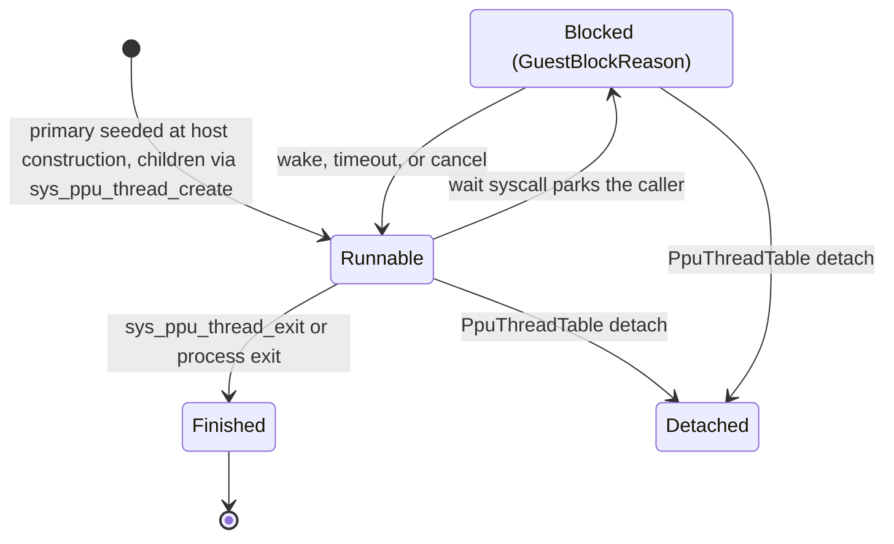
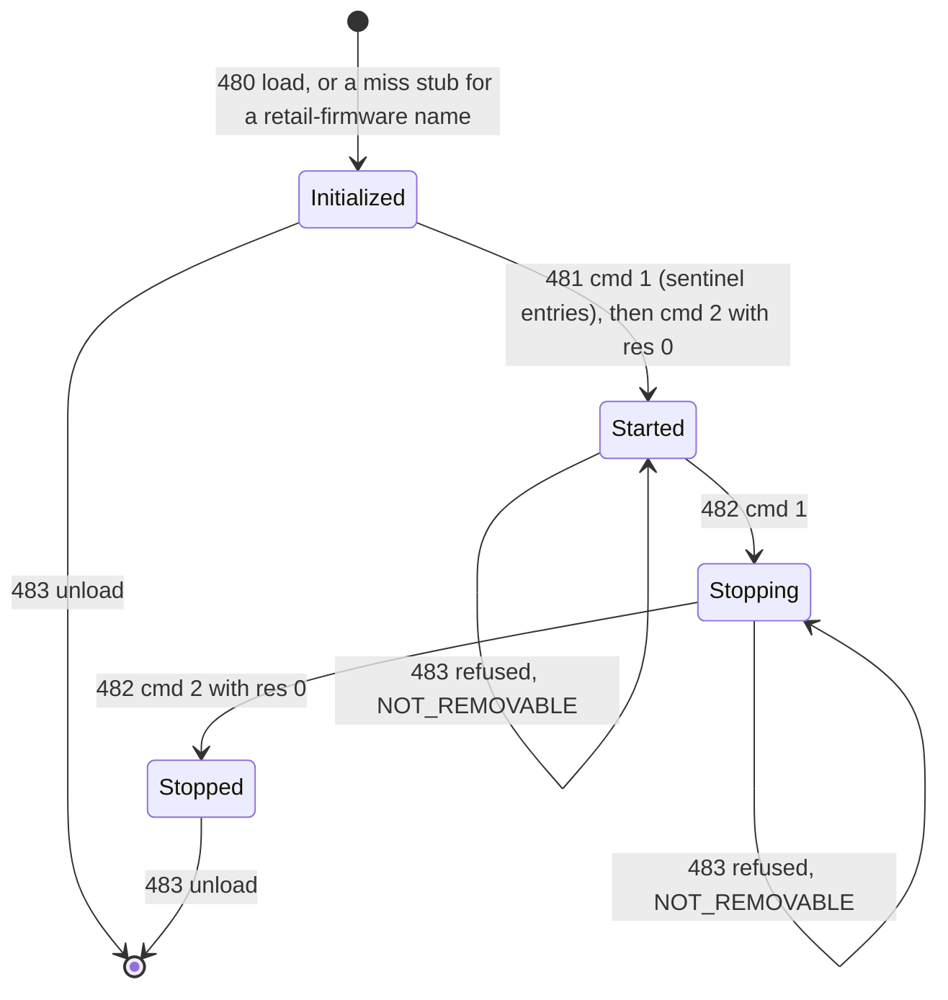
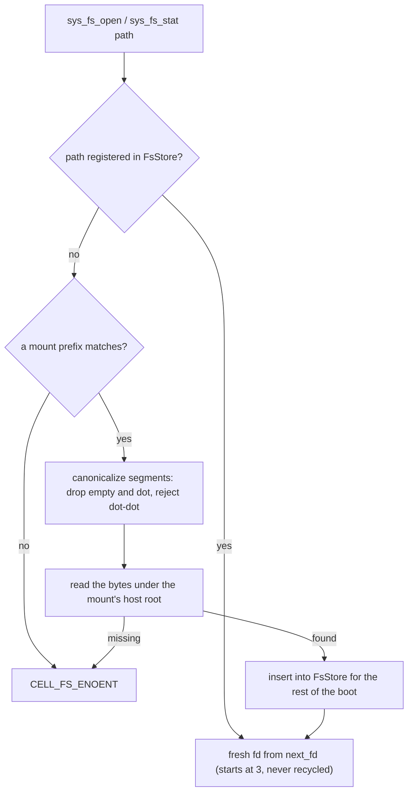

# LV2 host

`cellgov_lv2` owns the LV2 state machine: image registry, thread group
table, PPU thread table, TLS template, child-stack allocator, syscall
classification, syscall dispatch.

The host's fields live in three buckets. `Lv2State` is the hashed
guest-visible state: every primitive table, allocator cursor, and
dispatch-steering map folds into the runtime's `sync_state_hash` at
each commit boundary, and `state_hash` opens with an exhaustive
destructure (no rest pattern), so adding a field without a fold
decision is a compile error. `Lv2Derived` is guest-visible but
unhashed; each field's doc names where a divergence in it is caught
instead (typically the hashed guest memory its effects settle
into). `Lv2Observability` holds witness counters and diagnostic
logs behind one `observability()` accessor and is provably inert:
wiping every instrument after each committed step yields
byte-identical state traces (the `obs_null_sink` gate). The
dispatch tick is not host state; the router snapshots it once per
dispatch and threads it to the arms that stamp effect timestamps.

How a guest `sc` reaches an answer:



Classified into typed `Lv2Request` variants:

| Syscall                                            | Number                  | Behavior                                                                                                                                                                                                                                                                                                                                                                                                                                                                        |
| -------------------------------------------------- | ----------------------- | ------------------------------------------------------------------------------------------------------------------------------------------------------------------------------------------------------------------------------------------------------------------------------------------------------------------------------------------------------------------------------------------------------------------------------------------------------------------------------- |
| `sys_process_is_spu_lock_line_reservation_address` | 14                      | CELL_EINVAL for zero or unknown flag bits, then a verdict by the address's top nibble, mirroring RPCS3's `sys_process.cpp`: main / user / RSX / RawSPU-MMIO nibbles succeed; PPU stack (0xD) is CELL_EPERM; private SPU MMIO (0xF) is CELL_EPERM only under the RAW_SPU flag; unmodeled nibbles are CELL_EINVAL (RPCS3 consults sys_vm / mmapper state there; CellGov does not track it).                                                                                                 |
| `sys_process_exit`                                 | 22                      | Cascades Finished to all units in the process.                                                                                                                                                                                                                                                                                                                                                                                                                                  |
| `sys_ppu_thread_exit`                              | 41                      | Finishes the calling unit; wakes joiners with the exit value.                                                                                                                                                                                                                                                                                                                                                                                                                   |
| `sys_ppu_thread_yield`                             | 43                      | No-op scheduling hint; round-robin picks the next runnable unit.                                                                                                                                                                                                                                                                                                                                                                                                                |
| `sys_ppu_thread_join`                              | 44                      | Either returns exit value immediately or blocks caller on target.                                                                                                                                                                                                                                                                                                                                                                                                               |
| `sys_ppu_thread_create`                            | 52                      | Allocates stack + TLS, seeds child `PpuState`, registers a new PPU unit mid-run via `PpuFactory`.                                                                                                                                                                                                                                                                                                                                                                               |
| `sys_event_flag_*`                                 | 82, 83, 85, 86, 87, 118, 132, 139 | Create / destroy / wait / trywait / set / clear / cancel / get. AND/OR match with CLEAR/NO-CLEAR wake policy. Cancel (132) wakes every waiter with CELL_ECANCELED, stores the bits captured at cancel time through each waiter's parked `result_ptr` (via the wake channel, not the canceller's effects, so it resolves in the WAITER's address space), and writes the woken count to `*num_ptr` (skipped when null). Get (139) writes the current bits as BE u64. Slot 84 is `_sys_interrupt_thread_establish`; slot 118 is the firmware-era home of `sys_event_flag_clear`.                                                                                          |
| `sys_semaphore_*`                                  | 90-94, 114              | Create / destroy / wait / trywait / post / get_value. Wake-or-increment on post.                                                                                                                                                                                                                                                                                                                                                                                                |
| `sys_lwmutex_*`                                    | 95-99                   | Create / destroy / lock / unlock / trylock. FIFO waiter list. The kernel entry holds only `signaled` plus the waiter list -- owner and recursion count live in the guest-side `sys_lwmutex_t`, so unlock does not consult the caller. CELL_EDEADLK fires when the caller is already parked on the sleep queue, not on owner re-entry.                                                                                                                                            |
| `sys_mutex_*`                                      | 100-104                 | Create / destroy / lock / unlock / trylock. Heavy-mutex variant of lwmutex with attribute capture; the kernel entry tracks the owner (lwmutex does not). Destroy (101) is CELL_ESRCH on unknown id, CELL_EBUSY while owned or with waiters.                                                                                                                                                                                                                             |
| `sys_cond_*`                                       | 105-110                 | Create / destroy / wait / signal / signal_all / signal_to. Two-hop drop-and-reacquire mutex protocol.                                                                                                                                                                                                                                                                                                                                                                           |
| `sys_event_queue_*`                                | 128-131                 | Create / destroy / receive / tryreceive. Bounded FIFO with 4-u64 payloads. A non-zero `ipc_key` registers the queue under that key for later port lookup; an already-registered key is CELL_EEXIST, because create passes `SYS_SYNC_NEWLY_CREATED` and has no attach-on-create path. Receive (130) returns the event in r4..=r7 (source / data1 / data2 / data3), immediately as `ImmediateRegisters` or through the wake channel's register writes; the guest's event pointer is a dummy the kernel never writes.                                                                                                                                                                              |
| `sys_event_port_*`                                 | 134-138, 140            | Create / destroy / connect_local / disconnect / port_send / connect_ipc. A port is created unbound with type `SYS_EVENT_PORT_LOCAL` (1) or `SYS_EVENT_PORT_IPC` (3), else CELL_EINVAL, and binds to exactly one queue: by queue id (136) for a local port, by ipc key (140) for an IPC port, CELL_EINVAL on the wrong form. Rebind or destroy while bound is CELL_EISCONN; disconnect (137) while unbound is CELL_ENOTCONN. Send (138) resolves through the binding, so an unconnected port cannot deliver. |
| `sys_time_get_timezone`                            | 144                     | Writes zero through both out-pointers (UTC, no DST). CellGov has no host-time dependency.                                                                                                                                                                                                                                                                                                                                                                                       |
| `sys_spu_image_open`                               | 156                     | Looks up SPU ELF by path, writes `sys_spu_image_t` to guest memory.                                                                                                                                                                                                                                                                                                                                                                                                             |
| `sys_spu_image_import`                             | 158                     | Registers `size` bytes at the guest pointer into the `ContentStore` and writes a `sys_spu_image_t` referring to the registered blob.                                                                                                                                                                                                                                                                                                                                            |
| `sys_spu_initialize`                               | 169                     | CELL_EINVAL when `max_raw_spu > 5`, otherwise CELL_OK; the oracle does not partition the SPU pool into "usable" vs "raw" slots. The announced limits are discarded and reported as a `dispatch.spu_initialize_limits_unpersisted` invariant break.                                                                                                                                                                                       |
| `sys_spu_thread_group_create`                      | 170                     | Allocates a monotonic group id, writes it to guest pointer. CELL_EINVAL when `num_threads` exceeds `MAX_SLOTS_PER_GROUP`; CELL_EAGAIN on allocator exhaustion.                                                                                                                                                                                                                                                                                                                  |
| `sys_spu_thread_group_destroy`                     | 171                     | Withdraws the group from the table, scrubs unit / thread maps, returns CELL_OK. CELL_ESRCH on unknown id, CELL_EBUSY if any SPU in the group is still Running.                                                                                                                                                                                                                                                                                                                  |
| `sys_spu_thread_initialize`                        | 172                     | Reads the `sys_spu_image` record's `type` word. A kernel record (from 156 / 158) names an image the kernel holds by the id in `entry_point`, CELL_ESRCH otherwise; a user record's 24-byte segment table is checked against the kernel's bounds (entry inside local store, 1-32 segments, COPY sources 4-byte aligned, at most one INFO segment of at most 256 bytes, loadable segments 16-byte aligned, inside local store and non-overlapping) and its bytes are snapshotted into local-store segments at initialize, since group start has no guest-memory access. Args are copied at init time. The slot index is free within the 256-entry map; an occupied slot is CELL_EBUSY, as is a group whose declared thread count is already populated. Group destroy withdraws the user images. |
| `sys_spu_thread_group_start`                       | 173                     | Returns `RegisterSpu` with init state per slot; runtime creates SPUs.                                                                                                                                                                                                                                                                                                                                                                                                           |
| `sys_spu_thread_group_terminate`                   | 177                     | Not modeled; typed-variant arm logs an invariant break and returns CELL_ENOSYS. Split from join so dispatch cannot conflate the two ABI shapes. RPCS3 reference: its `sys_spu.cpp` terminate handler.                                                                                                                                                                                                                                                                           |
| `sys_spu_thread_group_join`                        | 178                     | Blocks caller; wakes when all SPUs in the group finish.                                                                                                                                                                                                                                                                                                                                                                                                                         |
| `sys_spu_thread_write_spu_mb`                      | 190                     | Deposits a value into the target SPU's inbound mailbox.                                                                                                                                                                                                                                                                                                                                                                                                                         |
| `sys_memory_container_create`                      | 341                     | Allocates a monotonic container id, writes it to the guest pointer. Shares one arm with syscall 324 (LV2 binds both numbers to one kernel entry point). CELL_ENOMEM when `size` truncates to nothing against the 1 MiB granule; CELL_EFAULT on a null pointer.                                                                                                                                                                                                                                                                                                                                                                                                                 |
| `sys_memory_allocate`                              | 348                     | Bump-allocates 64KB-aligned guest memory from the PS3 user region (0x00010000+, above the loaded ELF).                                                                                                                                                                                                                                                                                                                                                                          |
| `sys_memory_free`                                  | 349                     | Stub: no-op (CellGov does not track deallocation).                                                                                                                                                                                                                                                                                                                                                                                                                              |
| `sys_memory_allocate_from_container`               | 350                     | The 348 bump allocator gated on a container id `sys_memory_container_create` minted, aligned to the page size `flags` names (0 is the 1 MiB default); container budgets are untracked, so a live container never runs out. In the kernel's order: CELL_EALIGN on zero `size`; CELL_EINVAL on a page flag other than 0 / 64 KiB / 1 MiB; CELL_EALIGN when `size` is not a multiple of that page; CELL_ESRCH for an unminted container id; CELL_ENOMEM when the user-memory budget is exhausted; CELL_EFAULT on a null out-pointer. |
| `sys_memory_get_user_memory_size`                  | 352                     | Writes `sys_memory_info_t` to the guest pointer: `total` is the fixed user-memory size, `available` is `total - (mem_alloc_ptr - mem_alloc_base)`, so it SHRINKS as the bump allocator hands out memory.                                                                                                                                                                                                                                                                 |
| `sys_uart_*`                                       | 367-370                 | Initialize / receive / send / get_params: the virtual UART to the system controller's AV manager, spoken in PS3AV packets. Send (369) parses every packet in the buffer at dispatch, advancing by each header's wrapped u16 length (a short AVB_PARAM is a size mismatch; a mode-0 send reports its first chunk), and stages the replies; receive (368) hands the reply stream back and parks a blocking caller until a send stages bytes -- several may park, bytes go to them in park order, and a process exit purges its parked readers. HDMI plug and HDCP events follow their triggering command's replies, gated by the enabled-event mask at that moment. The monitor on HDMI 0 and the AV-multi port are fixed fixtures; audio and video packets are validated and acknowledged but drive nothing. The PS3's AV thread answers after a pause and delivers events on a timer; here the same bytes appear in the same order with no latency. |
| `sys_tty_write`                                    | 403                     | Appends the buffer to `tty_log` and writes `len` back through `nwritten_ptr`; CELL_EFAULT when that pointer is null. `Lv2Request` carries fd / len / buf for tracing.                                                                                                                                                                                                                                                                                                        |
| `sys_config_*`                                     | 516-522                 | The subscription store through which the shell's device managers learn what is attached. A handle (open / close, 516 / 517) binds to an event queue; a listener (519 / 520) subscribes to one service id, and every registered service it matches -- the two pad-manager services carrying the DUALSHOCK 3 descriptor are pre-registered -- is replayed to the handle's queue as a service event whose record the guest reads with 518; 521 / 522 register and withdraw services and announce them to matching listeners, reading registration state live. Ids come from the shared kernel-id allocator; event ids count from zero. A data buffer over 4 KiB is CELL_EINVAL with a named diagnostic. |
| `sys_usbd_*`                                       | 530-541                 | The USB host driver on a bus with no device. Initialize / finalize (530 / 531) mint and withdraw driver handles, several may be live at once; register / unregister LDD (535 / 536) record product strings, so unregistering one never registered is CELL_ESRCH; a receive-event reader (540) parks until finalize wakes every reader on that handle with the terminate triple; every device- or pipe-scoped call (532-534, 537-539) answers the refusal an empty bus gives, a null descriptor pointer being CELL_EINVAL ahead of the no-device answer; detect-event (541) is ABI-only. |
| `sys_fs_open`                                      | 801                     | Routes through the in-memory FS layer (see "In-memory filesystem" below): registered paths get a fresh fd from `FsStore`; a miss tries the mount table before `CELL_FS_ENOENT`. `/app_home/PARAM.SFO` and `/app_home/output.txt` are pre-registered as empty `FsStore` blobs at host construction and take the ordinary path (no synthetic-fd whitelist). CELL_EROFS on a write-flagged open of an existing path (read-only FS model); CELL_EFAULT on an unmapped path or fd out-pointer; CELL_EINVAL on no NUL within `CELL_FS_MAX_PATH_LENGTH`; CELL_EMFILE when the FsStore allocator is exhausted. |
| `sys_fs_read`                                      | 802                     | Reads up to `nbytes` from `fd`'s offset into the guest buffer, advances the offset by the count read, and writes that count (u64 BE) to `nread_out_ptr`. Error precedence: nread out-pointer not 8-byte aligned and writable -> CELL_EFAULT; unknown fd -> CELL_EBADF; bad buffer (when nbytes > 0) -> CELL_EFAULT, BEFORE the offset advances (POSIX semantics).                                                                                                      |
| `sys_fs_close`                                     | 804                     | Removes an FsStore-tracked fd from the open-fd table, so later reads / fstats return EBADF. Unknown fds return CELL_EBADF. `fs_fd_count` is unchanged across close (real-PS3 invariant pinned by ps3autotests `sys_process`).                                                                                                                                                                                                                                        |
| `sys_fs_lseek`                                     | 818                     | SEEK_SET / CUR / END semantics via `FsStore::seek`. Errors: CELL_EFAULT (bad pos out-pointer), CELL_EINVAL (whence outside `{0,1,2}` or seek outside `[0, u64::MAX]`), CELL_EBADF (unknown fd). A failed seek leaves the offset unchanged.                                                                                                                                                                                                                                          |
| `sys_fs_opendir`                                   | 805                     | Snapshots the mount-resolved directory entries into a per-fd `BTreeMap<u32, DirEntry>` in lexicographic byte order (the mount table is the only source; no manifest-directory path). Returns a fresh dir-fd via `FsStore::open_dir`. CELL_FS_ENOENT for unknown paths, plus ENOTDIR / EACCES / EIO / EMFILE arms.                                                                                                                                          |
| `sys_fs_readdir`                                   | 806                     | Yields the next `CellFsDirent` (258 bytes) at the dir-fd's cursor; writes the entry size to the caller's out-pointer (0 on end-of-directory). CELL_EBADF on unknown fd.                                                                                                                                                                                                                                                                                                         |
| `sys_fs_closedir`                                  | 807                     | Drops the dir-fd's snapshot and entry table. CELL_EBADF on unknown fd.                                                                                                                                                                                                                                                                                                                                                                                                          |
| `sys_fs_stat`                                      | 808                     | Path-keyed variant of `sys_fs_fstat`; manifest miss probes the mount table before returning CELL_FS_ENOENT. Same struct shape.                                                                                                                                                                                                                                                                                                                                                  |
| `sys_fs_fstat`                                     | 809                     | Writes a 56-byte `CellFsStat` to `stat_out_ptr` (8-byte aligned). `mode = S_IFREG \| 0o444`, `size` from the backing blob, `blksize = 4096`, all timestamp fields zero (oracle has no host time). CELL_EBADF on unknown fd.                                                                                                                                                                                                                                                     |
| `UnresolvedImport`                                 | (trampoline)            | Fired when CRT0 calls through a GOT slot whose NID matched no firmware export: the PRX loader patches such slots to a guest-resident trampoline OPD that loads the NID into r4 and issues this syscall. The dispatcher logs `dispatch.unresolved_import` (NID and `module::name`) and returns CELL_EINVAL, so the next observable effect is a structured fault, not control flow into junk PCs. |

**Timer sleep path (141 / 142).** `sys_timer_usleep` and
`sys_timer_sleep` never reach `Lv2Host::dispatch`; the runtime
handles them in `lv2_dispatch.rs`. A zero interval yields with
CELL_OK immediately. A non-zero interval parks the caller `Blocked`
with a `TimerWakeQueue` entry at `now + interval` (the seconds
argument of 142 truncates to u32 at the ABI boundary); the wake at
the deadline delivers CELL_OK. The queue is the deterministic
`(deadline, seq)` structure that also expires timed sync-primitive
waits with CELL_ETIMEDOUT; it is snapshot-captured and
state-hashed, and its wakes trace as `UnitWoken` with the `Timer`
reason. `SyscallEntered` carries the
`TracedSyscallDisposition::TimerFastPath` byte, which distinguishes
them from dispatched syscalls in the trace. The path bypasses
classification, so these two have no `classify` arm; their absence
from the typed table is not a coverage gap.

Not every classified arm has a row above. This table is
hand-maintained narrative for the arms worth prose; the generated
[lv2_fidelity.md](../lv2_fidelity.md), rendered from
`cellgov_lv2::request::fidelity` with a dispatch probe that fails
CI when the two disagree, is the complete drift-gated enumeration
for coverage questions. Typed arms omitted here as self-describing
id-mint or constant-return stubs: `sys_process_getpid` (1),
`sys_process_get_number_of_object` (12), `sys_process_getppid`
(18), `sys_process_get_sdk_version` (25),
`_sys_process_get_paramsfo` (30), `sys_process_get_ppu_guid` (31),
`sys_ppu_thread_start` (53, a no-op because SUSPENDED collapses
into create), `sys_timer_create` / `_destroy` (70 / 71),
`sys_rwlock_create` / `_destroy` (120 / 121),
`sys_time_get_timebase_frequency` (147), and `sys_fs_write` (803,
the read-only model: CELL_EBADF for any `size > 0`, CELL_OK for a
zero-length write).

## PPU thread lifecycle

`PpuThreadTable` in `cellgov_lv2::ppu_thread` tracks every
PS3-visible PPU thread: the primary (seeded at host construction)
and each child spawned via `sys_ppu_thread_create`. An entry
carries a guest-facing `PpuThreadId`, the runtime `UnitId`, the
lifecycle state, the creation attributes (entry OPD, arg, stack
range, priority, TLS base), the exit value (set on
`sys_ppu_thread_exit`), and a join-waiters list.

State machine: `Runnable -> Blocked(GuestBlockReason)
-> Runnable` (on wake), `Runnable -> Finished` (on exit), or
`Runnable | Blocked -> Detached` (via `PpuThreadTable::detach`). The guest-facing `GuestBlockReason` lives
next to the thread table; the scheduler sees only the opaque
`UnitStatus::Blocked`. Variants cover every LV2 primitive that
parks a caller: `WaitingOnJoin`, `WaitingOnLwMutex`,
`WaitingOnMutex`, `WaitingOnSemaphore`, `WaitingOnEventQueue`,
`WaitingOnEventFlag`, and `WaitingOnCond`. Each carries the
primitive id (plus the mutex id for `WaitingOnCond`); diagnostics
and fault backtraces read that context, the scheduler never does.



Child stacks come from the 15 MB `child_stacks` region at
`0xD0100000+` (see [guest_memory.md](guest_memory.md)) via
`ThreadStackAllocator`, a deterministic bump allocator: two fresh
allocators produce byte-identical sequences. The arena is
host-global; the backing memory is not. A stack block installs as a
region in the CREATOR's address space, so a thread spawned by a
child process stacks inside that process, not the boot map (the
boot pipeline pre-installs the whole window, so boot-process
creates skip the install). A create refused after taking a block --
no PPU factory installed, thread-id space exhausted, or a stack
region that will not install -- returns the block, so refusals
cannot leak the window one allocation at a time. The arena rewinds
only its most recent block; returning any other block is refused
with a named witness rather than corrupting a live stack.

Per-thread TLS comes from the captured `TlsTemplate`:
`set_tls_template` fires once at boot from the loader's PT_TLS
header, and `template.instantiate()` gives each child a fresh copy
of the initial bytes plus a zero-filled BSS tail.

Mid-run unit registration goes through the `PpuFactory` hook on
`Runtime`, installed by the CLI boot path. The factory takes a
`PpuThreadInitState` (resolved entry code address, TOC, arg, stack
top, TLS base, LR sentinel) and returns a `PpuExecutionUnit` with
its `PpuState` seeded per the PPC64 ABI, mirroring the SPU factory
pattern so `cellgov_core` stays independent of `cellgov_ppu`.

The host dispatcher special-cases many arms to return spec-correct
error codes or stage guest-memory effects.
`cellgov_lv2::host::dispatch_route` is the source of truth; the
table below lists each arm with non-default behavior. Syscalls
without a typed-variant arm route through the null backend (see
"Null backend for unmodeled syscalls" below) and return
`CELL_ENOSYS` with a traced diagnostic.

| Syscall / Request                                        | Number | Behavior                                                                                                                                                                                                                                                                                                 |
| -------------------------------------------------------- | ------ | -------------------------------------------------------------------------------------------------------------------------------------------------------------------------------------------------------------------------------------------------------------------------------------------------------- |
| `sys_ppu_thread_set_priority`                            | 47     | Stores `prio` in the target's thread-table attrs. CELL_EINVAL outside `0..=3071` (the floor widens to `-512` under debug-or-root capability, the same floor `_sys_ppu_thread_create` applies), then CELL_ESRCH for an id absent from the table. The round-robin scheduler does not consult the stored value.                                                                                              |
| `sys_ppu_thread_get_priority`                            | 48     | Writes the target priority (s32) to `*priop`. CELL_ESRCH for an id absent from the thread table, checked before the null gate (RPCS3's lookup-then-write order); CELL_EFAULT on null `priop`.                                                                                                          |
| `sys_tty_read`                                           | 402    | CELL_EIO (debug console off in retail).                                                                                                                                                                                                                                                                  |
| DEX-only unused slot                                     | 462    | CELL_ENOSYS so retail liblv2 takes its fallback path.                                                                                                                                                                                                                                                    |
| `sys_memory_container_create`                            | 324    | Same arm as syscall 341: mints a kernel id, writes it to `*cid_ptr`. Physical-memory budgets are untracked, so the only size-derived refusal is CELL_ENOMEM for a `size` that truncates to nothing against the 1 MiB granule; that gate precedes CELL_EFAULT on a null `cid_ptr`.                       |
| `sys_mmapper_allocate_address`                           | 330    | Bumps a 256 MiB-aligned cursor across `[MMAPPER_REGION_START = 0x5000_0000, MMAPPER_REGION_END = 0xC000_0000)` and writes the base to `*alloc_addr_ptr`; the start sits 256 MiB above `SYS_RSX_MEM_END` so the reserved `[0x4000_0000, 0x5000_0000)` rsx_context window cannot alias a handout, and the end is capped below the RSX dma_control MMIO base. Argument gates fire first, in the kernel's order: CELL_EALIGN when `size` is not a multiple of the 256 MiB VM-area granule (never rounded up); CELL_ENOMEM when `size` exceeds u32; then CELL_EALIGN when `alignment` is none of the four kernel-accepted area sizes (zero reads as the default area size, which PSL1GHT's sbrk relies on). CELL_EFAULT on a null pointer; CELL_ENOMEM on `size == 0` or cap exceeded. |
| `sys_mmapper_allocate_shared_memory`                     | 332    | Mints a monotonic mem_id, writes it to `*mem_id_ptr`. A keyed `ipc_key` (non-zero AND not the `SYS_MMAPPER_NO_SHM_KEY` sentinel liblv2 passes on its keyless path) goes through the process-shared IPC registry: a registered key returns the existing mem_id (size / flags ignored); an unregistered key mints and registers. Gates in the kernel's order, arguments before out-pointer: CELL_EALIGN on `size == 0`; CELL_EINVAL when the `flags` granularity field is other than unset, 64 KiB, or 1 MiB (an unknown field is an error, never rounded to a granule); CELL_ENOMEM when size exceeds u32; CELL_EALIGN when size is not a multiple of the flag-selected granule; then CELL_EFAULT on null `mem_id_ptr`. |
| `sys_mmapper_map_shared_memory`                          | 334    | Validates `addr` inside `[0x2000_0000, 0xC000_0000)` and against the 332 / 362 handle's alignment and size, pushes a `PendingRegionInstall` (carrying the handle's ipc key so the runtime keeps views of one keyed segment coherent) plus its ledger entry, and co-emits any registered `SystemStateSeed` writes for the mapped key in the same effect batch. CELL_EINVAL for an out-of-range or wrapping `addr`; CELL_ESRCH when `mem_id` is not in the handle table; CELL_EALIGN on a misaligned `addr`; CELL_EBUSY when the window intersects a region committed in the CALLER's address space (loader images included) or a window already handed out through 334 / 337. The occupancy test consults the caller's committed layout as well as the host-global ledger, which cannot see regions the boot pipeline or spawn loader installed. |
| `sys_mmapper_search_and_map`                             | 337    | Finds the first free aligned range of the handle's size at or after `start_addr`, records the install, and writes the mapped address (not the caller's hint) to `*alloc_addr_ptr`. A window in the host install ledger or the caller's committed layout advances the candidate rather than failing the call, as the kernel does inside the caller's VM area. CELL_EFAULT on null `alloc_addr_ptr`; CELL_EINVAL when `start_addr` is outside the mmapper window; CELL_ESRCH when `mem_id` is not in the handle table (332 / 362 must precede 337); CELL_ENOMEM when the search exhausts the window.                                                   |
| `sys_mmapper_allocate_shared_memory_ext`                 | 339    | Variant of 332 that also takes an entry table (`entries`, `entry_count`) whose `type` words the kernel checks: the plain types pass, the privileged type also needs 64 KiB pages and debug-or-root capability; the entries are otherwise not consulted. Every key registers, the keyless sentinel included, so repeating any key is CELL_EEXIST. Gates in the kernel's order: CELL_EALIGN on zero `size`; CELL_EINVAL on an unknown granularity encoding; CELL_ENOMEM when `size` exceeds u32; CELL_EALIGN when `size` is not a multiple of the granule; CELL_EINVAL on `flags` bits outside the granularity field or an `entry_count` outside `1..=16`; CELL_EFAULT on an unreadable entry; CELL_EPERM on an unknown or under-privileged entry type; CELL_EFAULT on a null `mem_id_ptr`; CELL_EEXIST on a registered key. |
| `sys_mmapper_allocate_shared_memory_from_container`      | 362    | Container variant of 332 with flags at r6 and `*mem_id_ptr` at r7. No ipc-key path: every call mints a fresh mem_id, so 332's process-shared dedupe does not apply. Same EALIGN / EINVAL / ENOMEM / EFAULT arms in the same order.                                                                            |
| `_sys_prx_load_module`                                   | 480    | Resolves the path at r3 against the PRX registry; a match returns the registered kernel id. A firmware-path miss whose stem names a retail-firmware module registers a stub entry under a real kernel id, stable across re-loads (a corpus-completeness measure, not kernel behaviour: a console's dev_flash always has the module); any other miss, including a name outside the retail module set, is CELL_ENOENT; an unreadable path pointer is CELL_EFAULT. |
| `_sys_prx_start_module`                                  | 481    | Two-phase handshake on `pOpt->cmd & 0xF`. cmd=1 writes `~0` (no-start sentinel) to `pOpt->entry` (and `entry2` when `size != 0x20`) and returns CELL_OK; cmd=2 with `res == 0` marks the module started and returns CELL_OK, any other `res` returns `res & 0xFFFF_FFFF`; an unknown nibble is CELL_PRX_ERROR_ERROR. CELL_EINVAL when `id == 0` or `pOpt == 0`; CELL_ESRCH for an unknown id; CELL_EFAULT on unreadable or wrapping `pOpt`. |
| `_sys_prx_stop_module`                                   | 482    | Stop-side counterpart of 481 on the same option struct: the cmd 1/2 handshake plus the cmd 4/8 pair the teardown helper runs, cmd 4 handing back the entries and cmd 8 reporting what they returned; neither changes module state. cmd=1 moves a started module to stopping and writes the `~0` sentinel entries; cmd=2 with `res == 0` completes the stop (so a later unload succeeds), `res == 1` is CELL_PRX_ERROR_CAN_NOT_STOP, other values are CELL_OK no-ops; wrong-state calls answer CELL_PRX_ERROR_NOT_STARTED / ALREADY_STOPPED / ALREADY_STOPPING. Unlike 481, the id lookup precedes the null-`pOpt` gate (CELL_ESRCH before CELL_EINVAL); CELL_EFAULT on unreadable or wrapping `pOpt`. |
| `_sys_prx_unload_module`                                 | 483    | Withdraws a never-started module (an sc 480 miss stub the guest abandoned) or one whose sc 482 stop handshake completed, returning CELL_OK and freeing its id (LV2's INITIALIZED/STOPPED-only withdraw); a started or stopping resident module is CELL_PRX_ERROR_NOT_REMOVABLE; an unknown id is CELL_PRX_ERROR_UNKNOWN_MODULE.                                          |
| `_sys_prx_register_module`                               | 484    | Reads the option struct at r4: sizes `0x1c` / `0x20` are the legacy forms (rebuilt with `type = 0`, no field reads); `0x30` carries the module type plus the caller's stub table `(ea, size)`; any other size is CELL_EINVAL; a null / unreadable option pointer is CELL_EINVAL / CELL_EFAULT. `type & 1 == 0` is CELL_OK and binds nothing. With the bit set the caller hands the kernel its own import tables, allowed only to a CoreOS process (privilege from the SELF capability header; see "Process privilege"): a normal application gets CELL_PRX_ERROR_ELF_IS_REGISTERED (`0x8001_1910`); a CoreOS caller's stub table is linked against the resolved firmware exports, each entry under the library name it carries, and a NID that library does not export stays unresolved, attributed to that library in diagnostics. Each way the stub-table walk can stop early -- unreadable entry header, below-minimum entry size, entry advance or NID slot wrapping u32 -- names its own invariant break, so a truncated table is never mistaken for a fully linked one. |
| `_sys_prx_register_library`                              | 486    | CELL_EFAULT on a null or unmapped `library` descriptor, otherwise CELL_OK (the kernel's no-match success path). Binding the descriptor to a loaded module's export table is not modeled: CellGov publishes every firmware module's exports at boot, so a caller-registered library adds no resolvable symbol. |
| `_sys_prx_get_module_list`                               | 494    | `flags & 0x2 == 0` -> CELL_OK no-op. With bit 2 set: CELL_EFAULT on null `pInfo`; otherwise walks the PRX registry (filtering liblv2.sprx), writing kernel ids to the `idlist` slots and the count to `pInfo->count`, capped at `pInfo->max`. A null `idlist` skips the slot writes but still writes the count. Iteration is BTreeMap-keyed, so byte output is independent of registration order. CELL_EFAULT on a wrapping `pInfo` or unreadable `max` / `idlist` fields. |
| `_sys_prx_load_module_on_memcontainer`                   | 497    | Same resolver as 480.                                                                                                                                                                                                                                                                                    |
| `sys_hid_manager_is_process_permission_root`             | 512    | Returns 0: retail titles run unprivileged.                                                                                                                                                                                                                                                               |
| `sys_gamepad_ycon_if`                                    | 621    | CELL_OK stub plus an invariant break. libgem.sprx, libio.sprx and vsh.self all call it, so the fabricated success is live; nothing establishes the kernel's answer.                                                                                                                                                                                                                                  |
| `sys_rsx_attribute`                                      | 677    | CELL_OK with no state change, plus an invariant break.                                                                                                                                                                                                                                                   |
| `SsAccessControlEngine` (`sys_ss_access_control_engine`) | 871    | `pkg_id == 1` or `3` -> CELL_ENOSYS (debug/root only). `pkg_id == 2` writes the boot title's program-authority id to `*a2`: the id parsed from the SELF identification header, or the retail-application fallback (`0x1010_0000_0100_0003`) for a raw-ELF input; CELL_EFAULT when `a2 == 0` or exceeds `u32`. Other `pkg_id` values return SS-domain status `0x8001_051D`.                                                  |
| `TimeGetTimezone`                                        | 144    | Writes 0 to `*timezone_ptr` and `*summer_time_ptr` (UTC). CELL_EFAULT on any null pointer.                                                                                                                                                                                                               |
| `TimeGetCurrentTime`                                     | 145    | Writes `(sec, nsec)` derived from the dispatch-entry tick snapshot. CELL_EFAULT on any null pointer.                                                                                                                                                                                                     |
| `TimeGetTimebaseFrequency`                               | 147    | Returns `CELL_PPU_TIMEBASE_HZ` as the syscall code (no effects).                                                                                                                                                                                                                                         |
| `MemoryGetUserMemorySize`                                | 352    | Writes `(total, available)`: total is the game-mode cap `0x0D50_0000`, also the allocator's budget, so a successful allocation can never coexist with `available == 0`. Known divergence: real LV2 also charges the loaded image and thread stacks, so its first-read `available` is already below total. CELL_EFAULT on a null pointer. |
| `MemoryContainerCreate`                                  | --     | Mints kernel id, writes to `*cid_ptr` (same payload shape as syscall 324).                                                                                                                                                                                                                               |
| `Hypercall`                                              | --     | CELL_EINVAL + invariant-break log (PS3 usermode must not issue `sc` with `LEV != 0`).                                                                                                                                                                                                                    |
| `Malformed`                                              | --     | CELL_EINVAL + invariant-break log.                                                                                                                                                                                                                                                                       |

`PpuThreadCreate` decodes as a typed variant, not an `Unsupported`
arm; nonzero `SYS_PPU_THREAD_CREATE_{JOINABLE,INTERRUPT}` flag bits
are unmodeled in the thread-table state and log an invariant break
on first occurrence.

The `_sys_prx_*` rows above form one module state machine:



## Process privilege

A few syscalls answer differently by the booting executable's
privilege: the kernel lets a system process do things it refuses a
retail game. CellGov derives that privilege from the executable
itself, not a per-title switch.

The SELF header yields two independent facts:

- **Program authority id**, from the identification header. Its top
  28 bits identify a CoreOS SELF (the system shell and the other
  firmware executables). A raw ELF with no SELF wrapper falls back
  to the retail-application id `0x1010_0000_0100_0003`.
- **Capability flags**, from the plaintext capability supplemental
  header (`type == 1`), readable without decryption; its first word
  `ctrl_flag1` carries the root and debug masks.

Predicates over those two answer "may this process do X".
`_sys_prx_register_module` (484) consults them: only a CoreOS
process may hand the kernel its own import tables. The masks
overlap and their bit semantics are unconfirmed even in the
reference implementation, so they are mirrored as-is rather than
reduced to disjoint bits.

## Process model and spawn

The LV2 host carries a process identity table, one entry per guest
process (ppid, authority id, capability flags, exit status); the
boot process is pre-seeded under the pid LV2 assigns the first user
process (`cellgov_ps3_abi::sys_process::BOOT_PROCESS_PID`). Units
bind to a pid after spawn; unbound units belong to the boot
process. Every entry field folds into the host state hash.

`_sys_process_spawn` and `sys_process_spawns_a_self2` decode the
caller's marshalled argument block (pointer table, path and argv
strings; bounded walks refuse loudly on an unterminated table),
resolve the child image through the LV2 content store, and hand it
to a host-injected `ProcessSpawnLoader` that installs it into a
fresh child address space. An SCE-wrapped child image (the system
shell spawns SELFs, not raw ELFs) is unwrapped through the
APP-keyed decrypt before the ELF parse. An NPDRM-wrapped child is
named as such from its plaintext NPD header and refused, because
klicensee resolution belongs to the title-install layer, not the
spawn path. Every failure arm unwinds the whole spawn -- space,
reservations, unit tags, and pid -- and the syscall fails with its
honest errno.

The loader also gives the child its firmware: it parses the child's
import table, selects and loads the import closure into the child
space through the same selection, relocation and GOT-patch pipeline
the boot uses ([boot.md](boot.md)), falls back to unresolved-import
trampolines when nothing loads, and pre-initializes TLS and the
kernel-context OPD there. Each child carries its own relocated
copies of its modules; a shared mapping stays the only channel
through which two spaces see the same bytes
([guest_memory.md](guest_memory.md)). A loader that stages this init pass returns an init
token; the runtime then parks the child's primary unit `Blocked`
behind a `PendingChildInit` and the host drains it after the
committed step, running every module's `module_start` in the
child's space on transient units aliased to the child's primary PPU
thread and bound to its pid, with every other runnable unit held
`Blocked` for the duration. A faulting child `module_start` is
skipped with a witness; a stalled or over-budget one is fatal, as it
is for the boot. The child's modules are not entered in the
process-shared PRX registry, and each spawn that loaded real modules
logs `process.child_prx_registry_shared` naming the pid, space and
module count.

The child's primary thread enters through a PPU factory unit with
its own stack inside the child space; its LR sentinel points at an
8-byte exit stub (`li r11, 22; sc`) that runs if the entry point
returns instead of calling `sys_process_exit`. The stub sits above
the loaded image, at the highest PT_LOAD end rather than a fixed
address, so no segment can land on it and address 0 stays reserved
as null (a stub at 0 would turn a guest branch through a null
function pointer into a clean exit instead of a fault).

`sys_process_exit` from a child finishes only that process's units,
records the exit status for `sys_process_get_status` polls, and
leaves the boot process untouched. getpid/getppid and the
SDK-version query answer from the caller's table entry, so a child
sees its own identity.

## Null backend for unmodeled syscalls

Any syscall without a typed-variant arm dispatches to the **null
backend**: an ABI-honest per-syscall "not implemented" response,
traced as a first-class event. The default arm returns
`CELL_ENOSYS` and emits a `dispatch.unsupported_stub`
invariant-break record naming the syscall number; arms with a known
RPCS3-divergent contract return the matching errno instead (e.g.
`sys_rsx_context_attribute`'s unknown-package fallback returns
`CELL_EINVAL` per RPCS3's `sys_rsx.cpp` default arm). The runtime
never returns a blanket `CELL_OK` for a path it did not execute, so
an unmodeled syscall cannot contaminate downstream guest state with
a fabricated result the guest consumes as truth.

The null backend enforces a **routing-layer** claim: every guest
syscall reaches either a dedicated arm or the honest traced "not
implemented" response, never a default arm's blanket success. How
much real LV2 behavior each *dedicated* arm reproduces is a
separate per-arm property: fully modeled, simplified kernel-visible
state, or plausible values with no backing state. That per-arm map
is code in `cellgov_lv2::request::fidelity` (the typed half is an
exhaustive match a new arm cannot skip; the routed-`Unsupported`
half is a const table whose membership a dispatch probe gates),
rendered to [lv2_fidelity.md](../lv2_fidelity.md) under a
drift-checked test.

The traced records feed cross-runner analysis: an unmodeled-syscall
diagnostic on a title's boot path names a specific gap, either a
**divergent honest gap** (RPCS3 delivers a real result where
CellGov ENOSYS-es; an implementation target) or a **convergent
honest gap** (CellGov matches RPCS3's own divergence-from-hardware;
not a target; the diagnostic can downgrade once a classifier
emerges). The convergence sections of [concepts/](../concepts/README.md)
define that honest / convergent / divergent vocabulary; the
cross-runner matrix in [titles.md](../titles.md) shares it.

## In-memory filesystem

The read-side `sys_fs_*` surface routes through an in-memory blob
store at `Lv2Host::fs_store` (`cellgov_lv2::fs_store::FsStore`),
backed by three `BTreeMap`s:

- a path-keyed blob table (`String -> Vec<u8>` plus a pre-computed
  FNV-1a content hash);
- a per-fd open-file table (`u32 -> { path, offset }`);
- a per-fd open-directory table (`u32 -> { entries, cursor }`).

Fds come from a monotonic `next_fd` counter starting at `3`,
matching real PS3's `lv2_fs_object::id_base = 3`, so the
kernel-returned fd fits the `[3, 255)` range the inline
`cellFsRead` wrapper truncates on. Fds are never recycled within a
boot, so a stale fd cannot alias a fresh one. The state hash folds
the content hashes, fd offsets, directory cursors, and next-fd
counter, so a content swap, an unintended re-allocation, or a bogus
extra read shows up as a state-hash divergence in post-step
assertions. Blob registration is single-write: a second
`register_blob` at the same path is rejected with
`FsError::PathAlreadyRegistered`, so content cannot mutate under an
open fd.

Path resolution beyond the manifest goes through `FsMountTable`:
per-title mounts (typically `/app_home`, populated from the title
manifest at boot; no default mount is auto-registered), each with a
guest-path prefix and a host-side root. Read-only enforcement is
global in the dispatch layer, not a per-mount flag: writes / mkdir
/ unlink return `CELL_EROFS` regardless of host-side permissions.
`dispatch_fs_open` / `dispatch_fs_stat` probe the manifest blob set
first; on a miss they call `try_mount_resolve_and_cache`, which
resolves the guest path against the mount's host root, reads the
bytes on demand, and inserts them into `FsStore` for the rest of
the boot. The resolver canonicalizes path segments (drops empty /
`.` segments, rejects `..`), so titles cannot escape their mount.
Directory iteration (`sys_fs_opendir` / `_readdir` / `_closedir`)
snapshots the directory at opendir time in lexicographic byte
order, so later reads are deterministic across host file system
order.



Per-title content lands in the store at boot via the manifest
schema in `titles/<content-id>.toml`:

```toml
[content]
base = "boot_content/<id>"
override_base_env = "CELLGOV_<ID>_CONTENT_DIR"
files = [
    { guest_path = "/app_home/Data/Resources/first.xml", host_path = "Data/Resources/first.xml" },
    ...
]
```

The boot-time content provider in
`apps/cellgov_cli/src/game/content.rs` resolves each entry
against three tiers in priority order:

1. `override_base_env`'s value, when the env var is set to a
   non-empty path. Hard-fail on any missing file with a diagnostic
   naming the env var, so the developer who set the override knows
   which knob to fix.
2. EBOOT-adjacent USRDIR (`<eboot>.parent()`), auto-discovered.
   Soft probe: every entry must resolve under it for the tier
   to win; a partial USRDIR falls through to (3).
3. The manifest's checked-in `base` (the synthetic stubs
   committed to the public repo). Hard-fail on missing files.

The firmware cellFs surface routes through the raw `sys_fs_*` LV2
syscall path, backed by the same `FsStore` model.
