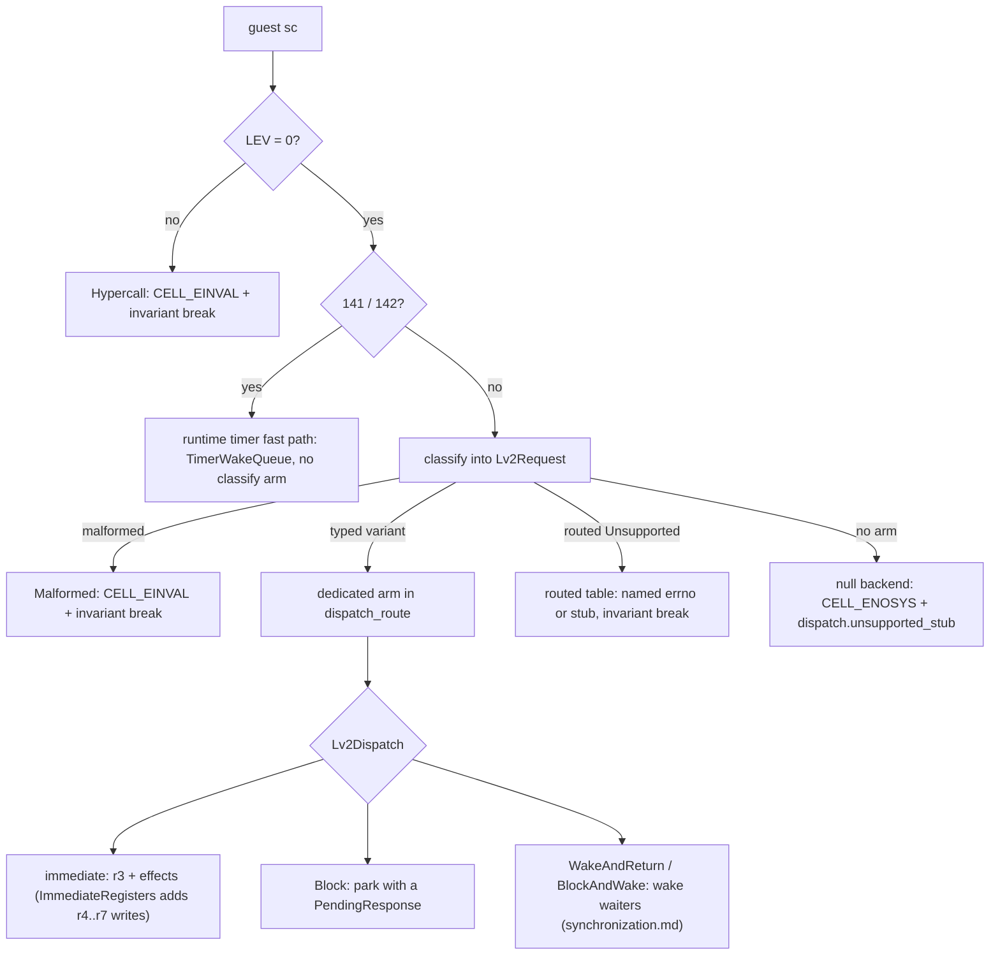
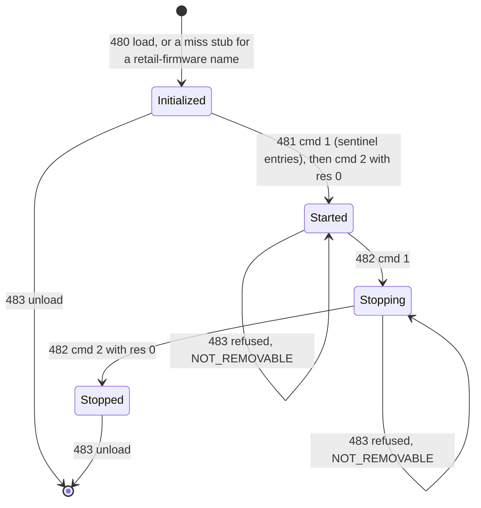
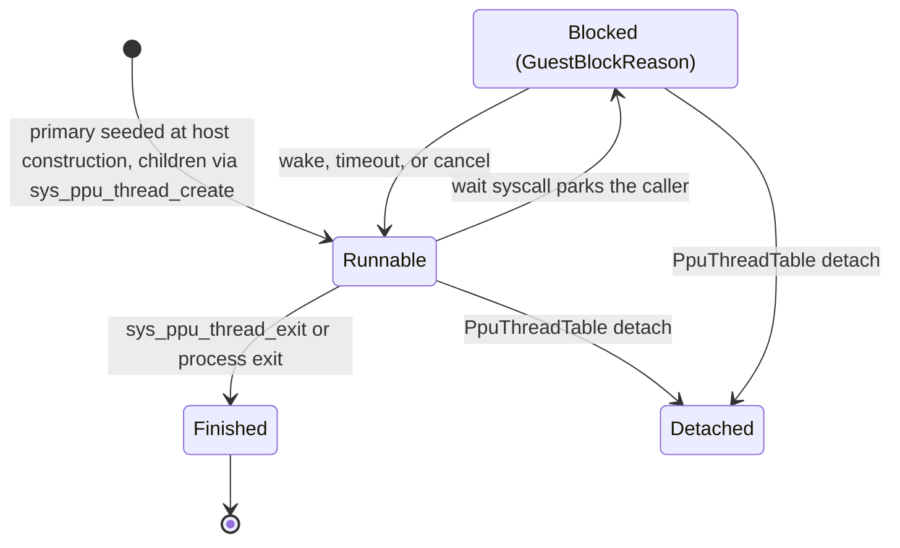
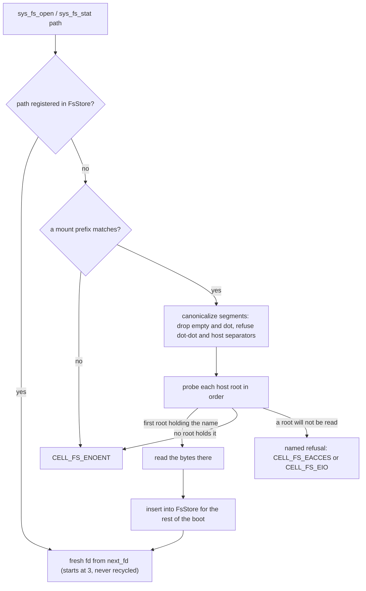

# LV2 host

`cellgov_lv2` owns the LV2 state machine: image registry, thread group
table, PPU thread table, child-stack allocator, syscall
classification, syscall dispatch.

The host's fields live in three buckets. `Lv2State` is the hashed
guest-visible state: every primitive table, allocator cursor, and
dispatch-steering map folds into the runtime's `sync_state_hash` at
each commit boundary, and `state_hash` opens with an exhaustive
destructure (no rest pattern), so adding a field without a fold
decision is a compile error. `Lv2Derived` is guest-visible but
unhashed; each field's doc names where a divergence in it is caught
instead (typically the hashed guest memory its effects settle
into). `Lv2Observability` holds witness counters and diagnostic
logs behind one `observability()` accessor and is provably inert:
wiping every instrument after each committed step yields
byte-identical state traces (the `obs_null_sink` gate). The
dispatch tick is not host state; the router snapshots it once per
dispatch and threads it to the arms that stamp effect timestamps.

How a guest `sc` reaches an answer:



A u32-typed field arrives in a 64-bit argument register. The
classifier refuses a register that carries high bits, so a typed
variant never holds a narrowed field. `Unsupported` hands the raw
registers past that gate; every `Unsupported` arm binds its own u32
fields under the same rule and answers CELL_EINVAL with a
`dispatch.arg_high_bits` break, before its own argument tests run. An
`int`-typed field takes the signed form of the same rule: the register
must reproduce its own low word under sign extension, and one that
does not answers CELL_EINVAL with a `dispatch.arg_not_sign_extended`
break. Whether the kernel masks such a field or refuses it is
unestablished -- every corpus caller passes a value that already fits
in 32 bits.

Every ordinal that reaches an arm has a row in the
[LV2 archive](../lv2/README.md): `route.tsv` names the arm, `arm.tsv`
its fidelity, and the curated `behavior.tsv` what the modelled
behaviour rests on and which test pins it. What each arm does is its
rustdoc under `crates/cellgov_lv2/src/host/`. The ordinal is the
extracted fact; its name is attributed, and the archive's `name.tsv`
records the name CellGov's `lv2_syscalls!` macro gives it beside what
the other committed sources say, with every disagreement kept in
`conflicts.tsv`.

Three requests carry no ordinal. `Hypercall` (an `sc` with LEV != 0,
which PS3 usermode never issues) and `Malformed` (a request whose
fields the classifier could not bind) each answer CELL_EINVAL with an
invariant break. `UnresolvedImport` fires when CRT0 calls through a
GOT slot whose NID matched no firmware export: the PRX loader patches
such slots to a guest-resident trampoline OPD that loads the NID into
r4 and issues this pseudo-syscall, and the dispatcher logs
`dispatch.unresolved_import` (NID and `module::name`) and returns
CELL_EINVAL, so the next observable effect is a structured fault, not
control flow into junk PCs.

**Timer sleep path (141 / 142).** `sys_timer_usleep` and
`sys_timer_sleep` never reach `Lv2Host::dispatch`; the runtime
handles them in `lv2_dispatch.rs`. A zero interval yields with
CELL_OK immediately. A non-zero interval parks the caller `Blocked`
with a `TimerWakeQueue` entry at `now + interval` (the seconds
argument of 142 truncates to u32 at the ABI boundary); the wake at
the deadline delivers CELL_OK. The queue is the deterministic
`(deadline, seq)` structure that also expires timed sync-primitive
waits with CELL_ETIMEDOUT; it is snapshot-captured and
state-hashed, and its wakes trace as `UnitWoken` with the `Timer`
reason. `SyscallEntered` carries the
`TracedSyscallDisposition::TimerFastPath` byte, which distinguishes
them from dispatched syscalls in the trace. The path bypasses
classification, so these two have no `classify` arm; `route.tsv`
reads them as `runtime_fast_path`, not as a coverage gap.

The `_sys_prx_*` arms (480 to 497) form one module state machine:



## PPU thread lifecycle

`PpuThreadTable` in `cellgov_lv2::ppu_thread` tracks every
PS3-visible PPU thread: the primary (seeded at host construction)
and each child spawned via `sys_ppu_thread_create`. An entry
carries a guest-facing `PpuThreadId`, the runtime `UnitId`, the
lifecycle state, the creation attributes (entry OPD, arg, stack
range, priority, TLS base), the exit value (set on
`sys_ppu_thread_exit`), and a join-waiters list.

State machine: `Runnable -> Blocked(GuestBlockReason)
-> Runnable` (on wake), `Runnable -> Finished` (on exit), or
`Runnable | Blocked -> Detached` (via `PpuThreadTable::detach`). The guest-facing `GuestBlockReason` lives
next to the thread table; the scheduler sees only the opaque
`UnitStatus::Blocked`. Variants cover every LV2 primitive that
parks a caller: `WaitingOnJoin`, `WaitingOnLwMutex`,
`WaitingOnMutex`, `WaitingOnSemaphore`, `WaitingOnEventQueue`,
`WaitingOnEventFlag`, and `WaitingOnCond`. Each carries the
primitive id (plus the mutex id for `WaitingOnCond`); diagnostics
and fault backtraces read that context, the scheduler never does.



Child stacks come from the 15 MB `child_stacks` region at
`0xD0100000+` (see [guest_memory.md](guest_memory.md)) via
`ThreadStackAllocator`, a deterministic bump allocator: two fresh
allocators produce byte-identical sequences. The arena is
host-global; the backing memory is not. A stack block installs as a
region in the CREATOR's address space, so a thread spawned by a
child process stacks inside that process, not the boot map (the
boot pipeline pre-installs the whole window, so boot-process
creates skip the install). A create refused after taking a block --
no PPU factory installed, thread-id space exhausted, or a stack
region that will not install -- returns the block, so refusals
cannot leak the window one allocation at a time. The arena rewinds
only its most recent block; returning any other block is refused
with a named witness rather than corrupting a live stack.

A child's TLS base (r13) is the `tls` word of the guest's thread
parameter block, installed verbatim and unvalidated: liblv2 reaches a
thread's own id through an r13-relative slot, so the guest owns that
address.

Mid-run unit registration goes through the `PpuFactory` hook on
`Runtime`, installed by the CLI boot path. The factory takes a
`PpuThreadInitState` (resolved entry code address, TOC, arg, stack
top, TLS base, LR sentinel) and returns a `PpuExecutionUnit` with
its `PpuState` seeded per the PPC64 ABI, mirroring the SPU factory
pattern so `cellgov_core` stays independent of `cellgov_ppu`.

## Process privilege

A few syscalls answer differently by the booting executable's
privilege: the kernel lets a system process do things it refuses a
retail game. CellGov derives that privilege from the executable
itself, not a per-title switch.

The SELF header yields two independent facts:

- **Program authority id**, from the identification header. Its top
  28 bits identify a CoreOS SELF (the system shell and the other
  firmware executables). A raw ELF with no SELF wrapper falls back
  to the retail-application id `0x1010_0000_0100_0003`.
- **Capability flags**, from the plaintext capability supplemental
  header (`type == 1`), readable without decryption; its first word
  `ctrl_flag1` carries the root and debug masks.

Predicates over those two answer "may this process do X".
`_sys_prx_register_module` (484) consults them: only a CoreOS
process may hand the kernel its own import tables. The masks
overlap and their bit semantics are unconfirmed even in the
reference implementation, so they are mirrored as-is rather than
reduced to disjoint bits.

## Process model and spawn

The LV2 host carries a process identity table, one entry per guest
process (ppid, authority id, capability flags, exit status); the
boot process is pre-seeded under the pid LV2 assigns the first user
process (`cellgov_ps3_abi::lv2::process::BOOT_PROCESS_PID`). Units
bind to a pid after spawn; unbound units belong to the boot
process. Every entry field folds into the host state hash.

`_sys_process_spawn` and `sys_process_spawns_a_self2` decode the
caller's marshalled argument block (pointer table, path and argv
strings; bounded walks refuse loudly on an unterminated table),
resolve the child image through the LV2 content store, and hand it
to a host-injected `ProcessSpawnLoader` that installs it into a
fresh child address space. An SCE-wrapped child image (the system
shell spawns SELFs, not raw ELFs) is unwrapped through the
APP-keyed decrypt before the ELF parse. An NPDRM-wrapped child is
named as such from its plaintext NPD header and refused, because
klicensee resolution belongs to the title-install layer, not the
spawn path. Every failure arm unwinds the whole spawn -- space,
reservations, unit tags, and pid -- and the syscall fails with its
honest errno.

The loader also gives the child its firmware: it parses the child's
import table, selects and loads the import closure into the child
space through the same selection, relocation and GOT-patch pipeline
the boot uses ([boot.md](boot.md)), falls back to unresolved-import
trampolines when nothing loads, and pre-initializes TLS and the
kernel-context OPD there. Each child carries its own relocated
copies of its modules; a shared mapping stays the only channel
through which two spaces see the same bytes
([guest_memory.md](guest_memory.md)). A loader that stages this init pass returns an init
token; the runtime then parks the child's primary unit `Blocked`
behind a `PendingChildInit` and the host drains it after the
committed step, running every module's `module_start` in the
child's space on transient units aliased to the child's primary PPU
thread and bound to its pid, with every other runnable unit held
`Blocked` for the duration. A faulting child `module_start` is
skipped with a witness; a stalled or over-budget one is fatal, as it
is for the boot. The child's modules are not entered in the
process-shared PRX registry, and each spawn that loaded real modules
logs `process.child_prx_registry_shared` naming the pid, space and
module count.

The child's primary thread enters through a PPU factory unit with
its own stack inside the child space; its LR sentinel points at an
8-byte exit stub (`li r11, 22; sc`) that runs if the entry point
returns instead of calling `sys_process_exit`. The stub sits above
the loaded image, at the highest PT_LOAD end rather than a fixed
address, so no segment can land on it and address 0 stays reserved
as null (a stub at 0 would turn a guest branch through a null
function pointer into a clean exit instead of a fault).

`sys_process_exit` from a child finishes only that process's units,
records the exit status for `sys_process_get_status` polls, and
leaves the boot process untouched. getpid and getppid answer from the
caller's table entry, so a child sees its own identity; the
SDK-version query answers the boot title's version for every
process.

## Null backend for unmodeled syscalls

Any syscall without a typed-variant arm dispatches to the **null
backend**: an ABI-honest per-syscall "not implemented" response,
traced as a first-class event. The default arm returns
`CELL_ENOSYS` and emits a `dispatch.unsupported_stub`
invariant-break record naming the syscall number; arms whose LV2
contract names a different refusal return that errno instead (e.g.
`sys_rsx_context_attribute`'s unknown-package fallback returns
`CELL_EINVAL`). The runtime never returns a blanket `CELL_OK`
for a path it did not execute, so
an unmodeled syscall cannot contaminate downstream guest state with
a fabricated result the guest consumes as truth.

The null backend enforces a **routing-layer** claim: every guest
syscall reaches either a dedicated arm or the honest traced "not
implemented" response, never a default arm's blanket success. How
much real LV2 behavior each *dedicated* arm reproduces is a
separate per-arm property: fully modeled, simplified kernel-visible
state, or plausible values with no backing state. That per-arm map
is code in `cellgov_lv2::request::fidelity` (the typed half is an
exhaustive match a new arm cannot skip; the routed-`Unsupported`
half is a const table whose membership a dispatch probe gates),
rendered to `arm.tsv` in the [LV2 archive](../lv2/README.md) under
a drift-checked test.

The traced records feed cross-runner analysis: an unmodeled-syscall
diagnostic on a title's boot path names a specific gap, either a
**divergent honest gap** (RPCS3 delivers a real result where
CellGov ENOSYS-es; an implementation target) or a **convergent
honest gap** (CellGov's not-implemented response already agrees with
RPCS3, because RPCS3 diverges from hardware the same way; a
coincidence of two gaps, not a target, and the diagnostic can
downgrade once a classifier emerges). The convergence sections of [concepts/](../concepts/README.md)
define that honest / convergent / divergent vocabulary; the
cross-runner matrix in [titles.md](../titles.md) shares it.

## In-memory filesystem

The read-side `sys_fs_*` surface routes through an in-memory blob
store at `Lv2Host::fs_store` (`cellgov_lv2::fs_store::FsStore`),
backed by three `BTreeMap`s:

- a path-keyed blob table (`String -> Vec<u8>` plus a pre-computed
  FNV-1a content hash);
- a per-fd open-file table (`u32 -> { path, offset }`);
- a per-fd open-directory table (`u32 -> { entries, cursor }`).

Fds come from a monotonic `next_fd` counter starting at `3`,
matching real PS3's `lv2_fs_object::id_base = 3`, so the
kernel-returned fd fits the `[3, 255)` range the inline
`cellFsRead` wrapper truncates on. Fds are never recycled within a
boot, so a stale fd cannot alias a fresh one. The state hash folds
the content hashes, fd offsets, directory cursors, and next-fd
counter, so a content swap, an unintended re-allocation, or a bogus
extra read shows up as a state-hash divergence in post-step
assertions. Blob registration is single-write: a second
`register_blob` at the same path is rejected with
`FsError::PathAlreadyRegistered`, so content cannot mutate under an
open fd.

Path resolution beyond the manifest goes through `FsMountTable`:
per-title mounts (typically `/app_home`, populated from the title
manifest at boot; no default mount is auto-registered), each with a
guest-path prefix and an ordered list of host roots. Read-only
enforcement is global in the dispatch layer, not a per-mount flag:
writes / mkdir / unlink return `CELL_EROFS` regardless of host-side
permissions. `dispatch_fs_open` / `dispatch_fs_stat` probe the
manifest blob set first; on a miss they call
`try_mount_resolve_and_cache`, which resolves the guest path against
each root in turn, reads the bytes on demand, and inserts them into
`FsStore` for the rest of the boot. `resolve_candidates` is pure path
arithmetic -- it yields one host path per root and probes nothing --
so the candidate list is a function of the guest path and the root
list alone. It canonicalizes path segments (drops empty / `.`
segments, refuses `..` and any segment carrying a host separator or
drive marker), so titles cannot escape their roots and resolution
does not vary with the host operating system.

Root order is shadowing order: the earliest root holding a name
decides both the hit and its type, which is what lets an update tree
sit over a base tree without the two being merged on disk. A root
that does not hold the name is skipped; a root the host declines to
read stops the lookup with a named refusal rather than falling
through to the next, since falling through would answer with bytes
the mount order does not name. Directory iteration (`sys_fs_opendir`
/ `_readdir` / `_closedir`) snapshots at opendir time, merging every
root that holds the directory into one listing in lexicographic byte
order, with a repeated name taken from the earliest root. Later reads
are deterministic across host file system order.



Per-title content lands in the store at boot via the manifest
schema in `title_manifests/<content-id>.toml`:

```toml
[content]
override_base_env = "CELLGOV_<ID>_CONTENT_DIR"
files = [
    { guest_path = "/app_home/Data/Resources/first.xml", host_path = "Data/Resources/first.xml" },
    ...
]
```

The boot-time content provider in
`apps/cellgov_cli/src/game/content.rs` resolves each entry
against the first of two base sets that is present:

1. `override_base_env`'s value, when the env var is set to a
   non-empty path: one directory. Hard-fail on any missing file with
   a diagnostic naming the env var, so the developer who set the
   override knows which knob to fix.
2. The composition's EBOOT directories, in the order the executable
   was probed for: a selected update's USRDIR ahead of the base's,
   the same shadowing the composed game mount applies. The first
   directory that holds the file supplies it; a file under none of
   them hard-fails naming the first path and the others found
   absent. An explicit executable the composition did not name keeps
   its own directory alone.

Neither set being present, because the env var is unset and the boot
names no EBOOT directory, is a startup error too. The manifest names
no base of its own. A `[[fs.mounts]]` entry follows the same rule:
its `override_env`, else its declared `host`, else every one of the
composition's EBOOT directories as an ordered root of the mount.

The firmware cellFs surface routes through the raw `sys_fs_*` LV2
syscall path, backed by the same `FsStore` model.
