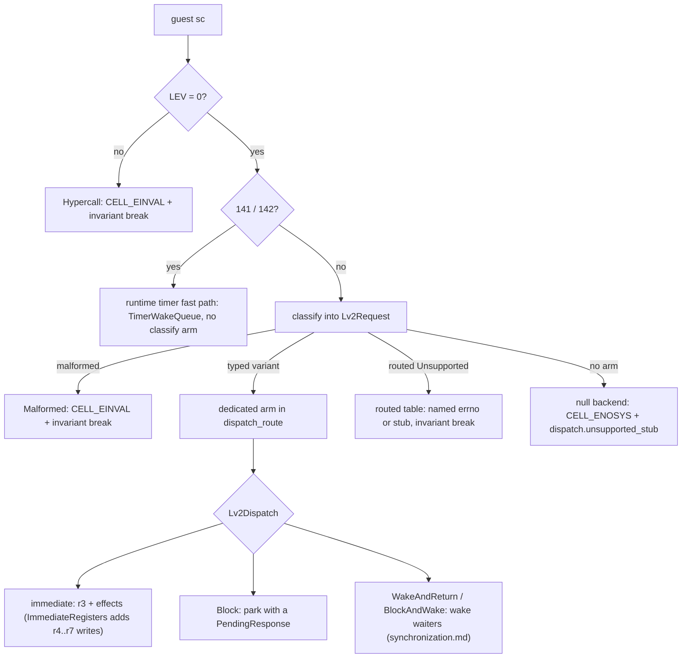
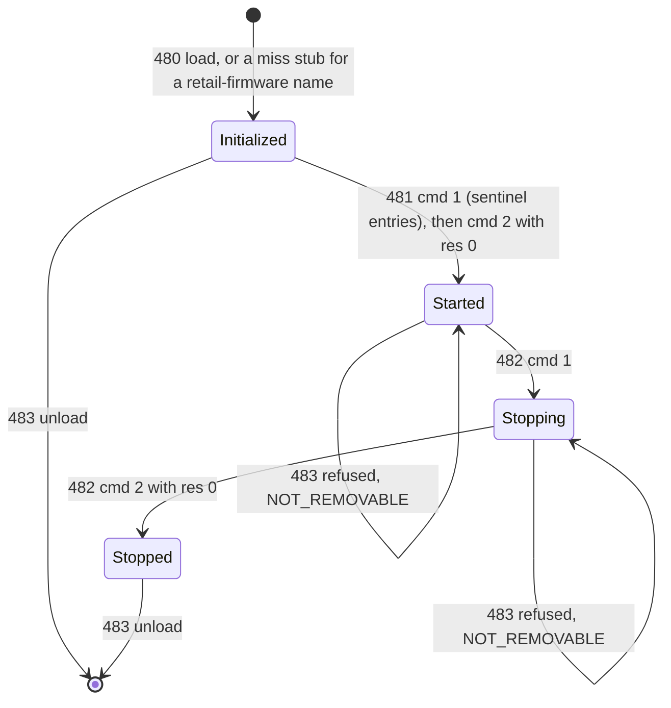
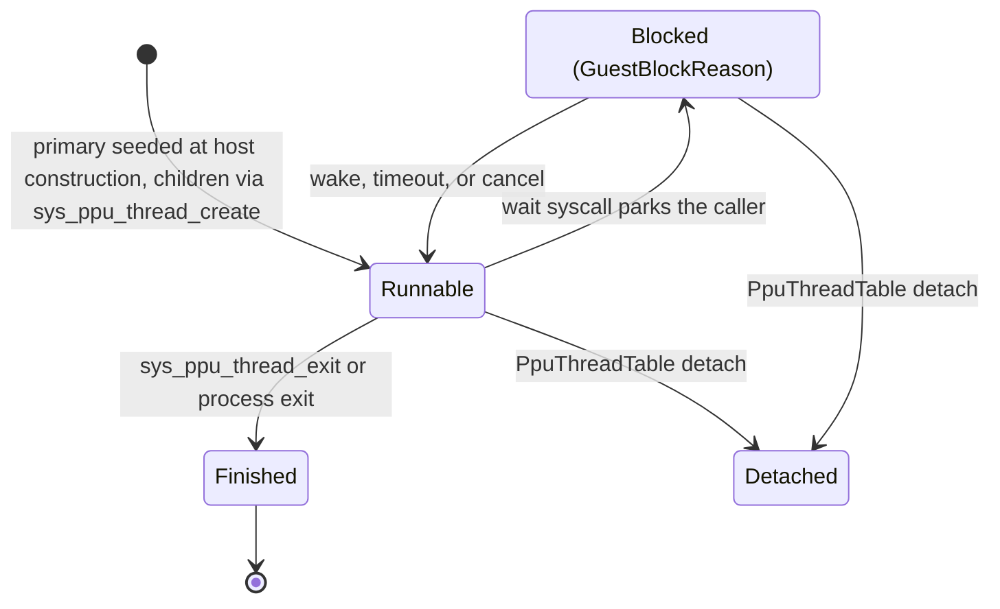
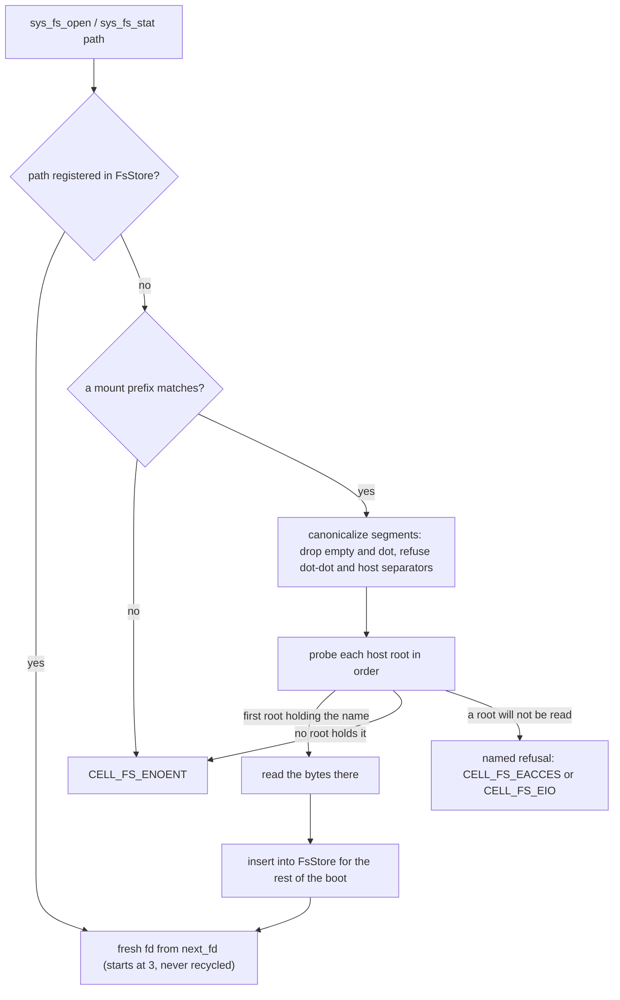

# LV2 host

`cellgov_lv2` owns the LV2 state machine. `cellgov_lv2` contains:

- the image registry
- the thread group table
- the PPU thread table
- the child-stack allocator
- syscall classification
- syscall dispatch

How a guest `sc` reaches an answer:


```mermaid
flowchart TD
  sc["guest sc"] --> lev{"LEV = 0?"}
  lev -->|no| hyp["Hypercall: CELL_EINVAL + invariant break"]
  lev -->|yes| timer{"141 / 142?"}
  timer -->|yes| fast["runtime timer fast path: TimerWakeQueue, no classify arm"]
  timer -->|no| classify["classify into Lv2Request"]
  classify -->|malformed| mal["Malformed: CELL_EINVAL + invariant break"]
  classify -->|typed variant| arm["dedicated arm in dispatch_route"]
  classify -->|routed Unsupported| routed["routed table: named errno or stub, invariant break"]
  classify -->|no arm| null["null backend: CELL_ENOSYS + dispatch.unsupported_stub"]
  arm --> disp{"Lv2Dispatch"}
  disp --> imm["immediate: r3 + effects (ImmediateRegisters adds r4..r7 writes)"]
  disp --> blk["Block: park with a PendingResponse"]
  disp --> wk["WakeAndReturn / BlockAndWake: wake waiters (synchronization.md)"]
```

## Host state

**The host's fields live in three buckets.**

- `Lv2State` -- the hashed guest-visible state. Every primitive
  table, allocator cursor, and dispatch-steering map folds into the
  runtime's `sync_state_hash` at each commit boundary as
  Multilinear-128 lanes.
- `Lv2Derived` -- guest-visible but unhashed. Each field's doc
  identifies where a divergence in it is caught instead (typically
  the hashed guest memory its effects settle into).
- `Lv2Observability` -- witness counters and diagnostic logs behind
  one `observability()` accessor. It is provably inert: wiping every
  instrument after each committed step yields byte-identical state
  traces (the `obs_null_sink` gate).

**Adding a field to `Lv2State` without a lane decision is a compile
error.**
*Why:* `Lv2State::sync_partial` opens with an exhaustive destructure
(no rest pattern).

**The dispatch tick is not host state.** The router snapshots it once
per dispatch and threads it to the arms that stamp effect timestamps.

## Argument width

**A u32-typed field in a register with high bits is refused.** A
u32-typed field arrives in a 64-bit argument register. The classifier
refuses a register that has high bits, so a typed variant never holds
a narrowed field.

`Unsupported` hands the raw registers past that gate. Every
`Unsupported` arm binds its own u32 fields under the same rule. A
violation returns CELL_EINVAL with a `dispatch.arg_high_bits` break,
before the arm's own argument tests run.

**An `int`-typed field takes the signed form of the same rule.** The
register must reproduce its own low word under sign extension. One
that does not returns CELL_EINVAL with a
`dispatch.arg_not_sign_extended` break.

Whether the kernel masks such a field or refuses it is unestablished
-- every observed caller passes a value that already fits in 32 bits.

## Archive rows and requests with no ordinal

**Every ordinal that reaches an arm has a row in the
[LV2 archive](../lv2/README.md).**

- `route.tsv` identifies the arm.
- `arm.tsv` records its fidelity.
- The curated `behavior.tsv` records what the modelled behaviour
  rests on and which test pins it.

What each arm does is its rustdoc under `crates/cellgov_lv2/src/host/`.

**The ordinal is the extracted fact; its name is attributed.** The
archive's `name.tsv` records the name CellGov's `lv2_syscalls!` macro
gives it beside what the other committed sources say.
`conflicts.tsv` keeps every disagreement.

**Three requests have no ordinal.**

- `Hypercall` -- an `sc` with LEV != 0, which PS3 usermode never
  issues. It returns CELL_EINVAL with an invariant break.
- `Malformed` -- a request whose fields the classifier could not
  bind. It returns CELL_EINVAL with an invariant break.
- `UnresolvedImport` -- fires when CRT0 calls through a GOT slot
  whose NID matched no firmware export. See below.

**An `UnresolvedImport` returns CELL_EINVAL.** The PRX loader patches
such slots to a guest-resident trampoline OPD. The trampoline loads
the NID into r4 and issues this pseudo-syscall. The dispatcher logs
`dispatch.unresolved_import` (NID and `module::name`) and returns
CELL_EINVAL.
*Why:* the next observable effect is a structured fault, not control
flow into junk PCs.

## Timer sleep path (141 / 142)

**`sys_timer_usleep` and `sys_timer_sleep` never reach
`Lv2Host::dispatch`;** the runtime handles them in its `lv2_dispatch` module.

- A zero interval yields with CELL_OK immediately.
- A non-zero interval parks the caller `Blocked` with a
  `TimerWakeQueue` entry at `now + interval`. The wake at the
  deadline delivers CELL_OK.

The seconds argument of 142 truncates to u32 at the ABI boundary.

**The queue is the deterministic `(deadline, seq)` structure** that
also expires timed sync-primitive waits with CELL_ETIMEDOUT. The
queue is:

- snapshot-captured
- state-hashed
- traced: its wakes trace as `UnitWoken` with the `Timer` reason

`SyscallEntered` contains the `TracedSyscallDisposition::TimerFastPath`
byte, which distinguishes these two syscalls from dispatched syscalls
in the trace.

**These two have no `classify` arm, because the path bypasses
classification.** `route.tsv` treats them as `runtime_fast_path`, not
as a coverage gap.

## PRX module state machine

The `_sys_prx_*` arms (480 to 497) form one module state machine:


```mermaid
stateDiagram-v2
  [*] --> Initialized : 480 load, or a miss stub for a retail-firmware name
  Initialized --> Started : 481 cmd 1 (sentinel entries), then cmd 2 with res 0
  Started --> Stopping : 482 cmd 1
  Stopping --> Stopped : 482 cmd 2 with res 0
  Stopping --> Stopping : 482 cmd 2 with res 1, CELL_PRX_ERROR_CAN_NOT_STOP
  Initialized --> [*] : 483 unload
  Stopped --> [*] : 483 unload
  Started --> Started : 483 refused, NOT_REMOVABLE
  Stopping --> Stopping : 483 refused, NOT_REMOVABLE
```

## PPU thread lifecycle

**`PpuThreadTable` in `cellgov_lv2::ppu_thread` tracks every
PS3-visible PPU thread.** These are the primary (seeded at host
construction) and each child spawned via `sys_ppu_thread_create`. An
entry contains:

- a guest-facing `PpuThreadId`
- the runtime `UnitId`
- the lifecycle state
- the creation attributes (entry OPD, arg, stack range, priority, TLS
  base)
- the exit value (set on `sys_ppu_thread_exit`)
- a join-waiters list

The state machine has three paths:

- `Runnable -> Blocked(GuestBlockReason) -> Runnable` (on wake)
- `Runnable -> Finished` (on exit)
- `Runnable | Blocked -> Detached` (via `PpuThreadTable::detach`)


```mermaid
stateDiagram-v2
  state "Blocked (GuestBlockReason)" as Blocked
  [*] --> Runnable : primary seeded at host construction, children via sys_ppu_thread_create
  Runnable --> Blocked : wait syscall parks the caller
  Blocked --> Runnable : wake, timeout, or cancel
  Runnable --> Finished : sys_ppu_thread_exit or process exit
  Runnable --> Detached : PpuThreadTable detach
  Blocked --> Detached : PpuThreadTable detach
  Finished --> [*]
```

**The scheduler sees only the opaque `UnitStatus::Blocked`.** The
guest-facing `GuestBlockReason` lives next to the thread table. Its
variants cover every LV2 primitive that parks a caller:

- `WaitingOnJoin`
- `WaitingOnLwMutex`
- `WaitingOnMutex`
- `WaitingOnSemaphore`
- `WaitingOnEventQueue`
- `WaitingOnEventFlag`
- `WaitingOnCond`

Each variant contains the primitive id (plus the mutex id for
`WaitingOnCond`). Diagnostics and fault backtraces read that context;
the scheduler never does.

### Child stacks

**Child stacks come from the 15 MB `child_stacks` region at
`0xD0100000+`** (see [guest_memory.md](guest_memory.md)) via
`ThreadStackAllocator`. `ThreadStackAllocator` is a deterministic bump
allocator: two fresh allocators produce byte-identical sequences.

**The arena is host-global; the backing memory is not.** A stack block
installs as a region in the CREATOR's address space. A thread spawned
by a child process therefore stacks inside that process, not the boot
map. The boot pipeline pre-installs the whole window, so boot-process
creates skip the install.

**A create refused after taking a block returns the block.** The
refusals that take a block are:

- no PPU factory is installed
- the thread-id space is exhausted
- a stack region will not install

*Why:* refusals cannot leak the window one allocation at a time.

**The arena rewinds only its most recent block.** Returning any other
block is refused with a named witness.
*Why:* accepting any other block would corrupt a live stack.

### TLS base

**A child's TLS base (r13) is the `tls` word of the guest's thread
parameter block, installed verbatim and unvalidated.**
*Why:* liblv2 reaches a thread's own id through an r13-relative slot,
so the guest owns that address.

### Mid-run unit registration

**Mid-run unit registration goes through the `PpuFactory` hook on
`Runtime`,** installed by the CLI boot path. The factory takes a
`PpuThreadInitState` and returns a `PpuExecutionUnit` with its
`PpuState` seeded per the PPC64 ABI. The init state contains:

- the resolved entry code address
- the TOC
- the arg
- the stack top
- the TLS base
- the LR sentinel

The hook mirrors the SPU factory pattern.
*Why:* `cellgov_core` stays independent of `cellgov_ppu`.

## Process privilege

**A few syscalls respond differently by the booting executable's
privilege.** The kernel lets a system process do things it refuses a
retail game. CellGov derives that privilege from the executable
itself, not a per-title switch.

The SELF header yields two independent facts:

- **Program authority id**, from the identification header. Its top
  28 bits identify a CoreOS SELF (the system shell and the other
  firmware executables). A raw ELF with no SELF wrapper falls back
  to the retail-application id `0x1010_0000_0100_0003`.
- **Capability flags**, from the plaintext capability supplemental
  header (`type == 1`), readable without decryption; its first word
  `ctrl_flag1` contains the root and debug masks.

Predicates over those two facts decide "may this process do X".
`_sys_prx_register_module` (484) consults them: only a CoreOS
process may hand the kernel its own import tables.

**The masks are mirrored as-is rather than reduced to disjoint bits.**
*Why:* the masks overlap and their bit semantics are unconfirmed even
in the reference implementation.

## Process model and spawn

**The LV2 host contains a process identity table, one entry per guest
process.** Each entry records:

- ppid
- authority id
- capability flags
- exit status

The boot process is pre-seeded under the pid LV2 assigns the first
user process (`cellgov_ps3_abi::lv2::process::BOOT_PROCESS_PID`).
Units bind to a pid after spawn; unbound units belong to the boot
process. Every entry field and every unit binding is a lane of the
host's partial of `sync_state_hash`.

### Spawn

`_sys_process_spawn` and `sys_process_spawns_a_self2` spawn a child in
three steps:

1. Decode the caller's marshalled argument block (pointer table, path
   and argv strings).
2. Resolve the child image through the LV2 content store.
3. Hand the image to a host-injected `ProcessSpawnLoader` that
   installs it into a fresh child address space.

The decode uses bounded walks, which refuse loudly on an unterminated
table.

A wrapped child image is handled according to its wrapper type:

- **SCE-wrapped** (the system shell spawns SELFs, not raw ELFs): the
  image is unwrapped through the APP-keyed decrypt before the ELF
  parse.
- **NPDRM-wrapped**: the image is identified as such from its
  plaintext NPD header and refused.
  *Why:* klicensee resolution belongs to the title-install layer, not
  the spawn path.

**Every failure arm unwinds the whole spawn,** and the syscall fails
with its honest errno. The unwind covers:

- the space
- reservations
- unit tags
- the pid

### Child firmware and module init

**The loader also gives the child its firmware.** The loader:

- parses the child's import table
- selects and loads the import closure into the child space, through
  the same selection, relocation and GOT-patch pipeline the boot uses
  ([boot.md](boot.md))
- falls back to unresolved-import trampolines when nothing loads
- pre-initializes TLS and the kernel-context OPD there

**Each child contains its own relocated copies of its modules.** A
shared mapping stays the only channel through which two spaces see
the same bytes ([guest_memory.md](guest_memory.md)).

**A loader that stages this init pass returns an init token.** The
runtime then parks the child's primary unit `Blocked` behind a
`PendingChildInit`. The host drains it after the committed step, and
runs every module's `module_start` in the child's space:

- on transient units aliased to the child's primary PPU thread and
  bound to its pid
- with every other runnable unit held `Blocked` for the duration

A faulting child `module_start` is skipped with a witness. A stalled
or over-budget one is fatal, as it is for the boot.

**The child's modules are not entered in the process-shared PRX
registry.** Each spawn that loaded real modules logs
`process.child_prx_registry_shared` naming the pid, space and module
count.

### Child entry and exit

**The child's primary thread enters through a PPU factory unit with
its own stack inside the child space.** Its LR sentinel points at an
8-byte exit stub (`li r11, 22; sc`) that runs if the entry point
returns instead of calling `sys_process_exit`.

**The stub sits above the loaded image, at the highest PT_LOAD end
rather than a fixed address.**
*Why:* no segment can land on it, and address 0 stays reserved as
null. A stub at 0 would turn a guest branch through a null function
pointer into a clean exit instead of a fault.

`sys_process_exit` from a child:

- finishes only that process's units
- records the exit status for `sys_process_get_status` polls
- leaves the boot process untouched

**getpid and getppid return values from the caller's table entry,**
so a child sees its own identity. The SDK-version query returns the
boot title's version for every process.

## Null backend for unmodeled syscalls

**Any syscall not refused by the firmware census and without a
typed-variant arm dispatches to the null backend.** The **null
backend** is an ABI-honest per-syscall "not implemented" response,
traced as a first-class event.

- The default arm returns `CELL_ENOSYS` and emits a
  `dispatch.unsupported_stub` invariant-break record naming the
  syscall number.
- Arms whose LV2 contract names a different refusal return that errno
  instead (e.g. `sys_rsx_context_attribute`'s unknown-package fallback
  returns `CELL_EINVAL`).

**The runtime never returns a blanket `CELL_OK` for a path it did not
execute.**
*Why:* an unmodeled syscall cannot contaminate downstream guest state
with a fabricated result the guest consumes as truth.

**The null backend enforces a routing-layer claim.** Every guest
syscall reaches either a dedicated arm or the honest traced "not
implemented" response, never a default arm's blanket success.

How much real LV2 behavior each *dedicated* arm reproduces is a
separate per-arm property. The levels are:

- fully modeled
- simplified kernel-visible state
- plausible values with no backing state

**That per-arm map is code in `cellgov_lv2::request::fidelity`,**
rendered to `arm.tsv` in the [LV2 archive](../lv2/README.md) under a
drift-checked test. The map has two halves:

- The typed half is an exhaustive match a new arm cannot skip.
- The routed-`Unsupported` half is a const table whose membership a
  dispatch probe gates.

**The traced records feed cross-runner analysis.** An
unmodeled-syscall diagnostic on a title's boot path identifies a
specific gap, either:

- a **divergent honest gap** (RPCS3 delivers a real result where
  CellGov ENOSYS-es; an implementation target), or
- a **convergent honest gap** (CellGov's not-implemented response
  already agrees with RPCS3, because RPCS3 diverges from hardware the
  same way; a coincidence of two gaps, not a target, and the
  diagnostic can downgrade once a classifier emerges).

The convergence sections of [concepts/](../concepts/README.md)
define that honest / convergent / divergent vocabulary; the
cross-runner matrix in [titles.md](../titles.md) shares it.

## In-memory filesystem

**The read-side `sys_fs_*` surface routes through an in-memory blob
store** at `Lv2Host::fs_store` (`cellgov_lv2::fs_store::FsStore`),
backed by three lane maps:

- a path-keyed blob table (`String -> Vec<u8>` plus a pre-computed
  content digest);
- a per-fd open-file table (`u32 -> { path, offset }`);
- a per-fd open-directory table (`u32 -> { entries, cursor }`).

The firmware cellFs surface routes through the raw `sys_fs_*` LV2
syscall path, backed by the same `FsStore` model.

### File descriptors and hashing

**Fds come from a monotonic `next_fd` counter starting at `3`.** The
start matches the first fd PS3's LV2 returns, so the
kernel-returned fd fits the `[3, 255)` range the inline `cellFsRead`
wrapper truncates on.

**Fds are never recycled within a boot.**
*Why:* a stale fd cannot alias a fresh one.

**The sync-state hash covers the store's state:**

- the content digests
- fd offsets
- directory cursors
- the next-fd counter

A content swap, an unintended re-allocation, or a bogus extra read
therefore shows up as a state-hash divergence in post-step
assertions.

**Blob registration is single-write.** A second `register_blob` at
the same path is rejected with `FsError::PathAlreadyRegistered`.
*Why:* content cannot mutate under an open fd.

### Mount resolution

**Path resolution beyond the manifest goes through `FsMountTable`.**
The table holds per-title mounts (typically `/app_home`, populated
from the title manifest at boot; no default mount is
auto-registered). Each mount has a guest-path prefix and an ordered
list of host roots.

**Read-only enforcement is global in the dispatch layer, not a
per-mount flag.** Host-side permissions play no part:

- an open of an existing path that requests write access, create,
  truncate or append returns `CELL_EROFS`;
- a write to any fd returns `CELL_EBADF`, since no fd is writable;
- mkdir and unlink take the null backend.

`dispatch_fs_open` / `dispatch_fs_stat` look up a path in two steps:

1. Probe the manifest blob set first.
2. On a miss, call `try_mount_resolve_and_cache`.

`try_mount_resolve_and_cache` resolves the guest path against each
root in turn, reads the bytes on demand, and inserts them into
`FsStore` for the rest of the boot.

**`resolve_candidates` is pure path arithmetic.** It yields one host
path per root and probes nothing, so the candidate list is a function
of the guest path and the root list alone. It canonicalizes path
segments:

- it drops empty / `.` segments
- it refuses `..`
- it refuses any segment containing a host separator or drive marker

*Why:* titles cannot escape their roots, and resolution does not vary
with the host operating system.

**Root order is shadowing order.** The earliest root holding a name
decides both the hit and its type.
*Why:* an update tree can sit over a base tree without the two being
merged on disk.

The lookup treats each root in order:

- A root that does not hold the name is skipped.
- A root the host declines to read stops the lookup with a named
  refusal rather than falling through to the next.

*Why:* falling through would return bytes the mount order does not
identify.

**Directory iteration (`sys_fs_opendir` / `_readdir` / `_closedir`)
snapshots at opendir time.** The snapshot merges every root that holds
the directory into one listing in lexicographic byte order, with a
repeated name taken from the earliest root. Later reads are
deterministic across host file system order.


```mermaid
flowchart TD
  open["sys_fs_open / sys_fs_stat path"] --> blob{"path registered in FsStore?"}
  blob -->|yes| fd["fresh fd from next_fd (starts at 3, never recycled)"]
  blob -->|no| mount{"a mount prefix matches?"}
  mount -->|no| enoent["CELL_FS_ENOENT"]
  mount -->|yes| canon["canonicalize segments: drop empty and dot, refuse dot-dot and host separators"]
  canon --> probe["probe each host root in order"]
  probe -->|first root holding the name| host["read the bytes there"]
  host --> cache["insert into FsStore for the rest of the boot"] --> fd
  probe -->|no root holds it| enoent
  probe -->|a root will not be read| refuse["named refusal: CELL_FS_EACCES or CELL_FS_EIO"]
```

### Per-title content

Per-title content lands in the store at boot via the manifest
schema in `title_manifests/<content-id>.toml`:

```toml
[content]
override_base_env = "CELLGOV_<ID>_CONTENT_DIR"
files = [
    { guest_path = "/app_home/Data/Resources/first.xml", host_path = "Data/Resources/first.xml" },
    ...
]
```

The boot-time content provider in
`apps/cellgov_cli/src/game/content.rs` resolves each entry
against the first of two base sets that is present:

1. `override_base_env`'s value, when the env var is set to a
   non-empty path: one directory.
2. The composition's EBOOT directories, in the order the executable
   was probed for.

**Override base.** Any missing file is a hard failure, with a
diagnostic naming the env var.
*Why:* the developer who set the override knows which knob to fix.

**EBOOT directories.** A selected update's USRDIR comes ahead of the
base's -- the same shadowing the composed game mount applies. The
first directory that holds the file supplies it. A file under none of
them hard-fails naming the first path and the others found absent. An
explicit executable the composition did not name keeps its own
directory alone.

**Neither set being present is a startup error too.** This happens
when the env var is unset and the boot names no EBOOT directory. The
manifest declares no base of its own.

A `[[fs.mounts]]` entry follows the same rule. Its roots come from the
first of:

- its `override_env`
- else its declared `host`
- else every one of the composition's EBOOT directories, as an
  ordered root of the mount
