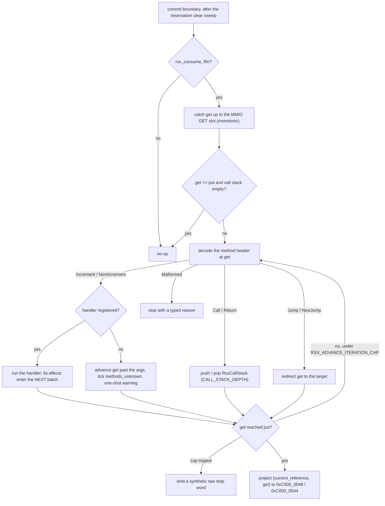
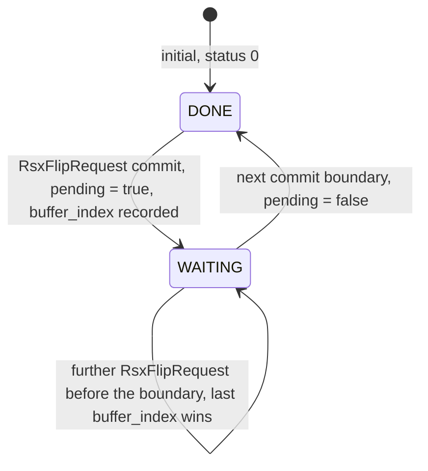

# RSX

## RSX CPU-side completion

CellGov models the CPU-visible completion values a PS3 guest
polls -- label bytes, flip-status transitions, and GPU
semaphore / report posts -- as a deterministic state machine
that method parsing advances at commit boundaries. The model
lives in the commit pipeline's committed state beside the
reservation table and folds into `sync_state_hash`.

**FIFO cursor.** `RsxFifoCursor` holds three scalar fields:
`put`, set only by guest writes to the control register at
`0xC0000040`; `get`, advanced only by the method-advance pass;
and `current_reference`, the last `NV406E_SET_REFERENCE` value,
readable through `cellGcmGetCurrentReference`. Invariant:
`get <= put` modulo the FIFO size.

**NV method decoder.** The decoder parses the 32-bit Fermi /
NV4097 method header (Increment, NonIncrement, Call, Return,
Jump, NewJump, plus a Malformed sentinel), then walks the
argument list from the FIFO. Registered handlers:
`NV406E_SEMAPHORE_OFFSET`, `NV406E_SEMAPHORE_RELEASE`,
`NV406E_SET_REFERENCE`, `NV4097_GET_REPORT`,
`GCM_FLIP_COMMAND` (Sony extension 0xFEAC),
`NV4097_SET_SEMAPHORE_OFFSET`,
`NV4097_BACK_END_WRITE_SEMAPHORE_RELEASE`. An unknown method
takes the fallback: advance `get` past its declared argument
count, tick `methods_unknown`, emit a one-shot warning. Call /
Return push and pop frames on an `RsxCallStack` bounded to
CALL_STACK_DEPTH frames; Jump / NewJump redirect `get` to the
target address. A malformed header (out-of-range read, address
overflow, wrapped cursor) stops the advance with a typed stop
reason instead of desynchronizing. A self-jump terminator,
`RSX_ADVANCE_ITERATION_CAP` (1_000_000), bounds runaway FIFOs;
on trip the pass emits a synthetic raw stop word
(`CALL_STACK_OVERFLOW_RAW`, `RSX_ADVANCE_UNDERFLOW_RAW`, or
`RSX_ADVANCE_ITERATION_CAP_RAW`).

**Method-advance pass.** The `rsx_consume_fifo` runtime flag
(per-title opt-in via the manifest `[rsx] consume = true`) gates
the pass. When enabled it runs at every commit boundary after the
reservation clear-sweep:

1. Catch GET up to the MMIO control-register GET slot
   (monotonic; never pulls the cursor backward).
2. Drain from `get` to `put`, decoding headers and invoking
   handlers in address order.
3. On clean reach of PUT, project `(current_reference, get)`
   back to MMIO at `0xC000_0048` / `0xC000_0044` so libgcm's
   `cellGcmGetCurrentReference` poll clears.

The pass is a no-op when `get == put` and the call stack is
empty. Handler effects (`RsxLabelWrite`, `RsxFlipRequest`) enter
the NEXT commit batch, a one-batch delay that preserves
atomic-batch semantics. FIFO memory is frozen at batch start, so
the pass cannot read writes committed in the same batch.

**Effect variants.** `RsxLabelWrite { offset, value }` wraps a
32-bit big-endian write to the RSX label area through the
standard `SharedWriteIntent` path, so the reservation clear
sweep and the state-hash contribution run automatically. It
stays a typed variant so traces can tell FIFO-origin label
writes from PPU / SPU / DMA writes. The commit resolves `offset`
against the label base the LV2 RSX context supplies, and the
guard that keeps a write inside the label area measures from
the same base. A report offset resolves against the report
block base, so report entry 0 and semaphore slot 0 sit at
distinct addresses. `RsxFlipRequest { buffer_index }` has no
memory side-effect; it drives only the flip state machine.

**Flip-status state machine.** `RsxFlipState` carries three
fields: `status` (0 = DONE, 1 = WAITING), `handler` (the
callback address `cellGcmSetFlipHandler` registers; recorded,
not dispatched), and `pending`. Status starts DONE. An
`RsxFlipRequest` commit moves it to WAITING with
`pending = true`; the next commit boundary moves it back to DONE
with `pending = false`. Any PPU step between the two boundaries
observes WAITING. Multiple `RsxFlipRequest`s before the next
DONE transition collapse: last writer wins on `buffer_index`,
and one WAITING-to-DONE transition follows.

**State-hash contribution.** The RSX committed state folds three
sub-hashes into `sync_state_hash` at every commit boundary:
`RsxFifoCursor::state_hash` (put / get / current_reference),
`RsxFlipState::state_hash` (status / handler / pending /
buffer_index), and the transient `sem_offset` as a u64, which
carries the offset from an `NV406E_SEMAPHORE_OFFSET` parse to
its paired `NV406E_SEMAPHORE_RELEASE`. Each `state_hash` carries
its own `STATE_HASH_FORMAT_VERSION` byte.

**Scope boundary.** The model does not do:

- RSX rasterisation (no pixel is produced);
- vertex or fragment shader execution;
- texture, render-target, or surface modelling;
- per-method latency distribution;
- vblank cadence;
- flip-handler callback dispatch (the address is recorded; PPU
  dispatch into it is deferred);
- performance-monitor method coverage.

The only fidelity claim is "the value the CPU polls is the
deterministic CPU-visible completion value CellGov defines for
the equivalent commit-boundary model."

Two independent manifest flags gate participation.
`[rsx] mirror = true` maps the region ReadWrite and enables the
flip-status / cursor MMIO mirror; without it the region stays
`ReservedZeroReadable` (see [Guest memory
layout](guest_memory.md#region-access-modes)) and put-pointer
writes fault as `FirstRsxWrite`. `[rsx] consume = true` (requires
`mirror`) also enables the FIFO consumer: the GET catch-up,
method-advance drain, and `(current_reference, get)` MMIO
writeback described above. Each title's manifest records which
flags it sets.

## LV2 sys_rsx syscall surface

`cellgov_lv2::host::rsx` models the kernel-side surface PS3 LV2
exposes under syscall numbers 668, 669, 670, 671, 672, 674, and
675; 677 exists as a routed stub. The surface is one allocated
RSX context, a bump-allocated memory region, and the structures
the guest poll paths read:

- `RsxReports` (37 KB: semaphore array, notify array, report
  array);
- `RsxDriverInfo` (0x12F8 bytes; handler-queue id at offset
  0x12D0);
- `RsxDmaControl` (put / get / reference fields at offsets
  0x40 / 0x44 / 0x48 from the MMIO base
  `control_register::DMA_CONTROL_BASE = 0xC000_0000`).

The iomap region `[PS3_RSX_IOMAP_BASE, +PS3_RSX_IOMAP_SIZE)`
(85 MiB from `0x4000_0000`) is composed at boot as ReadWrite
(see [Guest memory layout](guest_memory.md)) so the IO offsets
`sys_rsx_context_iomap` records back the title's later writes.
The init-time fill zeroes the whole region, then stamps every
notify and report entry's timestamp field with `u64::MAX` and each
report entry's trailing word with `u32::MAX`. What hardware leaves
in the semaphore block is undocumented, so it keeps the zero fill.

| Syscall | Request                  | Behaviour                                                                                                                                                                                                                                                                                                                                                                                                                             |
| ------- | ------------------------ | ------------------------------------------------------------------------------------------------------------------------------------------------------------------------------------------------------------------------------------------------------------------------------------------------------------------------------------------------------------------------------------------------------------------------------------- |
| 668     | `SysRsxMemoryAllocate`   | Bump-allocates the requested `size` (not a fixed amount) from `SYS_RSX_MEM_BASE = 0x3000_0000`, mints a monotonic handle, and writes out-params `mem_handle` (u32) and `mem_addr` (u64). CELL_ENOMEM on `size == 0`, wrap, or past `SYS_RSX_MEM_END`. The 3 MB figure is `region::CONTEXT_RESERVATION`, which belongs to 670.                                                                                                         |
| 669     | `SysRsxMemoryFree`       | Noop-safe (returns CELL_OK); bump allocator does not free.                                                                                                                                                                                                                                                                                                                                                                            |
| 670     | `SysRsxContextAllocate`  | Emits reports / driver-info / dma_control init plus the event queue. lpar_dma_control_ptr OUT receives `0xC000_0000` (libgcm derives the put-pointer at `+0x40`). A console capture reaches the same block one megabyte above the device base instead, at `0x4010_0000`; the field offsets inside it agree, only the window base does not.                                                                                                                                                                                                                                                                     |
| 671     | `SysRsxContextFree`      | Noop-safe (returns CELL_OK); single-context model.                                                                                                                                                                                                                                                                                                                                                                                    |
| 672     | `SysRsxContextIomap`     | Records the IO->EA mapping on the live context. Validates the context_id, 1 MiB alignment, `ea+size` below `PS3_RSX_BASE`, and `io+size` within the baked iomap region using u64 arithmetic.                                                                                                                                                                                                            |
| 674     | `SysRsxContextAttribute` | Sub-command dispatch: FIFO_SETUP, FLIP_MODE, FLIP_BUFFER, SET_DISPLAY_BUFFER, and three CellGov-internal handler-register packages (SET_FLIP_HANDLER 0x8000_0108, SET_VBLANK_HANDLER 0x8000_010C, SET_USER_HANDLER 0x8000_010D). FIFO_SETUP records the initial get / put pointers on the context and writes them through to the MMIO control register when the target words are writable, which normally means the RSX mirror is on. |
| 675     | `SysRsxDeviceMap`        | Idempotent: every `dev_id == 8` call returns `sys_rsx::device_map::ADDR` (`0x4000_0000`) in the OUT slot with CELL_OK. Other dev_ids return CELL_EINVAL; a null OUT pointer returns CELL_EFAULT, the LV2 answer for a write through a null guest pointer that this surface applies uniformly; both error paths record an invariant break.                                                                                                                                         |
| 677     | (routed `Unsupported`)   | `sys_rsx_attribute`: CELL_OK, no state change, plus an invariant break. Dispatches through the routed-`Unsupported` table in [LV2 host](lv2_host.md), not a typed sys_rsx request.                                                                                                                                                                                                                                                    |

**MMIO sentinel checkpoint.** Titles whose harness expects the
[`FirstRsxWrite`](../concepts/README.md#checkpoints-where-an-observation-stops)
checkpoint hit the pre-sys_rsx MMIO sentinel at `0xC0000040`;
firmware cellGcmSys.prx's `_cellGcmInitBody` runs through the
`sys_rsx` surface above.

**Single-context constraint.** At most one
`SysRsxContextAllocate` is live at a time, as on PS3 LV2; a
second allocation while a context is live returns
`CELL_EINVAL`.

**State-hash contribution.** The `RsxContext` committed state
folds its scalar fields (allocation addresses, counters,
display-buffer table, flip mode, handler OPDs) into
`sync_state_hash` at every commit boundary. Pristine state (no
`SysRsxContextAllocate`) and populated post-allocate state
have distinct golden hashes, so a cross-runner regression
surfaces at once as a hash divergence.

**Scope boundary.** sys_rsx does not do:

- RSX-side execution (the DMA-control and driver-info structs
  describe the surface; they drive nothing);
- flip-handler callback dispatch (`SysRsxContextAttribute`
  records the OPD; PPU dispatch into it is deferred);
- vblank cadence tied to sys_rsx (vblank callback registration
  is recorded, not scheduled);
- DMA-control-driven command playback (the real kernel DMAs FIFO
  commands to the RSX over a hardware channel CellGov does not
  model);
- multi-display or secondary-head configuration.

The fidelity claim is "the bytes the CPU reads from the
reports / driver-info / DMA-control regions at the points a
guest polls them match the bytes the real PS3 LV2 places there
for an equivalent single-context configuration."
