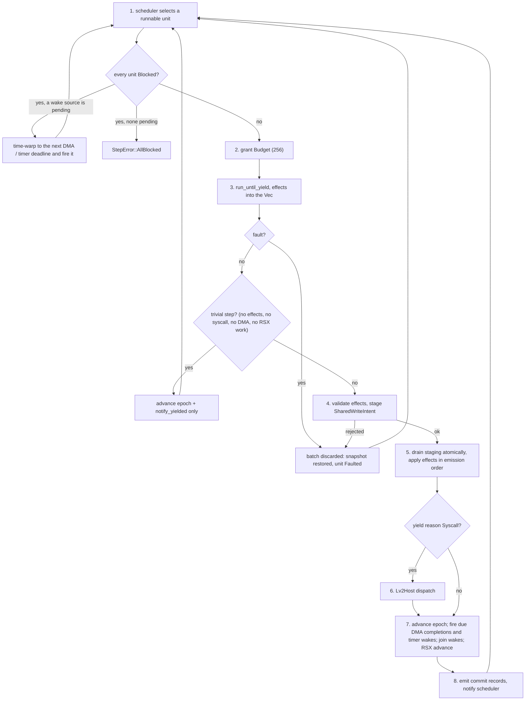

# Runtime pipeline

## Per-step pipeline

`Runtime::step` and `Runtime::commit_step` together implement a
nine-step deterministic loop:

1. Select a runnable unit via the configured `Scheduler`. The
   default `RoundRobinScheduler` walks the registry in id order
   from after the last selection, skipping units whose effective
   status is `Blocked` / `Faulted` / `Finished`.
   - Two stickiness exceptions match real-PS3 time slicing: the
     previous unit is reselected if (a) it holds at least one
     lwmutex (critical section in flight) or (b) its last yield
     was a non-blocking syscall that woke no other unit.
     Wake-causing syscalls (`sema_post`, `event_flag_set`, etc.)
     rotate normally so the woken unit runs.
   - A sticky-streak counter caps the seat: after 64 consecutive
     sticky yields the scheduler rotates regardless of either
     trigger, so a thread holding an lwmutex while issuing only
     non-waking syscalls cannot starve peers indefinitely. The
     64-step ceiling is 8x the empirical minimum, the longest
     ps3autotests printf critical section.
   - A single-runnable fast path keeps single-PPU titles off the
     two-pass rotation.
   - When the registry is non-empty but every unit is `Blocked`,
     `Runtime::step` time-warps guest time to the earliest pending
     wake source (next DMA completion or timer-wake deadline),
     fires it, and retries selection, looping while a wake source
     remains; a fired deadline can wake nobody, e.g. a contended
     cond expiry that re-parks its waiter on the mutex. Only when
     both queues are empty does it return `StepError::AllBlocked`
     rather than `NoRunnableUnit`, so callers can tell liveness
     from terminal stall.
2. Grant the unit the per-step `Budget` (default 256 instructions).
3. Run the unit until it yields (one `ExecutionUnit::run_until_yield`).
   The PPU executes up to Budget instructions per call, batching
   across basic-block boundaries; an intra-block store-forwarding
   buffer gives write-then-read coherence within the batch. Effects
   collect in a caller-owned `&mut Vec<Effect>`, not on the result
   struct.
4. Validate every effect against the registry and memory in one
   pass, staging `SharedWriteIntent` payloads into a
   `StagingMemory` buffer. A validation failure clears the staging
   buffer and rejects the whole batch.
5. Drain the staging buffer to guest memory atomically, then apply
   the remaining per-effect updates (mailboxes, signals, DMA
   enqueue, reservations, wakes, block transitions, RSX flip
   requests) in emission order.
6. Dispatch the unit's syscall through `Lv2Host` if the yield reason
   was `Syscall`; absorb a callback-worker mid-body fault if the
   source is a registered worker.
7. Advance the commit epoch, then fire due DMA completions (ready
   tick reached) and due timer wakes (guest-tick deadline reached;
   a parked sleep wakes with CELL_OK, a timed sync wait expires
   with CELL_ETIMEDOUT through `Lv2Host::expire_wait`); resolve
   join wakes if the unit finished; run the RSX FIFO advance pass,
   whose emitted effects queue for the next batch under the
   atomic-batch contract. DMA completions publish per-tag
   completion bits to the issuing SPU's tag-status channel at fire
   time, not at enqueue. An SPU yielding `DmaWait` is parked
   `Blocked` before completions fire, so a same-commit
   completion's `Runnable` override overwrites the fresh `Blocked`
   and the wake fires in the same batch.
8. Emit the batch's commit trace records and notify the scheduler
   of the yield with whether other units woke and whether the
   source still holds an lwmutex.

The loop with its fault and fast-path exits:

Guest time advances in step 3 (`Runtime::step`) by the unit's
consumed budget; `commit_step` only advances the epoch.

Steps 4-5 are atomic. A fault (`YieldReason::Fault` at step 4
entry, or a validation rejection mid-step 4) discards the whole
batch: the unit faults and the rest of the system sees nothing it
tried to do. On a mid-batch fault (some instructions retired)
through any of the four fault exits -- execute-verdict fault,
memory fault, decode failure, PC past the mapped image -- the PPU:

- restores the full architectural-state snapshot, reservation
  included, taken at step entry after the runtime's committed
  inputs (syscall return, register writes) were applied;
- clears the store buffer and the staged effects;
- rewinds the per-step trace so discarded retirements never reach
  the hash or zoom streams;
- reports the fault with zero consumed cost.

Pre-fault instructions are discarded, never re-executed; the
diagnostic still names the faulting PC and captures fault-site
registers before the rollback.

A `DmaEnqueue` whose destination fails `validate_write` at step 4
(reserved or out-of-range) also marks the issuing unit `Faulted`
before returning the `CommitError`, so the SPU cannot roll forward
into a tag-poll that never wakes: the unit terminates on the
rejecting step and the host-visible `CommitError` carries the
addr/region.

**Trivial-step fast path (FaultDriven only).** `Runtime::commit_step`
skips steps 4-8 and only advances the epoch (plus the scheduler
`notify_yielded` call) when:

- the effects vec is empty,
- `fault` is `None`,
- `yield_reason` is neither `Syscall` nor `Finished`,
- the DMA queue is empty, and
- no RSX work is pending.

`RuntimeMode::FaultDriven` suppresses the trace records of steps
1-8 anyway, so the observable contract is identical: every
atomic-batch boundary still advances the epoch, and an empty
commit leaves scheduler-visible state (`status_overrides`, pending
receives / syscall returns / reg writes) unchanged. The fast path
cuts per-step commit cost for the PPU-bound hot loops that
dominate real game boots; async state (pending DMA, pending wakes)
takes the slow path on the step that originates or observes it.

## Effects and trace records

The full vocabulary of guest-visible operations:

- **Effect variants** in `cellgov_effects::Effect`:
  `SharedWriteIntent`, `MailboxSend`, `MailboxReceiveAttempt`,
  `DmaEnqueue`, `WaitOnEvent`, `WakeUnit`, `SignalUpdate`,
  `FaultRaised`, `TraceMarker`, `ReservationAcquire`,
  `ConditionalStore`, `RsxLabelWrite`, `RsxFlipRequest`.
- **Trace record variants** in `cellgov_trace::TraceRecord`:
  - one header, `RunIdentity`, written first and never repeated:
    the format version plus a fingerprint of each half of the
    identity triple the run was composed from and one of the boot
    overrides it applied, so a comparison across two
    differently-composed runs is visible from the stream alone. It
    is the one record the level filter does not
    gate, and the writer refuses it anywhere but the front of an
    empty stream -- a header a reader would not find is worse than
    none, because absence reads as a run that made no claim;
  - decision-level: `UnitScheduled`, `StepCompleted`,
    `CommitApplied`, `StateHashCheckpoint`, `EffectEmitted`,
    `UnitBlocked`, `UnitWoken`;
  - two per-step variants for the divergence trace:
    `PpuStateHash`, `PpuStateFull`;
  - one diagnostic side-channel for host-side invariant breaks:
    `HostInvariantBreak`;
  - `SyscallEntered`, emitted before `Lv2Host::dispatch` runs, and
    its counterpart `SyscallReturned` (caller, `r3` value, guest
    time), emitted when the value is stored for the caller -- same
    commit for an immediate return, wake time for a blocked call
    -- so a wrong errno is readable from the stream without a
    re-run;
  - one locator for reads of the reserved-zero RSX / SPU ranges,
    `ReservedRegionRead` (unit, step, address, length, hits),
    drained after every step and commit so the replay comparison
    can find a zero the guest saw from a provisional region;
  - `HostWrite` (mechanism, space, address, length, reservations
    cleared), one per write the runtime itself lands in guest
    memory. Those writes carry no `UnitId`, so the mechanism
    stands in that slot.

`RuntimeMode` gates trace emission: `FaultDriven` boot pays no
trace overhead, `DeterminismCheck` pays state-hash overhead at
commit boundaries, and `FullTrace` pays both.

The per-call `ExecutionContext::trace_per_step` flag gates the two
per-step variants; `RuntimeMode::FullTrace` and
`RuntimeMode::DeterminismCheck` set it, `FaultDriven` does not.
When set, the unit emits one `PpuStateHash` (25 bytes: step + pc +
64-bit FNV-1a fingerprint of GPR + LR + CTR + XER + CR +
reservation) per retired instruction. The fingerprint input set is
one field list, `cellgov_exec::PpuFingerprint`, shared by the
hash, the `PpuStateFull` snapshot, and the zoom diff walker, so a
hash divergence always names a field in the zoom diff. After each
`run_until_yield` the runtime drains the records via
`ExecutionUnit::drain_retired_state_hashes` into the main trace
stream with monotonic per-instruction step indices independent of
`steps_taken`. PC attribution holds at any `Budget` size: a yield
retiring N instructions emits N records, one per PC.

`set_full_state_window(Some((lo, hi)))` enables a bounded-window
second stream of `PpuStateFull` records (310 bytes each, the same
fingerprint input set uncompressed), routed to a separate
`zoom_trace` sink so the main per-step stream stays homogeneous.
The off branch costs one predicted-away test in the hot loop.

Both per-step instruments cover only the fingerprint input set.
Outside it: FPR (256 bytes), VMX (512 bytes), FPSCR (unmodeled),
and the scalar TB and VRSAVE SPRs, whose divergences
surface only once an `mftb` / `mfvrsave` lands the value in a GPR.
`PpuStateFull`'s name predates the distinction. So every per-step
localization result carries a scoping qualifier: the step
`diverge` reports is the first **scalar-visible** divergence, not
necessarily the first divergence. Byte-identical reruns are
unaffected, and memory comparison still catches vector
nondeterminism once it propagates to a store, but for vector-heavy
code the localized step can sit arbitrarily far downstream of the
true one. Widening the covered set requires the digest to become
incrementally maintained state to stay affordable.
