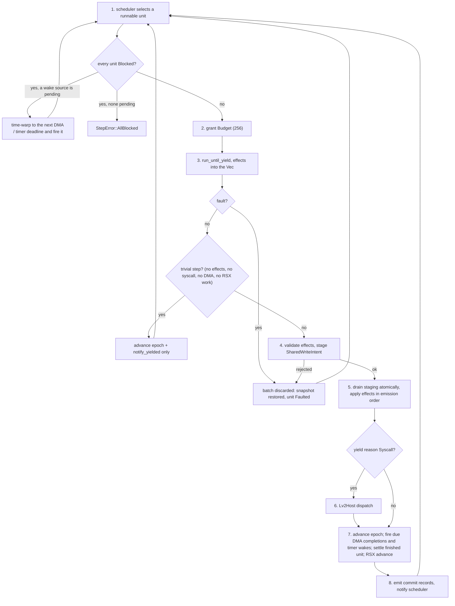

# Runtime pipeline

The runtime drives every execution unit through one per-step commit
loop. Each step the unit emits effects; the runtime commits them and
records trace records. Steps 4-5 of the loop are atomic: a fault
discards the whole batch, and the rest of the system sees nothing the
unit tried to do.

## Per-step pipeline

`Runtime::step` and `Runtime::commit_step` together implement a
eight-step deterministic loop:

1. Select a runnable unit via the configured `Scheduler`. See
   [Unit selection](#unit-selection).
2. Grant the unit the per-step `Budget` (default 256 instructions).
3. Run the unit until it yields (one `ExecutionUnit::run_until_yield`).
   See [Running a unit](#running-a-unit).
4. Validate every effect against the registry and memory in one
   pass, staging `SharedWriteIntent` payloads into a
   `StagingMemory` buffer. A validation failure clears the staging
   buffer and rejects the whole batch.
5. Drain the staging buffer to guest memory atomically, then apply
   the remaining per-effect updates (mailboxes, signals, DMA
   enqueue, reservations, wakes, block transitions, RSX flip
   requests) in emission order.
6. Dispatch the unit's syscall through `Lv2Host` if the yield reason
   was `Syscall`.
7. Advance the commit epoch, then fire due DMA completions and timer
   wakes, settle a finished unit, and run the RSX FIFO advance pass.
   See [DMA and timer wakes](#dma-and-timer-wakes) through
   [Channel-stall wakes](#channel-stall-wakes).
8. Emit the batch's commit trace records and notify the scheduler
   of the yield with whether other units woke and whether the
   source still holds an lwmutex.

The loop with its fault and fast-path exits:

```mermaid
flowchart TD
  sel["1. scheduler selects a runnable unit"] --> allb{"every unit Blocked?"}
  allb -->|"yes, a wake source is pending"| warp["time-warp to the next DMA / timer deadline and fire it"] --> sel
  allb -->|"yes, none pending"| stall["StepError::AllBlocked"]
  allb -->|no| budget["2. grant Budget (256)"] --> run["3. run_until_yield, effects into the Vec"]
  run --> fault{"fault?"}
  fault -->|yes| discard["batch discarded: snapshot restored, unit Faulted"] --> sel
  fault -->|no| triv{"trivial step? (no effects, no syscall, no DMA, no RSX work)"}
  triv -->|yes| fast["advance epoch + notify_yielded only"] --> sel
  triv -->|no| val["4. validate effects, stage SharedWriteIntent"]
  val -->|rejected| discard
  val -->|ok| drain["5. drain staging atomically, apply effects in emission order"]
  drain --> sc{"yield reason Syscall?"}
  sc -->|yes| lv2["6. Lv2Host dispatch"] --> epoch
  sc -->|no| epoch["7. advance epoch; fire due DMA completions and timer wakes; settle finished unit; RSX advance"]
  epoch --> rec["8. emit commit records, notify scheduler"] --> sel
```

Guest time advances in step 3 (`Runtime::step`) by the unit's
consumed budget; `commit_step` only advances the epoch.

### Unit selection

The default `RoundRobinScheduler` walks the registry in id order
from after the last selection. It skips units whose effective
status is `Blocked` / `Faulted` / `Finished`.

**Stickiness.** Round-robin rotation has two stickiness exceptions.
The previous unit is reselected if either holds:

- (a) it holds at least one lwmutex (critical section in flight);
- (b) its last yield was a non-blocking syscall that woke no other
  unit.

Wake-causing syscalls (`sema_post`, `event_flag_set`, etc.) rotate
normally so the woken unit runs.

*Why:* the two stickiness exceptions match real-PS3 time slicing.

**Sticky-streak cap.** After 64 consecutive sticky yields the
scheduler rotates regardless of either trigger. A sticky-streak
counter caps the seat.

*Why:* a thread holding an lwmutex while issuing only non-waking
syscalls cannot then starve peers indefinitely. The 64-step ceiling
is 8x the empirical minimum, the longest ps3autotests printf
critical section.

**Single-runnable fast path.** A single-runnable fast path keeps
single-PPU titles off the two-pass rotation.

**Every unit blocked.** When the registry is non-empty but every
unit is `Blocked`, `Runtime::step`:

1. time-warps guest time to the earliest pending wake source (next
   DMA completion or timer-wake deadline);
2. fires it;
3. retries selection.

It loops while a wake source remains. A fired deadline can wake
nobody, e.g. a contended cond expiry that re-parks its waiter on
the mutex. Only when both queues are empty does it return
`StepError::AllBlocked` rather than `NoRunnableUnit`.

*Why:* callers can tell liveness from terminal stall.

### Running a unit

The PPU executes up to Budget instructions per call, batching
across basic-block boundaries. An intra-block store-forwarding
buffer gives write-then-read coherence within the batch.

Effects collect in a caller-owned `&mut Vec<Effect>`, not on the
result struct.

### DMA and timer wakes

Step 7 advances the commit epoch, then fires due DMA completions
and due timer wakes:

- A DMA completion is due when its ready tick is reached.
- A timer wake is due when its guest-tick deadline is reached.
  - A parked sleep wakes with CELL_OK.
  - A timed sync wait expires with CELL_ETIMEDOUT through
    `Lv2Host::expire_wait`.

### Finished-unit settlement

Step 7 then settles a finished unit. An SPU thread's stop is
treated as an LV2 request:

- an exit resolves join wakes;
- a yield resumes the thread;
- anything else faults it as a thread-group error.

Any other finish resolves join wakes.

### RSX advance pass

Step 7 then runs the RSX FIFO advance pass. Its emitted effects
queue for the next batch that can commit them, under the
atomic-batch contract. That is the next space-0 batch which does
not fault. Neither a child-space batch nor a faulting one contains
them.

*Why:* those effects belong to no unit's step.

### DMA queue

The DMA queue is every SPU's MFC command queue.

- A queued put or get holds one of its issuer's 16 slots until it
  completes.
- Commands complete in (completion time, enqueue order). The
  latency model has seen the commands queued ahead.
- A fence or barrier holds a command behind the queued commands it
  orders after.
- The ordering commands (barrier, mfcsync, mfceieio) move no bytes.
  They hold a slot and their tag until they complete.
- A command whose opcode or parameters the MFC refuses holds its
  slot too. When the queue reaches it, its issuer's queue suspends
  and the runtime records the MFC exception for the host to take.

**Completion.** A completing transfer reads its source and writes
its destination at completion:

- a get lands its bytes in its issuer's local store;
- a put reads its issuer's local store.

A DMA completion leaves the queue at fire time.

**Tag groups.** An SPU's tag group reads complete at its next step
once both hold:

- none of its transfers with that tag is queued;
- none of its lists with that tag has elements still to queue.

### List commands

A list command queues one transfer per element under one slot and
its tag. It stops after a stall-and-notify element until the SPU
acknowledges the stall.

### SPU thread window

A transfer into the SPU thread window of its issuer's group reaches
the target thread instead. It reaches one of:

- the target thread's local store;
- for a 4-byte put, a signal-notification register;
- for a 4-byte put, its inbound mailbox.

Any other access into the window faults.

### Channel-stall wakes

A unit yielding `DmaWait` or `ChannelStall` out of a batch that
applied is parked `Blocked` before completions fire. So a
same-commit completion's `Runnable` override overwrites the fresh
`Blocked`, and the wake fires in the same batch.

**A refused batch parks nobody.**

*Why:* a refused batch queued no completion, so the park would wait
on a transfer that will never land.

A `ChannelStall` leaves the unit's program counter on the blocking
channel access. The unit identifies the event that ends the park.
Only that event wakes it, and the access runs again. The event is
one of:

- a mailbox delivery;
- a DMA completion (for a tag-status wait or a full command queue);
- for a second multisource synchronization request, the completion
  of a transfer to or from its local store, including another unit's
  transfer through the SPU thread window;
- a read of its outbound mailbox;
- a write to the signal-notification register it reads;
- for an atomic-status read with no status, an immediate atomic
  command of its own, which cannot come while it stalls;
- for an event-status read with no enabled event, any of the events'
  producers: a mailbox delivery, a signal write, a DMA completion, or
  a store that clears its reservation.
  A unit whose event is still masked parks again.

### Batch atomicity

Steps 4-5 are atomic. A fault (`YieldReason::Fault` at step 4
entry, or a validation rejection mid-step 4) discards the whole
batch: the unit faults and the rest of the system sees nothing it
tried to do.

A mid-batch fault is one where some instructions retired. It can
come through any of the four fault exits:

- execute-verdict fault;
- memory fault;
- decode failure;
- PC past the mapped image.

On a mid-batch fault the PPU:

- restores the full architectural-state snapshot, reservation
  included, taken at step entry after the runtime's committed
  inputs (syscall return, register writes) were applied;
- clears the store buffer and the staged effects;
- rewinds the per-step trace so discarded retirements never reach
  the hash or zoom streams;
- reports the fault with zero consumed cost.

Pre-fault instructions are discarded, never re-executed. The
diagnostic still reports the faulting PC and captures fault-site
registers before the rollback.

### Refused DMA enqueue

A `DmaEnqueue` the pipeline refuses at step 4 also marks the issuing
unit `Faulted` before returning the `CommitError`. The unit
terminates on the rejecting step, and the host-visible `CommitError`
says which argument it refused.

*Why:* the SPU cannot then roll forward into a tag-poll that never
wakes.

Two arguments reach that mark:

- an inline payload that is not the destination's length;
- a get that has a payload.

An address that does not translate is no refusal here. The queue
checks a transfer's main-storage ends in committed space 0 when it
reaches the transfer. It raises one that does not translate as an
MFC data-segment or data-storage exception, moving none of its
bytes.

### Trivial-step fast path (FaultDriven only)

`Runtime::commit_step` skips steps 4-8 and only advances the epoch
(plus the scheduler `notify_yielded` call) when all of these hold:

- the effects vec is empty,
- `fault` is `None`,
- `yield_reason` is neither `Syscall` nor `Finished`,
- the DMA queue is empty, and
- no RSX work is pending.

The observable contract is identical.

*Why:* `RuntimeMode::FaultDriven` suppresses the trace records of
steps 1-8 anyway.

Every atomic-batch boundary still advances the epoch, and an empty
commit leaves scheduler-visible state (`status_overrides`, pending
receives / syscall returns / reg writes) unchanged.

The fast path cuts per-step commit cost for the PPU-bound hot loops
that dominate real game boots. Async state (pending DMA, pending
wakes) takes the slow path on the step that originates or observes
it.

## Effects and trace records

The full vocabulary of guest-visible operations:

- **Effect variants** in `cellgov_effects::Effect`:
  `SharedWriteIntent`, `MailboxSend`, `MailboxReceiveAttempt`,
  `DmaEnqueue`, `WaitOnEvent`, `WakeUnit`, `SignalUpdate`,
  `FaultRaised`, `TraceMarker`, `ReservationAcquire`,
  `ConditionalStore`, `RsxLabelWrite`, `RsxFlipRequest`,
  `SharedReadIntent`, `ClockRead`, `MailboxPop`, `MfcInvalidCommand`.
  - `SharedReadIntent` and `ClockRead` declare what a step read so
    dependency analysis can pair it. The commit pipeline stages
    nothing for either.
  - `MailboxPop` removes a message the unit already read. The
    commit refuses the batch when the message is not the one at
    that place in the mailbox.
  - `MfcInvalidCommand` queues a command the MFC refuses.
- **Trace record variants** in `cellgov_trace::TraceRecord`:
  - one header, `RunIdentity`, written first and never repeated.
    It contains the format version plus a fingerprint of each half
    of the identity triple the run was composed from and one of
    the boot overrides it applied. So a comparison across two
    differently-composed runs is visible from the stream alone. It
    is the one record the level filter does not gate. The writer
    refuses it anywhere but the front of an empty stream -- a
    header a reader would not find is worse than none, because
    absence is treated as a run that made no claim;
  - `StateHashScheme`, written directly after the header: the scheme
    ids of the stream's `PpuStateHash` records and of its
    `StateHashCheckpoint` records. So two captures of two schemes
    compare as a scheme mismatch. A stream without it is treated as
    the FNV-1a PPU scheme and the first checkpoint scheme;
  - decision-level: `UnitScheduled`, `StepCompleted`,
    `CommitApplied`, `StateHashCheckpoint`, `EffectEmitted`,
    `UnitBlocked`, `UnitWoken`, `UnitStopped` (the status and
    resume address of a unit its own instruction stopped);
  - two per-step variants for the divergence trace:
    `PpuStateHash`, `PpuStateFull`;
  - `Barrier` (unit, address, kind), one per barrier instruction a
    unit retired, in retirement order;
  - one diagnostic side-channel for host-side invariant breaks:
    `HostInvariantBreak`;
  - `SyscallEntered`, emitted before `Lv2Host::dispatch` runs, and
    its counterpart `SyscallReturned` (caller, `r3` value, guest
    time). `SyscallReturned` is emitted when the value is stored for
    the caller -- same commit for an immediate return, wake time
    for a blocked call -- so a wrong errno is readable from the
    stream without a re-run;
  - one locator for reads of the reserved-zero RSX / SPU ranges,
    `ReservedRegionRead` (unit, step, address, length, hits). It is
    drained after every step and commit so the replay comparison
    can find a zero the guest saw from a provisional region;
  - `HostWrite` (mechanism, space, address, length, reservations
    cleared), one per write the runtime itself lands in guest
    memory. Those writes have no `UnitId`, so the mechanism takes
    the place of the `UnitId`.

### Trace gating

`RuntimeMode` gates trace emission. The per-call
`ExecutionContext::trace_per_step` flag gates the two per-step
variants and the `Barrier` records.

| `RuntimeMode` | Overhead paid | Sets `trace_per_step` |
| --- | --- | --- |
| `FaultDriven` | no trace overhead | no |
| `DeterminismCheck` | state-hash overhead at commit boundaries | yes |
| `FullTrace` | both: trace overhead, and state-hash overhead at commit boundaries | yes |

The runtime drains a step's barriers through
`ExecutionUnit::drain_barriers`.

### Per-step state hashes

When `trace_per_step` is set, the unit emits one `PpuStateHash` per
retired instruction: 25 bytes, step + pc + 64-bit Multilinear-128
hash of GPR + LR + CTR + XER + CR + reservation
(`cellgov_ppu::multilinear`).

The fingerprint input set is one field list,
`cellgov_exec::PpuFingerprint`. The hash, the `PpuStateFull`
snapshot and the zoom diff walker share it, so a hash divergence
always identifies a field in the zoom diff.

After each `run_until_yield` the runtime drains the records via
`ExecutionUnit::drain_retired_state_hashes` into the main trace
stream. Their per-instruction step indices are monotonic and
independent of `steps_taken`. PC attribution holds at any `Budget`
size: a yield retiring N instructions emits N records, one per PC.

### Zoom window

`set_full_state_window(Some((lo, hi)))` enables a bounded-window
second stream of `PpuStateFull` records. Each is 310 bytes, the
same fingerprint input set uncompressed. They go to a separate
`zoom_trace` sink so the main per-step stream stays homogeneous.
The off branch costs one predicted-away test in the hot loop.

### Per-step coverage caveat

Both per-step instruments cover only the fingerprint input set.
Outside it are:

- FPR (256 bytes);
- VMX (512 bytes);
- FPSCR (unmodeled);
- the scalar TB and VRSAVE SPRs, whose divergences surface only
  once an `mftb` / `mfvrsave` lands the value in a GPR.

`PpuStateFull`'s name predates the distinction between full state
and the fingerprint input set.

So every per-step localization result has a scoping qualifier: the
step `diverge` reports is the first **scalar-visible** divergence,
not necessarily the first divergence. Byte-identical reruns are
unaffected, and memory comparison still catches vector
nondeterminism once it propagates to a store. But for vector-heavy
code the localized step can sit arbitrarily far downstream of the
true one.

Widening the covered set requires the digest to become
incrementally maintained state to stay affordable.
