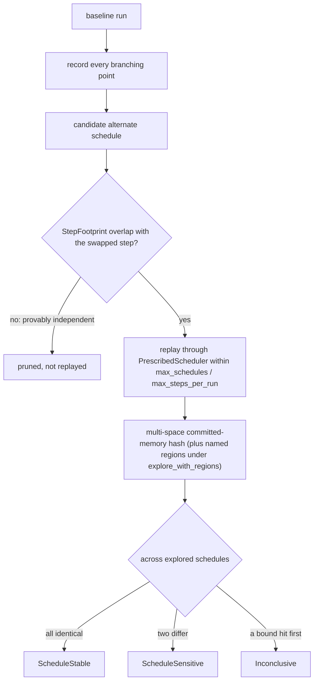

# Schedule exploration

`cellgov_explore` enumerates legal alternate schedules without
modifying the runtime. It records every branching point from a
baseline run, replays each alternate through a `PrescribedScheduler`
within configurable `max_schedules` and `max_steps_per_run` bounds,
and classifies each outcome as `ScheduleStable`, `ScheduleSensitive`,
or `Inconclusive`.

`StepFootprint`, extracted from the nine shared-resource `Effect`
variants, drives conservative dependency analysis: step pairs with
non-overlapping footprints prune as provably independent, including
DMA destinations against reservation lines in both directions (a DMA
completion clears cross-unit reservations covering its destination
line even when the bytes miss the conditional store's exact range).
Pruning is sound for effect-visible operations; plain loads emit no
effect, so a write-read race whose read feeds a later store to a
disjoint address is invisible. The dependency module states that
boundary.

Schedules compare through the multi-space committed-memory hash, so
divergence confined to a spawned child's address space is witnessed.
`explore_with_regions` also captures named memory regions per
schedule for comparison against external baselines; a region spec
that fails to resolve is captured unresolved and fails oracle
comparison loudly instead of matching zeros.
