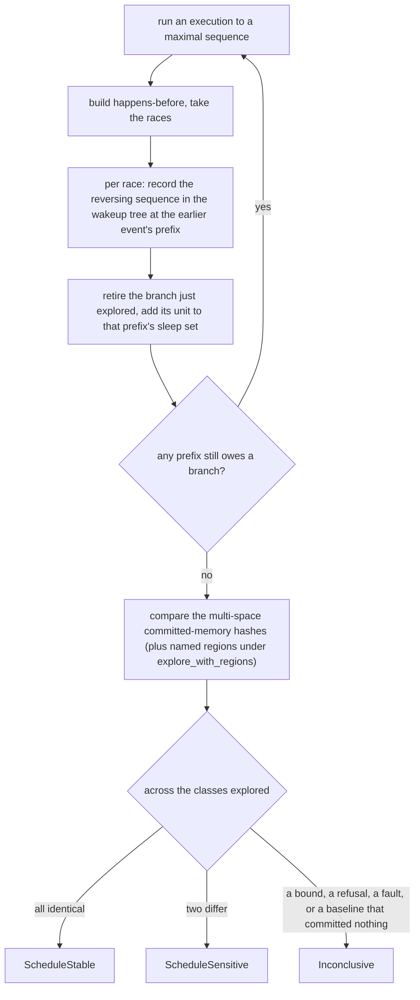

# Schedule exploration

`cellgov_explore` enumerates legal alternate schedules without
modifying the runtime, and classifies each outcome as
`ScheduleStable`, `ScheduleSensitive`, or `Inconclusive`. Two searches
reach that verdict, both forcing their choices through a
`PrescribedScheduler` within configurable `max_schedules` and
`max_steps_per_run` bounds. `max_schedules` bounds equivalence
classes.

The optimal search runs one execution per equivalence class. It runs
an execution to a maximal sequence, reads its races, and for each one
records the sequence that reaches the reversed order in a wakeup tree
at the prefix before the earlier event. The next execution takes the
least branch that tree holds. A sleep set carries the units already
explored from a prefix so none is explored twice, and the wakeup tree
is what keeps that sleep set from blocking: it holds enough of an owed
sequence to reach the state the race asked for. This is the search
behind `explore`, `explore_window` and `explore_with_regions`.

The backtrack-set search is the older algorithm, kept beside it. It
walks the same races without the wakeup trees and sleep sets, so a
class can cost it more than one execution. It exists because the two
share no reduction: they agree on the set of final memory hashes a
workload reaches even where they disagree on what reaching it costs,
and a reduction that drops a class shows up as a disagreement rather
than as a smaller count. A smaller count is what a dropped class looks
like to every measurement that does not have a second search to check
against.

`ScheduleStable` carries a class count when the search covered one
execution per class and hit no bound. A bounded run reports no count
and can only be inconclusive.

The count is narrower than it reads. A reversal that names a unit no
state at that depth can run is dropped, and one drop withdraws the
count for the whole run, so a search can answer for every outcome and
still report none. A result carries the drops beside the count for that
reason: an absent count with no drop means a bound stopped the search
or it claims no count of its own, and an absent count with a number
means that many branches were given up. The number counts branches over
every execution rather than classes, since one branch can carry more
than one owed sequence.
[`exhaustive_cover`](../../crates/cellgov_explore/tests/exhaustive_cover.rs)
walks the choice tree of a small workload, finds both committed
memories it can reach, and holds the search against them: it reaches
both, reports no count, and names the drops that withdrew it.

`StepFootprint`, extracted from the ten shared-resource `Effect`
variants, drives conservative dependency analysis: step pairs with
non-overlapping footprints prune as provably independent, including
DMA destinations against reservation lines in both directions (a DMA
completion clears cross-unit reservations covering its destination
line even when the bytes miss the conditional store's exact range).
A guest load of committed memory emits `SharedReadIntent`, so all
three of Bernstein's intersections hold over data accesses and a
write-read race whose read steers a later store to a disjoint address
conflicts rather than prunes. Two loads of the same bytes still
prune. Instruction fetch records what a PPU block read from the text
region, coalesced into one read per run of addresses at the block
boundary, so a fetch conflicts with another unit's write there. The
dependency
module states what each clause pairs, and carries the argument that
makes each domain rule sound -- why two units waiting on different
barriers cannot interact, why the cross-unit half of the reservation
rule is the half a footprint pair is asked for, and why the granule
arithmetic cannot saturate.

Guest time is one global clock that advances by each step's cost, so a
step touching no shared resource still moves it. Four things read it,
and the relation answers for each differently.

A transfer's landing is the first. A step carries what each transfer in
flight during it will touch at completion -- its destination, and its
source unless an inline payload already holds the bytes -- and those
ranges conflict with another step's access to them. A step that touches
the bytes of a transfer in flight during itself conflicts with every
step instead, because every step carries ticks and so decides which
side of the landing that step falls on.

A guest read of the time base is the second. A PPU `mftb` or `mftbu`
puts the clock into a guest register, which the guest can store
anywhere, so the step emits `ClockRead` and conflicts with every step.
The clause pairs on the read rather than on where the value went: what
would narrow it is tracking the value from the register that received
it to a store, and nothing does.

An LV2 handler's write is the third. A handler holds the tick its
dispatch ran at, and nothing in the effect it emits says whether the
payload was built from it, so such a write conflicts with every step on
the same argument the time-base read does.

A timer deadline is the fourth, and it needs no clause. A wake commits
nothing of its own. It changes which unit is runnable, and every effect
the woken unit then commits is an ordinary event the relation already
holds against the other writers.

An LV2 handler's effects do reach a footprint. A handler commits at
dispatch rather than through the pipeline, so the calling unit's step
names none of them and a syscall would otherwise read as a step that
touched nothing. The runtime publishes what the host did during a step
-- the tagged guest writes, and the effects the dispatch applied -- and
each one is folded into the category it would have had from a unit. A
handler's write becomes that step's write; its mailbox send becomes
that step's send and the wake it performs, since the dispatch releases
the target by status alone rather than by what parked it. No clause
was added for either.

Two things still reach committed state without reaching a footprint.
The RSX FIFO advance pass commits guest memory and sweeps reservations
from a batch no unit's step emitted; only its MMIO mirrors are
recorded. The all-blocked time warp is the other: it fires the timer
and sync wakes before it picks a step, and the commit that follows
clears the published records before any footprint reads them.

A park the commit pipeline takes from the step result rather than an
effect does reach a footprint. The independence relation reads the
yield reason for it, so a wake of the parked unit conflicts with the
step that parked it rather than pruning against it.

`Execution` carries those footprints as events: one per retired step,
identified by the step's position and the unit that ran it. It builds
happens-before over that sequence from three orders, transitively
closed through one clock vector per event:

- program order: the order one unit ran its own events;
- conflict order: the order the schedule ran two events whose
  footprints conflict;
- a wake before the step it released, which no footprint pair reaches
  because the wake names a unit and the released step emits no wait.

`Execution::races` then reads the relation for the pairs nothing but
their own conflict order holds apart. An edge added here removes a
race, so it removes a reversal the search would have owed: the
relation is the one place in the module where erring toward more order
costs cover rather than budget.

Schedules compare through the multi-space committed-memory hash, so
divergence confined to a spawned child's address space is witnessed.
`explore_with_regions` also captures named memory regions per
schedule for comparison against external baselines; a region spec
that fails to resolve is captured unresolved and fails oracle
comparison loudly instead of matching zeros.
