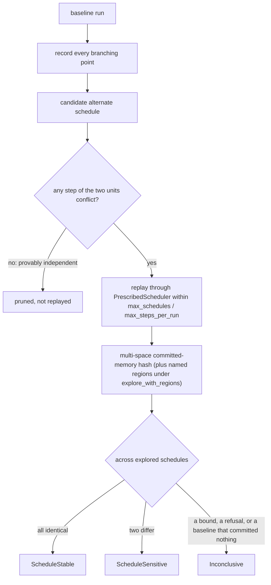

# Schedule exploration

`cellgov_explore` enumerates legal alternate schedules without
modifying the runtime. It records every branching point from a
baseline run, replays each alternate through a `PrescribedScheduler`
within configurable `max_schedules` and `max_steps_per_run` bounds,
and classifies each outcome as `ScheduleStable`, `ScheduleSensitive`,
or `Inconclusive`.

`StepFootprint`, extracted from the ten shared-resource `Effect`
variants, drives conservative dependency analysis: step pairs with
non-overlapping footprints prune as provably independent, including
DMA destinations against reservation lines in both directions (a DMA
completion clears cross-unit reservations covering its destination
line even when the bytes miss the conditional store's exact range).
A guest load of committed memory emits `SharedReadIntent`, so all
three of Bernstein's intersections hold over data accesses and a
write-read race whose read steers a later store to a disjoint address
conflicts rather than prunes. Two loads of the same bytes still
prune, and instruction fetch emits nothing, so a fetch still prunes
against another unit's write to the text region. The dependency
module states what each clause pairs.

`Execution` carries those footprints as events: one per retired step,
identified by the step's position and the unit that ran it. It builds
happens-before over that sequence -- two events of one unit ordered by
the order the unit ran them, two conflicting events by the order the
schedule ran them, transitively closed through one clock vector per
event -- and `Execution::races` reads the relation for the pairs
nothing but their own conflict orders.

Schedules compare through the multi-space committed-memory hash, so
divergence confined to a spawned child's address space is witnessed.
`explore_with_regions` also captures named memory regions per
schedule for comparison against external baselines; a region spec
that fails to resolve is captured unresolved and fails oracle
comparison loudly instead of matching zeros.
