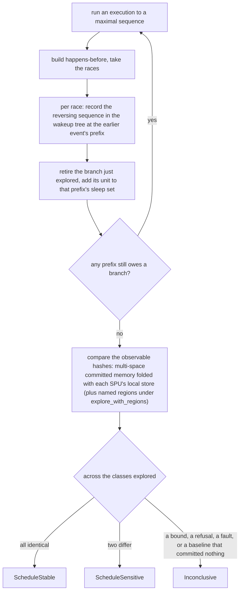

# Schedule exploration

`cellgov_explore` enumerates legal alternate schedules without
modifying the runtime, and classifies each outcome as
`ScheduleStable`, `ScheduleSensitive`, or `Inconclusive`. Two searches
reach that verdict, both forcing their choices through a
`PrescribedScheduler` within configurable `max_schedules` and
`max_steps_per_run` bounds. `max_schedules` bounds equivalence
classes.

```mermaid
flowchart TD
  run["run an execution to a maximal sequence"] --> races["build happens-before, take the races"]
  races --> owe["per race: record the reversing sequence in the wakeup tree at the earlier event's prefix"]
  owe --> back["retire the branch just explored, add its unit to that prefix's sleep set"]
  back --> next{"any prefix still owes a branch?"}
  next -->|yes| run
  next -->|no| hash["compare the observable hashes: multi-space committed memory folded with each SPU's local store (plus named regions under explore_with_regions)"]
  hash --> cls{"across the classes explored"}
  cls -->|all identical| stable["ScheduleStable"]
  cls -->|two differ| sens["ScheduleSensitive"]
  cls -->|"a bound, a refusal, a fault, or a baseline that committed nothing"| inc["Inconclusive"]
```

## The two searches

The optimal search runs one execution per equivalence class. It runs
an execution to a maximal sequence and reads its races. For each race
it records the sequence that reaches the reversed order in a wakeup
tree, at the prefix before the earlier event. The next execution takes
the least branch that tree contains. This is the search behind
`explore`, `explore_window` and `explore_with_regions`.

A sleep set contains the units already explored from a prefix, so none
is explored twice. The wakeup tree keeps that sleep set from blocking:
it contains enough of an owed sequence to reach the state the race
asked for.

The backtrack-set search is the older algorithm, kept beside the
optimal search because the two share no reduction: they agree on the
set of final memory hashes a workload reaches even where they
disagree on what reaching it costs.

*Why:* a reduction that drops a class therefore shows up as a
disagreement rather than as a smaller count. A smaller count is what
a dropped class looks like to every measurement that does not have a
second search to check against.

The backtrack-set search walks the same races without the wakeup
trees and sleep sets, so a class can cost it more than one execution.

## The observable

Every verdict compares one observable: the committed memory of every
address space and every SPU's local store at the end of a maximal
execution. That is what `observable_hash` covers: the multi-space
committed-memory hash folded with each unit's private memory (each
SPU's local store). `ScheduleStable` is stable with respect to that
observable, and the report names it on every verdict. Schedules
compare through that hash, so divergence confined to a spawned
child's address space or to one SPU's local store is witnessed.

**The observer relaxation lands on no write.** That relaxation treats
an unread write as unobserved.

*Why:* every byte is observed at the end of the run, so two writes to
overlapping bytes are dependent whatever reads fall between them.

The relaxation can land only on a resource whose final state the hash
does not cover:

- a mailbox
- a signal register
- a reservation
- a unit's registers

**A divergence confined to one of those four reports as stable.**

Named regions are a second comparison against an oracle, and they
never narrow the verdict. A run that declares none reports the same
verdict as one that declares many. `explore_with_regions` captures
named memory regions per schedule for comparison against external
baselines. A region spec that fails to resolve is captured unresolved
and fails oracle comparison loudly instead of matching zeros.

## The class count

`ScheduleStable` has a class count when the search covered one
execution per class and hit no bound. A bounded run reports no count
and can only be inconclusive.

**One dropped reversal withdraws the count for the whole run.** A
reversal is dropped when it identifies a unit that no state at that
depth can run. A search can therefore cover every outcome and still
report no count: the count is narrower than it reads.

A result has the number of drops beside the count, so an absent count
can be interpreted:

| Count | Drops | Meaning |
|---|---|---|
| absent | none | a bound stopped the search, or it claims no count of its own |
| absent | a number | that many reversals were given up |

**The drop number counts no classes.** A dropped sequence is one owed
execution; the executions its own races would have owed go uncounted.
Both searches report the number, and neither grows it with revisits,
but they count different objects:

| Search | One drop is | Example |
|---|---|---|
| backtrack-set | a prefix and a race | two races at one prefix are two |
| optimal | a depth's own frame and each sequence of the branch it could not take | two races that graft different tails under one head at one depth are two; a race that re-grafts a sequence the depth already lost, or an extension or a prefix of one, is none |

Compare each number against zero, not against the other. The
backtrack-set search claims no class count in any case, so its number
reports cover given up beside a count it never held.

[`exhaustive_cover`](../../crates/cellgov_explore/tests/exhaustive_cover.rs)
walks the choice tree of a small workload and finds both committed
memories it can reach. It compares the search against them: the
search reaches both, reports no count, and reports the drops that
withdrew it.

## Step footprints

`StepFootprint` drives conservative dependency analysis. It is
extracted from the ten shared-resource `Effect` variants. Step pairs
with non-overlapping footprints prune as provably independent. This
includes DMA destinations against reservation lines in both
directions.

*Why:* a DMA completion clears cross-unit reservations covering its
destination line even when the bytes miss the conditional store's
exact range.

A guest load of committed memory emits `SharedReadIntent`, so all
three of Bernstein's intersections hold over data accesses. A
write-read race whose read steers a later store to a disjoint address
therefore conflicts rather than prunes. Two loads of the same bytes
still prune.

Instruction fetch records what a PPU block read from the text region,
coalesced into one read per run of addresses at the block boundary. A
fetch therefore conflicts with another unit's write there.

The dependency module states what each clause pairs. It also contains
the argument that makes each domain rule sound:

- why two units waiting on different barriers cannot interact
- why the cross-unit half of the reservation rule is the half a
  footprint pair is asked for
- why the granule arithmetic cannot saturate

## Guest time

Guest time is one global clock that advances by each step's cost, so a
step touching no shared resource still moves it. Four things read it,
and the relation handles each differently:

| What reads guest time | How the dependency relation handles it |
|---|---|
| a transfer's landing | the ranges each transfer in flight will touch at completion conflict with another step's access to them; a step touching the bytes of a transfer in flight during itself conflicts with every step |
| a guest read of the time base (PPU `mftb` or `mftbu`) | the step emits `ClockRead` and conflicts with every step |
| an LV2 handler's write | conflicts with every step |
| a timer deadline | no clause |

### A transfer's landing

A step has what each transfer in flight during it will touch at
completion:

- its main-storage destination
- its main-storage source, unless an inline payload already contains
  the bytes
- each local-store range, with the unit that owns it

Those ranges conflict with another step's access to them. A step that
touches the bytes of a transfer in flight during itself conflicts with
every step instead.

*Why:* every step has ticks, and so decides which side of the landing
that step falls on.

An SPU's loads and stores reach no footprint, so a step of the unit
that owns a local-store range counts as touching it. This holds
whether the range is in flight during that step or during the other
step of the pair.

The issuer's end of a transfer the step itself queued does not count.

*Why:* the step's instructions all ran before the commit that queued
it.

### A guest read of the time base

A PPU `mftb` or `mftbu` puts the clock into a guest register, which
the guest can store anywhere. The step therefore emits `ClockRead` and
conflicts with every step. The clause pairs on the read rather than on
where the value went.

*Why:* what would narrow it is tracking the value from the register
that received it to a store, and nothing does.

### An LV2 handler's write

A write an LV2 handler makes conflicts with every step, on the same
argument the time-base read does.

*Why:* a handler has the tick its dispatch ran at, and nothing in the
effect it emits says whether the payload was built from it.

### A timer deadline

A timer deadline needs no clause.

*Why:* a wake commits nothing of its own. It changes which unit is
runnable, and every effect the woken unit then commits is an ordinary
event the relation already holds against the other writers.

## Commits the footprint does not take from a unit's effects

Four things reach committed state other than through the effects a
unit's step emits. The table shows which of them reach a footprint:

| Source | Reaches a footprint |
|---|---|
| an LV2 handler's effects | yes, folded into the category each would have had from a unit |
| the all-blocked time warp | yes, belongs to the step the warp then picked |
| a park the commit pipeline takes from the step result | yes, through the yield reason |
| the RSX FIFO advance pass | no; only its MMIO mirrors are recorded |

### LV2 handler effects

An LV2 handler's effects do reach a footprint. A handler commits at
dispatch rather than through the pipeline, so the calling unit's step
contains none of them. A syscall would otherwise be treated as a step
that touched nothing.

The runtime publishes what the host did during a step: the tagged
guest writes, and the effects the dispatch applied. Each one is folded
into the category it would have had from a unit:

- A handler's write becomes that step's write.
- Its mailbox send becomes that step's send and a wake of the target,
  whatever parked it.

*Why:* the dispatch releases a target parked on the mailbox or on
nothing it names, and recording the wake for every target only adds
conflicts.

No clause was added for either.

A handler's signal write has a clause of its own. It conflicts with
every step of its target, and with another signal write to the same
target.

*Why:* the target reads its signal-notification registers in steps
that emit nothing, and a register that overwrites keeps the later of
two writes.

### The all-blocked time warp

The all-blocked time warp does reach a footprint. It fires the timer
and DMA wakes before it picks a step, so the record a footprint reads
opens at the step's start rather than at its commit. What the warp
wrote belongs to the step it then picked.

A timed wait's expiry writing through its waiter's result pointer is
the case that needs it. The DMA half was already covered, because a
transfer's ranges are held for every step of its flight.

### Parks taken from the step result

A park the commit pipeline takes from the step result rather than an
effect does reach a footprint. The independence relation reads the
yield reason for it. A wake of the parked unit therefore conflicts
with the step that parked it rather than pruning against it.

### The RSX FIFO advance pass

One thing still reaches committed state without reaching a footprint.
The RSX FIFO advance pass commits guest memory and sweeps reservations
from a batch no unit's step emitted; only its MMIO mirrors are
recorded.

## Happens-before and races

`Execution` contains those footprints as events: one per retired step,
identified by the step's position and the unit that ran it. It builds
happens-before over that sequence from three orders, transitively
closed through one clock vector per event:

- program order: the order one unit ran its own events;
- conflict order: the order the schedule ran two events whose
  footprints conflict;
- a wake before the step it released, which no footprint pair reaches
  because the wake names a unit and the released step emits no wait.

`Execution::races` then reads the relation for the pairs that nothing
but their own conflict order keeps apart.

**An edge added here removes a race, and so removes a reversal the
search would have owed.** The relation is the one place in the module
where erring toward more order costs cover rather than budget.
