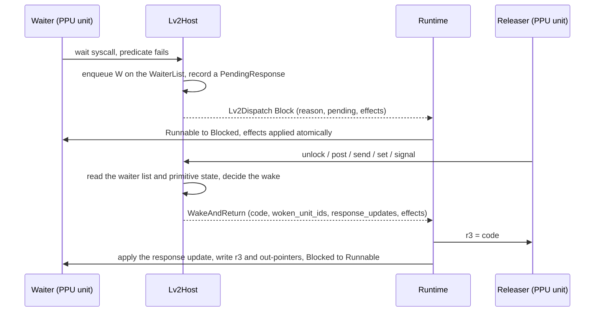
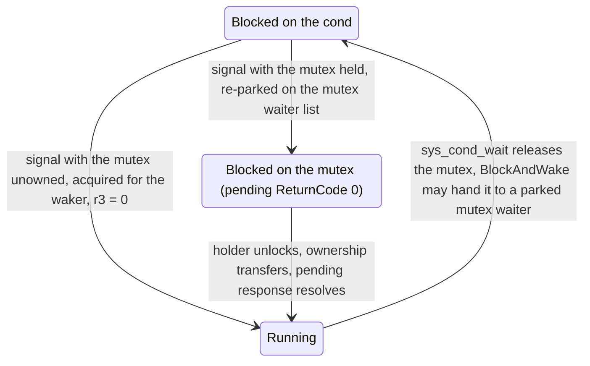
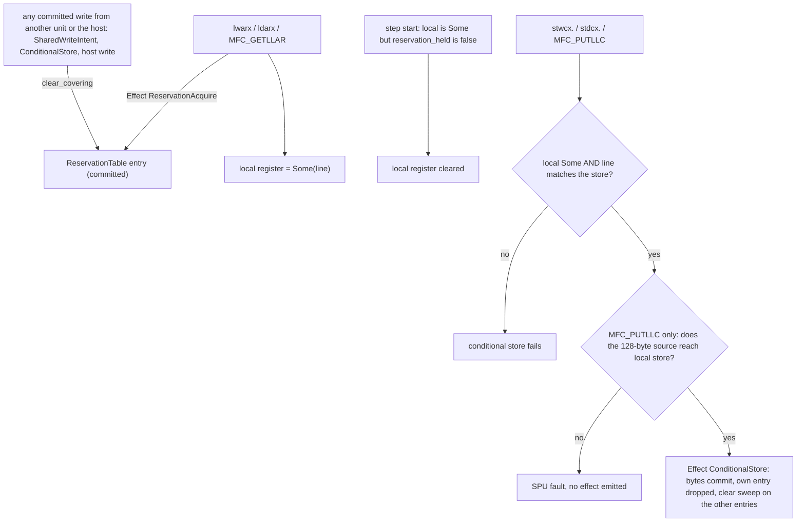

# Synchronization

## Synchronization primitives

The LV2 primitives park and wake PPU threads under one
contract. Each has its own table inside `Lv2Host`
(`LwMutexTable`, `MutexTable`, `SemaphoreTable`,
`EventQueueTable`, `EventFlagTable`, `CondTable`) keyed by the
guest-visible id. Every table composes the shared `WaiterList`
-- a strict FIFO queue of `PpuThreadId` -- and contributes to
the host's `state_hash` only when non-empty.

### Block / wake protocol

Park side: a wait handler whose predicate fails (mutex owned,
semaphore count zero, event queue empty, event flag mask
unsatisfied, cond unconditionally) enqueues the caller on the
primitive's waiter list, records a `PendingResponse` for that
unit in the runtime's `SyscallResponseTable`, and returns
`Lv2Dispatch::Block { reason, pending, effects }`. The runtime
moves the unit `Runnable -> Blocked` and applies the effects
atomically. `reason` carries the `Lv2BlockReason` (primitive id
plus, for cond, the associated mutex id); `pending` carries what
the wake resolver needs to complete the syscall: a return code,
a 32-byte event payload, a u64 flag observation, or a
cond-reacquire marker.

Release side: an unlock / post / send / set / signal handler
reads the waiter list and the primitive state in one dispatch,
decides the wake, and returns
`Lv2Dispatch::WakeAndReturn { code, woken_unit_ids,
response_updates, effects }`. The runtime sets the releaser's
r3 to `code`, applies the per-waiter `response_updates`, then
walks `woken_unit_ids`: for each it takes the pending response,
writes the r3 / out-pointer effects, and moves the unit
`Blocked -> Runnable`. A response update can swap a waiter's
`PendingResponse` wholesale: event queue send uses it to
deliver the payload, event flag set to deliver the observed bit
pattern, and cond signal to swap `CondWakeReacquire` for
`ReturnCode` on clean acquire.

Continuation pointers (event queue out pointer, event flag
result pointer) live on the primitive's waiter entry, not on
the release-side dispatch: parking records everything the wake
needs, which rules out the lost-wake class of bugs.

### Process-exit purge

Process exit removes every thread the process owns from every
waiter list in one sweep: every primitive table plus the
per-thread join-waiter lists. Exit finishes all the process's
units, so any later grant to one is a resource no thread will
consume or release: a semaphore count sunk into a dead waiter,
a mutex transferred to an owner that can never unlock it, or an
exit value delivered to a joiner that no longer runs. The purge
is record-only: nothing is woken and no pending-response entry
is cleared, because the purged threads are finished, not
resumed. Per-primitive purge counts are witnessed.

A mutex still owned by a dead thread keeps its owner and is
reported as a named invariant break. Reclaiming it needs creator
attribution the shared-object namespace does not record, and
the process-shared case with surviving attachments has no
oracle, so retained-locked is the honest answer for both.

### Cond-wake re-acquire (two-hop block)

`sys_cond_wait` alone breaks the straight release-wakes-caller
pattern: on wake the caller needs the associated mutex re-held.
The handler returns `Lv2Dispatch::BlockAndWake`, because
releasing the mutex on the way into the cond wait can transfer
ownership to a parked mutex waiter, which must wake in the same
dispatch the cond caller blocks.

On the signal side, the wake target holds
`PendingResponse::CondWakeReacquire { mutex_id, mutex_kind }`.
The signal handler consults the mutex table:

- Unowned: acquire on the waker's behalf, swap the pending
  response to `ReturnCode { code: 0 }`, and include the waker
  in `woken_unit_ids` -- a classic wake: r3 = 0, back to
  Runnable, mutex held.
- Held: re-park the waker on the mutex waiter list, swap the
  pending response to `ReturnCode { code: 0 }`, and leave the
  waker Blocked. When the holder calls `sys_mutex_unlock`, the
  unlock-wake path transfers ownership to this waker and
  resolves the swapped pending response.

Cond is non-sticky: a `sys_cond_signal` / `_signal_all` /
`_signal_to` on a cond with no waiters is observably lost. No
pending-signal counter is kept; a lost signal leaves the cond
table's state hash unchanged.

### Lost-wake prevention

The classic lost-wake bug is a race between
check-waiter-list-then-wake and check-count-then-decrement.
CellGov's runtime runs on one OS thread and drives every guest
execution unit (PPU and SPU) sequentially through the [step
loop](runtime_pipeline.md#per-step-pipeline), one committed
batch at a time, so two guest threads never run at once on two
host cores and no handler preempts another mid-read. Guest
units still interleave, but only at commit boundaries and in a
reproducible order. Each handler must still read and mutate
atomically within its own dispatch:

- Park handlers read primitive state AND install the block in
  the same dispatch.
- Release handlers read the waiter list AND drain it in the
  same dispatch.

The runtime commits each dispatch atomically.

Regression coverage: one post-before-wait test per non-cond
primitive asserts that a release scheduled before the wait
observably unblocks the waiter. For cond the inverse holds:
a signal-before-wait must NOT wake a later waiter, tested
against all three signal variants.

## Atomic reservation model

PPU `lwarx` / `stwcx.` / `ldarx` / `stdcx.` and SPU
`MFC_GETLLAR` / `MFC_PUTLLC` share one reservation model. The
granule is 128 bytes (a Cell BE cache line) on both sides.

**Two pieces of state.** Every execution unit carries a local
register -- `Option<ReservedLine>` on `PpuState` / `SpuState` --
set by an atomic load and cleared by a conditional-store
retirement or by another unit's write to the line; the holder's
own plain stores leave it in place. The committed
cross-unit view is `cellgov_sync::ReservationTable`, a
`BTreeMap<UnitId, ReservedLine>` owned by the commit pipeline
and folded into `sync_state_hash` with mailboxes, signals, LV2
host state, and syscall responses.

**Verdict rule.** `stwcx.` / `stdcx.` / `MFC_PUTLLC` succeed
when BOTH the local register is set AND its line matches the
store's line. The committed half of the check is a step-start
refresh: at the top of every `run_until_yield`, a local register
that is `Some` while `ExecutionContext::reservation_held(unit_id)`
is false (a cross-unit write in an earlier commit cycle cleared
the entry) is cleared. The context is frozen during the step, so
intra-step verdicts trust the local register alone.

**Effect vocabulary.** Two `Effect` variants drive the table:

- `ReservationAcquire { line_addr, source }` inserts or replaces
  the unit's entry. Emitted by `lwarx` / `ldarx` (PPU) and
  `MFC_GETLLAR` (SPU). A `MFC_GETLLAR` whose line does not reach
  local store emits none and clears the local register too, so the
  two halves agree that the unit holds nothing.
- `ConditionalStore { range, bytes, source, ordering,
source_time }` commits the success path of `stwcx.` / `stdcx.`
  / `MFC_PUTLLC`. The commit pipeline applies the bytes through
  the normal staging / drain path, drops the emitter's own
  reservation entry, and runs the clear sweep against all other
  entries covering the line. On the PPU side the conditional
  store goes through the store buffer, so its effect is emitted
  in program order with the block's plain stores and ahead of any
  later `ReservationAcquire` in the same block; a full buffer
  retries the instruction next block with CR0 and the reservation
  untouched.

**Clear-sweep contract.** Every write path that commits bytes to
main memory fires the clear sweep. The lost-reservation
regression suite in `cellgov_core::tests::runtime_tests` pins
the invariant per path. The sweep fires from three paths:

1. `SharedWriteIntent` commit, in the commit pipeline's apply
   pass after the staging drain.
2. `ConditionalStore` commit, same as (1) via the shared
   byte-deposit path, plus the emitter's own entry is dropped.
3. A host write, through `Runtime::host_write`: LV2 dispatch
   effects, wake and out-parameter payloads, DMA completion, the
   RSX control-register and flip-status mirrors, shared-view
   seeding and fanout, and the placements the driving program
   makes itself through `Runtime::place_bytes`. Validation, the
   sweep and the trace record sit together there, so a new
   host-side write inherits the sweep instead of carrying its own
   call. A write the host makes on one unit's behalf exempts that
   unit, as (1) exempts its emitter; a mechanism with no unit
   behind it exempts nobody.

**Scope and bounds.** The reservation table and local registers
are the full contention model. Memory-barrier instructions
(`sync`, `lwsync`, `eieio`, `isync`) are not modelled; the
commit pipeline's ordering at epoch boundaries substitutes for
them. [Schedule exploration](schedule_exploration.md) over
contention workloads is conservative:
`StepFootprint::reservation_lines` marks a step dependent on any
other step whose writes cover the reserved line.
