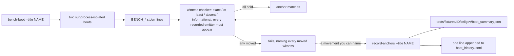
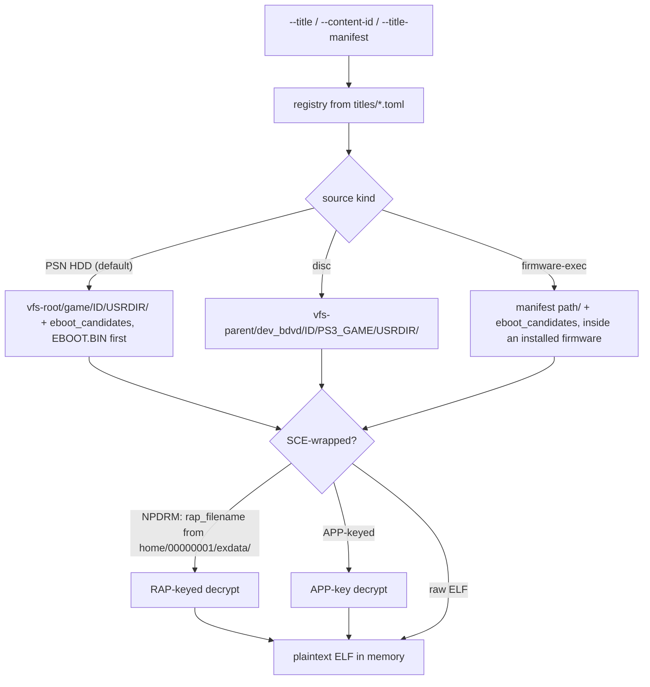

# Title harness (`cellgov_cli`)

Title-specific configuration lives in TOML manifests under
`titles/<content-id>.toml`; no library crate below
`cellgov_cli` knows that titles exist. `cellgov_cli` scans the
directory at startup into a registry the CLI looks up by short
name (`--title <name>`), content id (`--content-id <id>`), or
manifest path (`--title-manifest <file>`). A manifest declares:

- **Source kind.** The default PSN HDD layout resolves the EBOOT
  under `<vfs-root>/game/<content-id>/USRDIR/` and is NPDRM-keyed;
  the manifest's `rap_filename` names the operator-supplied RAP
  (decrypt path below). `[source] kind = "disc"` makes
  `resolve_eboot` look under
  `<vfs-parent>/dev_bdvd/<content-id>/PS3_GAME/USRDIR/` instead,
  APP-keyed (no RAP). `[source] kind = "firmware-exec"` points the
  resolver at a module directory inside an installed firmware image,
  where the manifest's `path` names the tree and `eboot_candidates`
  names the executable (the system shell is `vsh/module/vsh.self`).
  It boots as an ordinary guest process with no install step and
  exercises the privileged paths under
  [Process privilege](lv2_host.md#process-privilege).
- **Checkpoint kind.** `process-exit` for a title that calls
  `sys_process_exit` inside the captured window; `first-rsx-write`
  for one whose main loop never exits, so the first PPU write into
  the `rsx` reserved region counts as the hit; `pc` for a specific
  retired PC.
- **`[rsx]` flags.** `mirror = true` lands the title's GCM
  put-pointer stores in the FIFO cursor instead of tripping
  `first-rsx-write`; `consume = true` also enables the FIFO
  consumer (see [rsx.md](rsx.md)).
- **`[content]` blobs.** Read-only files registered into
  `Lv2Host::fs_store` at boot by the content provider in
  `apps/cellgov_cli/src/game/content.rs` (see
  [In-memory filesystem](lv2_host.md#in-memory-filesystem)).
- **Checkpoint regions.** The checkpoint manifest names the memory
  regions both runners capture; an EBOOT with more loadable
  segments names more regions (`code`, `data`, `code_hi`,
  `data_hi`, ...).

[titles.md](../titles.md) tracks per-title status (boot checkpoint
reached, cross-runner observation match).

## Title anchors and witnesses

Each title's expected boot behaviour is committed data, not test
code: `tests/fixtures/<content-id>/cellgov/boot_summary.json`
records the step count, outcome, and a witness set -- named
counters the boot emits as `BENCH_*` stderr lines (atomic-op
executions, invariant breaks, PRX load misses, ...). Every
witness carries a class:

- `exact`: any movement is a finding;
- `at-least`: a floor; losing coverage is a regression;
- `absent`: the boot does not reach this path;
- `informational`.

The checker also verifies that each recorded witness's emitting
line appeared in the boot output, so deleting an emitter cannot
leave an `absent`-class witness vacuously green; the parser
rejects unknown keys and duplicate lines rather than guessing.
Every `BENCH_*` line the boot path emits is either tracked in
that line table or listed as diagnostic-only with the reason it
carries no witness (a run-dependent key set, a line repeated per
module, a line suppressed on the quiet path), and a test holds
the emitters to that split.

`record-anchors` is the only writer: it re-measures, rewrites the
baseline (outcome included), and appends one line per real move
to the title's append-only `boot_history.jsonl`, so blessing a
change is a reviewable data diff.

The title suites (`title_witnesses`, `authority_id`) sit behind
the `title-corpus` cargo feature because they need the operator's
owned dumps. Within a run, boots split "not installed" from "boot
failure" via explicit stderr markers (`BENCH_TITLE_NOT_INSTALLED`,
`BENCH_BOOT_INPUTS_RESOLVED`), skip missing titles by name, and
fail unless at least one title booted.

Adding a title is a single-file TOML commit under
`titles/`; no Rust change is needed while the title
fits the existing checkpoint kinds (`process-exit`,
`first-rsx-write`, `pc`) and the standard PS3 VFS layout.
`--checkpoint <kind>` overrides the manifest default per run for
targeted diagnostics, e.g. `--checkpoint pc=0xADDR` for
step-count-aligned A/B measurements.

EBOOT resolution walks
`<vfs-root>/game/<content-id>/USRDIR/<candidate>` in the order the
manifest's `eboot_candidates` declares. The canonical layout is
`EBOOT.BIN`-first, so the encrypted SCE source is the source of
truth and a stale operator-decrypted `EBOOT.elf` cannot shadow
it. CellGov decrypts the encrypted `EBOOT.BIN` in memory at boot
through `cellgov_install::sce::decrypt_self_to_elf`: APP-keyed
for disc titles, RAP-keyed NPDRM for PSN-HDD titles (the RAP file
named by the manifest's `rap_filename` is read from
`<vfs-root>/home/00000001/exdata/`). `<vfs-root>` defaults to
`vfs/dev_hdd0`, the CellGov-owned VFS that
`cellgov_install install-game` / `install-iso` populate from a
user's PKG/ISO dumps; `--vfs-root` or `$CELLGOV_PS3_VFS_ROOT`
overrides it. `tools/rpcs3/` holds an RPCS3 checkout for offline
baselines only.

The diagnostic surface is:

- `run-game --title <name>`: fault-driven bring-up run with full
  per-step coverage (insn tally, PC hit counts, syscall summary).
- `bench-boot --title <name>`: two subprocess-isolated boot runs
  per invocation for reproducible wall-time measurement; the
  split sidesteps wall-time drift from guest-memory allocation /
  page-commit reuse across `Runtime` instances in one process.
  `--checkpoint pc=0xADDR` stops at a specific retired PC for A/B
  measurements that need identical step counts across runs.
- `dump-prx-imports <path>`: decodes any raw `.prx` or SCE-wrapped
  `.sprx` (SCE wrappers auto-detected and decrypted via
  `cellgov_install::sce`) and prints the module's internal name,
  export namespaces, and full import table.
