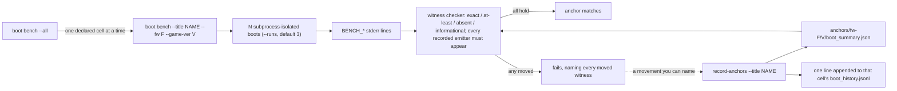
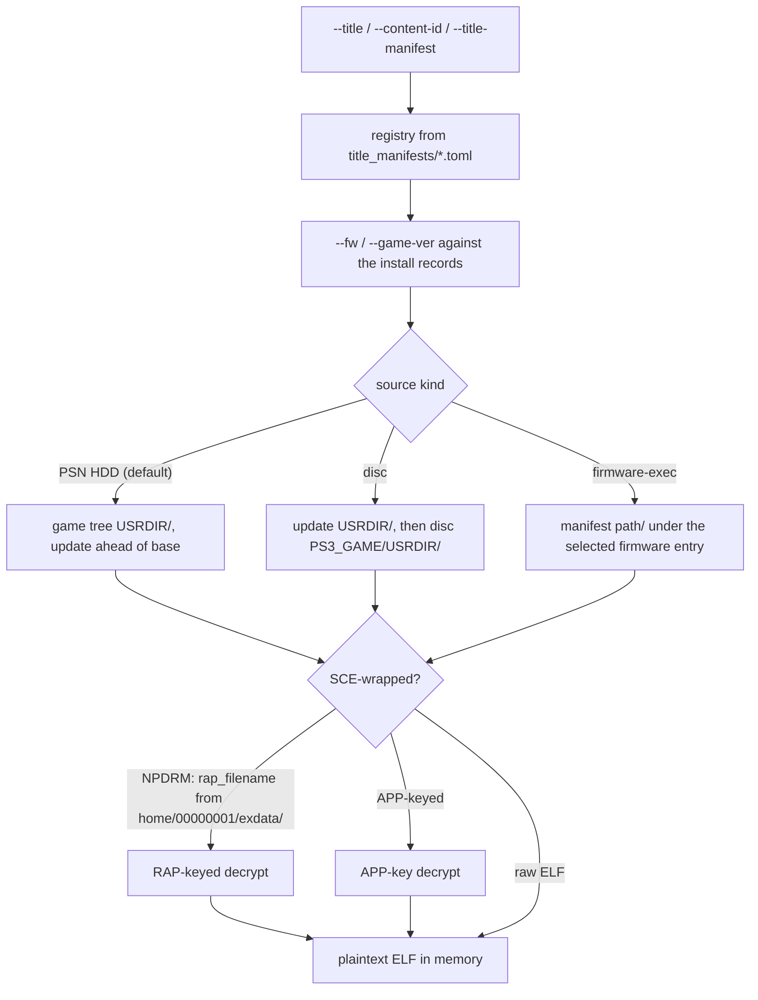

# Title harness (`cellgov_cli`)

Title-specific configuration lives in TOML manifests under
`title_manifests/<content-id>.toml`; no library crate below
`cellgov_cli` knows that titles exist. `cellgov_cli` scans the
directory at startup into a registry the CLI looks up by short
name (`--title <name>`), content id (`--content-id <id>`), or
manifest path (`--title-manifest <file>`). A manifest declares:

- **Source kind.** The default PSN HDD layout resolves the EBOOT
  under the title's `game` tree and is NPDRM-keyed; the manifest's
  `rap_filename` names the operator-supplied RAP (decrypt path
  below). `[source] kind = "disc"` resolves under the disc tree's
  `PS3_GAME/USRDIR/` instead, APP-keyed (no RAP). `[source] kind =
  "firmware-exec"` points the resolver at a module directory inside a
  firmware image, where the manifest's `path` is relative to the
  selected firmware entry and `eboot_candidates` names the
  executable. That relative path is what lets one manifest boot
  against every installed firmware. It boots as an ordinary guest
  process with no install step and exercises the privileged paths
  under [Process privilege](lv2_host.md#process-privilege).
- **Checkpoint kind.** `process-exit` for a title that calls
  `sys_process_exit` inside the captured window; `first-rsx-write`
  for one whose main loop never exits, so the first PPU write into
  the `rsx` reserved region counts as the hit; `pc` for a specific
  retired PC.
- **`[rsx]` flags.** `mirror = true` lands the title's GCM
  put-pointer stores in the FIFO cursor instead of tripping
  `first-rsx-write`; `consume = true` also enables the FIFO
  consumer (see [rsx.md](rsx.md)).
- **`[content]` blobs.** Read-only files registered into
  `Lv2Host::fs_store` at boot by the content provider in
  `apps/cellgov_cli/src/game/content.rs` (see
  [In-memory filesystem](lv2_host.md#in-memory-filesystem)).
- **Checkpoint regions.** The checkpoint manifest names the memory
  regions both runners capture; an EBOOT with more loadable
  segments names more regions (`code`, `data`, `code_hi`,
  `data_hi`, ...).
- **`system_ver` and `[[bench.matrix]]` cells.** A result is keyed by
  the cell -- the title at one firmware version and one game version.
  A title with a PARAM.SFO declares one cell by carrying `system_ver`,
  the firmware that table asks for, times its base install; that cell
  is the reference, the one the headline row is measured at, and
  nothing in the manifest can move it. `[[bench.matrix]]` rows declare
  further cells beside it, or repeat it to attach a per-cell cap,
  checkpoint or `pending` reason; a repeat that carries none of those
  is refused, and so is one asking the reference to be a probe. A row
  overrides the title-level cap and checkpoint for its own cell and
  nothing else, and a row expecting convergence (`frontier`) is
  distinguished from one that exists to observe an incompatibility
  (`probe`). A firmware-shipped title has no PARAM.SFO and so no
  `system_ver`: its version axis is the firmware's, its rows are its
  whole declaration, and each names a firmware and no game version.

## Which firmware a title is measured against

The reference cell is derived from the title. Every title states the
firmware it shipped against in its own `PARAM.SFO`, under
`PS3_SYSTEM_VER`, disc and network alike; `02.7600` names firmware 2.76.
The manifest repeats that value as `[title] system_ver` in the store's
key spelling, a `title-corpus` suite holds the repetition to the
installed table, and the loader builds the reference cell from it:
`(system_ver, base)`. No manifest key points the headline row
elsewhere, so the cell a title is measured at is a fact the title
carries rather than a choice the registry records.

The floor is the frontier map's honest surface. At it the title and the
firmware were shipped and tested together, so a divergence there is
CellGov's, and the syscall a `No` row names as the next implementation
target is one the title used on hardware. Measured on the newest
firmware instead, an early title loads a sysmodule set and binds a
system-software revision nobody who owned the disc ever ran, and a
divergence there may name a syscall that is on the boot path only
because the title was booted years out of its era.

The cost is real and is stated rather than hidden: each title is
measured against the system-software revision and sysmodule set its own
floor ships, so a bug shared by two titles at two floors will not
present as shared. That is what the hardware did. A manifest may still
declare the newest firmware as a further cell -- a drift study -- and
every declared cell renders on the title's own page.

A disc ships the PUP its floor names in `PS3_UPDATE/PS3UPDAT.PUP`, so
install that PUP and its install-record digest matches the one on the
disc; a network title states the same floor and ships nothing to satisfy
it.

[titles.md](../titles.md) tracks per-title status (boot checkpoint
reached, cross-runner observation match), one row per game title at its
reference cell, with a Config column naming that cell. Every declared
cell of one title, measured or not, is on that title's own page under
`docs/titles/<content-id>.md` -- a grid with firmware down the side and
game version across.

The system software has its own page. It ships inside every firmware
image, states no floor of its own, and its version axis is the firmware
axis, so a `Year` or a `Config` column beside the games would mean
something different from every other row. It renders on
[firmware.md](../firmware.md), one row per firmware version its
manifest declares, with the same verdict columns; every one of those
cells is gated on an anchor, since none is the reference.

Splitting the presentations is what keeps each readable. One table
cannot express the product of every version and stay the page people
screenshot, and folding a title's other cells into the headline row
would state several measurements as one. The grid distinguishes a
declared cell with nothing recorded from an intersection the manifest
never declared, because rendering a hole and a boundary the same makes
a coverage table lie about its own gaps.

`titles-gen` owns the whole set it writes: the title index, the
firmware page, and one page per title in the registry. A page under
`docs/titles/` that no title claims is removed on the next run and
named as it goes, so a title dropped from the registry cannot leave a
page behind that still reads as current. The drift gate compares the
set rather than each file, and fails on the orphan.

Each committed file is held against the cell it sits in. A summary
stating a firmware or a title version other than the one its directory
names is refused, and so is one filed under a cell the manifest does
not declare, or at a path no cell key names at all. The path is a claim
about what a file is, and an unchecked claim is how a curated matrix
stops being curated.

## Title anchors and witnesses

An anchor is evidence about a cell, so it is filed under one:

```
tests/fixtures/<content-id>/cellgov/anchors/fw-<ver>/<game-ver>/
  boot_summary.json
  boot_history.jsonl
```

A firmware-shipped title has no game-version axis, so its anchors sit
one level shallower -- the path names every axis the cell has and no
segment standing for one it does not. Nothing keys an anchor by content
id alone: the moment two firmwares can coexist, a witness moved by a
firmware swap and a regression are the same reading.

The cross-runner triple is filed the same way, under
`tests/fixtures/<content-id>/cross_runner/fw-<ver>/<game-ver>/`, so the
two schemes share one tail and one notion of which cell an artifact
answers for. A committed file states the firmware it was measured
against, and a file whose statement disagrees with the cell it sits in
is refused: the directory alone is a claim nothing checks.

A gated cell -- a game title's reference cell, or any declared cell of
the system software -- normally carries a committed anchor. When
something outside the registry stops it being measured -- a firmware
that cannot be obtained, a defect that ends the boot before the
checkpoint -- a `[[bench.matrix]]` row for that cell states the reason,
and the gate holds the reason rather than tolerating a silent hole. A
cell that states a reason and carries an anchor anyway is refused too,
so the reason cannot outlive what it described. A game title's other
cells are not gated: declaring one stays free.

Each cell's expected boot behaviour is committed data, not test code:
`boot_summary.json` records the step count, outcome, per-step budget,
the identity triple the measurement was taken against, and a witness
set -- named counters the boot emits as `BENCH_*` stderr lines
(atomic-op executions, invariant breaks, PRX load misses, ...). Every
witness carries a class:

- `exact`: any movement is a finding;
- `at-least`: a floor; losing coverage is a regression;
- `absent`: the boot does not reach this path;
- `informational`.

The checker also verifies that each recorded witness's emitting
line appeared in the boot output, so deleting an emitter cannot
leave an `absent`-class witness vacuously green; the parser
rejects unknown keys and duplicate lines rather than guessing.
Every `BENCH_*` line the boot path emits is either tracked in
that line table or listed as diagnostic-only with the reason it
carries no witness (a run-dependent key set, a line repeated per
module, a line suppressed on the quiet path), and a test holds
the emitters to that split.

`dev record-anchors` is the only writer. It records the cells the
registry declares -- the reference cell `system_ver` derives and every
`[[bench.matrix]]` row -- and refuses one it does not: the store may
hold ten firmwares, and a declared cell is one the title's own floor
names or somebody reviewed into a row. `--fw` and `--game-ver` narrow
the recording to the declared cells they name. Each recording re-measures the cell at
its own cap and checkpoint, rewrites the anchor (outcome included), and
appends one line per real move to that cell's append-only
`boot_history.jsonl`, so blessing a change is a reviewable data diff.
Per-cell files start empty rather than inheriting anything: a reader
that has to treat absence as "some earlier firmware" cannot say what it
is looking at.

An anchor also constrains the store it was measured against. Removing a
firmware version a committed anchor names is refused unless overridden,
because the cells naming that version would otherwise fail their next
measurement on an unresolved firmware rather than on a missing one. The
gate reads the registry and the anchor tree from the same root, so it
answers the same wherever the process was started; resolving one of
them against the working directory would make it a refusal that only
fires from inside the checkout.

The gate holds a run against the anchor of the cell the run composed,
and against nothing else. A cell with no committed anchor reports
`NOT RECORDED` and gates nothing, the same way a retargeted run reports
`NOT COMPARED`. A run that composed no cell at all -- an unmanaged
`--firmware-dir` tree, or a title the store does not hold -- has no key
to file evidence under, so it is reported incomparable rather than held
against a neighbouring cell. The gate also compares the triple the
anchor embeds against the one the run composed, so a file hand-edited,
copied in from another cell, or measured before one side of the triple
was installed says so instead of standing in for this cell's
measurement.

`boot bench --all` runs that gate over every declared cell of every
registry title, one cell after another in registry order, and prints
one summary line per cell and a tally. The cell list is the
registry's, the same list `dev record-anchors --all` records, so a
declared cell that was never recorded is a finding (`not recorded`,
exit 1). A cell whose firmware or dump this machine does not hold, or
that a `[[bench.matrix]]` row declares pending, is reported by name
and gates nothing, and a sweep that holds no cell at all exits 1. The
sweep's status is its worst cell's, in the single run set's order: a
determinism break, then a moved anchor, then a failed boot. The cells
run serially, so the report reads the same every time and no two
boots contend for host memory; each cell is composed by the firmware
and game version its row names, and the composed key is checked
against the declared one before anything is measured.



### What a run set gates on, and what it only reports

A run set separates two questions the same invocation answers.

**Determinism is a hard gate.** Every run of the set is held against
run 1 on four surfaces: retired steps, boot outcome, the budget the
run resolved, and the whole witness map parsed out of the `BENCH_*`
stderr lines. The witness map is what catches a counter that moves
while the step count holds, and the budget is a per-run result because
each child re-resolves its own composition. A disagreement exits
nonzero and re-runs the boot twice more under `--save-state-trace`,
feeding the two traces to the same comparison `diff diverge` uses, so
the report names the first divergent step, PC and hash. Those re-runs
take `DeterminismCheck` mode, which the measured runs do not, so a
break that mode fails to reproduce reports as identical -- the line
says which. The mode records a state hash per retired instruction, so
above a step cap the report names the two `bench-once` commands and
the `diff diverge` that follows them, and runs no boot itself. The cap
reads the longest run of the set, since a moved step count is one of
the breaks that triggers the localization.

A set of one run reproduces nothing, and says so where the gate
verdict would go.

**Throughput only reports.** The set estimates cost as min-of-N:
contention only ever adds time, so the fastest run is the least
contaminated. It reports the cross-run spread against a noise ceiling
and, above it, says `INCONCLUSIVE` and exits 0. Elapsed time on a host
running anything else measures the host, so gating on it inverts the
polarity -- the busier the machine, the likelier the gate trips on a
run that regressed nothing. `--strict-perf` turns "no throughput
verdict" into a nonzero exit, for a box with nothing else on it; it
needs two runs to have a spread to enforce, and refuses a one-run set.

The title suites (`title_witnesses`, `authority_id`) sit behind
the `title-corpus` cargo feature because they need the operator's
owned dumps. Within a run, boots split "not installed" from "boot
failure" via explicit stderr markers (`BENCH_TITLE_NOT_INSTALLED`,
`BENCH_BOOT_INPUTS_RESOLVED`), skip missing titles by name, and
fail unless at least one title booted.

A corpus-gated suite locates its fixtures the way the boot path does:
through the install record that names the tree, never through a layout
path of its own. "Not installed" is then the absence of a record, and a
record naming a tree whose file is gone fails as drift rather than
passing over. That keeps every suite reading one layout, and moves each
of them with the artifact when an installer's target changes.

Adding a title is a single-file TOML commit under
`title_manifests/`; no Rust change is needed while the title
fits the existing checkpoint kinds (`process-exit`,
`first-rsx-write`, `pc`) and the standard PS3 VFS layout.
`--checkpoint <kind>` overrides the manifest default per run for
targeted diagnostics, e.g. `--checkpoint pc=0xADDR` for
step-count-aligned A/B measurements.

`boot bench` measures a set of subprocess boots, so it forwards the
selection flags to each child rather than the paths they resolved to.
Handing a child a resolved directory would make it read an unmanaged
tree and compose no store mounts, and the set would measure different
guest trees.

The two commands share one argument struct, so the flags that describe
a single child -- the trace path it writes and the index it reports --
parse on both and mean something on only one. `boot bench` refuses
them by name: one path cannot serve several measurements, and the set
stamps each child's index itself.

## Version selection

The store keys firmware on its version and a title on its base plus
each installed update, so a boot names which of each it runs. `--fw
<version>` and `--game-ver base|<version>` resolve against the install
records, and the same contract governs both: the flag names a version
that must exist, no flag with exactly one candidate selects that
candidate, and no flag with zero or several refuses and lists what is
installed. There is no `latest` -- a lexical winner would decide
silently which of two versions a measurement was taken against, and
version strings are compared verbatim rather than normalized.

`--game-ver` is refused for a `firmware-exec` title: its executable
ships inside the firmware, so its version axis is the firmware axis
and `--fw` is what selects it.

The selection composes the guest tree from the records rather than
from a path convention. `/dev_flash` comes from the firmware entry;
a disc title keeps its `/dev_bdvd` mount whatever is selected; and
`/dev_hdd0/game/<id>` is answered by the base alone, by a selected
update alone for a disc title, or by a selected update ordered ahead
of the base for an HDD title, which is how a patch package lands on
hardware. The composed license directory is the content union of the
live one and each title's own, refusing by name when two same-named
files differ. Nothing is copied or merged: an update is a second mount
root, so the bytes under test are the bytes that were installed
(ordered roots in
[lv2_host.md](lv2_host.md#in-memory-filesystem)).

The composition names itself by an identity triple, and each half is
held against the tree it names. The firmware half comes from the
entry's record and the `firmware.toml` inside its tree; the two must
agree on version and source digest. The game half comes from the
record of the tree that leads the executable probe -- the selected
update's, else the base's -- and from that tree's own `PARAM.SFO`: the
version is published under the key the table named it by, `APP_VER`,
or `VERSION` standing in for a table that carries none, and the same
string under the two keys is two different triples. A table that
disagrees with its record, is missing, or does not parse refuses the
composition by name rather than letting the run claim a version its
tree does not carry.

`--firmware-dir` remains as an expert escape hatch naming a tree
outside the store. It is mutually exclusive with `--fw`, composes no
`/dev_flash` mount, and marks the run as carrying no firmware version,
which makes it incomparable against a committed anchor. Every
boot-family command prints the resolved selection on stderr before any
other output.

## EBOOT resolution

EBOOT resolution probes the composed directories in order, first hit
wins, trying the manifest's `eboot_candidates` within each. A selected
update is probed before the base it patches, so the patch's executable
is the one that runs. The canonical candidate order is `EBOOT.BIN`
-first, so the encrypted SCE source is the source of truth and a stale
operator-decrypted `EBOOT.elf` cannot shadow it. A title the store
does not hold derives its one directory from `<vfs-root>` instead.

CellGov decrypts the encrypted `EBOOT.BIN` in memory at boot through
`cellgov_install::sce::decrypt_self_to_elf`: APP-keyed for disc
titles, RAP-keyed NPDRM for PSN-HDD titles (the RAP file named by the
manifest's `rap_filename` is read from
`<vfs-root>/home/00000001/exdata/`). `<vfs-root>` defaults to
`vfs/dev_hdd0`, the CellGov-owned VFS that `cellgov title install`
populates from a user's PKG or disc-image dumps;
`--vfs-root` or `$CELLGOV_PS3_VFS_ROOT` overrides it, and also decides
which store the selection reads. `tools/rpcs3/` holds an RPCS3
checkout for offline baselines only.



The diagnostic surface is:

- `boot run --title <name>`: fault-driven bring-up run with full
  per-step coverage (insn tally, PC hit counts, syscall summary).
- `boot bench --title <name>`: `--runs` subprocess-isolated boot
  runs per invocation (default 3); the split sidesteps wall-time
  drift from guest-memory allocation / page-commit reuse across
  `Runtime` instances in one process. `--checkpoint pc=0xADDR`
  stops at a specific retired PC for A/B measurements that need
  identical step counts across runs.
- `dev prx-imports <path>`: decodes any raw `.prx` or SCE-wrapped
  `.sprx` (SCE wrappers auto-detected and decrypted via
  `cellgov_install::sce`) and prints the module's internal name,
  export namespaces, and full import table.

Every boot command splits its two streams by audience. stdout carries
the run's result and the guest's own output; stderr carries the
selection banner, the witness lines the anchor check reads, and the
progress bar. The split is what lets a parent spawn a boot and parse
both: the pair reads its child's result line off stdout and the same
child's witnesses off stderr, and a parent that captures either stream
passes `--no-progress` so a bar cannot render into a pipe.

Progress reports against `cellgov_terminal`'s sink, denominated in the
runtime's step-call cap -- which the boot parameters derive by
dividing the instruction cap by the step budget, and which a title's
`module_start` passes have already drawn against before the step loop
begins. A command that writes lines while it works declares that when
it starts the bar, and the renderer then reports at thresholds instead
of redrawing a frame in place.
