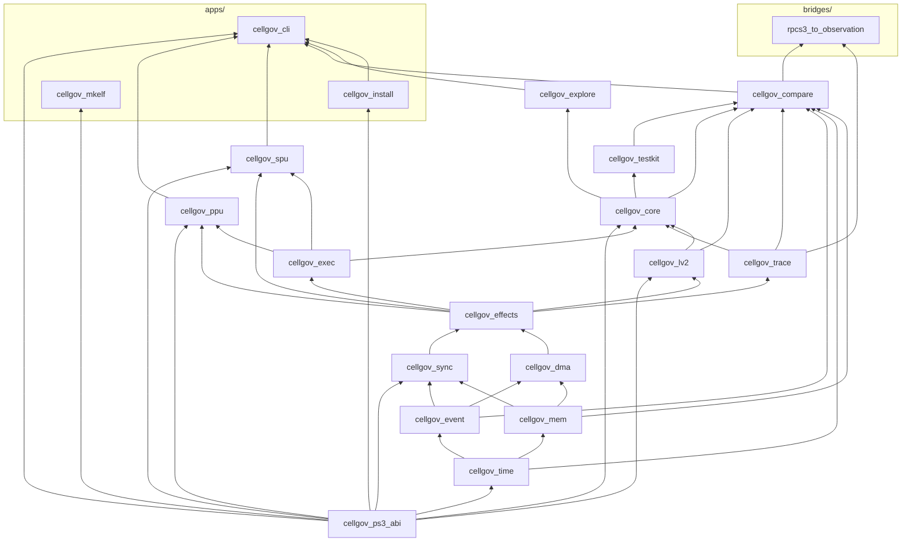

# Workspace

## Workspace shape

The library crates, the application binaries under `apps/`, and the
bridge binary under `bridges/` form a strict layered DAG: primitives at the
bottom, consumers at the top, no backward edges. `cellgov_ps3_abi` is
the data-only leaf for PS3 ABI source-of-truth values (NIDs, errnos,
struct layouts, syscall numbers, ELF/PRX layout, hardware constants).
It depends on nothing in the workspace; every layer that consumes PS3
ABI literals depends on it, and `cellgov_install` and `cellgov_mkelf`
depend on it alone.

Four structural rules:

- `cellgov_lv2` does not depend on `cellgov_core`: the runtime calls
  the host through the narrow `Lv2Runtime` trait, and the host never
  reaches back.
- `cellgov_ppu` and `cellgov_spu` are leaves of the library DAG: they
  plug in through the `ExecutionUnit` trait in `cellgov_exec`, and
  the runtime drives any `T: ExecutionUnit` without naming concrete
  types.
- `cellgov_explore` sits above `cellgov_core` and drives the runtime
  through `Runtime::step` / `commit_step` / `set_scheduler`; it never
  modifies the runtime model.
- `cellgov_install` is a lib+bin. The binary exposes the `install`,
  `install-game`, `install-iso`, `uninstall`, `keys` and
  `decrypt-self` subcommands; the library exposes the same PUP / SCE /
  SELF / TAR primitives, the operator key-vault loader (`keys`), and
  the game installers, which report progress
  through a reporter trait only the binary renders. `cellgov_cli`
  depends on the library to decrypt SCE-wrapped SELFs at boot
  through `self_image::to_plaintext_elf`, the one place that probes
  for the SCE wrapper and routes to the APP-keyed or
  klicensee-resolving decrypt per the caller's `KeyPolicy`. Only
  `cellgov_install` pulls the crypto crates (`aes`, `cbc`, `ctr`,
  `hmac`, `sha1`, `flate2` -- optional, linked by the default-off
  `decrypt` feature that also gates every key-consuming path;
  `sha2` for hashing in every build) and `filebuffer`, whose safe
  read-only file mapping lets the installer walk disc images larger
  than host memory. `cellgov_cli/decrypt` forwards to it.

External dependencies: `serde`, `serde_json`, and `toml` in
`cellgov_compare`; `serde` and `serde_json` in `cellgov_explore` and
`cellgov_cli`; crypto crates and `filebuffer` in `cellgov_install`
only. Everything else is workspace-internal. The workspace compiles
under `unsafe_code = "forbid"`.

## Per-crate responsibilities

| Crate                          | Responsibility                                                                                                                                                                                                                                                                                                                                                                                                                                                                                                                                                                                                                                                                                                                                                                                                                                                                                                                                                                                                    |
| ------------------------------ | ----------------------------------------------------------------------------------------------------------------------------------------------------------------------------------------------------------------------------------------------------------------------------------------------------------------------------------------------------------------------------------------------------------------------------------------------------------------------------------------------------------------------------------------------------------------------------------------------------------------------------------------------------------------------------------------------------------------------------------------------------------------------------------------------------------------------------------------------------------------------------------------------------------------------------------------------------------------------------------------------------------------- |
| `cellgov_ps3_abi`              | PS3 ABI source-of-truth leaf: NIDs (with `nid_const!` SHA-1 verification), the global NID lookup table and `stub_classification`, LV2 errno database, LV2 syscall numbers, ELF / PRX / SPRX layout, CBE PPU hardware constants, and RSX hardware constants under `rsx_nv_hardware.rs`. Data only; no behaviour. Zero workspace dependencies.                                                                                                                                                                                                                                                                                                                                                                                                                                                                                                                                                                                                                                                                      |
| `cellgov_time`                 | `GuestTicks`, `Budget`, `Epoch` -- distinct numeric types so guest time never becomes wall time.                                                                                                                                                                                                                                                                                                                                                                                                                                                                                                                                                                                                                                                                                                                                                                                                                                                                                                     |
| `cellgov_event`                | `UnitId`, `EventId`, `MailboxId`, `PriorityClass` -- identifier types and event vocabulary.                                                                                                                                                                                                                                                                                                                                                                                                                                                                                                                                                                                                                                                                                                                                                                                                                                                                                                                       |
| `cellgov_mem`                  | `GuestMemory` (sorted `Vec<Region>` matching the PS3 LV2 VA layout), `Region` with `RegionAccess` modes, `ByteRange`, `GuestAddr`, FNV-1a hashing with cached `content_hash`, and `StagingMemory` / `StagedWrite` for batched pending writes.                                                                                                                                                                                                                                                                                                                                                                                                                                                                                                                                                                                                                                                                                                                                                                     |
| `cellgov_sync`                 | Mailbox FIFO, signal-register OR-merge, barrier ids, and the atomic reservation table.                                                                                                                                                                                                                                                                                                                                                                                                                                                                                                                                                                                                                                                                                                                                                                                                                                                                                                                            |
| `cellgov_dma`                  | DMA completion queue with pluggable latency models.                                                                                                                                                                                                                                                                                                                                                                                                                                                                                                                                                                                                                                                                                                                                                                                                                                                                                                                                                               |
| `cellgov_effects`              | The `Effect` enum and inline `WritePayload` (16-byte stack buffer, heap fallback above).                                                                                                                                                                                                                                                                                                                                                                                                                                                                                                                                                                                                                                                                                                                                                                                                                                                                                                               |
| `cellgov_exec`                 | `ExecutionUnit` trait, `ExecutionContext`, `ExecutionStepResult`: the boundary between architecture interpreters and the runtime. Effects flow through a caller-owned `&mut Vec<Effect>` passed to `run_until_yield`, not the result struct.                                                                                                                                                                                                                                                                                                                                                                                                                                                                                                                                                                                                                                                                                                                                                                   |
| `cellgov_trace`                | Binary trace format with a strict tag/layout contract (decision-level records, `PpuStateHash` / `PpuStateFull` per-step divergence trace, `HostInvariantBreak` side-channel, `SyscallEntered` / `SyscallReturned` syscall entry and return, `ReservedRegionRead` locating each provisional zero-read by step and address); see [runtime_pipeline.md](runtime_pipeline.md#effects-and-trace-records).                                                                                                                                                                                                                                                                                                                                                                                                                                                                                                                                                                                                                                                            |
| `cellgov_lv2`                  | LV2 model: image / content registry, loaded-PRX registry, thread-group table, PPU thread table, in-memory filesystem store, LV2 sync primitives (mutex, cond, semaphore, lwmutex, event-flag, event-queue), syscall classification (`Lv2Request`) and dispatch (`Lv2Dispatch`).                                                                                                                                                                                                                                                                                                                                                                                                                                                                                                                                                                                                                                                                                                                                   |
| `cellgov_core`                 | The runtime: deterministic step loop, commit pipeline, syscall response table, SPU factory hook.                                                                                                                                                                                                                                                                                                                                                                                                                                                                                                                                                                                                                                                                                                                                                                                                                                                                                                                  |
| `cellgov_ppu`                  | PPU interpreter, ELF64 / SPRX / PRX loaders, and the PRX loader's dependency-ordered multi-module import resolution; the NID lookup database lives in `cellgov_ps3_abi`.                                                                                                                                                                                                                                                                                                                                                                                                                                                                                                                                                                                                                                                                                                                                                                                                                                   |
| `cellgov_spu`                  | SPU interpreter and SPU ELF loader; MFC / SPU channel-number constants live in `cellgov_ps3_abi::spu_channels`.                                                                                                                                                                                                                                                                                                                                                                                                                                                                                                                                                                                                                                                                                                                                                                                                                                                                                               |
| `cellgov_testkit`              | Scenario fixtures and the runner used by tests across the workspace.                                                                                                                                                                                                                                                                                                                                                                                                                                                                                                                                                                                                                                                                                                                                                                                                                                                                                                                                              |
| `cellgov_compare`              | Normalized observation schema, RPCS3 runner adapter, multi-baseline diff, per-step `diverge` scanner, zoom-in `zoom_lookup`.                                                                                                                                                                                                                                                                                                                                                                                                                                                                                                                                                                                                                                                                                                                                                                                                                                                                                      |
| `cellgov_explore`              | Bounded schedule exploration with conflict-aware pruning.                                                                                                                                                                                                                                                                                                                                                                                                                                                                                                                                                                                                                                                                                                                                                                                                                                                                                                                                                         |
| `cellgov_cli`                  | The user-facing binary: `run-game`, `bench-boot`, `bench-boot-once`, `dump`, `dump-prx-imports`, `disasm`, `compare`, `explore`, `compare-observations`, `diverge`, `zoom`, `rpcs3-attribute`, `fixture-gen`, `titles-gen`.                                                                                                                                                                                                                                                                                                                                                                                                                                                                                                                                                                                                                                                                                                                                                                                       |
| `cellgov_mkelf`                | Standalone generator of PPU ELF fixtures for the microtest corpus. Depends on `cellgov_ps3_abi` only.                                                                                                                                                                                                                                                                                                                                                                                                                                                                                                                                                                                                                                                                                                                                                                                                                                                                                                              |
| `cellgov_install`              | PS3 firmware and SELF decrypter, lib + bin. The `install` subcommand peels the outer SCE/PUP wrapping of a `PS3UPDAT.PUP` (PUP container parse, SHA-1 HMAC validation, AES-256-CBC / AES-128-CTR decryption, zlib decompression, nested TAR extraction) and writes per-module SELFs into the VFS's `dev_flash` mount, with `dev_flash2` / `dev_flash3` as siblings beside it. `decrypt-self` decrypts one SELF at a time. `cellgov_cli`'s boot path calls the library's `sce::decrypt_self_to_elf` to peel encrypted SELFs at load time. Every decrypt path takes a `keys::KeyVault` the operator supplies (`CELLGOV_KEYS`, or the vault `keys import` normalized into `vfs/.cellgov/keys/keys.toml`); no build carries a key value, and a SELF whose key revision the vault lacks is refused by name. Firmware modules from the user's PUP decrypt bit-identically to RPCS3's decrypter on the same PUP, held by a parity gate over the module stems shipped in both encrypted and pre-decrypted form; the user supplies the PUP, since neither RPCS3 nor CellGov ships firmware. No RPCS3 dependency at runtime. |
| `bridges/rpcs3_to_observation` | RPCS3 dump -> `Observation` JSON adapter. Lives under `bridges/`, excluded from the workspace's `default-members`, so a plain `cargo build` pulls in no RPCS3-aware code; build with `cargo build -p rpcs3_to_observation`. Paired with the C++ patch under `bridges/rpcs3-patch/`.                                                                                                                                                                                                                                                                                                                                                                                                                                                                                                                                                                                                                                                                                                           |
