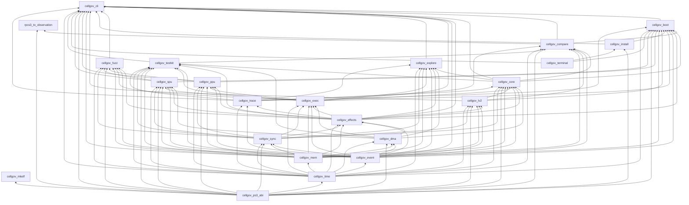

# Workspace

## Workspace shape

The library crates, the application binaries under `apps/`, and the
bridge binary under `bridges/` form a strict layered DAG: primitives at the
bottom, consumers at the top, no backward edges. `cellgov_ps3_abi` is
the leaf for PS3 ABI source-of-truth values (NIDs, errnos, struct
layouts, syscall numbers, ELF/PRX layout, hardware constants) and the
pure functions over them (the NID derivation, the syscall-namespace
split, the stub instruction encoders). It holds no guest state and
does no I/O; it depends on nothing in the workspace; every layer that consumes PS3
ABI literals depends on it, and `cellgov_install` and `cellgov_mkelf`
depend on it alone.

<!-- workspace-gen:dag:start -->

<!-- workspace-gen:dag:end -->

Five structural rules:

- `cellgov_lv2` does not depend on `cellgov_core`: the runtime calls
  the host through the narrow `Lv2Runtime` trait, and the host never
  reaches back.
- `cellgov_ppu` and `cellgov_spu` are leaves of the library DAG: they
  plug in through the `ExecutionUnit` trait in `cellgov_exec`, and
  the runtime drives any `T: ExecutionUnit` without naming concrete
  types.
- `cellgov_explore` sits above `cellgov_core` and drives the runtime
  through `Runtime::step` / `commit_step` / `set_scheduler`; it never
  modifies the runtime model.
- `cellgov_terminal` is a host-tooling leaf with no workspace
  dependency, and no runtime crate depends on it -- the same standing
  as `cellgov_testkit`: in the tree, outside the runtime DAG. It reads
  the host clock, the process environment and the console size, so no
  guest-visible path reaches it.
- `cellgov_boot` owns the PS3 process boot and the two step drivers,
  above `cellgov_core` and `cellgov_install` and below `cellgov_cli`.
  It writes to no console and ends no process: a refusal is a
  `BootError` and every line of narration goes to a caller-supplied
  `BootSink`, so the CLI decides where each channel lands and what
  status a refusal exits with. Its dependency on `cellgov_install`
  points at a library that happens to live under `apps/` -- the edge
  runs the same direction as `cellgov_cli`'s.
- `cellgov_install` is a library: the PUP / SCE / SELF / TAR
  primitives, the operator key-vault loader (`keys`), and the firmware
  and game installers, which report progress through
  `cellgov_terminal`'s sink trait. `cellgov_cli` depends on it both to
  drive those installers from the `firmware` / `title` / `keys` /
  `self` commands, attaching the renderer, and to decrypt SCE-wrapped
  SELFs at boot through `self_image::to_plaintext_elf`, the one place
  that probes for the SCE wrapper and routes to the APP-keyed or
  klicensee-resolving decrypt per the caller's `KeyPolicy`. Only
  `cellgov_install` pulls the crypto crates (`aes`, `cbc`, `ctr`,
  `hmac`, `sha1`, `flate2` -- optional, linked by the default-off
  `decrypt` feature that also gates every key-consuming path;
  `sha2` for hashing in every build); `cellgov_cli/decrypt` forwards to
  it. `cellgov_cli` takes `filebuffer`, whose safe read-only file
  mapping lets an install walk disc images larger than host memory.
- `cellgov_cli` builds the workspace's one binary, `cellgov`: a
  two-level noun-verb tree parsed by `clap` in `cli::parse`, with
  every command's behavior a function over the plain structs that
  module produces. `cli::reference` renders that same tree three ways
  -- the examples each command's help leads with, the committed
  `docs/cli.md`, and the `clap_complete` shell scripts -- so a
  command the binary accepts and a command the reference documents
  cannot differ.

The direct external dependencies below come from `cargo metadata`; test-only,
build-only, and target-specific dependencies are intentionally absent. The
workspace compiles under `unsafe_code = "forbid"`.

<!-- workspace-gen:external:start -->
| Crate | Direct external dependencies |
| --- | --- |
| `cellgov_ps3_abi` | none |
| `cellgov_time` | derive_more, serde |
| `cellgov_event` | strum |
| `cellgov_mem` | derive_more, serde, thiserror |
| `cellgov_effects` | none |
| `cellgov_dma` | none |
| `cellgov_sync` | derive_more |
| `cellgov_exec` | strum |
| `cellgov_trace` | num_enum, strum, thiserror |
| `cellgov_core` | strum, thiserror |
| `cellgov_lv2` | num_enum, strum, thiserror |
| `cellgov_testkit` | tempfile |
| `cellgov_compare` | serde, serde_json, strum, thiserror, toml |
| `cellgov_boot` | serde, serde_json, strum, thiserror, toml |
| `cellgov_install` | aes, cbc, ctr, flate2, hmac, serde, sha1, sha2, thiserror, toml |
| `cellgov_terminal` | ctrlc, terminal_size |
| `cellgov_ppu` | derive_more, strum, thiserror |
| `cellgov_spu` | strum, thiserror |
| `cellgov_explore` | serde, serde_json, strum |
| `cellgov_fuzz` | serde, serde_json, thiserror |
| `cellgov_cli` | clap, clap_complete, filebuffer, serde, serde_json, strum, thiserror, toml |
| `cellgov_mkelf` | none |
| `rpcs3_to_observation` | serde, serde_json, thiserror, toml |

<!-- workspace-gen:external:end -->

## Per-crate responsibilities

| Crate                          | Responsibility                                                                                                                                                                                                                                                                                                                                                                                                                                                                                                                                                                                                                                                                                                                                                                                                                                                                                                                                                                                                    |
| ------------------------------ | ----------------------------------------------------------------------------------------------------------------------------------------------------------------------------------------------------------------------------------------------------------------------------------------------------------------------------------------------------------------------------------------------------------------------------------------------------------------------------------------------------------------------------------------------------------------------------------------------------------------------------------------------------------------------------------------------------------------------------------------------------------------------------------------------------------------------------------------------------------------------------------------------------------------------------------------------------------------------------------------------------------------- |
| `cellgov_ps3_abi`              | PS3 ABI source-of-truth leaf, nested on the axis each fact belongs to: `lv2` (errno database, syscall numbers and the r11 namespace split, per-subsystem flag bits and layouts), `format` (ELF / PRX / SPRX, SCE, PUP, the CoreOS package, dev_flash, PARAM.SFO and title-tree names), `hw` (CBE PPU and SPU constants, PowerPC encodings, RSX hardware constants, the fixed address-space layout), `nid` (NIDs with `nid_const!` SHA-1 verification and the global lookup table) and `codegen` (the PPC64 encoders for CellGov's stub trampolines). External-ABI facts and pure functions over them; no guest state, no I/O. Zero workspace dependencies.                                                                                                                                                                                                                                                                                                                                                                                                                                                                                                                                                                                                                                                                      |
| `cellgov_time`                 | `GuestTicks`, `Budget`, `Epoch` -- distinct numeric types so guest time never becomes wall time.                                                                                                                                                                                                                                                                                                                                                                                                                                                                                                                                                                                                                                                                                                                                                                                                                                                                                                     |
| `cellgov_event`                | `UnitId`, `EventId`, `MailboxId`, `PriorityClass` -- identifier types and event vocabulary.                                                                                                                                                                                                                                                                                                                                                                                                                                                                                                                                                                                                                                                                                                                                                                                                                                                                                                                       |
| `cellgov_mem`                  | `GuestMemory` (sorted `Vec<Region>` matching the PS3 LV2 VA layout), `Region` with `RegionAccess` modes, `ByteRange`, `GuestAddr`, FNV-1a hashing with cached `content_hash`, and `StagingMemory` / `StagedWrite` for batched pending writes.                                                                                                                                                                                                                                                                                                                                                                                                                                                                                                                                                                                                                                                                                                                                                                     |
| `cellgov_sync`                 | Mailbox FIFO, signal-register OR-merge, barrier ids, and the atomic reservation table.                                                                                                                                                                                                                                                                                                                                                                                                                                                                                                                                                                                                                                                                                                                                                                                                                                                                                                                            |
| `cellgov_dma`                  | DMA completion queue with pluggable latency models.                                                                                                                                                                                                                                                                                                                                                                                                                                                                                                                                                                                                                                                                                                                                                                                                                                                                                                                                                               |
| `cellgov_effects`              | The `Effect` enum and inline `WritePayload` (16-byte stack buffer, heap fallback above).                                                                                                                                                                                                                                                                                                                                                                                                                                                                                                                                                                                                                                                                                                                                                                                                                                                                                                               |
| `cellgov_exec`                 | `ExecutionUnit` trait, `ExecutionContext`, `ExecutionStepResult`: the boundary between architecture interpreters and the runtime. Effects flow through a caller-owned `&mut Vec<Effect>` passed to `run_until_yield`, not the result struct.                                                                                                                                                                                                                                                                                                                                                                                                                                                                                                                                                                                                                                                                                                                                                                   |
| `cellgov_trace`                | Binary trace format with a strict tag/layout contract (decision-level records, `PpuStateHash` / `PpuStateFull` per-step divergence trace, `HostInvariantBreak` side-channel, `SyscallEntered` / `SyscallReturned` syscall entry and return, `ReservedRegionRead` locating each provisional zero-read by step and address); see [runtime_pipeline.md](runtime_pipeline.md#effects-and-trace-records).                                                                                                                                                                                                                                                                                                                                                                                                                                                                                                                                                                                                                                                            |
| `cellgov_lv2`                  | LV2 model: image / content registry, loaded-PRX registry, thread-group table, PPU thread table, in-memory filesystem store, LV2 sync primitives (mutex, cond, semaphore, lwmutex, event-flag, event-queue), syscall classification (`Lv2Request`) and dispatch (`Lv2Dispatch`).                                                                                                                                                                                                                                                                                                                                                                                                                                                                                                                                                                                                                                                                                                                                   |
| `cellgov_core`                 | The runtime: deterministic step loop, commit pipeline, syscall response table, SPU factory hook.                                                                                                                                                                                                                                                                                                                                                                                                                                                                                                                                                                                                                                                                                                                                                                                                                                                                                                                  |
| `cellgov_ppu`                  | PPU interpreter, ELF64 / SPRX / PRX loaders, and the PRX loader's dependency-ordered multi-module import resolution; the NID lookup database lives in `cellgov_ps3_abi`.                                                                                                                                                                                                                                                                                                                                                                                                                                                                                                                                                                                                                                                                                                                                                                                                                                   |
| `cellgov_spu`                  | SPU interpreter and SPU ELF loader; MFC / SPU channel-number constants live in `cellgov_ps3_abi::hw::spu`.                                                                                                                                                                                                                                                                                                                                                                                                                                                                                                                                                                                                                                                                                                                                                                                                                                                                                               |
| `cellgov_fuzz`                 | Deterministic library engines for PPU and SPU instruction, sequence, and decoder-partition fuzzing, plus the loader harness: structure-aware ELF and PRX images, the per-parser calls the `cargo fuzz` targets under `fuzz/` make, and a bounded mutation sweep of the same calls on stable. ISA identity, encoding fields, observable state, legal outcomes, effect footprints, and shrink rules remain owned by the interpreter crates. The caller owns console, clock, environment, process, and parallel execution policy. |
| `cellgov_testkit`              | Scenario fixtures and the runner used by tests across the workspace, the PARAM.SFO emitter synthetic title trees are built with, and the scratch directories those tests write into -- one guard that removes its tree on drop, including while a panic unwinds, so a failing test leaks nothing. The scratch half sits behind a default-off feature, since this crate is a runtime dependency of the binaries and the directories come from `tempfile`.                                                                                                                                                                                                                                                                                                                                                                                                                                                                                                                                                                                                                                                                                                                                                                                                                                                                                                                              |
| `cellgov_terminal`             | Terminal presentation for the host tools: startup capability detection (`Off` / `Plain` / `Ansi`, color policy, width) and the shared progress bar -- a `ProgressSink` event seam instrumented code emits against, and a render thread that owns stderr. Callers describe their work as a `Task` (verb, phase labels, `Bytes`/`Files`/`Steps`/`Cases`/`Items` denominator), so no command's vocabulary is baked in.                                                                                                                                                                                                                                                                                                                                                                                                                                                                                                                                                                                                                                                                                                                                                                                                                                                                                                                                              |
| `cellgov_compare`              | Normalized observation schema, RPCS3 runner adapter, multi-baseline diff, per-step `diverge` scanner, zoom-in `zoom_lookup`.                                                                                                                                                                                                                                                                                                                                                                                                                                                                                                                                                                                                                                                                                                                                                                                                                                                                                      |
| `cellgov_boot`                  | The PS3 process boot: guest address space, firmware PRX loading and import resolution, TLS and kernel-context setup, the `module_start` pass, and the diagnostic and throughput step drivers with their fault classifiers. Also owns the title-manifest registry every store and doc command reads. Console-free and exit-free by construction: `prepare` returns `Result<PreparedBoot, BootError>` and narration goes to a `BootSink` the caller supplies. |
| `cellgov_explore`              | Bounded schedule exploration with conflict-aware pruning.                                                                                                                                                                                                                                                                                                                                                                                                                                                                                                                                                                                                                                                                                                                                                                                                                                                                                                                                                         |
| `cellgov_cli`                  | The workspace's one binary, `cellgov`: `firmware`, `title`, `keys`, `self`, `boot`, `diff`, `explore`, `scenario`, and the `dev` tools.                                                                                                                                                                                                                                                                                                                                                                                                                                                                                                                                                                                                                                                                                                                                                                                       |
| `cellgov_mkelf`                | Standalone generator of PPU ELF fixtures for the microtest suite. Depends on `cellgov_ps3_abi` only.                                                                                                                                                                                                                                                                                                                                                                                                                                                                                                                                                                                                                                                                                                                                                                                                                                                                                                              |
| `cellgov_install`              | PS3 firmware and SELF decrypter library. Its firmware installer peels the outer SCE/PUP wrapping of a `PS3UPDAT.PUP` (PUP container parse, SHA-1 HMAC validation, AES-256-CBC / AES-128-CTR decryption, zlib decompression, nested TAR extraction) and writes per-module SELFs into a store entry keyed on the version the extracted tree's own `vsh/etc/version.txt` names, holding the `dev_flash` mount with `dev_flash2` / `dev_flash3` as siblings beside it, and `core_os/` with the LV2 kernel the PUP's CoreOS package carries, kept SCE-wrapped and hashed as stored in the install record. The extraction stages under one hidden sibling of the firmware root and commits with a rename, since the version that names the entry is unreadable until the tree is out. A SELF decrypts one at a time behind `cellgov self decrypt`. `cellgov_cli`'s boot path calls the library's `sce::decrypt_self_to_elf` to peel encrypted SELFs at load time. Every decrypt path takes a `keys::KeyVault` the operator supplies (`CELLGOV_KEYS`, or the vault `keys import` normalized into `vfs/.cellgov/keys/keys.toml`); no build carries a key value, and a SELF whose key revision the vault lacks is refused by name. Firmware modules from the user's PUP decrypt bit-identically to committed per-module reference digests, held by a parity gate over the stems the reference set covers; the user supplies the PUP, since CellGov ships no firmware. Nothing in the decrypt path depends on another runner. |
| `bridges/rpcs3_to_observation` | RPCS3 dump -> `Observation` JSON adapter. Lives under `bridges/`, excluded from the workspace's `default-members`, so a plain `cargo build` pulls in no RPCS3-aware code; build with `cargo build -p rpcs3_to_observation`. Paired with the C++ patch under `bridges/rpcs3-patch/`.                                                                                                                                                                                                                                                                                                                                                                                                                                                                                                                                                                                                                                                                                                           |
