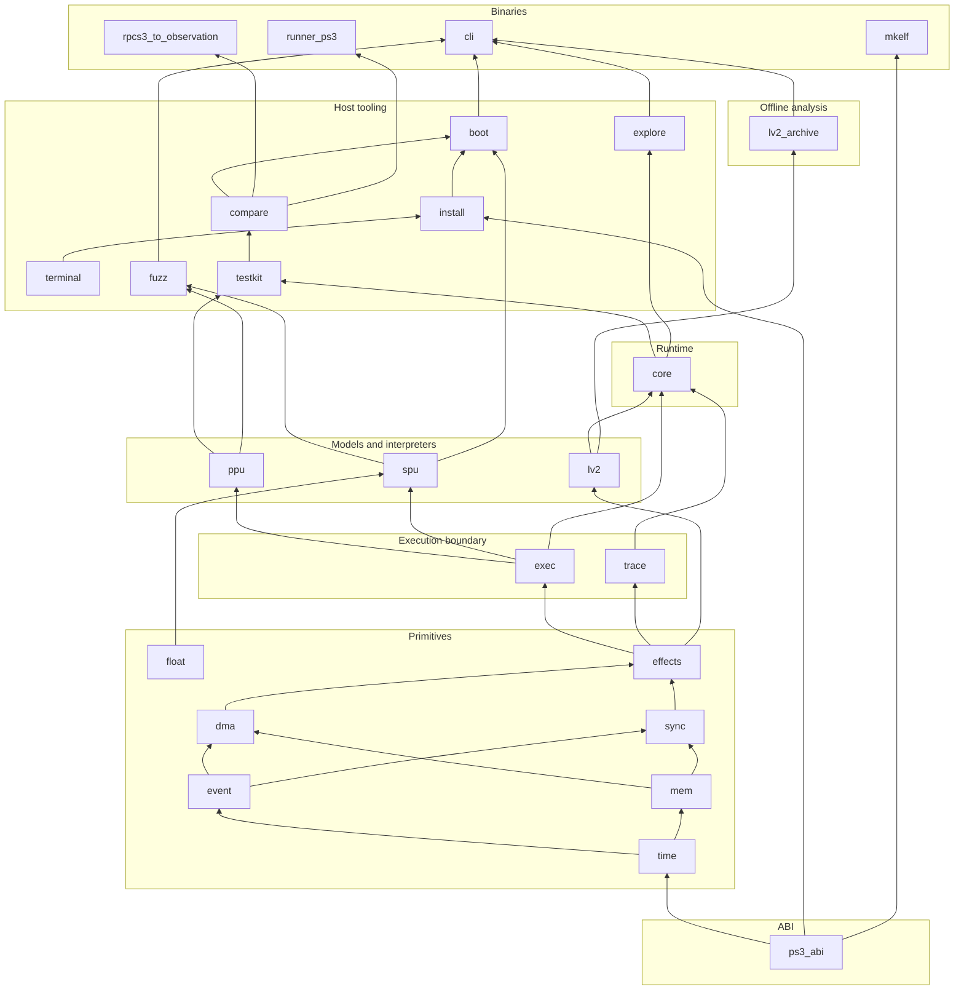

# Workspace

## Workspace shape

The library crates, the application binaries under `apps/`, and the
bridge binary under `bridges/` form a strict layered DAG: primitives at
the bottom, consumers at the top, no backward edges.

<!-- workspace-gen:dag:start -->

```mermaid
graph BT
  subgraph ABI
    ps3_abi
  end
  subgraph Primitives
    time; float; event; mem; dma; sync; effects
  end
  subgraph Execution boundary
    exec; trace
  end
  subgraph Models and interpreters
    lv2; ppu; spu
  end
  subgraph Runtime
    core
  end
  subgraph Offline analysis
    lv2_archive
  end
  subgraph Host tooling
    terminal; testkit; compare; explore; fuzz; install; boot
  end
  subgraph Binaries
    cli; mkelf; rpcs3_to_observation; runner_ps3
  end

  ps3_abi --> time
  time --> event
  time --> mem
  event --> dma
  mem --> dma
  event --> sync
  mem --> sync
  dma --> effects
  sync --> effects
  effects --> exec
  effects --> trace
  effects --> lv2
  exec --> ppu
  exec --> spu
  float --> spu
  exec --> core
  lv2 --> core
  trace --> core
  lv2 --> lv2_archive
  core --> testkit
  ppu --> testkit
  testkit --> compare
  core --> explore
  ppu --> fuzz
  spu --> fuzz
  ps3_abi --> install
  terminal --> install
  compare --> boot
  install --> boot
  spu --> boot
  boot --> cli
  explore --> cli
  fuzz --> cli
  lv2_archive --> cli
  ps3_abi --> mkelf
  compare --> rpcs3_to_observation
  compare --> runner_ps3
```

<!-- workspace-gen:dag:end -->

### The ABI leaf

`cellgov_ps3_abi` is the leaf for PS3 ABI source-of-truth values and
the pure functions over them. It holds no guest state, does no I/O
and depends on nothing in the workspace. It contains:

- the values: NIDs, errnos, struct layouts, syscall numbers, ELF/PRX
  layout, hardware constants
- the pure functions over them: the NID derivation, the
  syscall-namespace split, the stub instruction encoders

Every layer that consumes PS3 ABI literals depends on it.
`cellgov_install` and `cellgov_mkelf` depend on it alone.

### Structural rules

Seven structural rules:

- `cellgov_lv2` does not depend on `cellgov_core`. The runtime calls
  the host through the narrow `Lv2Runtime` trait, and the host never
  reaches back. Nor does `cellgov_lv2` share a build edge with
  `cellgov_ppu`; only `cellgov_ppu`'s tests use it. The LV2 archive is
  a separate crate; see [The LV2 archive crate](#the-lv2-archive-crate).
- `cellgov_ppu` and `cellgov_spu` are leaves of the library DAG. They
  plug in through the `ExecutionUnit` trait in `cellgov_exec`. The
  runtime drives any `T: ExecutionUnit` without naming concrete types.
- `cellgov_explore` sits above `cellgov_core` and never modifies the
  runtime model. It drives the runtime through `Runtime::step` /
  `commit_step` / `set_scheduler`.
- `cellgov_terminal` is a host-tooling leaf, in the tree but outside
  the runtime DAG -- the same standing as `cellgov_testkit`. It has no
  workspace dependency, and no runtime crate depends on it.
  *Why:* it reads the host clock, the process environment and the
  console size, so no guest-visible path reaches it.
- `cellgov_boot` owns the PS3 process boot and the two step drivers.
  It sits above `cellgov_core` and `cellgov_install` and below
  `cellgov_cli`. `cellgov_boot`'s dependency on `cellgov_install`
  points at a library that happens to live under `apps/`; the edge
  runs the same direction as `cellgov_cli`'s. `cellgov_boot` writes to
  no console and ends no process:
  - a refusal is a `BootError`
  - every line of narration goes to a caller-supplied `BootSink`

  *Why:* the CLI decides where each channel lands and what status a
  refusal exits with.
- `cellgov_install` is a library, and the only crate that pulls the
  crypto crates; see [The install library](#the-install-library).
- `cellgov_cli` builds the workspace's one binary, `cellgov`, and is a
  thin shim; see [The CLI binary](#the-cli-binary).

### The LV2 archive crate

The LV2 archive is its own crate, `cellgov_lv2_archive`. It reads
`cellgov_lv2`'s request classification and fidelity map, and nothing
in `cellgov_lv2` depends on it.
*Why:* a census change does not rebuild the runtime.

The archive defines its own row types and the rules that merge and
check them. The mapping from `cellgov_ppu`'s kernel and caller
classifications into those rows sits above both crates, in the
commands that extract them.

### The install library

`cellgov_install` is a library. It contains:

- the PUP / SCE / SELF / TAR primitives
- the operator key-vault loader (`keys`)
- the firmware and game installers, which report progress through
  `cellgov_terminal`'s sink trait

`cellgov_cli` depends on it for two jobs:

- to drive those installers from the `firmware` / `title` / `keys` /
  `self` commands, attaching the renderer
- to decrypt SCE-wrapped SELFs at boot through `self_image`

`self_image` is the one module that probes for the SCE wrapper. It
routes to the APP-keyed or klicensee-resolving decrypt per the
caller's `KeyPolicy`. `npdrm::read_rap` is the one RAP reader, and
the caller says whether its file may be absent.

Only `cellgov_install` pulls the crypto crates:

- `aes`, `cbc`, `ctr`, `hmac`, `sha1`, `flate2` -- optional, linked by
  the default-off `decrypt` feature that also gates every
  key-consuming path
- `sha2`, for hashing in every build

`cellgov_cli/decrypt` forwards to it. `cellgov_cli` takes
`filebuffer`, whose safe read-only file mapping lets an install walk
disc images larger than host memory.

### The CLI binary

`cellgov_cli` builds the workspace's one binary, `cellgov`. Its
commands form a two-level noun-verb tree parsed by `clap` in
`cli::parse`. Every command's behavior is a function over the plain
structs that module produces.

`cli::reference` renders that same tree three ways:

- the examples each command's help leads with
- the committed `docs/cli.md`
- the `clap_complete` shell scripts

*Why:* a command the binary accepts and a command the reference
documents cannot differ.

The crate is a thin shim. It keeps four concerns:

- presentation: report text, tables, JSON shaping, the progress bar,
  colour, generated markdown
- process concerns: exit codes, the stdout/stderr split, signals,
  child processes, and locating the VFS root and key vault from flags
  and the environment
- argument shape
- dispatch

A function lives in the library crate that owns its domain if it
could move there without any of these:

- importing `clap`
- printing
- ending the process
- naming the CLI's own error and exit types

The anchor-fixture layout and the title-page generator stay in the
CLI by decision.

### Direct external dependencies

The table below lists each crate's direct external dependencies, taken
from `cargo metadata`. Test-only, build-only, and target-specific
dependencies are intentionally absent. The workspace compiles under
`unsafe_code = "forbid"`.

<!-- workspace-gen:external:start -->

| Crate                  | Direct external dependencies                                               |
| ---------------------- | -------------------------------------------------------------------------- |
| `cellgov_ps3_abi`      | none                                                                       |
| `cellgov_time`         | derive_more, serde                                                         |
| `cellgov_float`        | none                                                                       |
| `cellgov_event`        | strum                                                                      |
| `cellgov_mem`          | derive_more, serde, thiserror                                              |
| `cellgov_effects`      | none                                                                       |
| `cellgov_dma`          | thiserror                                                                  |
| `cellgov_sync`         | derive_more                                                                |
| `cellgov_exec`         | strum, thiserror                                                           |
| `cellgov_trace`        | num_enum, strum, thiserror                                                 |
| `cellgov_core`         | strum, thiserror                                                           |
| `cellgov_lv2`          | num_enum, strum, thiserror                                                 |
| `cellgov_testkit`      | tempfile                                                                   |
| `cellgov_ppu`          | derive_more, strum, thiserror                                              |
| `cellgov_compare`      | serde, serde_json, strum, thiserror, toml                                  |
| `cellgov_spu`          | strum, thiserror                                                           |
| `cellgov_boot`         | serde, serde_json, strum, thiserror, toml                                  |
| `cellgov_install`      | aes, cbc, ctr, flate2, hmac, serde, sha1, sha2, thiserror, toml            |
| `cellgov_terminal`     | ctrlc, terminal_size                                                       |
| `cellgov_lv2_archive`  | strum, thiserror                                                           |
| `cellgov_explore`      | serde, serde_json, strum, thiserror                                        |
| `cellgov_fuzz`         | serde, serde_json, thiserror                                               |
| `cellgov_cli`          | clap, clap_complete, filebuffer, serde, serde_json, strum, thiserror, toml |
| `cellgov_mkelf`        | none                                                                       |
| `rpcs3_to_observation` | serde, serde_json, thiserror, toml                                         |
| `runner_ps3`           | serde, serde_json, sha2, strum, thiserror, toml                            |

<!-- workspace-gen:external:end -->

## Per-crate responsibilities

| Crate                          | Responsibility                                                                                                                                                                                                                                                                                                                                                                                                                                                                                                                                                                                                                                                                                                                                                                                                                                                                                                                                                                                                                                                                                                                                                                                                                                                                                                                                                                                                                                                                                                      |
| ------------------------------ | ------------------------------------------------------------------------------------------------------------------------------------------------------------------------------------------------------------------------------------------------------------------------------------------------------------------------------------------------------------------------------------------------------------------------------------------------------------------------------------------------------------------------------------------------------------------------------------------------------------------------------------------------------------------------------------------------------------------------------------------------------------------------------------------------------------------------------------------------------------------------------------------------------------------------------------------------------------------------------------------------------------------------------------------------------------------------------------------------------------------------------------------------------------------------------------------------------------------------------------------------------------------------------------------------------------------------------------------------------------------------------------------------------------------------------------------------------------------------------------------------------------------- |
| `cellgov_ps3_abi`              | PS3 ABI source-of-truth leaf, nested on the axis each fact belongs to: `lv2` (errno database, syscall numbers and the r11 namespace split, per-subsystem flag bits and layouts), `format` (ELF / PRX / SPRX, SCE, PUP, the CoreOS package, dev_flash, PARAM.SFO and title-tree names), `hw` (CBE PPU and SPU constants, PowerPC encodings, RSX hardware constants, the fixed address-space layout), `nid` (NIDs with `nid_const!` SHA-1 verification and the global lookup table) and `codegen` (the PPC64 encoders for CellGov's stub trampolines). External-ABI facts and pure functions over them; no guest state, no I/O. Zero workspace dependencies.                                                                                                                                                                                                                                                                                                                                                                                                                                                                                                                                                                                                                                                                                                                                                                                                                                                          |
| `cellgov_time`                 | `GuestTicks`, `Budget`, `Epoch` -- distinct numeric types so guest time never becomes wall time.                                                                                                                                                                                                                                                                                                                                                                                                                                                                                                                                                                                                                                                                                                                                                                                                                                                                                                                                                                                                                                                                                                                                                                                                                                                                                                                                                                                                                    |
| `cellgov_float`                | Integer soft-float: an exact value, one `round_pack` for every rounding, saturation and flush, the SPU extended single-precision and IEEE-with-CBE-deviations policies, and operand decoding. No host floating-point arithmetic; the rounding mode is an argument and the flags a return value. Zero workspace dependencies.                                                                                                                                                                                                                                                                                                                                                                                                                                                                                                                                                                                                                                                                                                                                                                                                                                                                                                                                                                                                                                                                                                                                                                                        |
| `cellgov_event`                | `UnitId`, `EventId`, `MailboxId`, `PriorityClass` -- identifier types and event vocabulary.                                                                                                                                                                                                                                                                                                                                                                                                                                                                                                                                                                                                                                                                                                                                                                                                                                                                                                                                                                                                                                                                                                                                                                                                                                                                                                                                                                                                                         |
| `cellgov_mem`                  | `GuestMemory` (sorted `Vec<Region>` matching the PS3 LV2 VA layout), `Region` with `RegionAccess` modes, `ByteRange`, `GuestAddr`, FNV-1a hashing with cached `content_hash`, and `StagingMemory` / `StagedWrite` for batched pending writes.                                                                                                                                                                                                                                                                                                                                                                                                                                                                                                                                                                                                                                                                                                                                                                                                                                                                                                                                                                                                                                                                                                                                                                                                                                                                       |
| `cellgov_sync`                 | Mailbox FIFO, signal-register OR-merge, barrier ids, and the atomic reservation table.                                                                                                                                                                                                                                                                                                                                                                                                                                                                                                                                                                                                                                                                                                                                                                                                                                                                                                                                                                                                                                                                                                                                                                                                                                                                                                                                                                                                                              |
| `cellgov_dma`                  | DMA completion queue with pluggable latency models.                                                                                                                                                                                                                                                                                                                                                                                                                                                                                                                                                                                                                                                                                                                                                                                                                                                                                                                                                                                                                                                                                                                                                                                                                                                                                                                                                                                                                                                                 |
| `cellgov_effects`              | The `Effect` enum and inline `WritePayload` (16-byte stack buffer, heap fallback above).                                                                                                                                                                                                                                                                                                                                                                                                                                                                                                                                                                                                                                                                                                                                                                                                                                                                                                                                                                                                                                                                                                                                                                                                                                                                                                                                                                                                                            |
| `cellgov_exec`                 | `ExecutionUnit` trait, `ExecutionContext`, `ExecutionStepResult`: the boundary between architecture interpreters and the runtime. Effects flow through a caller-owned `&mut Vec<Effect>` passed to `run_until_yield`, not the result struct.                                                                                                                                                                                                                                                                                                                                                                                                                                                                                                                                                                                                                                                                                                                                                                                                                                                                                                                                                                                                                                                                                                                                                                                                                                                                        |
| `cellgov_trace`                | Binary trace format with a strict tag/layout contract (decision-level records, `PpuStateHash` / `PpuStateFull` per-step divergence trace, `HostInvariantBreak` side-channel, `SyscallEntered` / `SyscallReturned` syscall entry and return, `ReservedRegionRead` locating each provisional zero-read by step and address); see [runtime_pipeline.md](runtime_pipeline.md#effects-and-trace-records).                                                                                                                                                                                                                                                                                                                                                                                                                                                                                                                                                                                                                                                                                                                                                                                                                                                                                                                                                                                                                                                                                                                |
| `cellgov_lv2`                  | LV2 model: image / content registry, loaded-PRX registry, thread-group table, PPU thread table, in-memory filesystem store, LV2 sync primitives (mutex, cond, semaphore, lwmutex, event-flag, event-queue), syscall classification (`Lv2Request`) and dispatch (`Lv2Dispatch`).                                                                                                                                                                                                                                                                                                                                                                                                                                                                                                                                                                                                                                                                                                                                                                                                                                                                                                                                                                                                                                                                                                                                                                                                                                     |
| `cellgov_lv2_archive`          | The LV2 syscall archive under `docs/lv2/`: the table specs and their loader, the census, caller and name rows with the rules that merge and check them, the route and arm tables rendered from `cellgov_lv2`'s classification, the `pup.tsv` rows, the SQL forms and the operator-local oracle-gap overlay's text form. Text in, text out; no I/O. The runtime never calls it. `pup.rs` holds the `pup.tsv` rows only; the PUP container layout stays in `cellgov_ps3_abi::format::pup`. |
| `cellgov_core`                 | The runtime: deterministic step loop, commit pipeline, syscall response table, SPU factory hook.                                                                                                                                                                                                                                                                                                                                                                                                                                                                                                                                                                                                                                                                                                                                                                                                                                                                                                                                                                                                                                                                                                                                                                                                                                                                                                                                                                                                                    |
| `cellgov_ppu`                  | PPU interpreter, ELF64 / SPRX / PRX loaders, and the PRX loader's dependency-ordered multi-module import resolution; the NID lookup database lives in `cellgov_ps3_abi`.                                                                                                                                                                                                                                                                                                                                                                                                                                                                                                                                                                                                                                                                                                                                                                                                                                                                                                                                                                                                                                                                                                                                                                                                                                                                                                                                            |
| `cellgov_spu`                  | SPU interpreter and SPU ELF loader; MFC / SPU channel-number constants live in `cellgov_ps3_abi::hw::spu`.                                                                                                                                                                                                                                                                                                                                                                                                                                                                                                                                                                                                                                                                                                                                                                                                                                                                                                                                                                                                                                                                                                                                                                                                                                                                                                                                                                                                          |
| `cellgov_fuzz`                 | Deterministic library engines for PPU and SPU instruction, sequence, and decoder-partition fuzzing, plus the loader harness: structure-aware ELF, PRX and SPU images, the per-parser calls the `cargo fuzz` targets under `fuzz/` make, and a bounded mutation sweep of the same calls on stable. ISA identity, encoding fields, observable state, legal outcomes, effect footprints, and shrink rules remain owned by the interpreter crates. The caller owns console, clock, environment, process, and parallel execution policy. A generated campaign runs through `runner::run_campaign`, which asks the caller for each batch's runs, the deadline and the progress reports through the `runner::CampaignHost` trait, so the crate takes no `cellgov_terminal` edge.                                                                                                                                                                                                                                                                                                                                                                                                                                                                                                                                                                                                                                                                                                                                                                                                                                                                                                                                                                                 |
| `cellgov_testkit`              | Scenario fixtures and the runner used by tests across the workspace, the PARAM.SFO emitter synthetic title trees are built with, and the scratch directories those tests write into -- one guard that removes its tree on drop, including while a panic unwinds, so a failing test leaks nothing. The scratch half sits behind a default-off feature, since this crate is a runtime dependency of the binaries and the directories come from `tempfile`.                                                                                                                                                                                                                                                                                                                                                                                                                                                                                                                                                                                                                                                                                                                                                                                                                                                                                                                                                                                                                                                            |
| `cellgov_terminal`             | Terminal presentation for the host tools: startup capability detection (`Off` / `Plain` / `Ansi`, color policy, width) and the shared progress bar -- a `ProgressSink` event seam instrumented code emits against, and a render thread that owns stderr. Callers describe their work as a `Task` (verb, phase labels, `Bytes`/`Files`/`Steps`/`Cases`/`Items` denominator), so no command's vocabulary is baked in.                                                                                                                                                                                                                                                                                                                                                                                                                                                                                                                                                                                                                                                                                                                                                                                                                                                                                                                                                                                                                                                                                                 |
| `cellgov_compare`              | Normalized observation schema, RPCS3 runner adapter, multi-baseline diff, per-step `diverge` scanner, zoom-in `zoom_lookup`.                                                                                                                                                                                                                                                                                                                                                                                                                                                                                                                                                                                                                                                                                                                                                                                                                                                                                                                                                                                                                                                                                                                                                                                                                                                                                                                                                                                        |
| `cellgov_boot`                 | The PS3 process boot: guest address space, firmware PRX loading and import resolution, TLS and kernel-context setup, the `module_start` pass, and the diagnostic and throughput step drivers with their fault classifiers. Also owns the title-manifest registry every store and doc command reads. Console-free and exit-free by construction: `prepare` returns `Result<PreparedBoot, BootError>` and narration goes to a `BootSink` the caller supplies.                                                                                                                                                                                                                                                                                                                                                                                                                                                                                                                                                                                                                                                                                                                                                                                                                                                                                                                                                                                                                                                         |
| `cellgov_explore`              | Bounded schedule exploration with conflict-aware pruning.                                                                                                                                                                                                                                                                                                                                                                                                                                                                                                                                                                                                                                                                                                                                                                                                                                                                                                                                                                                                                                                                                                                                                                                                                                                                                                                                                                                                                                                           |
| `cellgov_cli`                  | The workspace's one binary, `cellgov`: `firmware`, `title`, `keys`, `self`, `boot`, `diff`, `explore`, `scenario`, and the `dev` tools.                                                                                                                                                                                                                                                                                                                                                                                                                                                                                                                                                                                                                                                                                                                                                                                                                                                                                                                                                                                                                                                                                                                                                                                                                                                                                                                                                                             |
| `cellgov_mkelf`                | Standalone generator of PPU ELF fixtures for the microtest suite. Depends on `cellgov_ps3_abi` only.                                                                                                                                                                                                                                                                                                                                                                                                                                                                                                                                                                                                                                                                                                                                                                                                                                                                                                                                                                                                                                                                                                                                                                                                                                                                                                                                                                                                                |
| `cellgov_install`              | PS3 firmware and SELF decrypter library. Its firmware installer peels the outer SCE/PUP wrapping of a `PS3UPDAT.PUP` (PUP container parse, SHA-1 HMAC validation, AES-256-CBC / AES-128-CTR decryption, zlib decompression, nested TAR extraction) and writes per-module SELFs into a store entry keyed on the version the extracted tree's own `vsh/etc/version.txt` names, holding the `dev_flash` mount with `dev_flash2` / `dev_flash3` as siblings beside it, and `core_os/` with the LV2 kernel the PUP's CoreOS package contains, kept SCE-wrapped and hashed as stored in the install record. The extraction stages under one hidden sibling of the firmware root and commits with a rename, since the version that names the entry is unreadable until the tree is out. A SELF decrypts one at a time behind `cellgov self decrypt`. `cellgov_cli`'s boot path calls the library's `sce::decrypt_self_to_elf` to peel encrypted SELFs at load time. Every decrypt path takes a `keys::KeyVault` the operator supplies (`CELLGOV_KEYS`, or the vault `keys import` normalized into `vfs/.cellgov/keys/keys.toml`); no build carries a key value, and a SELF whose key revision the vault lacks is refused by name. Firmware modules from the user's PUP decrypt bit-identically to committed per-module reference digests, held by a parity gate over the stems the reference set covers; the user supplies the PUP, since CellGov ships no firmware. Nothing in the decrypt path depends on another runner. |
| `bridges/runner_ps3`           | The PS3 runner: deploys a packaged microtest to a retail console over webMAN's HTTP and FTP, starts it, fetches the CGOV frame it leaves, and converts the frame into the `Observation` a committed capture under `tests/micro/<name>/ps3/` holds. Host tooling over `std::net`; excluded from `default-members` as `rpcs3_to_observation` is; build with `cargo build -p runner_ps3`. The `ps3-hardware` feature gates the one test target that opens a socket. |
| `bridges/rpcs3_to_observation` | RPCS3 dump -> `Observation` JSON adapter. Lives under `bridges/`, excluded from the workspace's `default-members`, so a plain `cargo build` pulls in no RPCS3-aware code; build with `cargo build -p rpcs3_to_observation`. Paired with the C++ patch under `bridges/rpcs3-patch/`.                                                                                                                                                                                                                                                                                                                                                                                                                                                                                                                                                                                                                                                                                                                                                                                                                                                                                                                                                                                                                                                                                                                                                                                                                                 |
